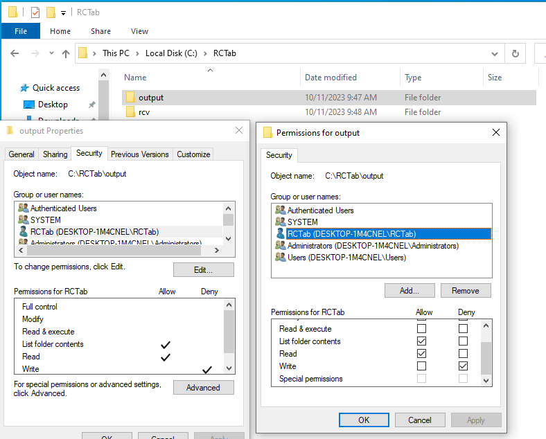
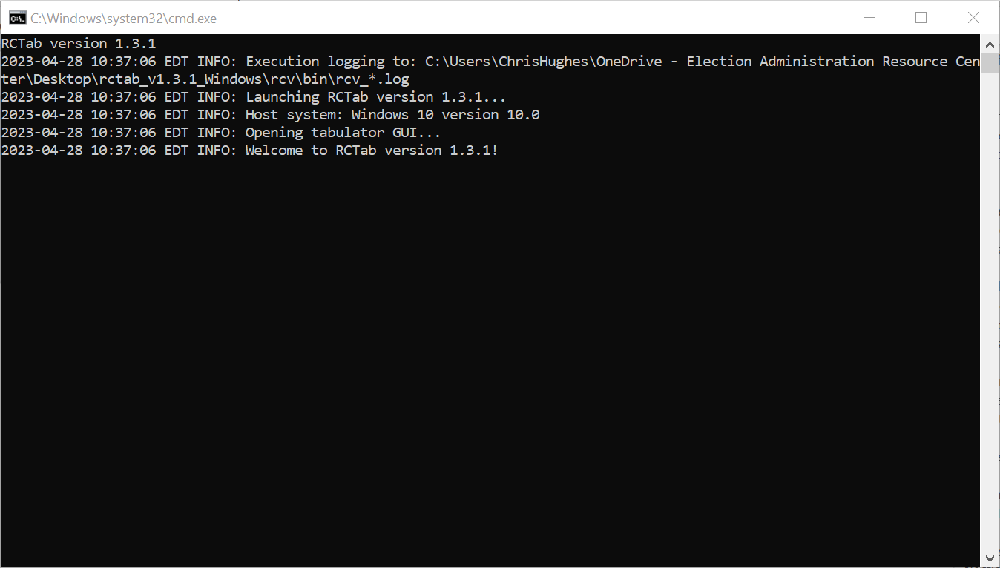

# Section 22 - Installation Instructions for Windows OS

## Installing RCTab v2.0

> - ***Never connect the internet to the Workstation RCTab is installed on.***
> - Only Election Administrators should complete the following installation steps. It requires logging in with a Windows administrator level account created in [**Section 16 - System Hardening Procedures - Windows OS**](system_hardening_procedures_-_windows_os.md). As described in that section, credentials for the Windows Administrator account should follow secure password practices and should be provided to the least amount of users necessary to complete the following steps. Users who will be running the tabulation shall not have access to the Administrator account.

- Log in to an administrator-level account on the RCTab machine.
- Follow [**Section 16 - System Hardening Procedures - Windows OS**](system_hardening_procedures_-_windows_os.md) before installation of RCTab.
- **Create RCTab Windows Standard User Account** To ensure that RCTab users have the least OS-level permissions necessary to run a tabulation we will create an "RCTab" Windows standard user account. The standard user account has less permissions than a Windows administrator account. Jurisdictions shall use this standard "RCTab" account when running tabulations with RCTab.
    * Open Windows System Settings by clicking the Windows Button \-\> Settings
    * Select "Accounts"
    * Click "Family & other users" in the left menu list
    * Click "Add someone else to this PC"
    * Click "I don"t have this person"s sign in information"
    * Click "Add a user without a Microsoft Account"
    * Enter "RCTab" as the User name
    * Enter a secure password
    * Enter security questions
    * Hit "Next"
    * The "RCTab" account has been created. Continue installation instructions as an administrator-level account until installation instructions say to log in as RCTab user
- Contact the relevant authority to request the Trusted Build of the RCTab v1.3.2 software.
- The relevant authority will provide the procedures to receive the Trusted Build to install RCTab.
- Upon receipt of RCTab, plug the flash drive RCTab is saved on into the USB port on the hardware to be used for RCTab installation.
- Using File Explorer, locate the `C:\` drive and open it.
- Right-click in the open space in the right-hand frame and select new and left-click on the folder.
- Name the new folder `RCTab`. This folder is now located at `C:\RCTab`
- Using File Explorer, locate the `rctab_v2.0_windows.zip` file.
- Right-click on the `.zip` file and select copy.
- Using File Explorer, open the RCTab folder.
- Right-click in the open space and select paste.
- To validate that the downloaded zip folder contains the certified version of RCTab, follow the instructions in document [**Section 23 - Trusted Build & Output Hash Verification - Windows OS**](trusted_build_and_output_hash_verification.md)
- After validating the hash of the trusted build navigate to the RCTab folder and locate the `rctab_v1.3.2_windows.zip` file.
- Right-click on the file. Then click on the tab “Compressed Folder Tools” at the top of the file explorer window. Click on “Extract All” at the top of the File Explorer.
- A window will pop up. Confirm that the extraction location is the RCTab folder created earlier. Click extract.
- The .zip file will now extract. You now have a folder called `rctab_v1.3.2_windows`
- **Enforce Read-Only Permissions on Output folder** To enforce read-only permissions for all RCTab output you **must** set the following permissions on the folder your jurisdiction will use for RCTab output.
    * Create a folder to be used for RCTab output. In order for RCTab to write output files as read only **do not use paths within the Windows User folders, like Desktop or Documents (**that is anything under the path `C:\users\`). This requirement is programmed into RCTab - it will not allow the output path to be configured to a Windows user account folder. For these instructions we will create an `output` folder in the `C:\RCTab` folder we created earlier
    * Right-click the `C:\RCTab\output` folder and select Properties
    * Click the "Security" tab
    * Click "Edit" to change permissions
    * Click "Add"
    * Type "RCTab" in the “Enter the object names to select” text box
    * Click the "Check Names" button. If successful, the user name will be underlined. It might include the computer name in front of it. This is ok as long as it is underlined.
    * Click "Ok"
    * Uncheck "Allow" for "Read and Execute"
    * Check "Deny" for "Write"
    * Click "Apply"
    * Click "Ok"

	

    Note: RCTab contest summary output files are programmatically set to be unmodifiable. However, if the folder they are exported to is not set properly with the preceding steps users could *delete* them.

- Now, log in as the "RCTab" Windows standard user. Tabulation should **always be done logged in to the Windows OS as the "RCTab" Windows standard user.**
- Navigate to the `rctab_v2.0_windows` folder. Double-click on the `rcv` folder.
- Double-click on the `bin` folder.
- Right-click on the `rcv.bat` file Click "Run as Administrator." If a "Windows protected your PC" window pops up click "More Info" then click the "Run anyway" button. Enter the administrator password
- RCTab will now launch.
- Using your mouse left click and drag the window with the dark top border down until it looks like the pictures below.
- Check that the first line on the black background shows:

		RCTab version 2.0

- You have successfully installed the RCTab v2.0!
- Optionally, you can create a shortcut on your desktop for a simpler start process in the future
    * Right-click the `rcv.bat` file -> Create Shortcut
    * Right-click the shortcut file created -> Properties -> Advanced -> Check the "Run as administrator" checkbox -> Ok -> Ok
    * Drag the shortcut file to your desktop
- Complete the instructions in [**Section 23 - Trusted Build & Output Hash Verification - Windows OS**](trusted_build_and_output_hash_verification.md) under the "Validating the hash of a trusted RCTab build" header to verify your installation.

