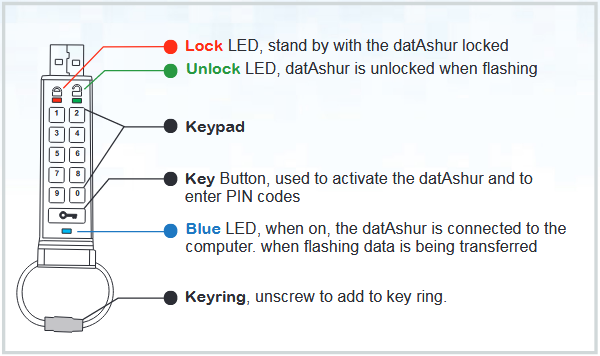
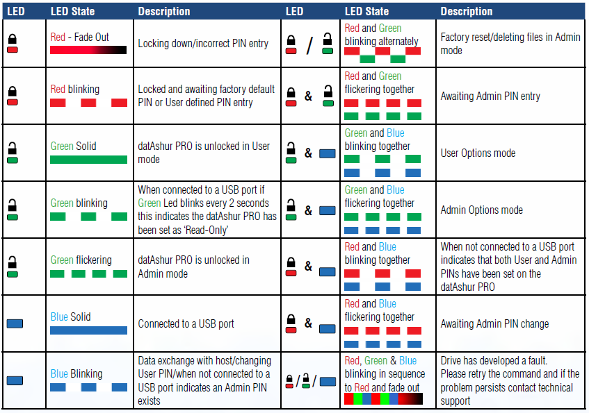

# Section 32 - Secure USB Process

RCTab is available as a download from the RCVRC website or directly from GitHub, where each build of the software is hosted. However, jurisdictions are free to request a copy of the software on a secure USB.

The steps below outline the details of how the RCVRC selects and secures a USB for use and transport to the requestee.

## USB Details
Security begins with the USB storage device selected. Currently, the RCVRC uses iStorage datAshur PRO encrypted USB Memory Sticks. iStorage’s datAshur PROs were selected because they include the following features and attributes:

- PIN authenticated hardware encryption
- AES-XTS 256-bit hardware encryption
- Certified to meet NIST’s FIPS 140-2 Level 3 standard
- Compatible with MS Windows, macOS, and Linux

For more information on iStorage’s datAshur PROs functionality please see the [appendix at the end of this guide](22-month-archiving-procedure.md).

## USB Formatting
Each datAshur PRO memory stick arrives formatted by the factory. However, the RCVRC formats each USB memory stick in-house to ensure security. Formatting is done using Windows 11’s disk formatting tool.

To format a datAshur PRO memory stick, the RCVRC follows the following steps:

1. Unlock the datAshur PRO memory stick by pressing the key icon button on the memory stick and entering the default admin password, 1-1-2-2-3-3-4-4. Press the key icon button again, and the LED above the keypad will turn green.
2.  Plug the datAshur PRO memory stick into a USB slot on your PC.
3. Select the search icon on your window’s toolbar, which is typically located in the bottom left-hand corner of your screen, and type “File Explorer”.
4. Once File Explorer is open, select “This PC” on the left-hand side of the screen.
5. Under Devices and drives, right-click on the USB memory stick and then select “Format”.
6. In the Format USB Drive window, leave each option alone except for “Format Options.” Unselect “Quick Format.”
7.  A warning prompt will pop up. Click “Ok”
8. Formatting complete.

## Setting a PIN on datAshur PRO Memory Stick
Once the datAshur PRO Memory Stick has been formatted, the manufacturer will program a user PIN into the device. This PIN will be shared with the organization or jurisdiction requesting the USB version of RCTab. User PIN requirements are as follows:

- Must be between 7-15 digits in length
- Must not contain only repetitive numbers, e.g. (`3-3-3-3-3-3-3`)
- Must not contain only consecutive numbers, e.g. (`1-2-3-4-5-6-7`)
- Must not be plugged in a USB port at the time of updating

To update a pin on the datAshur PRO Memory Stick follow these steps:

1. Press the key button and wait for the red LED to blink.
2. Enter the user PIN and press the key button. The red LED will be solid for two seconds and then change to a solid green LED light.
    1. The factory default PIN is (`1-1-2-2-3-3-4-4`)
3. Press the key button twice and the blue LED will blink.
4. Within 10 seconds, enter a new user pin and press the key button twice. The green LED will blink after entry.
    1. Decide on a PIN first and write it down before trying this step.
    2. The new PIN can be a word and typed using the alpha-numeric keypad on the datAshur PRO Memory Stick.
5. Re-enter the new user PIN and press the key button twice. The red LED will illuminate and then change to a solid green LED if PIN entries match.
6. Once the datAshur PRO Memory Stick locks, enter the new PIN and verify it unlocks the memory stick.
    1. After the PIN has been changed, the default PIN (`1-1-2-2-3-3-4-4`) will no longer work.

## Preparing datAshur PRO Memory Stick for a jurisdiction
After a datAshur PRO Memory Stick has been formatted and the PIN has been reset, the requested version of RCTab and any relevant documentation will be loaded onto the memory stick. The details of what is stored on the memory stick, as well as the PIN, will be shared with the organization or jurisdiction.

1. **datAshure PRO Layout**

    

2. **LED Indicators and their actions**

    
