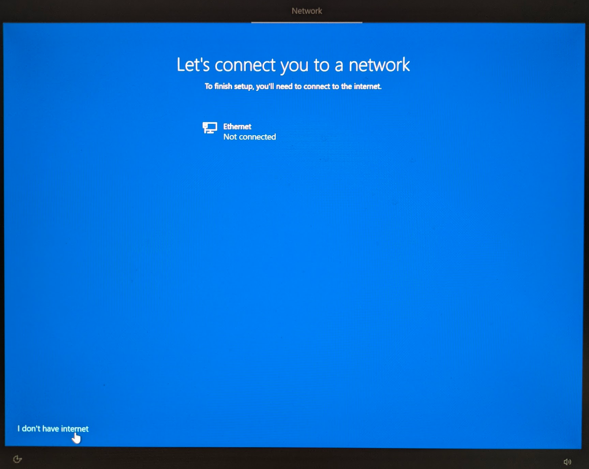
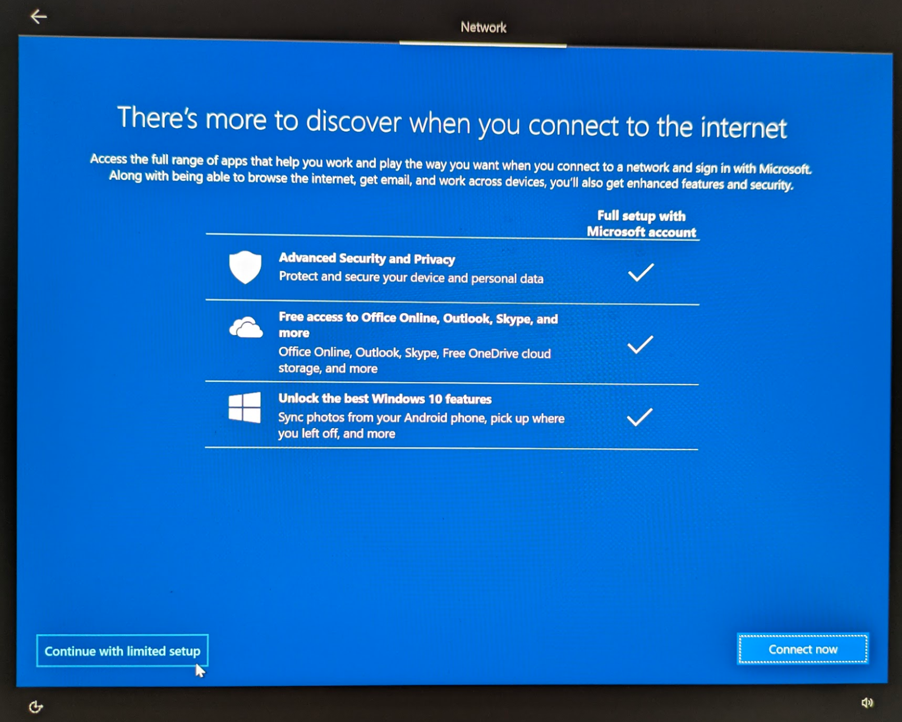
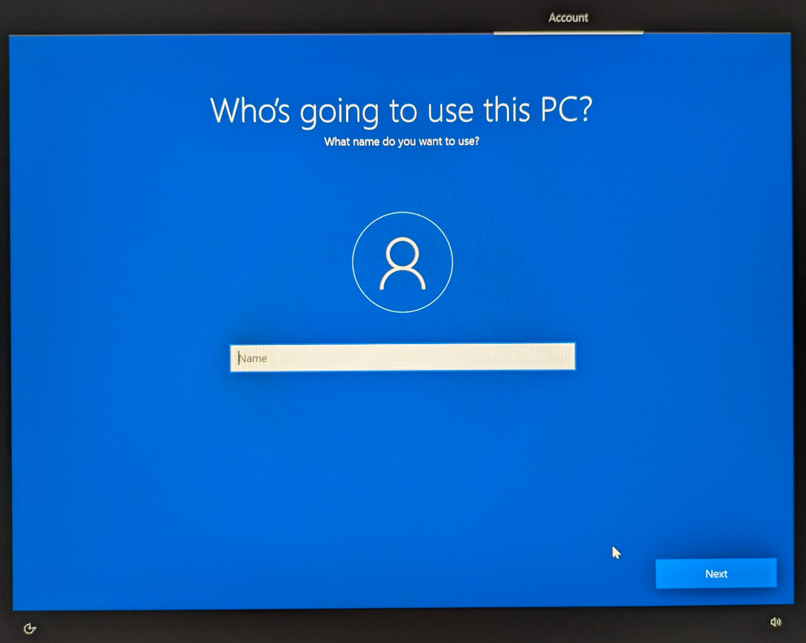
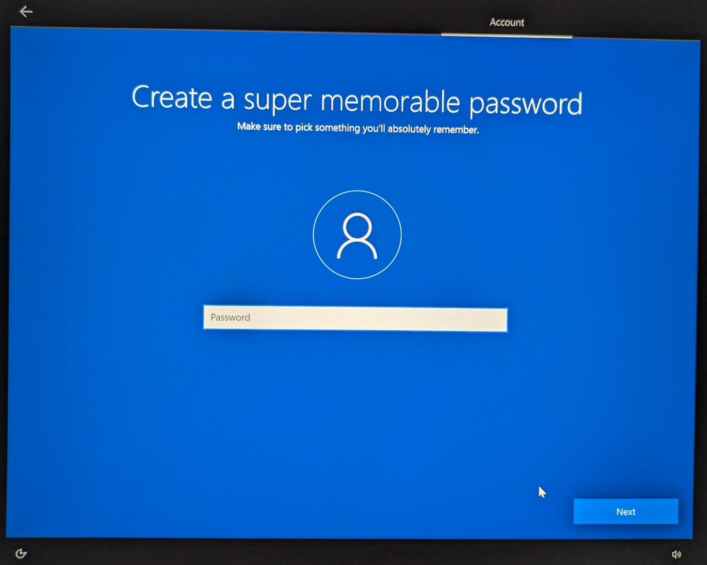
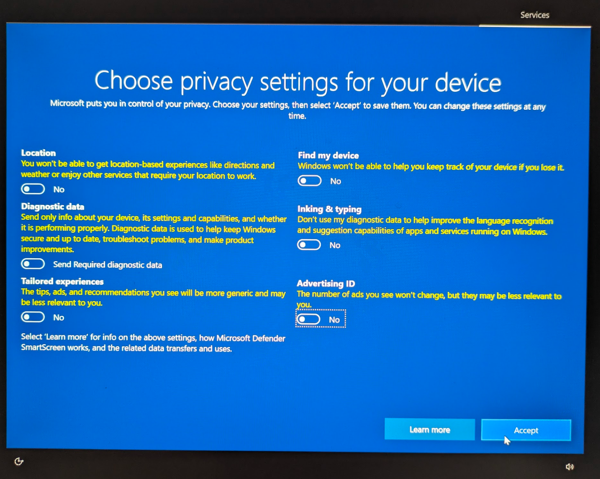
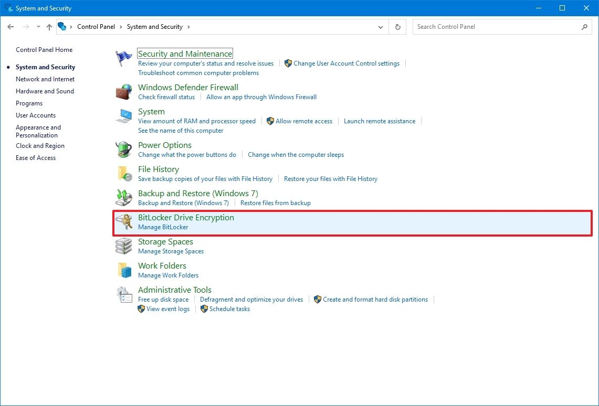
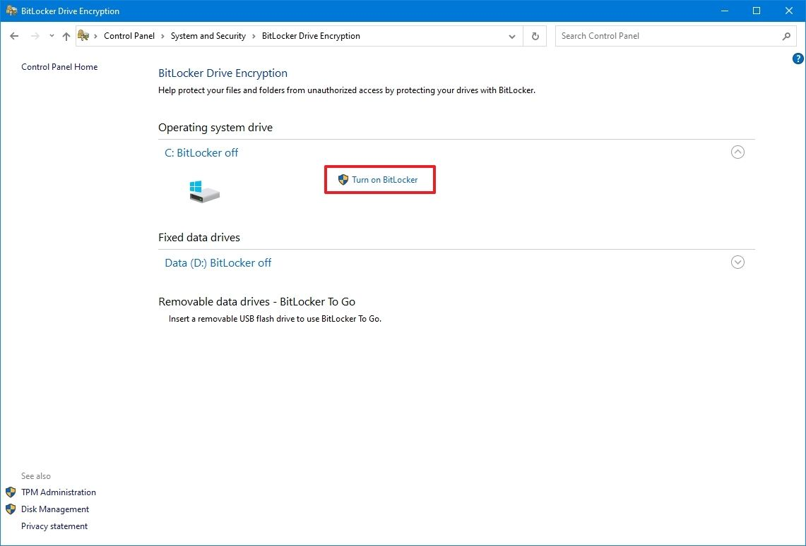
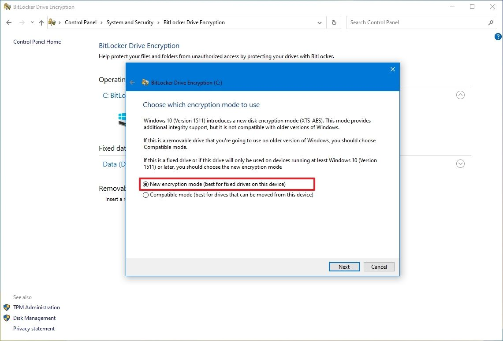
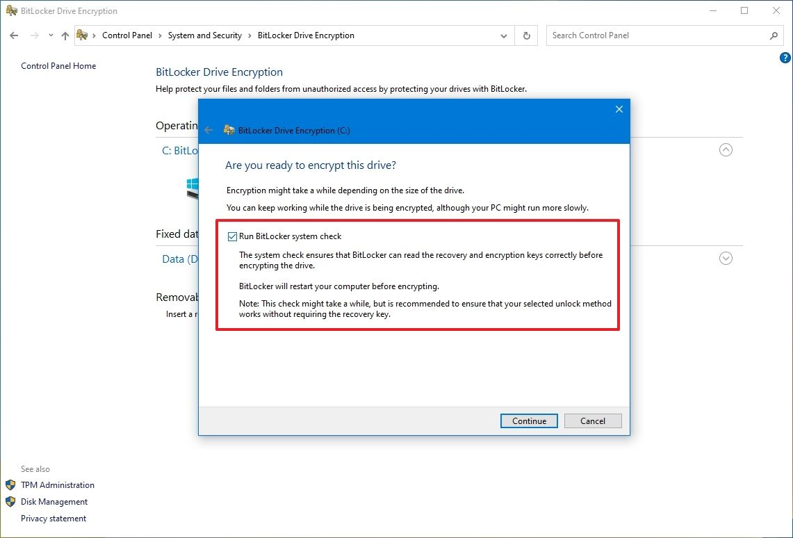

# Section 16 - System Hardening Procedures - Windows OS

The hardware used to house RCTab software should, at minimum, follow the steps below to ensure the hardware is adequately protected against unauthorized access, theft of data, and/or malicious attacks.

Hardening of the operating system (i.e. Windows) is a way to make the computer and data more secure. It may include removing unused applications and files, establishing password login protection on Windows OS, disabling automatic windows login, and proper configuration of the system among other things. No unauthorized software should be installed on the computer unless authorized by your jurisdiction. All RCTab systems must include only the following software:

- Windows 10 Pro (or newer)
- RCTab v1.3.2
- LibreOffice 7.5.7 - For viewing formatted cvr output
- XML Viewer - For viewing CVR information
- Users must also retain access to:
    * Command Prompt
    * Notepad
- UPS

See below for procedures for securing verified versions of COTS software listed above.

> Note: None of the steps below requires the presence of any special environment variables.
> 
> In addition to the system hardening protocols, it is recommended that only authorized users (no less than two employees) should have physical access to the standalone computer.
> 
> The computer should be in a secure location.

## Required Items for System Setup & Hardening

Jurisdictions should have the following artifacts for System Setup & Hardening

- HP Z4 G4 workstation
- USB 1 - contains HpSetup.txt file for Bios Password setup
- USB 2 - contains bootable Windows 10 image

> Note: Jurisdiction should follow secure password practices and provide access to the least amount of users necessary for the BIOS password and Windows OS Admin password created in the following steps. These passwords shall be used for installation and initial configuration. Users running the tabulation shall not have access to these passwords.

## Bios Password

The following steps will set a BIOS password and relevant boot security settings to harden the computer.

1. Power on the workstation.
2. Press F10 repeatedly until the BIOS menu appears.
3. Create a Workstation BIOS password for the workstation.
4. Navigating to “Security” → “Create a BIOS Administrator Password”: Enter a Workstation BIOS password (at least 8 characters. Uppercase, Lowercase, 0-9, and symbol characters are all acceptable)
    1. Enter the password and press Enter.
    2. Enter the password again (to verify), and press Enter.
    3. **Please Note: There is no recovery to reset and re-enter the BIOS if the BIOS password is forgotten or lost.**
5. Insert a USB Stick with the Replicated Setup `HpSetup.txt` file.
6. Go to “Main” → “Replicated Setup.”
7. Click “Restore current settings from USB device.”
8. Click “Browse for Configuration File” and navigate to the HpSetup.txt on the USB 1 stick.
9. A prompt will appear that says “Number of settings successfully restored (239). Number of settings that were invalid (0).” Hit “OK.”
10. Press F10 to save changes and exit.
11. The system will reboot multiple times. Confirm the settings change when prompted during the reboot processes.

## Windows OS Install

First, enable USB boot.

1. Turn on the workstation.
2. Press F10 repeatedly until the BIOS menu appears.
3. Enter the Workstation BIOS Password.
4. Navigate to "Advanced" > "Boot Options".
5. Check the box to enable “USB Storage Boot.”
6. Press F10 and follow the prompts to save changes and exit.
7. Following OS deployment, follow the same process to disable USB Storage Boot.

Then, using USB 2 with the Windows 10 image install the Windows OS

1. Insert USB and restart the computer. When it restarts you should see a Windows OS installation screen. Follow the instructions.
    1. On the "Let's connect you to a network" screen select "I don't have internet" button in bottom left then "Continue with limited setup"
        
        
    2. When it asks "Who’s going to use this PC?" this will be the Windows Administrator Account. After providing an account name it will ask for a password.
        
        
    3. When asked, select the following settings to disable all Windows telemetry
        

Then, disable USB boot.

1. Restart the workstation.
2. Press F10 repeatedly until the BIOS menu appears.
3. Enter the Workstation BIOS Password.
4. Navigate to "Advanced" > "Boot Options".
5. Check the box to disable “USB Storage Boot.”
6. Press "F10" and follow the prompts to save changes and exit.

## Step 1: Prepare Updates on Internet Connected Computer

RCTab should run on a airgapped workstation that is in a closed environment (not on a network) without access to the internet.  Hardware drivers, updates, and virus protection should be downloaded on another computer and transferred to the workstation by a removable device such as a USB flash drive.

Prepare for offline updates by downloading the following to the USB drive designated for use for this purpose:
- hardware drivers
- Windows updates
- Windows Defender offline updates.

### Preparing Windows Defender Offline Updates

- Navigate to the following website: <https://www.microsoft.com/en-us/wdsi/definitions>
- Go to the “Manually Download the Update” section. Download the update for your OS.
- Transfer the downloaded file to a USB drive and keep for later installation. As a note, all USB drives used for these purposes should be kept in a safe place in manufacturer recommended conditions.

### Prepare LibreOffice Offline Installer

Download LibreOffice 7.6.4 installer `LibreOffice_7.6.4_Win_x86-64.msi` [here](https://www.libreoffice.org/download/download-libreoffice/?type=win-x86\_64\&version=7.6.4\&lang=en-US). `SHA256`: `65678ac729cd0b545d14703879b601872d285c2934ae8d76452f7c2fb2c62d15`

### Prepare XML Notepad Installer

XML Notepad can be used to find the Contest ID from `.xml` CVR files. The standalone installer can be downloaded as `XmlNotepadSetup.zip` from [here](https://microsoft.github.io/XmlNotepad/\#install/). `SHA256`: `00cdfb1888cddf5507e691d610b3959428599317db97ac3de763e0e8940aef36`

## Step 2: Applying Offline Updates

This section covers the configuration of the operating system and other software on the airgapped computer. Since the workstation is not connected to the internet, updates and security patches that were prepped in the previous step must be installed manually.

Note: Depending on the build of your Windows, the UI might be slightly different than described in the section below.

### Install Xml Notepad

- Extract `XmlNotepadSetup.zip`
- Double-click the `XmlNotepadSetup.msi` to install Xml Notepad.

### Install LibreOffice

- Double click the `LibreOffice_7.6.2_Win_x86-64.msi`
- Run through the installer with all default settings to install LibreOffice

### Windows Defender

- Connect the USB drive prepared in the section above.

- On a non-internet connected workstation, double-click the `mpam` file to install it.  There will be no prompts or installation process.

- To verify the update was applied, open Windows Defender by searching for “Virus and Threat Protection” in Windows Search, locate "Virus and threat protection updates" section.  It will say "Up to date" if installation was successful.

### Device Encryption

Use the following steps to encrypt the hard drive with Windows Bitlocker

1. Open Start.
2. Search for "Control Panel" and click the top result to open the app.
3. Click on "System and Security".
4. Click on "BitLocker Drive Encryption".

    

5. Under the "Operating system drive" section, click the "Turn on BitLocker" option.

    

6. Select the option to save the recovery key.
7. Click the Next button.
8. Select how much the drive space to encrypt:
    * Encrypt the entire drive (slower but best for PCs and drives already in use).
9. Choose between the two encryption options:
    * New encryption mode (best for fixed drives on this device).

        

10. Click the Next button.
11. Check the "Run BitLocker system check" option.

    

12. Click the Continue button.
13. Click the Restart now button.

### Physical Security

1. Users must physically seal all external ports on hardware where RCTab is installed, except:
    - Ports used for power supply,
    - Necessary external displays, and
    - One (1) USB port.
  
2. The user jurisdiction should implement a policy that employs tamper-evident and tamper-resistant seals to categorize ports based on their accessibility:
    1. Ports that should never be accessed,
    2. Ports that are unlikely to be accessed, and
    3. Ports that can be accessed if necessary.

### Operating System Hardening

Operating system hardening can reduce the risk of a security breach by removing or disabling many non-essential software and hardware components that could act as a back door for attackers.  Manufacturer highly recommends the following hardening procedures to protect your standalone computer.

> NOTE: Before hardening, make sure all system and third-party components are installed and configured.  After security settings are applied, some earlier steps may be impossible to perform due to the hardened state of the Operating System.  Once applied, security settings cannot be undone.

#### Disable Network Connection From Network Connection Settings

1. Press `Win+R` and enter `ncpa.cpl` to open the Network Connection window.

2. For each network connection right click on it: "Select disable".

#### Disable Screen Saver

This will ensure that users will always have to log in with their passwords.

1. Open the Control Panel.

2. Search “Screen Saver” and select “Change Screen Saver”

3. In the “Screen Saver” dropdown select “None”

#### Disable Remote Access

1. Type "remote desktop settings" into the Windows search box.

2. Select "Remote Desktop Settings" to access the “Remote Desktop” settings

3. Ensure “Enable Remote Desktop” setting is set to "**off**"

#### Enable Firewall

1. Open the Control Panel in Windows.

2. Click on "System and Security".

3. Click on "Windows Firewall".

4. In the left navigation pane click "Turn Windows Firewall On".

#### Disable all network interfaces

1. Enter "cmd" in the windows search bar.

2. "Command Prompt" application shows up in search results.

3. Right-click on the "Command Prompt".

4. Select "Run as administrator".

5. Type `C:\Windows\System32\netsh.exe interface show interface` and press "Enter".

6. For each network device listed enter the following command, replacing `<interface_name>` with each of the names returned from step 5:

    `C:\Windows\System32\netsh.exe interface set interface <interface_name> disable`

#### Global Disclaimer for non-RCTab software processes and procedures

Always refer to the manufacturer's current documentation and recommendations for the latest and most secure manner to download, store, and verify the installation of software dependencies.  If questions or issues arise, consult with an information technology security professional for additional information and assistance.
