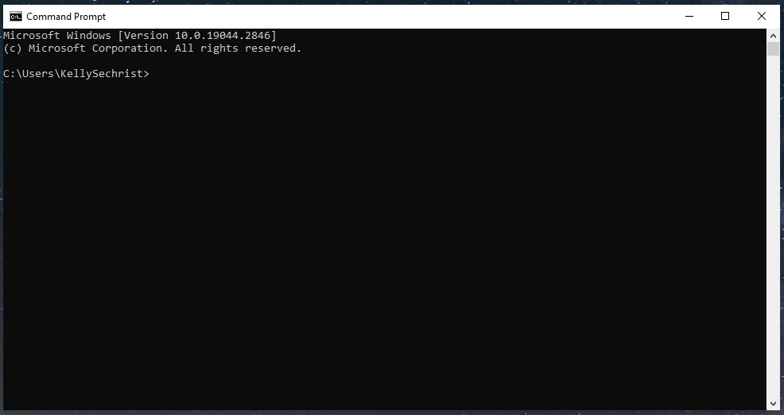
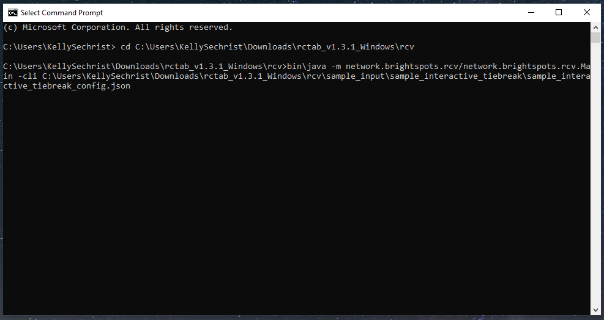

# Section 24 - Tabulator Command Line Instructions

To run the tabulation for a config file via the command line, users must open a terminal, navigate to the root directory of the unzipped software build, and use a command similar to the one that launches the GUI, except with different arguments. The final argument is the name of the config file to be tabulated. All tabulation will be done in the terminal window. RCTab’s user interface will not appear. If command line launch is successful, RCTab will tabulate a contest according to the requirements of the configuration file in the command line argument. Following are detailed steps for how to launch the RCTab in the command line.

On Windows:

1. Open Start Menu
2. Type Command Prompt. Hit enter.
3. Command Prompt will launch. The screenshot below displays an example of Command Prompt.

    

4. The user needs to direct Command Prompt to the folder where RCTab is installed. Type cd. Insert the folder name: locate the folder rcv under the folder `rctab_v1.3.1_windows` in File Explorer.
5. Click on the rcv folder and while continuing to hold the button down, drag the file to the Command Prompt window and place after cd.
    1. Example: `cd C:\RCTab\rctab_v1.3.1_windows\rcv`
6. Hit enter. The screenshot displays the result of a successful execution of previous steps.

    

7. Type in `bin\java -m network.brightspots.rcv/network.brightspots.rcv.Main -cli [filename]`
    1. Filename should be the name of the configuration file for the RCTab to use to process the contest. Example: `C:\RCTab\rctab_v1.3.1_windows\rcv\sample_input\sample_interactive_tiebreak`
    2. Screenshot shows an example of correct command prompt entry for this example.

    

8. Filename can be copied over into the Command Prompt by finding the configuration file in File Explorer, clicking on the file, and dragging the file over to the Command Prompt window.
9. Press enter.
10. Tabulation will run. Messages explaining the process of tabulation will appear in the Command Prompt window. Screenshot shows an example of messages sent during tabulation.

     

11. When tabulation is complete, Command Prompt will display the message: "INFO: Tabulation Session Completed." Followed by a line stating, "Results written to: [filepath]". The file path will be based on the information included in the Output Directory setting in the configuration file. See [**Section 18 - User Guide**](user_guide.md) and [**Section 25 - Configuration File Parameters**](configuration_file_parameters.md) for more information. See below for an example of messages sent at the end of successful tabulation.

     

12. If any of the above commands do not work, double check that you have copied them all over correctly, that you are pointing the command prompt to the correct directory, and that all filenames are correctly entered.
