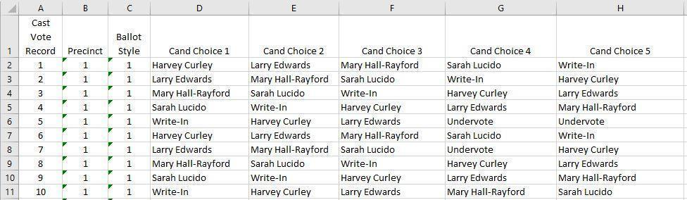
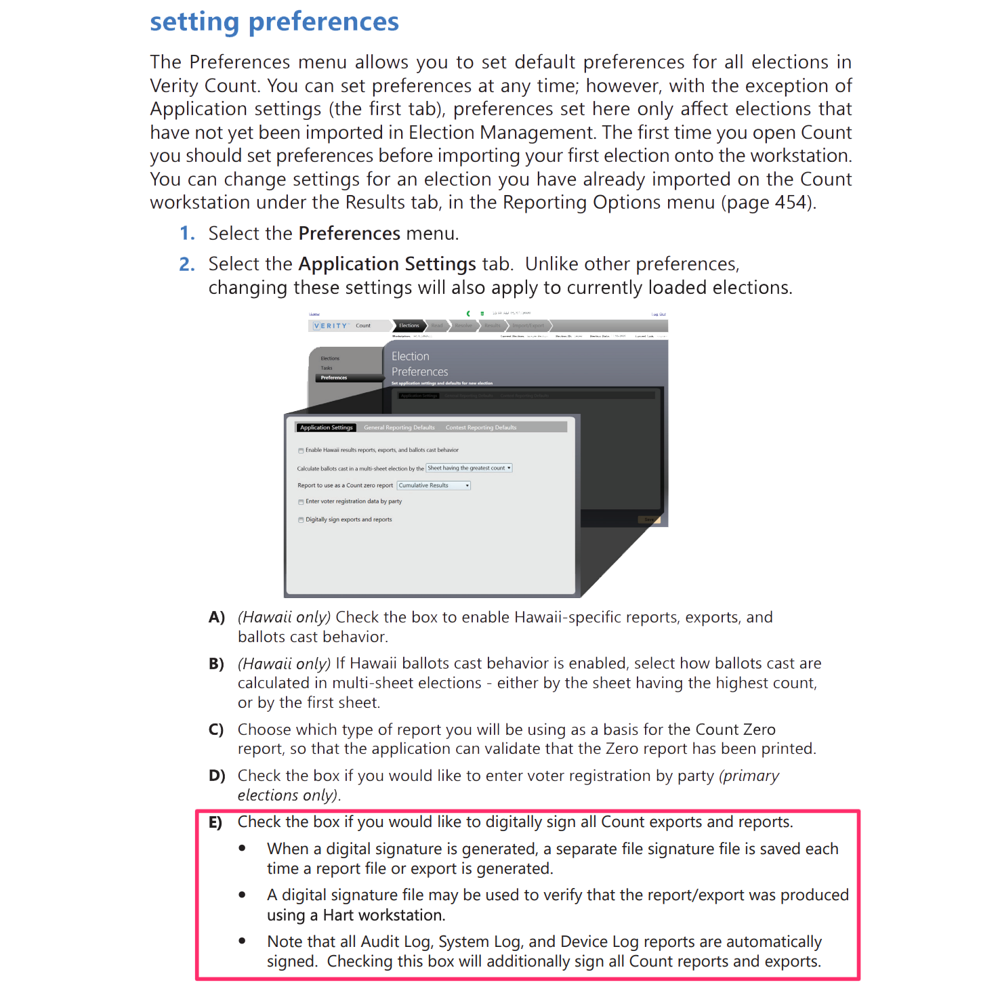
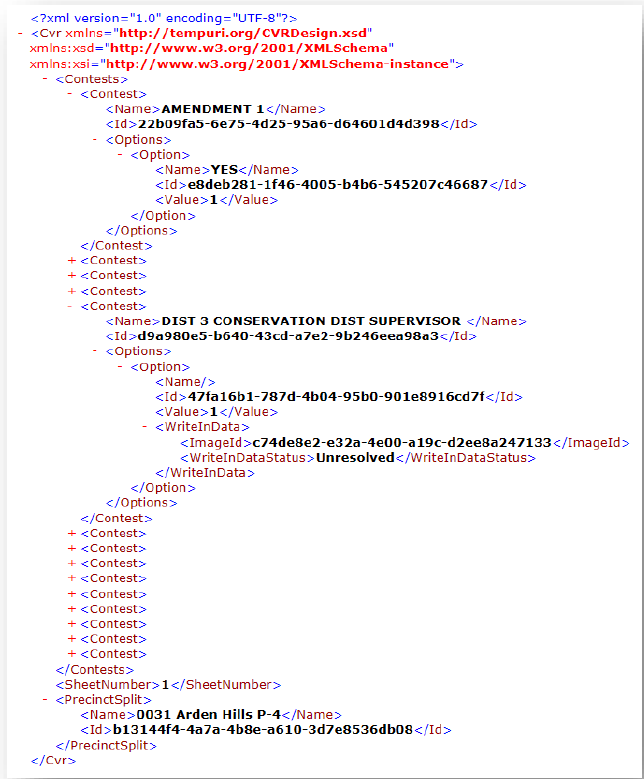
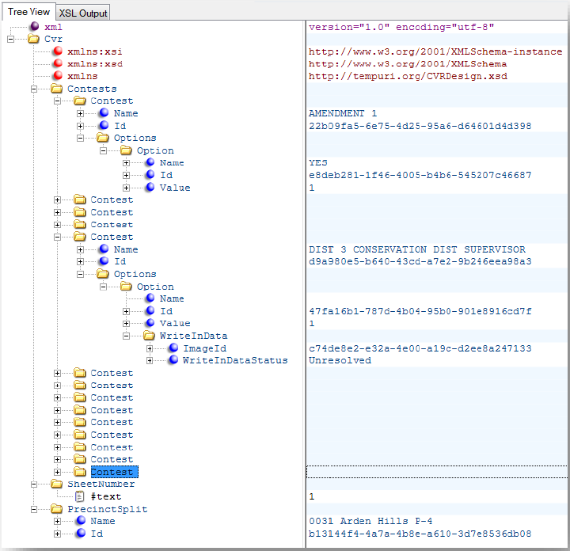

# Section 26 - RCTab CVR Files

This document describes the different CVR files RCTab is compatible with. It documents how they are laid out and describes relevant file structures that inform how RCTab parses CVR data.

## ES&S

The CVR files from the ES&S EVS export system are in an MS Excel Worksheet format.  The sample below displays the following records:

- **First Vote Column Index** – the first vote appears in column D under "Cand Choice 1"
- **First Vote Row Index** – the first cast vote record is in Row 2 in this example
- **ID Column Index** – in this sample Column A contains all Cast Vote Record IDs, making it the ID Column
- **Precinct Column Index** – displayed in Column B as the precinct Name/#
- **Ballot Style** – in Column C is the Name/# of the ballot style
- **Cand Choice** – in columns D through H are the candidate choices selected by the voter

<figure>
  
  <figcaption>Figure 1 - Sample cvr File</figcaption>
</figure>

**Note:** The first three columns in the ES&S’ file are fixed and the number of columns will depend on the number of contest choices. The format will typically follow this format:

**Header Row (column labels)**

| Cast Vote  Record | Precinct | Ballot Style | CONTEST-X  1st Choice | CONTEST-X  2nd Choice | CONTEST-X  3rd Choice | CONTEST-X  4th Choice |
|:------------------|:---------|:-------------|:----------------------|:----------------------|:----------------------|:----------------------|

**Each CVR Row**

<table>
  <thead>
    <tr>
      <th>Column Number</th>
      <th>Description</th>
    </tr>
  </thead>
  <tbody>
    <tr>
      <td><strong>Column 1</strong></td>
      <td>
Cast Vote Record ID number. Unique number, sequentially assigned.
</td>
    </tr>
    <tr>
      <td><strong>Column 2</strong></td>
      <td>
Precinct Name that is associated with the cast vote record.
</td>
    </tr>
    <tr>
      <td><strong>Column 3</strong></td>
      <td>
Ballot Style Name that is associated with the cast vote record. Applies to both ballots by precinct and ballots by style elections.
</td>
    </tr>
    <tr>
      <td><strong>Column 4 thru N + 3</strong></td>
      <td>
        
<code>N + 3</code> where <code>N</code> is the number of choices on the ballot. The content of the cell in each of the columns will be the name of the candidate selected on the ballot.

        <ul>
          <li>If there is no selection for the choice, the content of the column will show "undervote".</li>
          <li>If there is more than one selection for the choice, the column will show "overvote".</li>
          <li>If the choice is a write-in, the column will show "write-in".</li>
        </ul>
      </td>
    </tr>
  </tbody>
</table>

## Hart Verity

Hart’s Verity system exports CVRs in a multi-folder format and differs from that of singular file CVRs such as ES&S. The structure of Verity’s CVRs are as follows:

### CVR Archives Naming Convention

The format of the archive name is:

`CVRArchive_<C>_<S>_<E>_<T>.zip` where:

- `<C>` is the number of CVRs contained in the Archive.
- `<S>` is the number of cast sheet 1s.
- `<E>` is the number of cast electronic ballots.
- `<T>` is a timestamp used to make the archive name unique.

### Cryptographically signing Hart CVRs

RCTab requires the Hart CVRs to be cryptographically signed. Signed CVR archives include a corresponding `.zip`.sig.xml file for the .`zip` as well as a corresponding `.xml.sig.xml` for each `.xml` CVR file inside the `.zip`. This allows the CSV `.zip` archive and its contents to be programmatically verified by RCTab during tabulation. Tabulation will not proceed without a  `.sig.xml` for each CVR `.xml` file.
 
Use the Preferences menu in Verity Count to digitally sign CVR exports:

### CVR Structure

CVR data is recorded in XML file format, and can be viewed using a number of applications, such  as Windows Notepad and Microsoft Edge. However, applications designed to work specifically with XML, such as XML Notepad, may simplify the presentation of the XML data.

XML files must be extracted from the ZIP file before being viewed. Once extracted, the "Open with" command may be used to view the XML in the desired application.

### CVR File Naming Convention

The .zip contains many CVR files. Each CVR file name uses the convention `<S>_<G>.xml`, where:

- `<S>` is the CVR type identifier
    * `1` if paper ballot sheet 1, blank for all other sheets
    * `e` for DRE ballot
    * `p` for Provisional ballot
- `<G>` is the GUID of the CVR

> Examples: `1_c7db3cf2-c1a2-4773-971c-337ea2d198d7.xml`, or `50810795-95d4-4c0c-a6dc-0d5333e99c5a.xml`

When signed, each `.xml` CVR file has a corresponding `.xml.sig.xml` file.

### Viewing CVR Contents

The following is a general example of a CVR as viewed in Internet Explorer, showing two contests expanded:

Here is the same section of the previous CVR as viewed in XML Notepad:

### Structure
Each CVR accounts for all contests available to the voter for that ballot style (precinct-split/party/sheet combination), including a voter’s marked choice(s), any remaining Undervotes, or for unmarked contests in an Open Primary, a "No vote" tag.

Marked choices are viewable in plain text. For marked write-ins, an ID is provided to cross-reference with a folder containing images of each write-in.

The following example combines all election types—General, Closed Primary, and Open Primary—into a "master" structure; not all fields will be present for all election types, and will be indicated appropriately.

### CVR Elements

- `Cvr` (top-level folder)
    * `Contests` (contains all contests for this ballot or sheet)
        + `Contest` (random order of contests—Verity 1.0)
            - `Name` (Title of contest; includes Party designation for Closed and Open Primaries)
            - `Id` (Globally Unique ID [GUID] of contest)
            - `Options` (contains each marked Choice for this contest)
                * `Option` (empty if contest is completely undervoted)
                    + `Name` (Choice name, or blank if Write-in)
                    + `Id` (GUID of Choice)
                    + `Value` (`1` if marked; `100000` or similar, where the position of the 1 indicates a ranking mark in Ranked Choice contests, or to indicate one or more marks in a Cumulative contests)
                    + `WriteInData` (only present when Write-in Choice is marked)
                        - Text (Central vDrives only; text of Write-in, if resolved)
                        - `ImageID` (GUID of Write-in Image, and name of file located in "Write In Images" folder)
                        - `WriteInDataStatus` ("Unresolved" for all Scan write-ins; "Unresolved", "Resolved" or "Rejected" for all Central write-ins)
            - `Undervotes` (quantity of undervotes)
            - `Overvoted` (only present if contest is also overvoted)
            - `NoVote` (Open Primaries only; indicates the contest was not voted in)
            - `InvalidVote` (Open Primaries only; only present if contests of different party affiliations are voted in)
    * `BatchSequence` (Central vDrives only; indicates the sheet’s sequence within the batch number, below)
    * `IsElectronic` (True/False; indicates whether the vote was cast with a DRE)
    * `SheetNumber` (sheet indicator of paper ballot)
    * `PrecinctSplit`
        + `Name` (name of the voted Precinct-Split)
        + `Id` (GUID of Precinct-Split)
    * `Party` (Closed Primaries only; indicates party affiliation of ballot)
        + `Name` (name of Party)
        + `Id` (GUID of Party)
    * `BatchNumber` (Central vDrives only; indicates the Batch ID)
    * `DeviceSerialNumber` (Verity 1.0: Central vDrives only; indicates the vDrive ID)
    * `RetrievalCode` (Unique Retrievable Ballot Code for this CVR, if applicable)
    * `ProvisionalCode` (Unique Provisional Ballot Code for this CVR, if applicable)
    * `CvrGuid` (GUID of CVR)

## Dominion

Dominion’s CVR format consists of several files which are grouped together in the same directory, similar to Hart’s CVR structure. All exported files have a top level attribute which is set to the version of EMS that produced the file.

**Configuration**

This file shows which parameters were selected by the user when performing the export. It contains the following attributes:

- `IncludeTabulatorFilter`: Boolean value indicating whether the export was performed for a single tabulator.
- `TabulatorFilterValue`: a numeric identifier of the tabulator that was exported.
- `IncludeResultContainerFilter`: Boolean value indicating whether the batch filter was used.
- `ResultContainerFilterValue`: an integer indicating the batch to export CVR data for.
- `IncludePrecinctPortionFilter`: Boolean value indicating whether the export was performed for a  single precinct portion.
- `PrecinctPortionFilterValue`: an integer indicating the precinct portion to export CVR data for.
- `IncludeBallotTypeFilter`: Boolean value indicating whether the export was performed for a single  ballot type.
- `BallotTypeFilterValue`: an integer indicating the ballot type to export CVR data for.
- `IncludeContestFilter`: Boolean value indicating whether the export was performed for a single contest.
- `ContestFilterValue`: an integer indicating the contest to export CVR data for.
- `SplitFilesPerBatch`: a Boolean value indicating whether separate CVR export JSON files should be created per batch.
- `IncludeOnlyPublishedResultContainers`: a Boolean value indicating whether only published result  containers where included.

### `ContestManifest`

This file contains a list of all non-disabled contests ordered by global order that can produce votes. The list is ordered by contest global order and each contest has the following attributes:

- Description: name of the contest.
- `Id`: identifier of the contest (internal machine id)
- External Id: external identifier (optional)
- `VoteFor`: the number of votes allowed/number of positions to be elected.
- `NumOfRanks`: the number of rankings allowed to be made.

### `CandidateManifest`

This file contains a list of all non-disabled candidates ordered by global order (first by contest, then by choice) that can produce votes (for example "No Candidate" are not included).

- Description: name of the candidate.
- `Id`: identifier of the candidate (internal machine id)
- External Id: external identifier (optional)
- `ContestId`: identifier of the contest this choice belongs to.
- `Type`: candidate type. `Regular`, `Writein`, `NoPreference` , `QualifiedWriteIn`.

### `PartyManifest`

This file contains a list of political parties ordered by global order, each with the following attributes:

- Description: name of the political party
- `Id`: identifier of the party (internal machine id)
- External Id: external identifier (optional)

### `PrecinctPortionManifest`

This file contains a list of all precinct portions ordered by global order, each with the following attributes:

- Description: name of the precinct portion
- `Id`: identifier of the precinct portion (internal machine id)
- External Id: external identifier (optional)

### `BallotTypeManifest`

This file contains a list of all ballot types ordered by global order, each with the following attributes:

- Description: name of the ballot type
- `Id`: identifier of the ballot type (internal machine id)
- External Id: external identifier (optional).

### `BallotTypeContestManifest`

This file contains information on which contests are used on which ballot types. Each relationship has  the following attributes:

- `BallotTypeId`: identifier of the ballot type (internal machine id)
- `ContestId`: identifier of the contest (internal machine id).

### `CountingGroupManifest`

This file contains a list of all counting groups ordered by global order, each with the following attributes:

- Description: name of the counting group
- `Id`: identifier of the counting group (internal machine id)
- External Id: external identifier (optional).

### `TabulatorManifest`

This file contains a list of all tabulators ordered by global order, each with the following attributes:

- Description: name of the tabulator
- `Id`: identifier of the tabulator, we will use tabulator number here.
- `ExternalId`: the external string identifier (optional).
- `ThresholdMin`: minimum threshold for voting box scanned on this tabulator
- `ThresholdMax`: maximum threshold for voting box scanned on this tabulator
- `WriteinThresholdMin`: minimum threshold for write-in area scanned on this tabulator
- `WriteinThresholdMax`: maximum threshold for write-in area scanned on this tabulator

### `CVRExport`

This file contains the actual CVR data. In addition to the top level version field it also has an ElectionId field that contains the description of the election.

The main content of the file is a list of CVR sessions. Each **Session** object contains the following attributes:

- `TabulatorId`: the tabulator id, same as the one used in the manifest
- `BatchId`: the batch id, unique for a given tabulator id.
- `RecordId`: the CVR id within the batch.
- `CountingGroupId`: the counting group id, same as the one used in the manifest.
- `ImageMask`: the file mask for finding the associated images with this session.
- Original element, contains the original state of the CVR data for this session.
- Modified element (optional), contains the modified state of the CVR data for this session.

### Original/Modified element:

This element contains attributes that can be potentially be modified during adjudication/conditional voting management:

- `PrecinctPortionId`: the precinct portion id, same as the one used in the manifest.
- `BallotTypeId`: the ballot type id, same as the one used in the manifest.
- `IsCurrent`: set to true, if this element represents the current state of the CVR.
- Contest elements. Lists all contests for the current ballot type.

### Contest:

This element represents a marked contest. Contains the following attributes:

- `Id`: contest identifier, as used in the manifest file.
- `Marks`: list of marked (explicitly/implicitly) in this contest. Note: explicit marks mean when the voter filled in the voting box directly. Implicit means when the voting box was implied by a straight party ticket selection.

### Mark element

Contains the following attributes:

- `CandidateId`: indicates the candidate the mark is for (if a write-in position is resolved to a qualified write-in the candidate id will point to a qualified write-in).
- `PartyId`: indicates party affiliation. If not party affiliation then this will be `0`.
- `Rank`: indicates rank; will be `1` by default, will only contain values higher than `1` if ranked choice voting is used.
- `WriteinIndex`: if mark is for write-in position (or qualified write-in) this attribute indicates which  write-in position in the contest (`0` means first, `1` means second position, etc.)
- `MarkDensity`: percentage that voting box was filled.
- `WriteinDensity`: percentage that write-in area was filled in. Attribute exists only if it is a write-in position.
- `IsAmbiguous`: a Boolean value indicating whether mark is ambiguous.
- `IsVote`: a Boolean value indicating whether the mark produced a vote Note: an implicit selection  because of straight party vote would also be set to true. Any mark above the max threshold will  be true in a ranked choice voting contest.

## Clear Ballot

Clear Ballot’s CVR is still currently under development and while RCTab was developed to include Clear Ballot as a vendor, it is considered a beta feature at this time. Once Clear Ballot has finalized a format for their CVR export, the details of said CVR will be included in this document as a reference.
