# Section 18 - User Guide

Users should ensure the instructions below have been followed and completed before operating RCTab:

- [**Section 05 - Acceptance Test Procedures**](../tdp/acceptance_test_procedures.md)
- [**Section 16 - System Hardening Procedures - Windows OS**](../tdp/system_hardening_procedures_-_windows_os.md)
- [**Section 22 - Installation Instructions for Windows OS**](../tdp/installation_instructions_for_windows_os.md)
- [**Section 23 - HashCode Instructions - Windows OS**](../tdp/trusted_build_and_output_hash_verification.md)
- [**Section 25 - Configuration File Parameters**](../tdp/configuration_file_parameters.md)

Any interaction with RCTab, including producing configuration files, running tabulations, hashing results files, and transmission of files from RCTab on USB drives should follow transmission procedures required in the jurisdiction, including the use of a team with no less than two trained personnel. This document describes all interfaces and options in the RCTab software.

> Note: examples in this guide assume that the user is using Windows.

## Launching RCTab

The manufacturer recommends RCTab be installed as part of the pre-election preparation process. Jurisdictions using RCTab for official elections should follow local guidelines for procuring RCTab.
For others, RCTab installers and command line bundles are available for download from the [RCTab Github Releases page](https://github.com/BrightSpots/rcv/releases).

##### RCTab Installers
Official RCTab releases have installers for Windows, Mac and Linux. Use like any other application.
On the [RCTab Github Releases page](https://github.com/BrightSpots/rcv/releases) find the appropriate installer based on your operating system.

## RCTab Layout
Let's get familiar with the RCTab layout. There are four important sections for RCTab users.
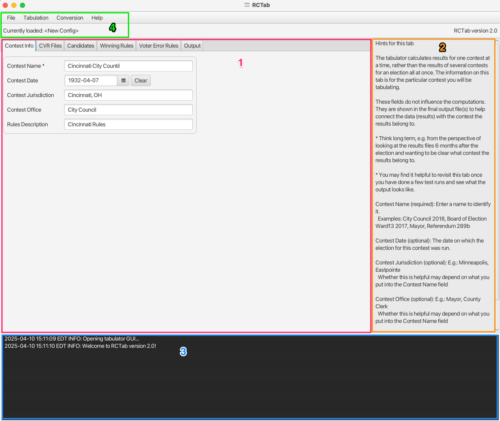
**1 - Config Tabs** Different options for configuring a ranked choice voting contest in RCTab. Clicking through the tabs on the top will take you to different configuration options.

**2 - Hint Text** For each of the different configuration tabs, this section has help text for users.

**3 - Log Output** While using RCTab, everything that it is doing is logged to this section. Users should be looking here for any information that RCTab needs to communicate. Users can copy text from this section with `[Right Click] -> Copy`.
It sends the user messages about the tabulation process, any errors encountered in using a configuration file, any errors in tabulation, and other software messages.
All messages in this panel are also saved to a file on disk for auditability later.  

**4 - RCTab Menu**
The menu bar contains some important actions. 

- `File -> Save` saves your current configuration to a file on disk.
- `File -> Load` allows you to choose a configuration file to load into RCTab, allowing you to continue from a previously configured contest.
- `File -> New` lets you start fresh with an empty configuration in the UI.

- `Tabulation -> Validate` runs some basic validation on your configuration _before_ running the round by round tabulation. Configuration issues are logged for the user to address.
- `Tabulation -> Tabulate` begins the round by round tabulation!

The `Currently Loaded` text under the menu shows the path of the configuration file that is currently being used. 

## Setting up a configuration file for RCTab

This section will describe how to set up a configuration for a contest using your jurisdiction's  ranked choice voting rules. This guide also includes screenshots of the interfaces described. The values a user inputs into any of these fields depend upon the relevant laws and regulations in place in their jurisdiction, as well as the voting system vendor used to produce cast-vote records for their elections. Users must understand the requirements of their laws, regulations, and vendor CVR data in order to fill out these fields accurately for their needs.

RCTab is organized into tabs

- The Contest Info Tab
- The CVR Files Tab
- The Candidates Tab
- The Winning Rules Tab
- The Voter Error Rules Tab
- The Output Tab

These tabs each include a set of fields that users fill out - some fields are always required, some fields are required based on previous input, and some fields are always optional.
This guide will take the user through basic descriptions of each of these tabs and each of these fields.

As users navigate through each tab, they are building a configuration file which must be saved before tabulation.
If RCTab is closed and the configuration is not saved, no information will be stored. The next time RCTab is opened all fields will be blank. 
Once configured, RCTab can save all the current configuration settings to a file. That file can be used later to load RCTab into the same configuration. Use `File -> Save` and `File -> Load` to save and load RCTab configs.

Each individual contest run through RCTab requires its own configuration with contest-specific information such as the contest name and candidate names.

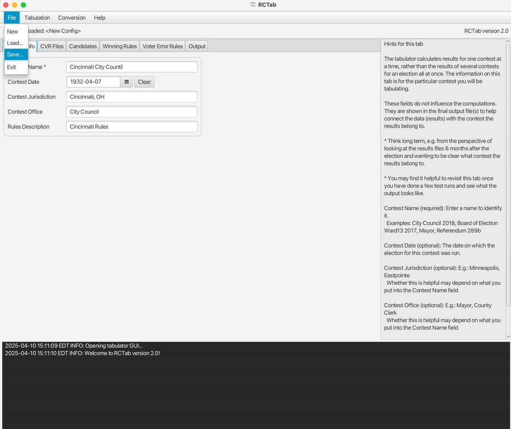

### Contest Info Tab
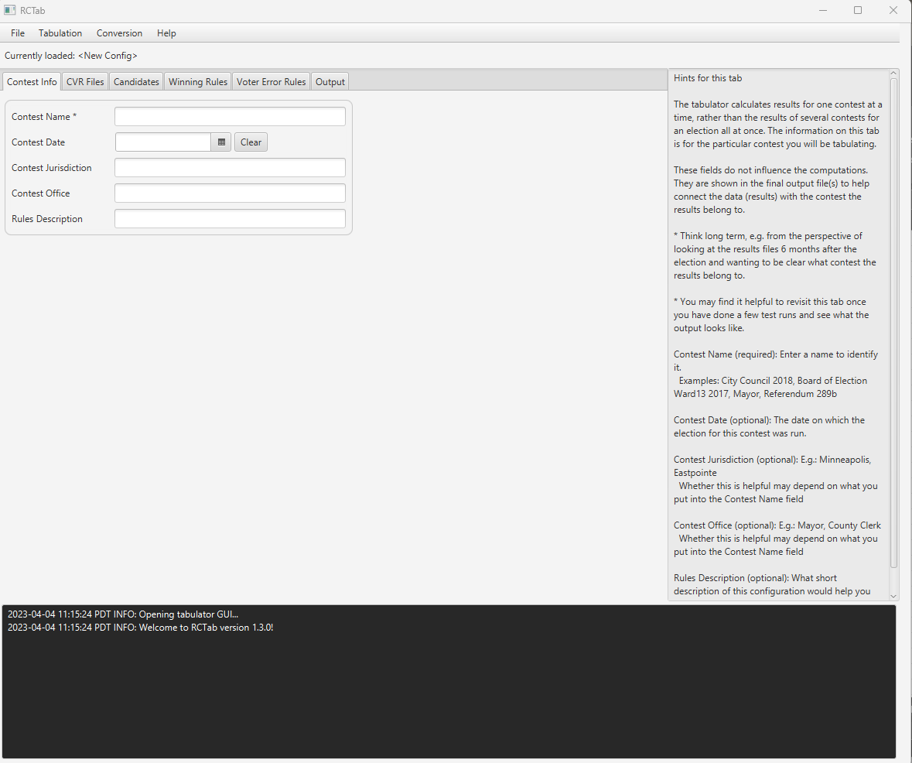
The tabulator calculates results for one contest at a time, rather than the results of several contests for an election all at once. The information on this tab is for the particular contest you will be tabulating.

These fields do not influence the computations. They are shown in the final output file(s) to help connect the data (results) with the contest the results belong to.
Think long term, e.g. from the perspective of looking at the results files 6 months after the election and wanting to be clear what contest the results belong to.

- **Contest Name (required)** Enter a name to identify your contest. Examples: City Council 2025, Mayor Preliminary Election Night, Mayor Certified 
- **Contest Date**
- **Contest Jurisdiction**
- **Contest Office**
- **Rules Description**

Example Completed Contest Info tab

### CVR Files Tab

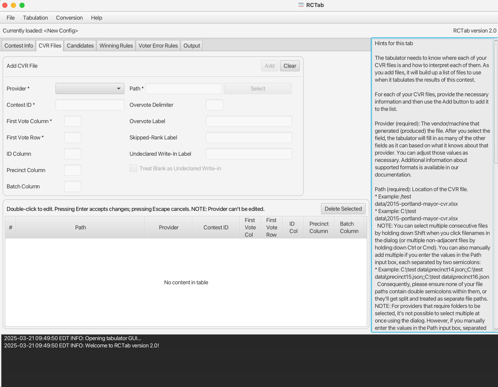

The tabulator needs configuration information for each of the contest's CVR files. 
Only add files to the configuration that contain data for the contest you are tabulating.

This tab is a multistep process. For each CVR location, the user provides the file path and additional pertinent information that RCTab needs to interpret them. For each CVR location, after additional required information is provided, the user must explicitly add them to the list of configured CVRs. Pressing the 'Add' button will populate the currently configured CVR in the table below.  

All information in this tab only configures RCTab on where to find files and how to read those files. This step does not actually pull in any vote information. Vote information is only used after a user clicks the "Tabulate" button under "Tabulation" as described later in this guide.

For each of your CVR files, provide the necessary information and then use the Add button to add it to the list.

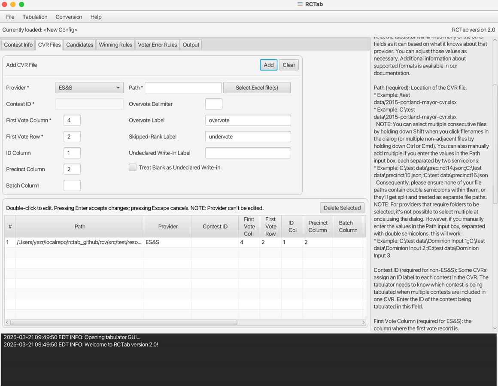

**Provider (required):** The vendor that generated the CVR. After you select the field, the tabulator will fill in as many of the other fields as it can, based on what it knows about that provider. You can adjust those values as necessary. Different options are active for different providers.
See below for a break-down of each field and what is required:

**Path (required)**: Location of the CVR file or the folder that they reside in. What you need to select is dependent on the provider. RCTab will change the file selector to select only what you can.

**Contest ID:** Some CVRs assign an ID label to each contest in the CVR. The tabulator needs to know which contest is being tabulated when multiple contests are included in one CVR. Enter the ID of the contest being tabulated in this field.

**First Vote Column:** the column where the first vote record is.

**First Vote Row:** the row where the first vote record is.

**ID Column:** The column the IDs are in. Not all CVR files contain an ID column.

**Precinct Column:** The column that contains the precinct.

**Batch Column:** The column that contains the batch identifier.

**Overvote Delimiter:** (must be blank if "Overvote Label" is provided) If using a CVR in ES&S style, overvotes can be reflected in a CVR by displaying all candidates marked at a ranking. Those candidate names will be separated from each other by a delimiter, something like a vertical bar `|` or a slash `/`. If your overvotes are delimited like this, enter the delimiter used in this field. Note: that ES&S files may include only the label "overvote" and no additional information, in which case the "Overvote Label" field should be used instead.

**Overvote Label:** (must be blank if Overvote Delimiter is provided) Some providers use a particular word/phrase to indicate an overvote.

**Undervote Label**: Some ES&S CVRs use a particular word/phrase to indicate an undervote.

**Undeclared Write-in Label:** Defines rankings in the CVR that will count towards `Undeclared Write-In` in the round-by-round count.
`Undeclared Write-In` will always be eliminated in the first round, regardless of vote count.

**Treat Blank as Undeclared Write-in:** When checked, the tabulator will interpret blank cells in the ES&S CVR as votes for `Undeclared Write-In`.

Additionally, there are some action buttons used for configuring CVRs.

**Add:** Adds an instance of the currently configured CVR settings to the list used during tabulation. Each addition is listed in the CVR table above the log output. Continue adding until you have specified all CVRs for your contest.   

**Clear:** Clears all fillable values in CVR Files tab above the CVR Files table.

**Delete Selected:** Deletes a row of CVR file information from the CVR table.

This guide will now briefly discuss details for each provider. It will highlight idiosyncrasies for each provider that users should be thinking about.  

CDF

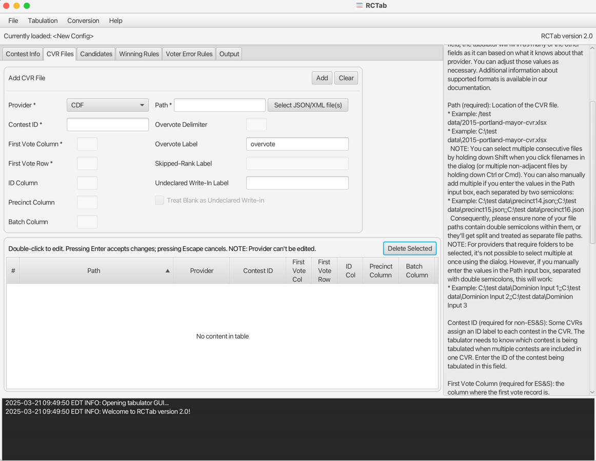

CDF, or Common Data Format, is a common standard required by VVSG 2.0. 

**Path** Either a `.json` or `.xml` file. Add multiple if necessary.

Clear Ballot

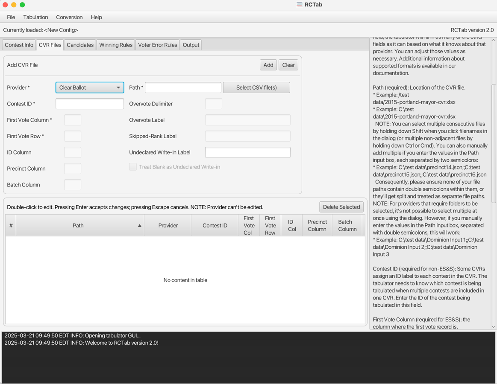

**Contest ID** Look in the first column of the ClearBallot CVR. The Contest ID is between the first and second colons `:`
In this example the Contest ID would be `City of Portland, Councilor, District 1`
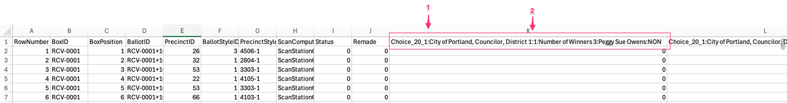

CSV CVR

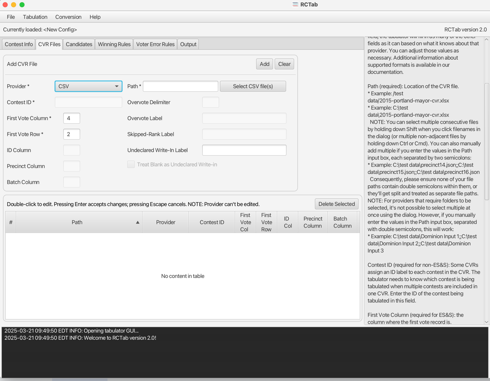

Expects `.csv` file to have Candidate Names along the top row and ranks in the cells.
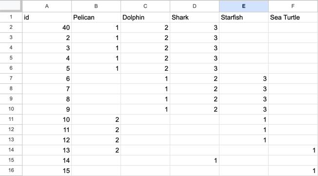

Dominion

**Path** Is the folder with Dominion `CvrExport.json` output CVRs. 

**Contest ID** Look in `ContestManifest.json` or `Contests.Id` in `CvrExport.json` files.

ES&S

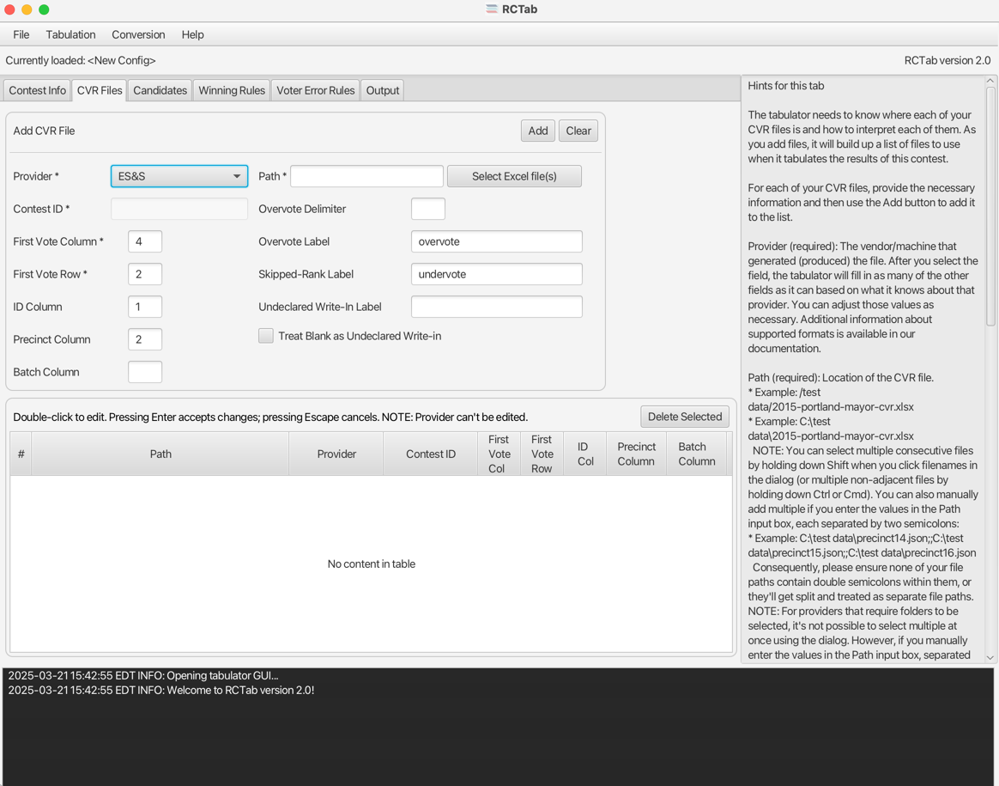

ES&S's CVR export schema can be configured in the voting system. RCTab defaults to match the voting system defaults.
Here are two examples of the default ES&S CVR file layout, both of which would be configured similarly. 

By default, ES&S CVRs have three columns of ballot information, followed by a column for each available ranking. There is a single header row with Column names followed by one row for each ballot.

The CVR below has row/column index numbers added in pink for configuring in RCTab.
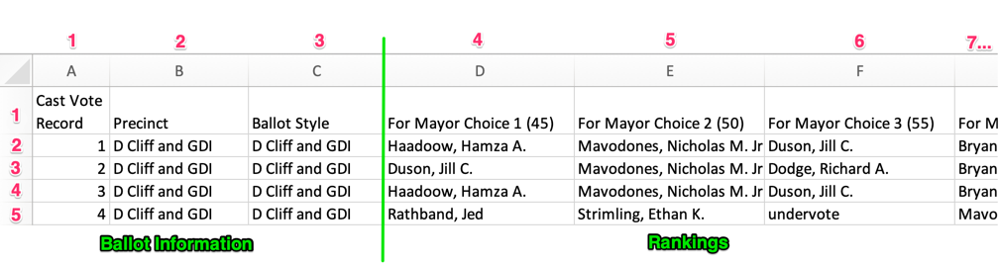

**Path** ES&S `.xlsx` CVR file. Add multiple if necessary.  

**ID Column** Column index of the ballot ID.

**Precinct Column** Column index of the precinct identifier.

**First Vote Column**  Column index where RCV rankings begin. Defaults to `4` to account for first three columns of ballot information like ID, Precinct description and Ballot Style.

**First Vote Row** Row index where RCV rankings begin. Defaults to `2` to account for the header row that has Column names in it.

Your ES&S CVR might look a little different from these examples of the default ES&S CVR layout. Use the descriptions above to configure accordingly!

Hart

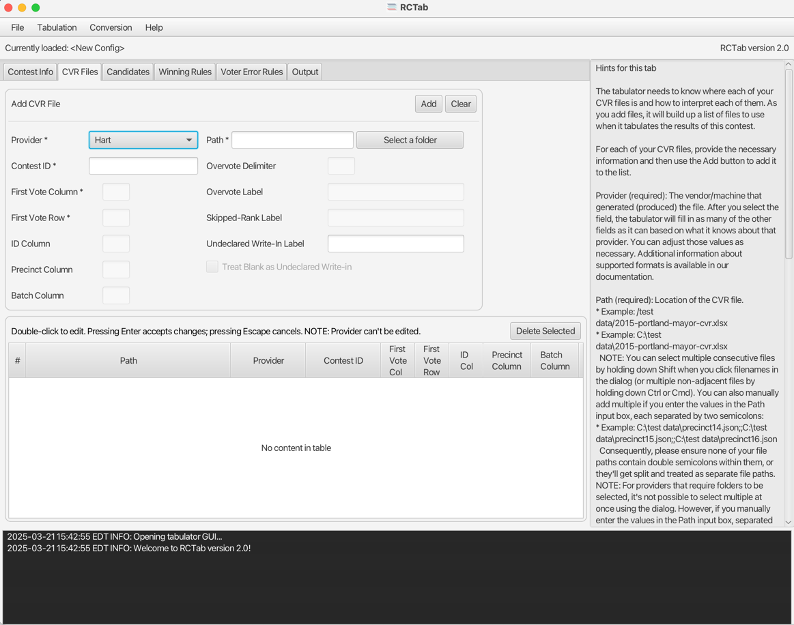
**Path** A folder containing `.xml` CVRs. They name files with GUIDs like `1_f4b6ca3a-1341-4f93-804e-a0a723cfc6f5.xml` and `943e7f54-5cac-40c3-843b-2aef881ea308.xml`

**Contest ID** Inside of the `.xml` is an ID, another GUID. So for the Austin Library Office contest you would use `dee8b4df-a3fa-4148-9fb6-b5202d555bec`.
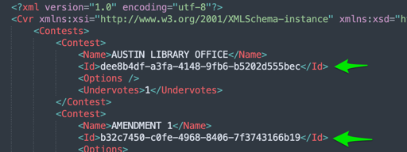

### Candidates Tab

The Candidates tab allows users to put in information about how candidates are referred to in cast-vote record files. 
These settings impact how CVR files are read. 
Candidate names entered on this tab will also be used to display candidate names in results files.

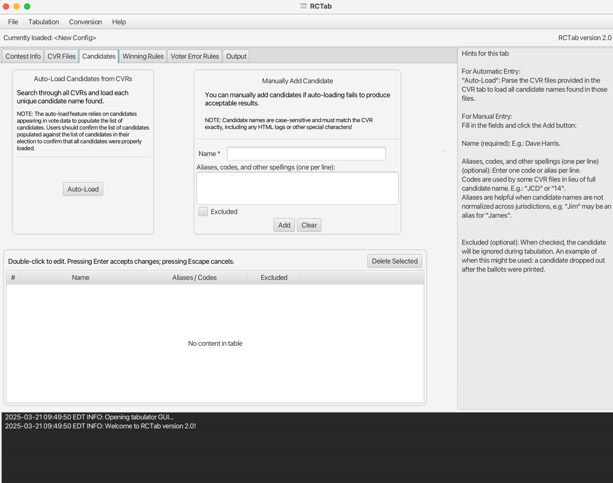
RCTab must be configured with information about every candidate in your contest. There are two ways to load candidate data.

#### Auto-Load
RCTab will look through each of the currently configured CVR files for distinct candidates and load their name and Aliases
automatically for you. The candidate Auto-Load feature relies on candidates appearing in vote data to populate the list of candidates. 
Users should confirm the list of candidates populated against the list of candidates in their election to confirm that
all cnadidates were properly loaded. 

#### Manually Adding Candidate Information
For each candidate, enter their name and any aliases/codes that identify them across CVRs.
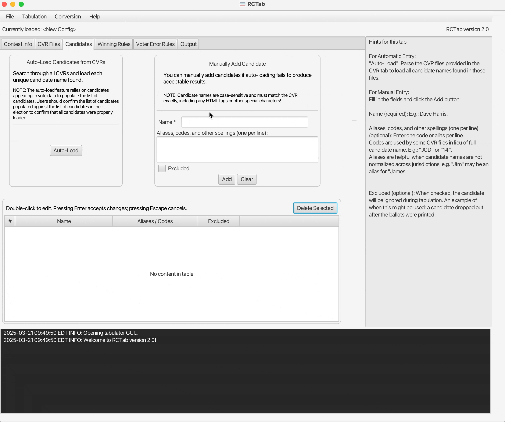

**Name (required):** E.g.: Dave Harris. This information is used to display candidate names in results files.

**Code:** Some CVR files use codes in lieu of the full candidate name. e.g.: "JCD" or "14". Multiple
codes can be used for a single candidate if required e.g. multi-vendor tabulation.

**Excluded:** In round by round tabulation, excluded candidates are treated from the beginning as an eliminated candidate.
They can never be a ballot's continuing candidate in any round. Excluded candidates are not included in the list of candidates in results.   

Additionally, there are some action buttons for configuring candidates. 

**Add:** Adds the currently configured single candidate information to the configured list of candidates. This full list is displayed in the Candidates Table.

**Clear:** Clears any information in Name, Code, and Excluded.

**Delete Selected:** Deletes selected candidate data from the Candidate Table.

### Winning Rules Tab

Winning Rules configuration options tell RCTab what kind of ranked choice voting election to run and how to handle details required for each.

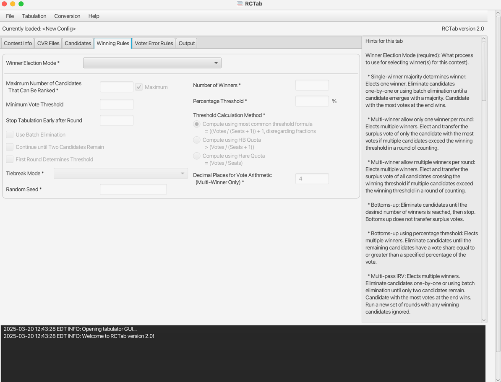

There are two main sets of options on the Winning Rules tab: Winner Election Mode options and Tiebreak Mode options.

Winner election mode options have many options that interact in many different ways. Which options are required and which options users can edit ultimately depend on the winner election mode option itself. Options are described below. Screenshots are then provided of each interface for each winner election mode.

**Winner Election Mode** (required)**:** What process to use for selecting winner(s) for this contest.

- **Single-winner majority determines winner:** Elects one winner. Eliminate candidates one-by-one or using batch elimination until a candidate emerges with a majority. Candidate with the most votes at the end wins.
- **Multi-winner allows only one winner per round:** Elects multiple winners. Elect and transfer the surplus vote of only the candidate with the most votes if multiple candidates exceed the winning threshold in a round of counting.
- **Multi-winner allows multiple winners per round:** Elects multiple winners. Elect and transfer the surplus vote of all candidates crossing the winning threshold if multiple candidates exceed the winning threshold in a round of counting.
- **Bottoms-up:** Eliminate candidates until the desired number of winners is reached, then stop. Bottoms up does not transfer surplus votes.
- **Bottoms-up using percentage threshold:** Elects multiple winners. Eliminate candidates until the remaining candidates have a vote share equal to or greater than a specified percentage of the vote.
- **Multi-pass IRV:** Elects multiple winners. Eliminate candidates one-by-one or using batch elimination until only two candidates remain. Candidate with the most votes at the end wins. Run a new set of rounds with any winning candidates ignored.

**Maximum Number of Candidates That Can Be Ranked** (required)**:** How many rankings each voter has in this contest. This tells RCTab how many rankings to read from each CVR. This option can be filled out in the text box or by selecting a checkbox. Selecting the checkbox disables the text box option and inserts the value “maximum”. The checkbox can be unselectedDefault value: Maximum. Available in all winner election modes.

**Minimum Vote Threshold** (optional)**:** The number of first-choice votes a candidate must receive in order to remain in the race. Any candidates falling below the minimum vote threshold are eliminated and have their votes transferred. Most jurisdictions do not set a minimum vote threshold. Note that if no candidate exceeds the minimum vote threshold, vote tabulation will silently fail. Be sure not to set a minimum vote threshold beyond the number of votes candidates have. This option can impact how any winner election mode tabulation runs. Its validity is not impacted by any other option. Available in all winner election modes.

**Use Batch Elimination** (optional)**:** Batch elimination, or simultaneous elimination of all candidates for whom it is mathematically impossible to be elected, eliminates all candidates who cannot receive enough votes to surpass the candidate with the next highest number of votes. Example: in a six candidate contest with 200 votes, Candidate A has 80 votes, Candidate B has 70, and the other four combined have 50. Because those four candidates can never combine their votes to surpass Candidate B, they can be batch eliminated. This option impacts how single-winner majority determines winner tabulation runs. Its validity is impacted by the winner election mode. It will not impact who wins the election. Available only when Winner Election Mode is "Single-winner majority determines winner".

**Stop Tabulation Early after Round** (optional)**:** If a winner is not found by the given round, tabulation stops early after tabulating this round.

**Continue until Two Candidates Remain** (optional)**:** Single-winner ranked choice voting elections can stop as soon as a candidate receives a majority of votes, even though 3 or more candidates may still be in the race. Selecting this option will run the round-by-round count until only two candidates remain, regardless of when a candidate wins a majority of votes. It will not impact who wins the election.  Available only when Winner Election Mode is "Single-winner majority determines winner".

**First Round Determines Threshold** For single-winner contests, keeps the threshold to elect static based on the first round active ballots, rather than dynamically changing round by round as ballots go inactive. 

**Number of Winners** (required)**:** The number of seats to be filled in the contest. This option impacts the calculation of the election threshold. Its validity and editability is impacted by the winner election mode. It sets the value for “S” in the calculations described in the UI/configuration file parameters. Available and required for Multi-winner allow only one winner per round, Multi-winner allow multiple winners per round, Bottoms-up, and Multi-pass IRV. Set to 1 by RCTab for Single-winner majority determines winner.

- Note that multi-pass IRV does not use this value to calculate its election threshold. The election threshold in multi-pass IRV is always calculated using an S value of 1. This number is used in multi-pass IRV to determine how many instances of a single-winner majority determines winner tabulation must be run on CVR files. See Configuration Parameters for more details.

**Percentage Threshold:** The share of votes a candidate must have in order to win. Used to calculate the election threshold in “Bottoms-up using percentage threshold.” Candidates falling below this threshold are eliminated one-by-one beginning with the candidate with the fewest votes. Required and Available only when Winner Election Mode is "Bottoms-up using percentage threshold".

**Threshold Calculation Method:** The threshold of election is the number of votes a candidate must receive in order to win the election. There are three primary ways to calculate the threshold of election in multi-winner RCV contests. This will be set in law (either by statute or regulation) in your jurisdiction. Required and available only when Winner Election Mode is "Multi-winner allow only one winner per round" or "Multi-winner allow multiple winners per round".

- **Compute using most common threshold formula:** The most common threshold formula is calculated by dividing the number of votes by the number of seats plus one, then adding one to that number. Fractions are disregarded. This is also known as the Droop quota. Candidates must receive this number of votes (or more) to win. This is the default threshold calculation.
- **Compute using HB Quota**: The HB, or Hagenbach-Bischoff, Quota divides the number of votes by the number of seats plus one, leaving fractions. Candidates must receive more than this number of votes to win.
- **Compute using Hare Quota**: The Hare quota divides the number of votes by the number of seats. Fractions are disregarded. It requires candidates to receive that number of votes (or more) to win.

**Decimal Places for Vote Arithmetic (Multi-Winner Only):** Sets how many decimal places after the decimal point are used in surplus transfers and in calculating the threshold. Its validity and editability is impacted by the winner election mode. Required and available only when Winner Election Mode is "Multi-winner allow only one winner per round" or "Multi-winner allow multiple winners per round". Default value: 4.

#### Tiebreaking

There are six tiebreak modes (described in technical detail in [**Section 25 - Configuration File Parameters**](../tdp/configuration_file_parameters.md)). Tiebreak modes impact the validity/operation of one other option: random seed. Tiebreak mode is required for all winner election modes.

**Tiebreak Mode** (required for all winner election modes)**:** Ties in ranked choice voting contests can occur when eliminating candidates or when electing candidates. All winner election modes may have a tie for last place. Tiebreak mode breaks the tie and determines which candidate loses the tie. Multi-winner allows only one winner per round contests can have ties between candidates who have both crossed the threshold of election; in that case, ties are broken to determine whose surplus vote value transfers first. Tiebreak procedures are set in law, either in the ranked choice voting law used in your jurisdiction or in the elections code more generally. Select the option from this list that complies with the law and procedure in your jurisdiction.

- **Random:** Randomly select a tied candidate to eliminate or, in multi-winner allow only one winner per round contests only, elect. Requires a random seed.
- **Stop counting and ask:** Pause count when a tie is reached.  The user is prompted to select any tied candidate to eliminate or, in multi-winner allow only one winner per round contests only, elect.
- **Previous round counts (then random):** Looks back through each previous round's candidate tallies to break the tie. If all previous rounds are ties, the tie is broken randomly. Requires a random seed.
- **Previous round counts (then stop counting and ask):** Looks back through each previous round's candidate tallies to break the tie. If all previous rounds are ties, user is prompted to select any tied candidate to eliminate or, in multi-winner contests only, elect.
- **Use candidate order in the config file:** Use the order of candidates in the config file to determine tiebreak results. Candidates lower in the list lose the tiebreaker.
- **Generate permutation:** Generate a randomly ordered list of candidates in the contest. Candidates lower in the permutation lose the tiebreaker. Requires a random seed.

Random Seed (required if Tiebreak Mode is "Random", "Previous round counts (then random)", or "Generate permutation"): Enter a positive or negative integer to generate random orders. Impacts operation of randomized functions for tiebreaking. Unavailable if Tiebreak Mode is Stop Counting and Ask, Previous round counts (then stop counting and ask) or Use candidate order in the config file.

Following are screenshots of each of the winning rules interfaces on RCTab.

#### Single-winner majority determines winner

<table style="width: 100%; border-collapse: collapse; font-family: 'Arial', sans-serif;">
    <tr>
        <!-- Left Column -->
        <td style="padding: 10px; text-align: left; vertical-align: top; border-bottom: 1px solid #ddd; width: 50%;">
            <strong>Permits user to edit these options:</strong>
            
Maximum Number of Candidates That Can Be Ranked*

            
Minimum Vote Threshold

            
Use Batch Elimination

            
Continue until Two Candidates Remain

            
Tiebreak Mode*

            
Random Seed (* if using randomized)

        </td>
        <!-- Right Column Top -->
        <td style="padding: 10px; text-align: left; vertical-align: top; border-bottom: 1px solid #ddd; width: 50%;">
            <strong>Automatically fills in and locks this option:</strong>
            
Number of Winners*

             
            <strong>Invalid options, locked for this mode:</strong>
            
Percentage Threshold

            
Threshold Calculation Method

            
Decimal Places for Vote Arithmetic

        </td>
    </tr>
    <!-- Bottom Row for Note -->
    <tr>
        <td colspan="2" style="padding: 10px; text-align: left; font-style: italic; font-size: 0.9em; border-top: 1px solid #ddd;">
            Note: Required settings are denoted with an asterisk (*).
        </td>
    </tr>
</table>

#### Multi-winner allow only one winner per round

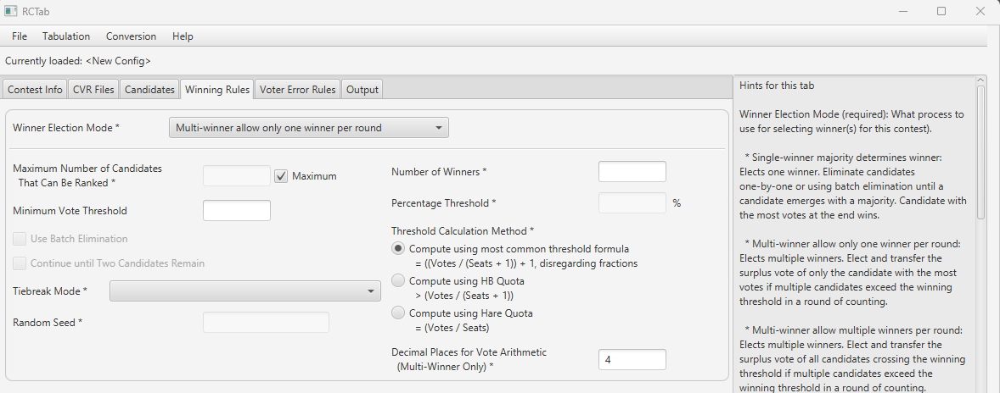

<table style="width: 100%; border-collapse: collapse; font-family: 'Arial', sans-serif;">
    <tr>
        <!-- Left Column -->
        <td style="padding: 10px; text-align: left; vertical-align: top; border-bottom: 1px solid #ddd; width: 50%;">
            <strong>Permits user to edit these options:</strong>
            
Maximum Number of Candidates That Can Be Ranked*

            
Minimum Vote Threshold

            
Tiebreak Mode*

            
Random Seed (* if using randomized tiebreak mode)

            
Number of Winners*

            
Threshold Calculation Method*

            
Decimal Places for Vote Arithmetic*

        </td>
        <!-- Right Column -->
        <td style="padding: 10px; text-align: left; vertical-align: top; border-bottom: 1px solid #ddd; width: 50%;">
            <strong>Invalid options, locked for this mode:</strong>
            
Percentage Threshold

            
Use Batch Elimination

            
Continue until Two Candidates Remain

        </td>
    </tr>
    <!-- Bottom Row for Note -->
    <tr>
        <td colspan="2" style="padding: 10px; text-align: left; font-style: italic; font-size: 0.9em; border-top: 1px solid #ddd;">
            Note: Required settings are denoted with an asterisk (*).
        </td>
    </tr>
</table>

#### Multi-winner allow multiple winners per round

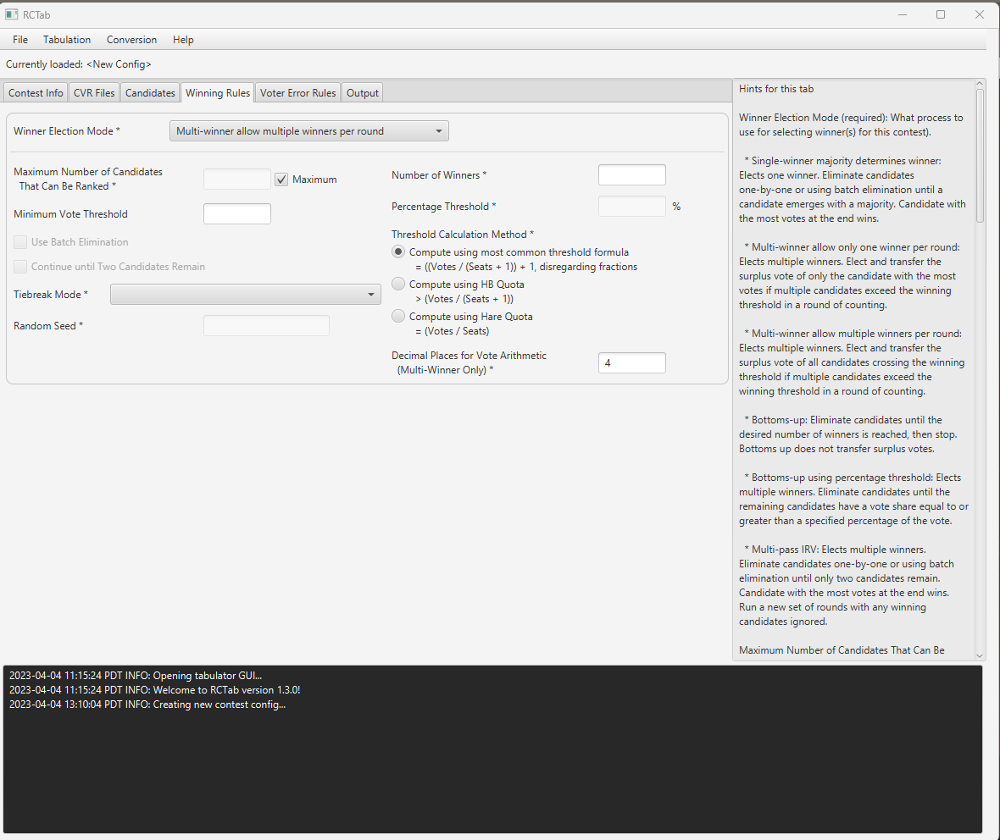

<table style="width: 100%; border-collapse: collapse; font-family: 'Arial', sans-serif;">
    <tr>
        <!-- Left Column -->
        <td style="padding: 10px; text-align: left; vertical-align: top; border-bottom: 1px solid #ddd; width: 50%;">
            <strong>Permits user to edit these options:</strong>
            
Maximum Number of Candidates That Can Be Ranked*

            
Minimum Vote Threshold

            
Tiebreak Mode*

            
Random Seed (* if using randomized tiebreak mode)

            
Number of Winners*

            
Threshold Calculation Method*

            
Decimal Places for Vote Arithmetic*

        </td>
        <!-- Right Column Top -->
        <td style="padding: 10px; text-align: left; vertical-align: top; border-bottom: 1px solid #ddd; width: 50%;">
            <strong>Invalid options, locked for this mode:</strong>
            
Use Batch Elimination

            
Continue until Two Candidates Remain

            
Percentage Threshold

        </td>
    </tr>
    <!-- Bottom Row for Note -->
    <tr>
        <td colspan="2" style="padding: 10px; text-align: left; font-style: italic; font-size: 0.9em; border-top: 1px solid #ddd;">
            Note: Required settings are denoted with an asterisk (*).
        </td>
    </tr>
</table>

#### Bottoms-Up

<table style="width: 100%; border-collapse: collapse; font-family: 'Arial', sans-serif;">
    <tr>
        <!-- Left Column -->
        <td style="padding: 10px; text-align: left; vertical-align: top; border-bottom: 1px solid #ddd; width: 50%;">
            <strong>Permits user to edit these options:</strong>
            
Maximum Number of Candidates That Can Be Ranked*

            
Minimum Vote Threshold

            
Tiebreak Mode*

            
Random Seed (* if using randomized tiebreak mode)

            
Number of Winners*

        </td>
        <!-- Right Column Top -->
        <td style="padding: 10px; text-align: left; vertical-align: top; border-bottom: 1px solid #ddd; width: 50%;">
            <strong>Invalid options, locked for this mode:</strong>
            
Use Batch Elimination

            
Continue until Two Candidates Remain

            
Percentage Threshold

            
Threshold Calculation Method

            
Decimal Places for Vote Arithmetic

        </td>
    </tr>
    <!-- Bottom Row for Note -->
    <tr>
        <td colspan="2" style="padding: 10px; text-align: left; font-style: italic; font-size: 0.9em; border-top: 1px solid #ddd;">
            Note: Required settings are denoted with an asterisk (*).
        </td>
    </tr>
</table>

#### Bottoms-up using percentage threshold

<table style="width: 100%; border-collapse: collapse; font-family: 'Arial', sans-serif;">
    <tr>
        <!-- Left Column -->
        <td style="padding: 10px; text-align: left; vertical-align: top; border-bottom: 1px solid #ddd; width: 50%;">
            <strong>Permits user to edit these options:</strong>
            
Maximum Number of Candidates That Can Be Ranked*

            
Minimum Vote Threshold

            
Tiebreak Mode*

            
Random Seed (* if using randomized tiebreak mode)

            
Percentage Threshold*

        </td>
        <!-- Right Column Top -->
        <td style="padding: 10px; text-align: left; vertical-align: top; border-bottom: 1px solid #ddd; width: 50%;">
            <strong>Automatically fills in and locks this option:</strong>
            
Number of Winners*

             
            <strong>Invalid options, locked for this mode:</strong>
            
Use Batch Elimination

            
Continue until Two Candidates Remain

            
Threshold Calculation Method

            
Decimal Places for Vote Arithmetic

        </td>
    </tr>
    <!-- Bottom Row for Note -->
    <tr>
        <td colspan="2" style="padding: 10px; text-align: left; font-style: italic; font-size: 0.9em; border-top: 1px solid #ddd;">
            Note: Required settings are denoted with an asterisk (*).
        </td>
    </tr>
</table>

#### Multi-pass IRV

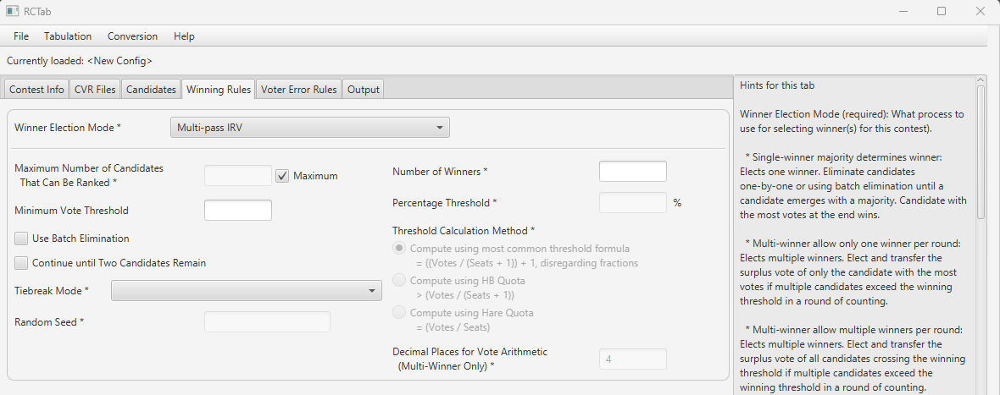

<table style="width: 100%; border-collapse: collapse; font-family: Arial, sans-serif;">
    <tr>
        <!-- Left Column -->
        <td style="padding: 10px; text-align: left; vertical-align: top; border-bottom: 1px solid #ddd; width: 50%;">
            <strong>Permits user to edit these options (required settings denoted with *):</strong>
            
Maximum Number of Candidates That Can Be Ranked*

            
Minimum Vote Threshold

            
Tiebreak Mode*

            
Random Seed (* if using randomized tiebreak mode)

            
Number of Winners*

        </td>
        <!-- Right Column -->
        <td style="padding: 10px; text-align: left; vertical-align: top; border-bottom: 1px solid #ddd; width: 50%;">
            <strong>Invalid options, locked for this mode:</strong>
            
Use Batch Elimination

            
Continue until Two Candidates Remain

            
Threshold Calculation Method

            
Decimal Places for Vote Arithmetic

            
Percentage Threshold

        </td>
    </tr>
</table>

#### Tiebreak Modes

##### Random, Generate Permutation, Previous Round Counts (then random)
If users select any of the tiebreaking modes that incorporate randomness (random, generate permutation, previous round counts (then random)) this is how RCTab will appear. Users must fill out the Random Seed setting.

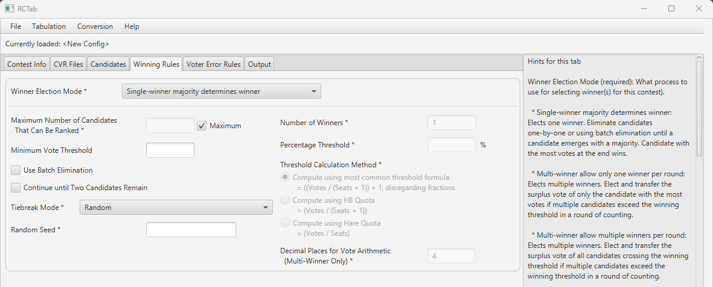

##### Stop counting and ask, previous round counts (then stop counting and ask), use candidate order in the config file
If users select any of the tiebreaking modes that incorporate user input (Stop counting and ask, previous round counts (then stop counting and ask), use candidate order in the config file) this is how RCTab will appear. The Random Seed field will be locked.

### Voter Error Rules

The tabulator needs to know how to handle voter errors in your jurisdiction. These requirements are typically included in statute or regulation. This is a screenshot of what winning rules looks like when a user first navigates to it.

**Overvote Rule** (required)**:** How to handle a ballot where a voter has marked multiple candidates at the same ranking when that ballot is encountered in the round-by-round count.

- **Always skip to next rank:** Skips over an overvote and goes to the next validly-marked ranking on a ballot.
    * Requires Overvote Label to be supplied (when overvote label can be edited)
- **Exhaust immediately:** A ballot with an overvote exhausts when that overvote is encountered in the rounds of counting.
    * Requires overvote label to be supplied (when overvote label can be edited)
- **Exhaust if multiple continuing:** If a voter has an overvote but only one candidate at that overvote is still in the race when that overvote is encountered, the ballot counts for that candidate. If multiple candidates at the overvote are still in the race, the ballot exhausts.
    * Requires overvote delimiter to be supplied (when overvote delimiter can be edited)

**How Many Consecutive Skipped Ranks Are Allowed** (required)**:** How many rankings in a row can a voter skip and still have later rankings count? 0 allows no skipped rankings. `1` allows voters to skip rankings one at a time, but not more than `1` in a row, and so on. Selecting the checkbox disables the text box and inserts the value “unlimited”. Checkbox can be unselected. Default value: `1`.
  Example: A voter could rank their 1st, 3rd and 5th choices and not exhaust the ballot under this rule, for example.

**Exhaust on Multiple Ranks for the Same Candidate** (optional)**:** When checked, the tabulator will exhaust a ballot that includes multiple rankings for the same candidate when that repeat ranking is reached. When unchecked repeated rankings will not exhaust the ballot.
Example: A voter ranks the same candidate 1st and 3rd, a different candidate 2nd, and another candidate 4th. If their original first choice and their second choice are eliminated, the ballot exhausts when it reaches the repeat ranking in rank 3. The ranking in the 4th rank does not count.

Below is an example screenshot of a sample filled-out voter error rules tab. The user has selected Always skip to next rank for Overvote, has selected unlimited for How Many Consecutive Skipped Ranks Are Allowed (making the text box inoperable) and has left Exhaust on Multiple Ranks for the Same Candidate blank.

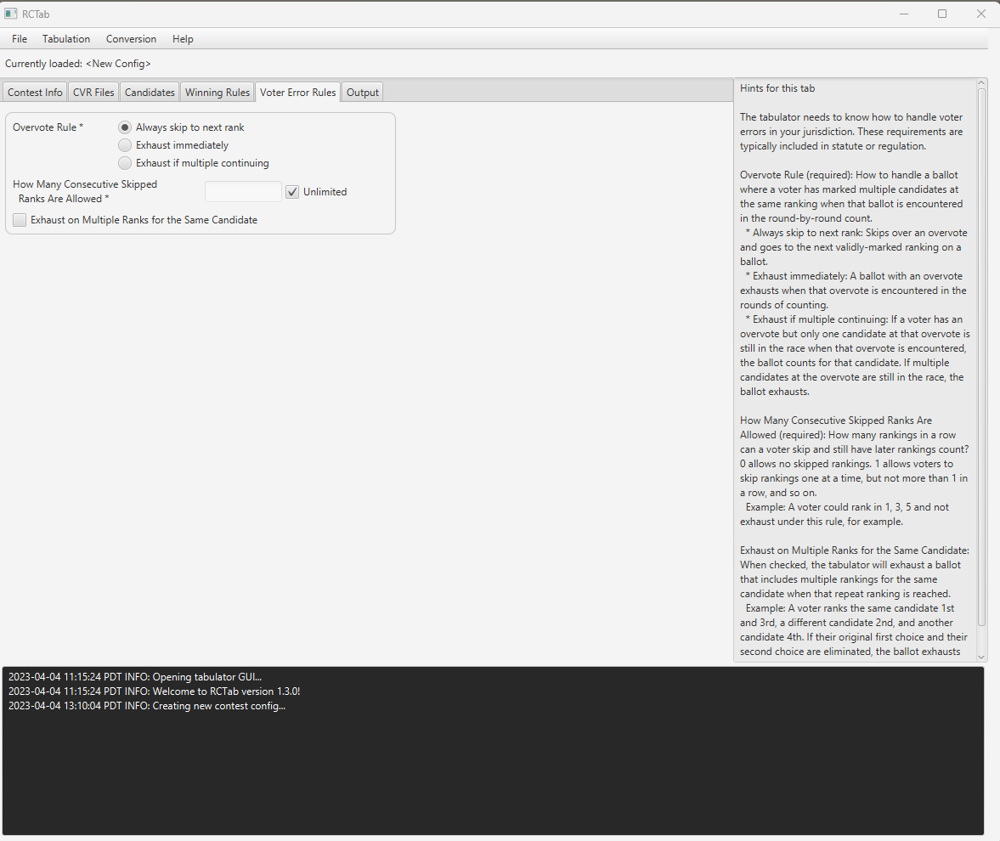

### Output Tab

Tell the tabulator where results files go and what additional output files you want.

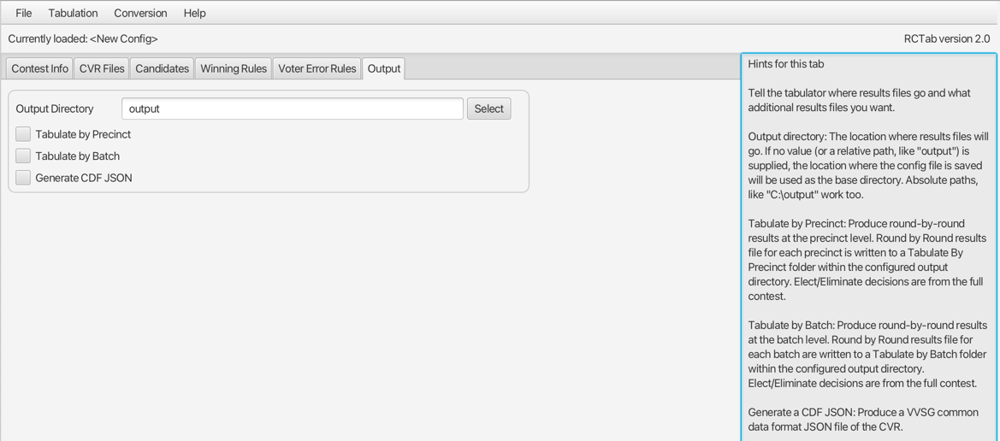

**Output Directory:** Where any output files from successful tabulations go. If no value (or a relative path, like `output`) is supplied, the location where the config file is saved will be used as the base directory. Absolute paths, like `C:\output` work too.

**Tabulate by Precinct:** Produce round-by-round results at the precinct level. Round-by-round results file for each precinct is written to a `Tabulate By Precinct` folder within the configured output directory.  Elect/Eliminate decisions are from the full contest.

**Tabulate by Batch:** Produce round-by-round results at the batch level. Round-by-round results file for each batch are written to a `Tabulate by Batch` folder within the configured output directory. Elect/Eliminate decisions are from the full contest.

**Generate a CDF JSON:** Produce a VVSG common data format JSON file of the CVR.

## Running the round-by-round count

Once configuration is complete, the user can validate the configuration settings before round-by-round tabulation.

1. Click on "Tabulation" at the top of the software window
2. Click on "Validate"
3. Refer to the log box at the bottom of the application. If the message "Contest config validation successful." appears, your contest configuration has been successfully completed.
4. If any error messages appear in the log box, refer to [**Section 29 - RCTab Operator Log Messages**](../tdp/rctab_operator_log_messages.md) and messages in the log box for how to resolve errors. If the error persists, restart the RCTab software

### Pre-Tabulation Checks

Start the round-by-round tabulation by clicking `Tabulation` in the menu, then `Tabulate`. You will see the Pre-Tabulation Checks popup.

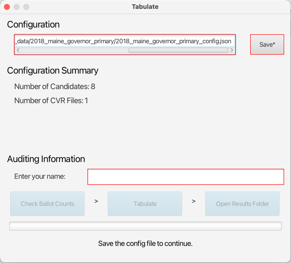

**Configuration** lists the path of your current config file, if loaded. Clicking save allows you to overwrite that file or save a new one. Users are required to save a config file for each tabulation if any settings have changed. This ensures each tabulation run has an auditable config file on disk.

**Configuration Summary** Shows the number of configured candidates and CVR locations. 

**Auditing Information** Each tabulation is required to have a identifier for audit purposes. 

Once your config is saved and a user identifier is entered you can click `Check Ballot Counts`.

#### Check Ballot Counts

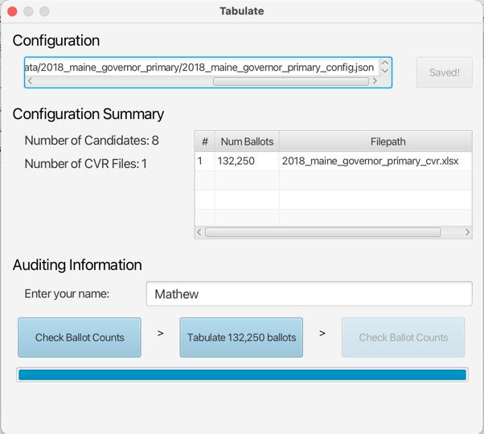

Clicking the `Check Ballot Counts` button reads CVR data from each configured CVR location. For each CVR location you'll see the filepath and total number of ballots at that location. The sum number of total ballots from all CVR locations will then populate in the middle button. Users should confirm this number with their expected ballot counts. 

When you've reviewed this data you can run the tabulation by clicking the `Tabulate XXX,XXX ballots` button!

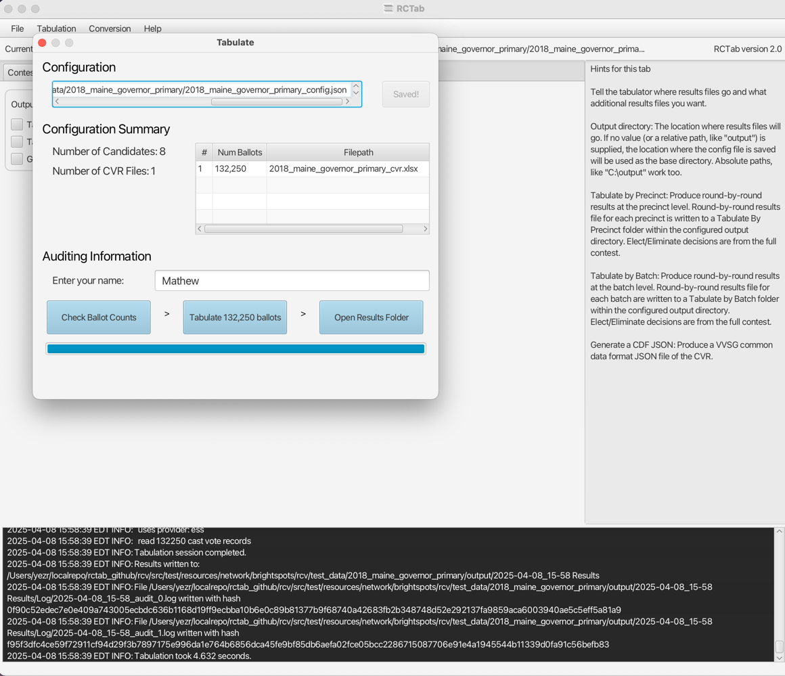

After clicking the `Tabulate XXX,XXX ballots` button you can follow the progress through the log messages in the bottom of the app. When complete the final button `Open Results Folder` is available. It will open the File Explorer to the folder where RCTab results were written to. 

#### Errors During Tabulation
In the event that there is an error, the final button will say `Close and View Errors`. Review the log window for details.
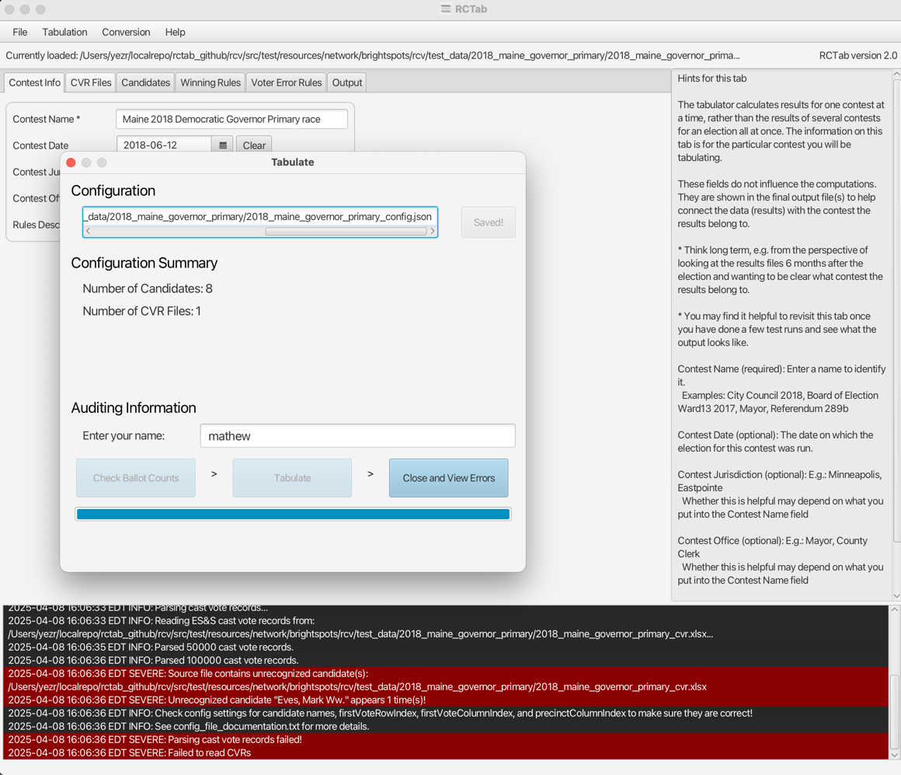

### Output Files
All output files are written to the location specified in the Output tab. Let's assume this is configured to `c:\output` for the following examples. Within that folder, each time a tabulation is run RCTab will create

- A `YYYY-MM-DD-HH-mm Results` folder. In the name of the folder it will replace the actual date and time that the tabulation was run. So the results files for a tabulation run on April 8, 2025 at 4:33PM would be located in `c:\output\2025-04-08-16-33 Results`. The results files for a tabulation that was run 5 minutes later at 4:38PM would be located at `c:\output\2025-04-08-16-38 Results`. In these folders are
  - `YYYY-MM-DD-HH-mm_detailed_report`
  - `YYYY-MM-DD-HH-mm_summary_report`
  - `YYYY-MM-DD-HH-mm_rctab_cvr`
  - A `Log` folder

Optionally, depending on configuration, the following might also be included.
- A `Tabulate by Precinct` folder with detailed and summary reports for each precinct.
- A `Tabulate by Batch` folder with detailed and summary reports for each batch.
- A `YYYY-MM-DD-HH-mm_cdf_cvr` file

Each folder has a `Checksums` folder within it. Inside of that folder are digital fingerprints for each file RCTab generates. 

Here is more detail about each of the output files

**Detailed and Summary Report** Round-by-round results: candidate totals, inactive ballot counts, thresholds and vote percentages.
Detailed report has everything, Summary report excludes separated inactive ballot buckets.

**RCTab CVR** For every ballot configured, identifying information like precinct and file path. For each rank, displays the candidate name for how RCTab read the ballot. 

**Audit Logs** Detailed logs of everything that happens in RCTab. Exact copy of the text that shows up in the UI at the bottom.

**CDF CVR** CVR data in a "Common Data Format" `.json` file.

If necessary, instructions for verifying result file hashes can be found in [**Section 23 - Trusted Build & Output Hash Verification - Windows OS**](../tdp/trusted_build_and_output_hash_verification.md).

RCTab tabulates a single contest at a time. Additional contests must be re-configured.  

If any errors arise in the use of RCTab, refer to [**Section 29 - RCTab Operator Log Messages**](../tdp/rctab_operator_log_messages.md). Errors arising out of any hardware or software other than RCTab should refer to [**Section 09 - System Maintenance Manual**](../tdp/system_maintenance_manual.md) and any relevant user and maintenance manuals.

Any interaction with RCTab, including producing configuration files, running tabulations, hashing results files, and transmission of files from RCTab on USB drives should follow transmission procedures required in the jurisdiction, including the use of a team of no less than two trained personnel.
