# Section 18 - User Guide

Users should ensure the instructions below have been followed and completed before operating RCTab:

- [**Section 05 - Acceptance Test Procedures**](../tdp/acceptance_test_procedures.md)
- [**Section 16 - System Hardening Procedures - Windows OS**](../tdp/system_hardening_procedures_-_windows_os.md)
- [**Section 22 - Installation Instructions for Windows OS**](../tdp/installation_instructions_for_windows_os.md)
- [**Section 23 - HashCode Instructions - Windows OS**](../tdp/trusted_build_and_output_hash_verification.md)
- [**Section 25 - Configuration File Parameters**](../tdp/configuration_file_parameters.md)

Any interaction with RCTab, including producing configuration files, running tabulations, hashing results files, and transmission of files from RCTab on USB drives should follow transmission procedures required in the jurisdiction, including the use of a team with no less than two trained personnel. This document describes all interfaces and options in the RCTab software.

> Note: examples in this guide assume that the user is using Windows.

## Launching RCTab

The manufacturer recommends RCTab be installed as part of the pre-election preparation process. Jurisdictions using RCTab for official elections should follow local guidelines for procuring RCTab.
For others, RCTab installers and command line bundles are available for download from the [RCTab Github Releases page](https://github.com/BrightSpots/rcv/releases).

Official RCTab releases have installers for Windows, Mac and Linux. Use like any other application.
On the [RCTab Github Releases page](https://github.com/BrightSpots/rcv/releases) find the appropriate installer based on your operating system.

## RCTab Layout
Let's get familiar with the RCTab layout. There are four important sections for RCTab users.

**1 - Config Tabs** Different options for configuring a ranked choice voting contest in RCTab. Clicking through the tabs on the top will take you to different configuration options.

**2 - Hint Text** For each of the different configuration tabs, this section has help text for users.

**3 - Log Output** While using RCTab, everything that it is doing is logged to this section. Users should be looking here for any information that RCTab needs to communicate. Users can copy text from this section with `[Right Click] -> Copy`.
It sends the user messages about the tabulation process, any errors encountered in using a configuration file, any errors in tabulation, and other software messages.
All messages in this panel are also saved to a file on disk for auditability later.  

**4 - RCTab Menu**
The menu bar contains some important actions. 

- `File -> Save` saves your current configuration to a file on disk.
- `File -> Load` allows you to choose a configuration file to load into RCTab, allowing you to continue from a previously configured contest.
- `File -> New` lets you start fresh with an empty configuration in the UI.

- `Tabulation -> Validate` runs some basic validation on your configuration _before_ running the round by round tabulation. Configuration issues are logged for the user to address.
- `Tabulation -> Tabulate` begins the round by round tabulation!

The `Currently Loaded` text under the menu shows the path of the configuration file that is currently being used. 

## Setting up a configuration file for RCTab

This section will describe how to set up a configuration for a contest using your jurisdiction's  ranked choice voting rules. This guide also includes screenshots of the interfaces described. The values a user inputs into any of these fields depend upon the relevant laws and regulations in place in their jurisdiction, as well as the voting system vendor used to produce cast-vote records for their elections. Users must understand the requirements of their laws, regulations, and vendor CVR data in order to fill out these fields accurately for their needs.

RCTab is organized into tabs

- The Contest Info Tab
- The CVR Files Tab
- The Candidates Tab
- The Winning Rules Tab
- The Voter Error Rules Tab
- The Output Tab

These tabs each include a set of fields that users fill out - some fields are always required, some fields are required based on other settings, and some fields are always optional.
This guide will walk the user through basic descriptions of these tabs and each of these fields.

As users navigate through each tab, they are building a configuration file which must be saved before tabulation.
If RCTab is closed and the configuration is not saved, no information will be stored. The next time RCTab is opened all fields will be blank. 
Once configured, RCTab can save all the current configuration settings to a file. That file can be used later to load RCTab into the same configuration. Use `File -> Save` and `File -> Load` to save and load RCTab configs.

Each individual contest run through RCTab requires its own configuration with contest-specific information such as the contest name and candidate names.

### Validating Your Contest Configuration
At any time, users can validate their contest configuration. RCTab has logic to look through all settings and confirm that they are valid.
If invalid, messages will provide guidance on how to address invalid settings.
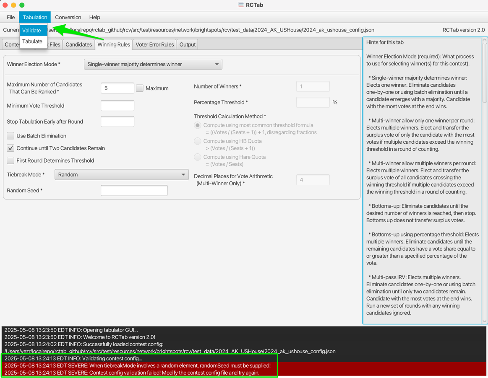

### Contest Info Tab
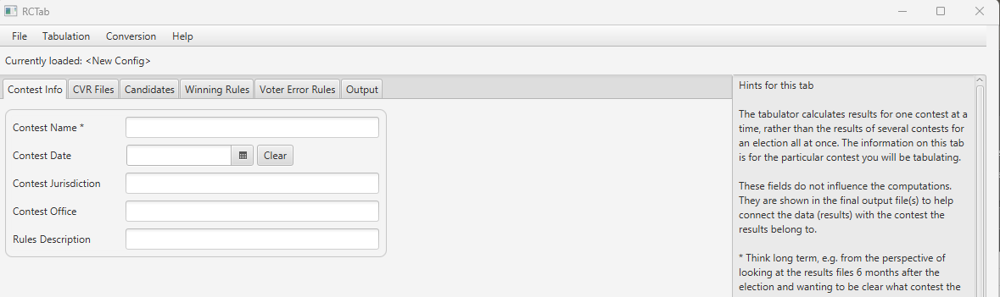
The tabulator calculates results for one contest at a time, rather than the results of several contests for an election all at once. The information on this tab is for the particular contest you will be tabulating.

These fields do not influence the computations. They are shown in the final output file(s) to help connect the data (results) with the contest the results belong to.
Think long term, e.g. from the perspective of looking at the results files 6 months after the election and wanting to be clear what contest the results belong to.

- **Contest Name (required)** Enter a name to identify your contest. Examples: City Council 2025, Mayor Preliminary Election Night, Mayor Certified 
- **Contest Date**
- **Contest Jurisdiction**
- **Contest Office**
- **Rules Description**

Example Completed Contest Info tab

### CVR Files Tab

The tabulator needs configuration information for each of the contest's CVR files. 
Only add files to the configuration that contain data for the contest you are tabulating.

This tab is a multistep process. For each CVR location, the user provides the file path and additional pertinent information that RCTab needs to interpret them. For each CVR location, after additional required information is provided, the user must explicitly add them to the list of configured CVRs. Pressing the 'Add' button will populate the currently configured CVR in the table below.  

All information in this tab only configures RCTab on where to find files and how to read those files. This step does not actually pull in any vote information. Vote information is only used after a user clicks the "Tabulate" button under "Tabulation" as described later in this guide.

For each of your CVR files, provide the necessary information and then use the Add button to add it to the list.

**Provider (required):** The vendor that generated the CVR. After you select the field, the tabulator will fill in as many of the other fields as it can, based on what it knows about that provider. You can adjust those values as necessary. Different options are active for different providers.
See below for a break-down of each field and what is required:

**Path (required)**: Location of the CVR file or the folder that they reside in. What you need to select is dependent on the provider. RCTab will change the file selector to select only what you can.

**Contest ID:** Some CVRs assign an ID label to each contest in the CVR. The tabulator needs to know which contest is being tabulated when multiple contests are included in one CVR. Enter the ID of the contest being tabulated in this field.

**First Vote Column:** the column where the first vote record is.

**First Vote Row:** the row where the first vote record is.

**ID Column:** The column where ballot IDs are located. Not all CVR files contain an ID.

**Precinct Column:** The column that contains the precinct.

**Batch Column:** The column that contains the batch identifier.

**Overvote Delimiter:** (must be blank if "Overvote Label" is provided) If using a CVR in ES&S style, overvotes can be reflected in a CVR by displaying all candidates marked at a ranking. Those candidate names will be separated from each other by a delimiter, something like a vertical bar `|` or a slash `/`. If your overvotes are delimited like this, enter the delimiter used in this field. Note: that ES&S files may include only the label "overvote" and no additional information, in which case the "Overvote Label" field should be used instead.

**Overvote Label:** (must be blank if Overvote Delimiter is provided) Some providers use a particular word/phrase to indicate an overvote.

**Undervote Label**: Some ES&S CVRs use a particular word/phrase to indicate an undervote.

**Undeclared Write-in Label:** Defines rankings in the CVR that will count towards `Undeclared Write-In` in the round-by-round count.
`Undeclared Write-In` will always be eliminated in the first round, regardless of vote count.

**Treat Blank as Undeclared Write-in:** When checked, the tabulator will interpret blank cells in the ES&S CVR as votes for `Undeclared Write-In`.

Additionally, there are some action buttons used for configuring CVRs.

**Add:** Adds an instance of the currently configured CVR settings to the list used during tabulation. Each addition is listed in the CVR table above the log output. Continue adding until you have specified all CVRs for your contest.   

**Clear:** Clears all fillable values in CVR Files tab above the CVR Files table.

**Delete Selected:** Deletes a row of CVR file information from the CVR table.

This guide will now briefly discuss details for each provider. It will highlight idiosyncrasies for each provider that users should be thinking about.  

CDF

CDF, or Common Data Format, is a common standard required by VVSG 2.0. 

**Path** Either a `.json` or `.xml` file. Add multiple if necessary.

Clear Ballot

**Contest ID** Look in the first column of the ClearBallot CVR. The Contest ID is between the first and second colons `:`
In this example the Contest ID would be `City of Portland, Councilor, District 1`

CSV CVR

Expects `.csv` file to have Candidate Names along the top row and ranks in the cells.

Dominion

**Path** Is the folder with Dominion `CvrExport.json` output CVRs. 

**Contest ID** Look in `ContestManifest.json` or `Contests.Id` in `CvrExport.json` files.

ES&S

ES&S's CVR export schema can be configured in the voting system. RCTab defaults to match the voting system defaults.
Here are two examples of the default ES&S CVR file layout, both of which would be configured similarly. 

By default, ES&S CVRs have three columns of ballot information, followed by a column for each available ranking. There is a single header row with Column names followed by one row for each ballot.

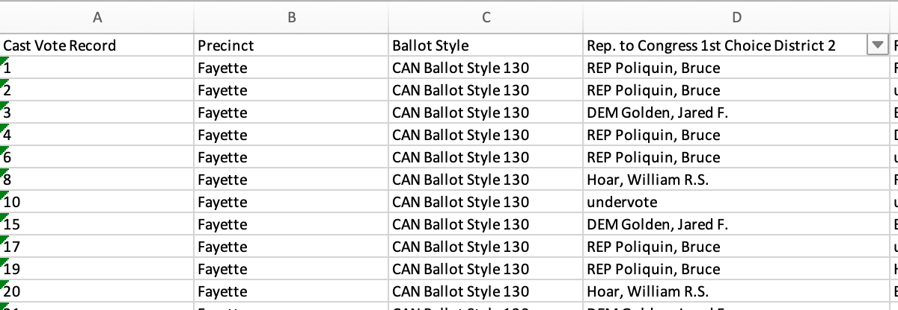

The CVR below has row/column index numbers added in pink for configuring in RCTab.

**Path** ES&S `.xlsx` CVR file. Add multiple if necessary.  

**ID Column** Column index of the ballot ID.

**Precinct Column** Column index of the precinct identifier.

**First Vote Column**  Column index where RCV rankings begin. Defaults to `4` to account for first three columns of ballot information like ID, Precinct description and Ballot Style.

**First Vote Row** Row index where RCV rankings begin. Defaults to `2` to account for the header row that has Column names in it.

Your ES&S CVR might look a little different from these examples of the default ES&S CVR layout. Use the descriptions above to configure accordingly!

Hart

**Path** A folder containing `.xml` CVRs. They name files with GUIDs like `1_f4b6ca3a-1341-4f93-804e-a0a723cfc6f5.xml` and `943e7f54-5cac-40c3-843b-2aef881ea308.xml`

**Contest ID** Inside the `.xml` is an ID, another GUID. In the example below, for the Austin Library Office contest you would use `dee8b4df-a3fa-4148-9fb6-b5202d555bec`.

### Candidates Tab

The Candidates tab allows users to put in information about how candidates are referred to in cast-vote record files. 
These settings impact how CVR files are read. 
Candidate names entered on this tab will also be used to display candidate names in results files.

RCTab must be configured with information about every candidate in your contest. There are two ways to load candidate data.

#### Auto-Load
RCTab will look through each of the currently configured CVR files for distinct candidates and load their name and Aliases
automatically for you. The candidate Auto-Load feature relies on candidates appearing in vote data to populate the list of candidates. 
Users should confirm the list of candidates populated against the list of candidates in their election to confirm that
all candidates were properly loaded. 

#### Manually Adding Candidate Information
For each candidate, enter their name and any aliases/codes that identify them across CVRs.

**Name (required):** E.g.: Dave Harris. This information is used to display candidate names in results files.

**Code:** Some CVR files use codes in lieu of the full candidate name. e.g.: "JCD" or "14". Multiple
codes can be used for a single candidate if required e.g. multi-vendor tabulation.

**Excluded:** In round by round tabulation, excluded candidates are treated from the beginning as an eliminated candidate.
They can never be a ballot's continuing candidate in any round. Excluded candidates are not included in the list of candidates in results.   

Additionally, there are some action buttons for configuring candidates. 

**Add:** Adds the currently configured single candidate information to the configured list of candidates. This full list is displayed in the Candidates Table.

**Clear:** Clears any information in Name, Code, and Excluded.

**Delete Selected:** Deletes selected candidate data from the Candidate Table.

### Winning Rules Tab

Winning Rules configuration options tell RCTab what kind of ranked choice voting election to run and how to handle details required for each.

#### Winner Election Mode
Similar to the **Provider** dropdown in the CVR Files Tab, the **Winner Election Mode** dropdown in the Winning Rules tab drives many of the other settings on this tab.
Depending on which **Winner Election Mode** is selected, certain configuration fields are unneccesary and greyed out, certain fields are defaulted, and certain fields are required.  

First, let's describe each mode. 

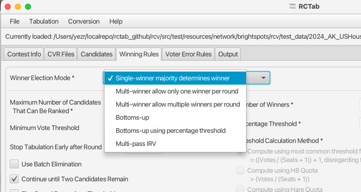

**Winner Election Mode (required):** Which RCV round-by-round process to use for selecting winner(s) for this contest.

- **Single-winner majority determines winner:** Elects one winner. Eliminate candidates one-by-one or using batch elimination until a candidate emerges with a majority. Candidate with the most votes at the end wins.
- **Multi-winner allows only one winner per round:** Elects multiple winners. Elect and transfer the surplus vote of only the candidate with the most votes if multiple candidates exceed the winning threshold in a round of counting.
- **Multi-winner allows multiple winners per round:** Elects multiple winners. Elect and transfer the surplus vote of all candidates crossing the winning threshold if multiple candidates exceed the winning threshold in a round of counting.
- **Bottoms-up:** Eliminate candidates until the desired number of winners is reached, then stop. Bottoms up does not transfer surplus votes.
- **Bottoms-up using percentage threshold:** Elects multiple winners. Eliminate candidates until the remaining candidates have a vote share equal to or greater than a specified percentage of the vote.
- **Multi-pass IRV:** Elects multiple winners by running consecutive Single-Winner contests where subsequent contests have winning candidates excluded.

Selecting a Winner Election Mode will affect the Winning Rules settings in the following way

- Any Winning Rules setting that is applicable and has a default set by RCTab will be filled in with that default.
- Any Winning Rules setting that is either not applicable or has a required default for the currently selected Winner Election mode will be disabled and not editable.
- Any Winning Rules setting that is editable for the currently selected Winner Election Mode will be able to be changed by the user.

You can always use the `Tabulate -> Verify` button to confirm that your current settings are valid!

#### Winning Rules Settings

This guide will now briefly describe each different Winning Rules Settings.

**Maximum Number of Candidates That Can Be Ranked (required):** How many rankings are possible on a ballot. By default, `Maximum` checkbox is selected, which calculates this number automatically from the CVR.
Explicit number allows RCTab to programmatically validate that all CVRs match expectations.

[//]: # (and in the future, provide more detailed reporting on exhausted ballots. https://github.com/BrightSpots/rcv/issues/854)

**Minimum Vote Threshold:** Any candidates falling below the minimum vote threshold are eliminated in the initial round and have their votes transferred just like an eliminated candidate. Default is blank, in which case no minimum vote threshold is applied.

**Stop Tabulation Early after Round:** If a winner is not found by the given round, round by round tabulation stops following this round and output contains only those rounds.
Default is blank, which means that Tabulation continues until the configured number of elected candidates are found.

**Use Batch Elimination:** When multiple candidates in a round do not have enough votes together to overcome the next highest candidate, those candidates will be eliminated in a single round instead of one round for each.

**Continue until Two Candidates Remain:** Single-winner ranked choice voting elections can identify a winner and stop tabulating as soon as a candidate reaches the winning threshold, before other candidates are explicitly eliminated. For example, a 10 candidate contest can identify a winner before eliminating anyone if a candidate gets 60% of all first ranks. Selecting this option will play out the round-by-round count until only two candidates remain, regardless of when a candidate reaches the threshold.

**First Round Determines Threshold** For single-winner contests, keeps the threshold to elect static based on the first round active ballots, rather than dynamically changing round by round as ballots go inactive.

**Number of Winners:** The number of seats to be filled in the contest.

**Percentage Threshold:** The share of votes a candidate must have to win. Used to calculate the election threshold in “Bottoms-up using percentage threshold.” Candidates falling below this threshold are eliminated one-by-one beginning with the candidate with the fewest votes.

**Threshold Calculation Method:** The threshold of election is the number of votes a candidate must receive to be elected. There are three primary ways to calculate the threshold of election in multi-winner RCV contests. 

- **Compute using most common threshold formula:** The most common threshold formula is calculated by dividing the number of votes by the number of seats plus one, then adding one to that number. Fractions are disregarded. This is also known as the Droop quota. Candidates must receive this number of votes (or more) to win. This is the default threshold calculation.
- **Compute using HB Quota**: The HB, or Hagenbach-Bischoff, Quota divides the number of votes by the number of seats plus one, leaving fractions. Candidates must receive more than this number of votes to win.
- **Compute using Hare Quota**: The Hare quota divides the number of votes by the number of seats. Fractions are disregarded. It requires candidates to receive that number of votes (or more) to win.

**Decimal Places for Vote Arithmetic (Multi-Winner Only):** Sets how many decimal places after the decimal point are used in surplus transfers and in calculating the threshold.

#### Tiebreaking

All Winner Election Modes must explicitly choose a Tiebreak Mode.

**Tiebreak Mode:** Ties in ranked choice voting contests can occur when eliminating candidates or when electing candidates.
Tiebreak mode breaks the tie and determines which candidate loses the tie.

- **Random:** Randomly select a tied candidate to elect/eliminate. 
- **Stop counting and ask:** Pause count when a tie is reached. The user is prompted to select any tied candidate to elect/eliminate.
- **Previous round counts (then random):** Looks back through each previous round's candidate tallies to break the tie. If all previous rounds are ties, the tie is broken randomly.
- **Previous round counts (then stop counting and ask):** Looks back through each previous round's candidate tallies to break the tie. If all previous rounds are ties, user is prompted to select any tied candidate to elect/eliminate.
- **Use candidate order in the config file:** Use the order of candidates in the config file to determine tiebreak results. Candidates lower in the list lose the tiebreaker.
- **Generate permutation:** Generate a randomly ordered list of candidates in the contest. Candidates lower in the permutation lose the tiebreaker. 

**Random Seed:** Enter any positive or negative integer. Required for any Tiebreak Mode that uses randomness. 

Following are screenshots of the different Winner Election Modes in RCTab.

Single-winner majority determines winner
 

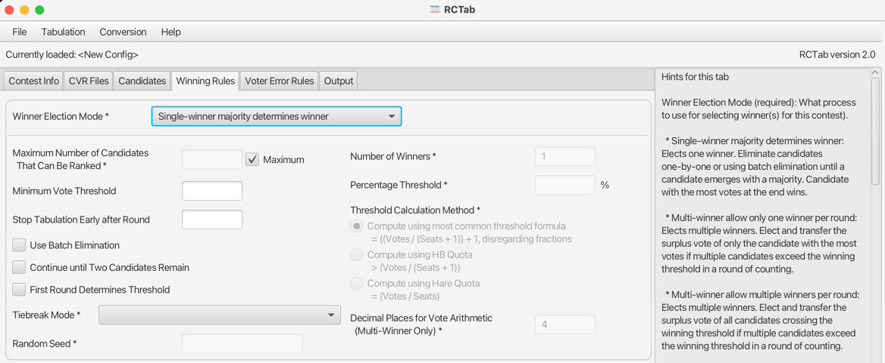
Can run with all defaults. 

Multi-winner allow only one winner per round

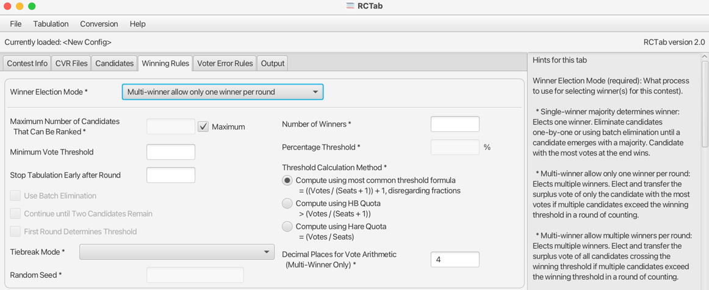
**Required Input:** Number of Winners

Multi-winner allow multiple winners per round

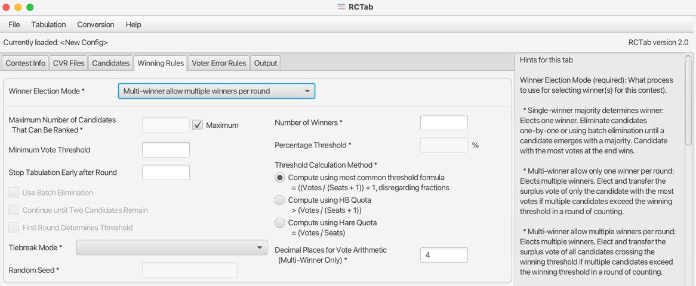
**Required Input:** Number of Winners

Bottoms-Up

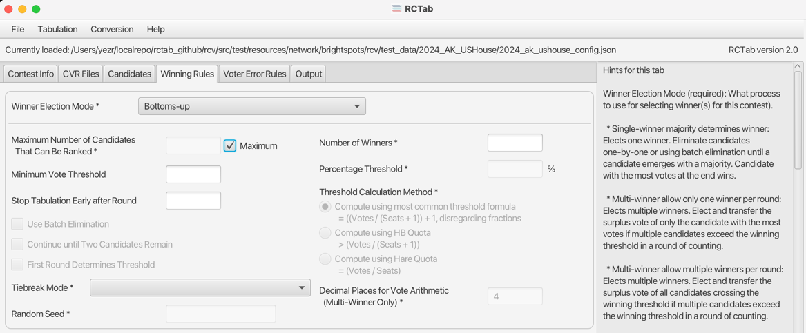
**Required Input:** Number of Winners

Bottoms-up using percentage threshold

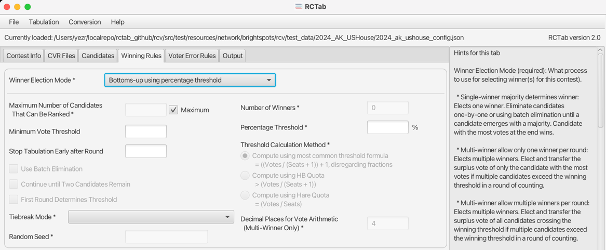
**Required Input:** Percentage Threshold

Multi-pass IRV

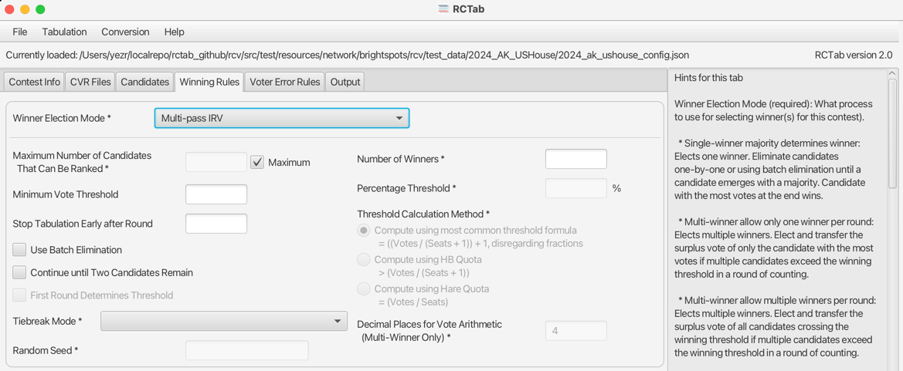
**Required Input:** Number of Winners

### Voter Error Rules Tab

RCTab can be configured to be strict or permissive with voter errors. 

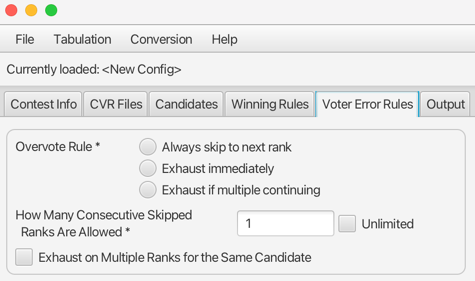

**Overvote Rule (required):** How to handle a ballot where a voter has marked multiple candidates at the same ranking when that ballot is encountered in the round-by-round count.

- **Always skip to next rank:** Skips over an overvote and goes to the next validly-marked ranking on a ballot.
- **Exhaust immediately:** A ballot with an overvote exhausts when that overvote is encountered in the round by round count.
- **Exhaust if multiple continuing:** If a voter has an overvote but only one candidate at that overvote is still in the race when that overvote is encountered, the ballot counts for that candidate. If multiple candidates at the overvote are still in the race, the ballot exhausts.

**How Many Consecutive Skipped Ranks Are Allowed (required):** How many consecutive rankings a voter can skip and still have later rankings count. 0 allows no skipped rankings. `1` allows a single consecutive skipped rank, and so on.
Checking `Unlimited` allows any number of consecutive skipped rankings while still count later valid rankings.

**Exhaust on Multiple Ranks for the Same Candidate:** When checked, the tabulator will exhaust a ballot that includes more than one ranking for the same candidate.
It will exhaust when the first repeated ranking is encountered. When unchecked, any repeat rankings for the same ballot will be treated as an excluded candidate, and the ballot will count towards the next ranked continuing candidate.

### Output Tab

Tell the tabulator where results files go and what additional output files you want.

**Output Directory:** Where any output files from successful tabulations go. If no value (or a relative path, like `output`) is supplied, the location where the config file is saved will be used as the base directory. Absolute paths, like `C:\output` work too.

**Tabulate by Precinct:** Produce round-by-round results at the precinct level. Round-by-round results file for each precinct is written to a `Tabulate By Precinct` folder within the configured output directory.  Elect/Eliminate decisions are from the full contest.

**Tabulate by Batch:** Produce round-by-round results at the batch level. Round-by-round results file for each batch is written to a `Tabulate by Batch` folder within the configured output directory. Elect/Eliminate decisions are from the full contest.

**Generate a CDF JSON:** Produce a VVSG common data format JSON file of the CVR.

## Round By Round Tabulation
### Pre-Tabulation Checks

Start the round-by-round tabulation by clicking `Tabulation` in the menu, then `Tabulate`. You will see the Pre-Tabulation Checks popup.

**Configuration** lists the path of your current config file, if loaded. Clicking save allows you to overwrite that file or save a new one. Users are required to save a config file for each tabulation if any settings have changed. This ensures each tabulation run has an auditable config file on disk.

**Configuration Summary** Shows the number of configured candidates and CVR locations. 

**Auditing Information** Each tabulation is required to have an identifier for audit purposes. 

Once your config is saved and a user identifier is entered you can click `Check Ballot Counts`.

#### Check Ballot Counts

Clicking the `Check Ballot Counts` button reads CVR data from each configured CVR location. For each CVR location you'll see the filepath and total number of ballots at that location. The sum number of total ballots from all CVR locations will then populate in the middle button. Users should confirm this number with their expected ballot counts. 

When you've reviewed this data you can run the tabulation by clicking the `Tabulate XXX,XXX ballots` button!

After clicking the `Tabulate XXX,XXX ballots` button you can follow the progress through the log messages in the bottom of the app. When complete the final button `Open Results Folder` is available. It will open the File Explorer to the folder where RCTab results were written to. 

### After Tabulation
In the event that there is an error, the final button will say `Close and View Errors`. Review the log window for details. Refer to [**Section 29 — RCTab Operator Log Messages**](../tdp/rctab_operator_log_messages.md) to troubleshoot.

If tabulation is successful, the final button will say `Open Results Folder`. Click to view the results!
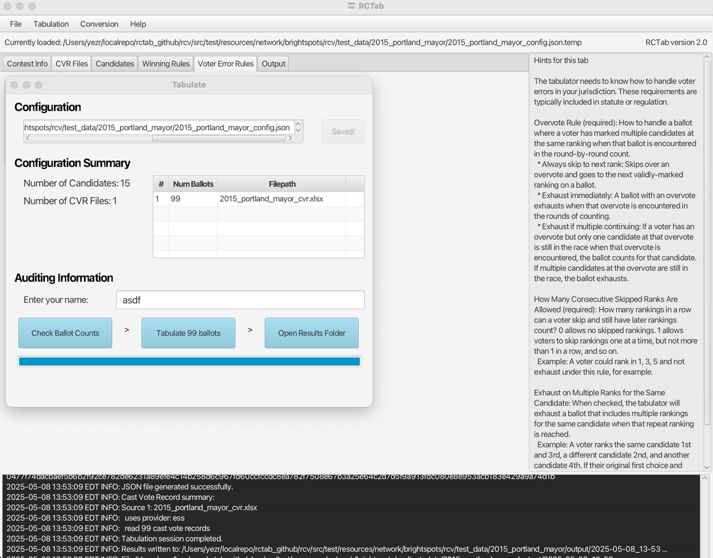

#### Output Files
All output files are written to the location specified in the Output tab. Let's assume this is configured to `c:\output` for the following examples. Within that folder, each time a tabulation is run RCTab will create

- A `YYYY-MM-DD-HH-mm Results` folder. In the name of the folder it will replace the actual date and time that the tabulation was run. So the results files for a tabulation run on April 8, 2025 at 4:33PM would be located in `c:\output\2025-04-08-16-33 Results`. The results files for a tabulation that was run 5 minutes later at 4:38PM would be located at `c:\output\2025-04-08-16-38 Results`. In these folders are
  - `YYYY-MM-DD-HH-mm_detailed_report`[^detailed_report]
  - `YYYY-MM-DD-HH-mm_summary_report`
  - `YYYY-MM-DD-HH-mm_rctab_cvr`
  - A `Log` folder

[^detailed_report]: More details about the data in the Detailed Report are available in the [User Guide Extended](../user_guide/user_guide_extended.md#detailed-report).

Optionally, depending on configuration, the following might also be included.
- A `Tabulate by Precinct` folder with detailed and summary reports for each precinct.
- A `Tabulate by Batch` folder with detailed and summary reports for each batch.
- A `YYYY-MM-DD-HH-mm_cdf_cvr` file

Each folder has a `Checksums` folder within it. Inside of that folder are digital fingerprints for each file RCTab generates. 

Here is more detail about each of the output files

**Detailed and Summary Report** Round-by-round results: candidate totals, inactive ballot counts, thresholds and vote percentages.
Detailed Report has everything, Summary Report excludes separated inactive ballot buckets.

**RCTab CVR** For every ballot configured, identifying information like precinct and file path. For each rank, displays the candidate name for how RCTab read the ballot. 

**Audit Logs** Detailed logs of everything that happens in RCTab. Exact copy of the text that shows up in the UI at the bottom.

**CDF CVR** CVR data in a "Common Data Format" `.json` file.

Any interaction with RCTab, including producing configuration files, running tabulations, hashing results files, and transmission of files from RCTab on USB drives should follow transmission procedures required in the jurisdiction, including the use of a team of no less than two trained personnel.
