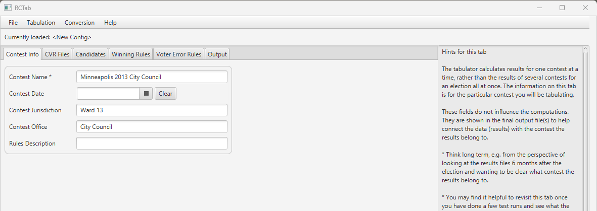
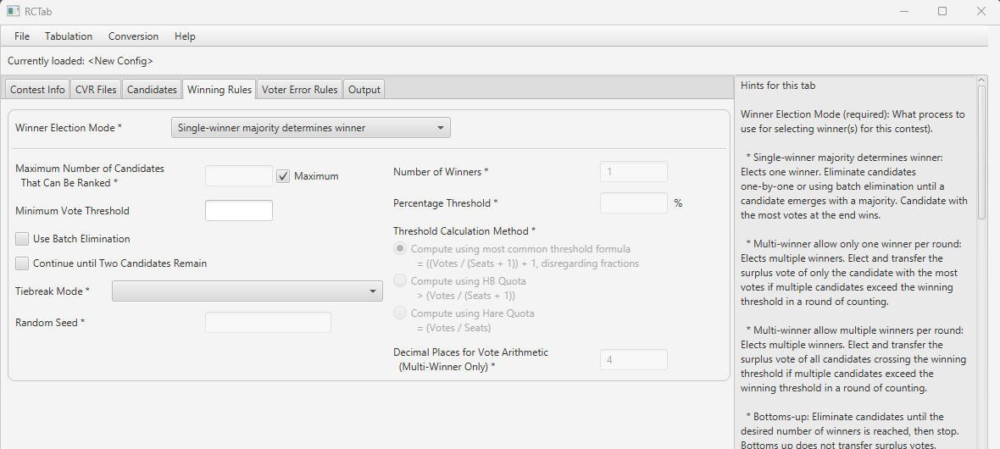
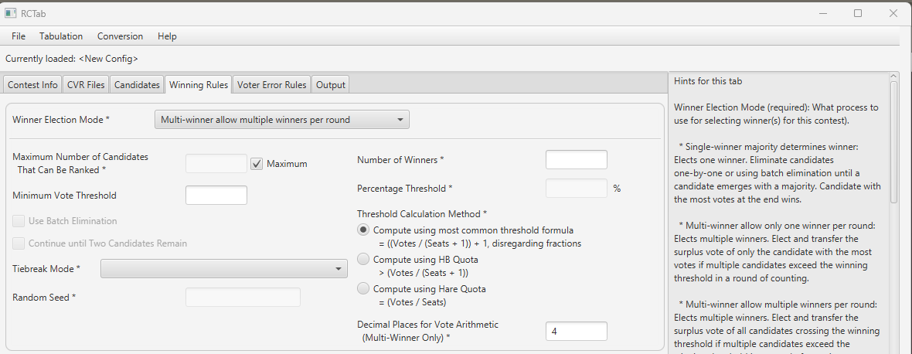
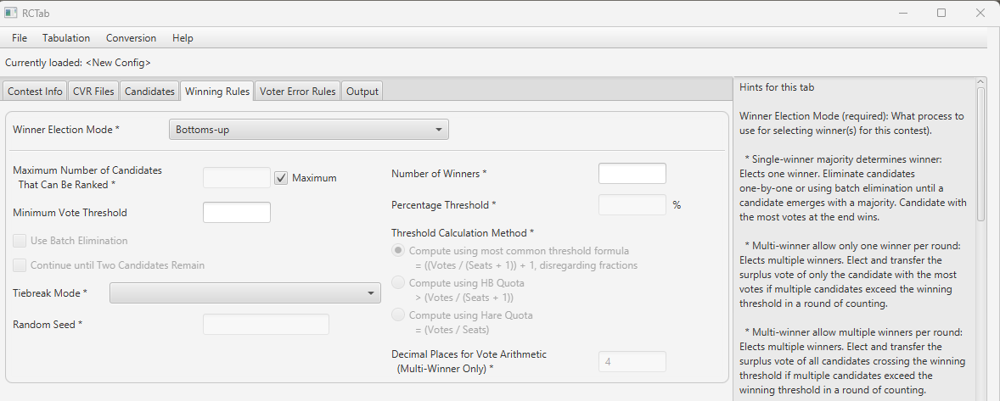
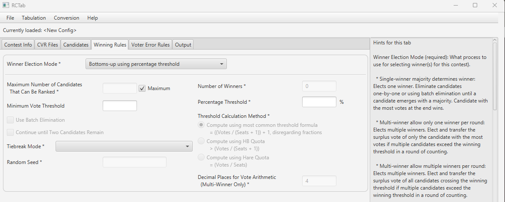
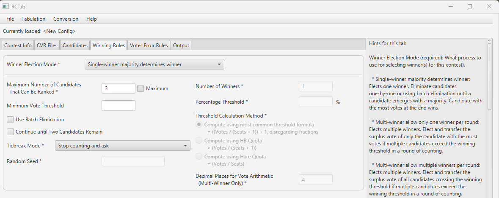

# Section 18 - User Guide

Users should ensure instructions below have been followed and completed prior to operating RCTab:

- [**Section 05 - Acceptance Test Procedures**](../tdp/acceptance_test_procedures.md)
- [**Section 16 - System Hardening Procedures - Windows OS**](../tdp/system_hardening_procedures_-_windows_os.md)
- [**Section 22 - Installation Instructions for Windows OS**](../tdp/installation_instructions_for_windows_os.md)
- [**Section 23 - HashCode Instructions - Windows OS**](../tdp/trusted_build_and_output_hash_verification.md)
- [**Section 25 - Configuration File Parameters**](../tdp/configuration_file_parameters.md)

Any interaction with RCTab, including producing configuration files, running tabulations, hashing results files, and transmission of files from RCTab on USB drives should follow transmission procedures required in the jurisdiction, including the use of a team with no less than two trained personnel. This document describes all interfaces and options in the RCTab software.

> Note: examples in this guide assumes that the user is using Windows.

## Launching RCTab

The manufacturer recommends RCTab be installed as part of the pre-election preparation process.  In order to determine the appropriate launch procedure for a jurisdiction, users should consider the maximum possible number of votes that could occur in the event all eligible voters presented themselves to vote. Jurisdictions should, as part of their pre-election procedure, launch RCTab according to the relevant launch instructions described below to ensure they launch it in accordance with the below requirements. The manufacturer is available for support with this process. For acceptance testing and L&A procedures to set up and use of RCTab, see:

- [**Section 05 - Acceptance Test Procedures**](../tdp/acceptance_test_procedures.md)
- [**Section 11 - L&A Testing**](../tdp/l_and_a_testing.md)

### Contests with fewer than 1,000,000 votes

To Launch:

1. Navigate to the rcv folder created when you unzipped RCTab.
2. Open the bin folder
3. Right-click on the `rcv.bat` file. Click "Run as Administrator". If a "Windows protected your PC" window pops up click "More Info" then click the "Run anyway" button. Enter the administrator password

### Contests with more than 1,000,000 votes

1. Open a Command Prompt by navigating to the start menu and typing in Command Prompt.
2. Press enter to launch Command Prompt.
3. Change the current directory to the `rcv` folder created when you unzipped RCTab.
4. First, type in cd (note there should be a space after cd).
5. Using File Explorer navigate to the folder where RCTab is installed.
6. Double-click on the `rctab_v1.3.0_windows` folder
7. Click and drag the `rcv` folder over to the command prompt window
8. Your command prompt will now read something like:
    1. `cd C:\RCTab\rctab_v1.3.0_windows\rcv`
9. Press enter
10. Launch the tabulator by entering the following command:
     1. `.\bin\java -mx30G -p .\app -m network.brightspots.rcv/network.brightspots.rcv.Main`.

## Prepping CVRs for use with RCTab Software

All exports of CVR records for use with RCTab and migration of CVR records for use with RCTab should follow CVR procedures required by the jurisdiction. Users must keep track of the path to each file that is needed to tabulate the RCV contests. This will be needed when configuring the RCTab software.

## Setting up a configuration file for RCTab

All settings in the RCTab software are described in technical detail in [**Section 25 - Configuration File Parameters**](../tdp/configuration_file_parameters.md), including brief descriptions of how options impact the operational validity of other options. This document will describe how to set up a configuration for a contest using your jurisdiction's  ranked choice voting rules. This guide also includes screenshots of the interfaces described. The values a user inputs into any of these fields depend upon the relevant laws and regulations in place in their jurisdiction, as well as the voting system vendor used to produce cast-vote records for their elections. Users must understand the requirements of their laws, regulations, and vendor CVR data in order to fill out these fields accurately for their needs.

RCTab is organized into tabs: the Contest Info Tab, the CVR Files Tab, the Candidates Tab, the Winning Rules Tab, the Voter Error Rules Tab, and the Output Tab. These tabs each include a set of fields that users fill out - some fields are always required, some fields are required based on previous input, and some fields are always optional. This guide will take the user through basic descriptions of each of these tabs and each of these fields. Additional technical information about these fields can be found in [**Section 25 - Configuration File Parameters**](../tdp/configuration_file_parameters.md). As users navigate through each tab they are building a configuration `.json` file which must be saved when complete. If RCTab is closed and the configuration is not saved, no information will be stored. The next time RCTab is opened all fields will be blank. Once a configuration is saved, it can be used by RCTab to process RCV election results according to the rules laid out in that configuration, provided all rules necessary are filled out.

Each individual contest run through RCTab requires its own configuration with contest-specific information such as the contest name and candidate names. This guide will run through setting up the winning rules and voter error rules requirements that will apply in your election and will discuss procedures for how to properly fill out other fields in the software. Operation of RCTab must be conducted by a team of no less than two trained personnel. Note: Including a % symbol anywhere in a configuration file results in a crash of the software. Do not use % symbols in any portion of a configuration file, including settings such as file paths and candidate names.

The following guide describes how to operate RCTab. See also [**Section 11 - L&A Testing**](../tdp/l_and_a_testing.md) document for additional detail on system operations.

### Contest Info Tab

Below is what the contest info tab looks like when a user first navigates to it. This is also the first screen a user will see upon successfully launching RCTab. Contest info fields are in the middle of the screen. The black box at the bottom of the screen is called the operation log box. It sends the user messages about the tabulation process, any errors encountered in using a configuration file, any errors in tabulation, and other software errors. Information in this panel is saved to the `rcv_0.log file`. Users cannot turn this feature off while using the RCTab software. The panel on the right side of the document is the “Hints'' tab which includes any interaction with RCTab, including producing configuration files, running tabulations, hashing results files, and transmission of files from RCTab on USB drives should follow transmission procedures required in the jurisdiction, including the use of a team with no less than two trained personnel.

These settings appear on the "Contest Info" tab in RCTab.

- Contest Name
- Contest Date
- Contest Jurisdiction
- Contest Office
- Rules Description

The tabulator calculates results for one contest at a time, rather than the results of several contests for an election all at once. The information on this tab is for the particular contest you will be tabulating.

These fields do not influence the computations. Contest Name, Contest Date, Contest Jurisdiction, and Contest Office are shown in the final output file(s) to help connect the data (results) with the contest the results belong to.

- Think long term, e.g. from the perspective of looking at the results files 6 months after the election and wanting to be clear what contest the results belong to.
- You may find it helpful to revisit this tab once you have done a few test runs and see what the output looks like.

Contest Name (required): Enter a name to identify it.

- Examples: City Council 2018, Board of Election Ward 13 2017, Mayor, Referendum 289b

Contest Date (optional): The date on which the election for this contest was run.

- Clear permits user to clear this field
- The calendar button allows a user to navigate through a calendar to select the date of the contest

Contest Jurisdiction (optional): E.g.: Minneapolis, Eastpointe

- Whether this is helpful may depend on what you put into the Contest Name field

Contest Office (optional): E.g.: Mayor, County Clerk

- Whether this is helpful may depend on what you put into the Contest Name field

Rules Description (optional): What short description of this configuration would help you remember in, say, six months what election this specific rule configuration is for? This option’s use impacts no other options. It is included in configuration `.json` files and audit `.log` files.

Example Completed Contest Info tab

### CVR Files Options

This is what the CVR Files tab looks like when a user first navigates to it:

The tabulator needs configuration information for each of the contest's CVR files. 
Only add files to the configuration that contain data for the contest you are tabulating.

This tab is a multi step process. For each CVR location, the user provides it's path and additional pertinent information that RCTab needs to interpret them. For each CVR location, after additional required information is provided the user must explicitly add them to the list of configured CVRs. Pressing the 'Add' button will populate the currently configured CVR in the table below.  

All information in this tab only configures RCTab on where to find files and how to read those files. This step does not actually pull in any vote information. Vote information is only used after a user clicks the "Tabulate" button under "Tabulation" as described later in this guide.

For each of your CVR files, provide the necessary information and then use the Add button to add it to the list.

**Provider (required):** The vendor/machine that generated (produced) the file. After you select the field, the tabulator will fill in as many of the other fields as it can, based on what it knows about that provider. You can adjust those values as necessary. Different options are active for different providers.
See below for a break-down of each field and what is required:

**Path** (required)**:** Location of the CVR file or the folder that they reside in. What you need to select is dependent on the provider. RCTab will change the picker to select only what you can.

**Contest ID:** Some CVRs assign an ID label to each contest in the CVR. The tabulator needs to know which contest is being tabulated when multiple contests are included in one CVR. Enter the ID of the contest being tabulated in this field.

**First Vote Column:** the column where the first vote record is.

**First Vote Row:** the row where the first vote record is.

**ID Column:** The column the IDs are in. Not all CVR files contain an ID column.

**Precinct Column:** The column that contains the precinct.

**Overvote Delimiter** (optional, but must be blank if "Overvote Label" is provided)**:** If using a CVR in ES&S style, overvotes can be reflected in a CVR by displaying all candidates marked at a ranking. Those candidate names will be differentiated from each other by a delimiter, something like a vertical bar `|` or a slash `/`. If your overvotes are delimited like this, enter the delimiter used in this field. Note: that ES&S files may include only the label "overvote" and no additional information, in which case the "Overvote Label" field should be used instead.

**Overvote Label** (optional, but must be blank if Overvote Rule is)**:** Some CDF and ES&S CVRs use a particular word/phrase to indicate an overvote.

**Undervote Label** (optional)**:** Some ES&S CVRs use a particular word/phrase to indicate an undervote.

**Undeclared Write-in Label** (optional)**:** Some CVRs use a particular word/phrase to indicate a write-in.

**Treat Blank as Undeclared Write-in** (optional for ES&S)**:** When checked, the tabulator will interpret blank cells in this ES&S CVR as votes for undeclared write-ins.

**Add:** Adds CVR to the configuration file. Impacts no other option. Operation impacted by whether required fields (depending on Provider selected) are filled in.

**Clear:** Clears all fillable values in CVR Files tab above the CVR Files table.

**Delete Selected:** Deletes CVR file information listed in the CVR table. Impacted by and impacts no options.

This guide will now briefly show which provider settings permit users to edit which additional settings.

#### CDF

| **Permits user to edit these options:**  | **Does not permit user to edit these options:** |
|------------------------------------------|-------------------------------------------------|
| Path (.JSON or .XML)                     | First Vote Column                               |
| Contest ID                               | First Vote Row                                  |
| Overvote Label (Default value: overvote) | ID Column                                       |
| Undeclared write-in label                | Precinct Column                                 |
|                                          | Overvote Delimiter                              |
|                                          | Undervote Label                                 |
|                                          | Treat Blank as Undeclared Write-In              |

#### Clear Ballot

| **Permits user to edit these options:**  | **Does not permit user to edit these options:**  |
|------------------------------------------|--------------------------------------------------|
| Path                                     | First Vote Column                                |
| Contest ID                               | First Vote Row                                   |
| Undeclared Write-In Label                | ID Column                                        |
|                                          | Precinct Column                                  |
|                                          | Overvote Delimiter                               |
|                                          | Overvote Label                                   |
|                                          | Undervote Label                                  |
|                                          | Treat Blank as Undeclared Write-In               |

#### CSV CVR

| **Permits user to edit these options:** | **Does not permit user to edit these options:** |
|-----------------------------------------|-------------------------------------------------|
| Path (.csv)                             | ID Column                                       |
| First Vote Row                          | Precinct Column                                 |
| First Vote Column                       | Overvote Delimiter                              |
| Undeclared Write-In Label               | Overvote Label                                  |
|                                         | Undervote Label                                 |
|                                         | Treat Blank as Undeclared Write-In              |

#### Dominion

| **Permits user to edit these options:** | **Does not permit user to edit these options:**  |
|-----------------------------------------|--------------------------------------------------|
| Path (folder)                           | First Vote Column                                |
| Contest ID                              | First Vote Row                                   |
| Undeclared Write-In Label               | ID Column                                        |
|                                         | Precinct Column                                  |
|                                         | Overvote Delimiter                               |
|                                         | Overvote Label                                   |
|                                         | Undervote Label                                  |
|                                         | Treat Blank as Undeclared Write-In               |

#### ES&S

| **Permits user to edit these options:**    | **Does not permit user to edit these options:**  |
|--------------------------------------------|--------------------------------------------------|
| Path (.xlsx)                               | Contest ID                                       |
| First Vote Column (Default Value: 4)       |                                                  |
| First Vote Row (Default Value: 2)          |                                                  |
| ID Column (Default Value: 1)               |                                                  |
| Precinct Column (Default Value: 2)         |                                                  |
| Overvote Delimiter                         |                                                  |
| Overvote Label (Default Value: overvote)   |                                                  |
| Undervote Label (Default Value: undervote) |                                                  |
| Undeclared Write-In Label                  |                                                  |
| Treat Blank as Undeclared Write-In         |                                                  |

ES&S CVR export can be configured in the voting system. The defaults match the voting system defaults.
If the default settings are not used in the ES&S export file, the user must determine the values to be used by referencing the CVRs files to be used in the Tabulation.

The First Vote Column location depends on the information users choose to export in their CVR exports from ES&S’s system. ES&S systems can include individual CVR ID information, Precinct information, and ballot style label information in the first three columns of a CVR, as shown in the below screenshot. Column A (aka Column 1) has CVR ID numbers; Column B (Column 2) has Precinct information, Column C (3) has ballot style information, and Column D (4) includes the first ranking in the RCV contest in this CVR. This is the standard CVR layout for ES&S. More information is available from ES&S.

CVR exports from ES&S contain columns for each ranking in an RCV contest. See the above screenshot for an example. This screenshot includes the five rankings voters had in the contest, arranged in sequential order. This CVR export included only data for the one RCV contest to be run. The setting “Maximum Number of Candidates That Can Be Ranked” (covered below in Winning Rules) instructs RCTab how many columns to process when running the round-by-round count. If that setting is set to five and the First Vote Column setting is set to four (Column D), RCTab will process this CVR starting at Column D/4 (column number 4) and continue through columns E/5, F/6, G/7, and H/8 - five columns for the five rankings voters have.

#### Hart

| **Permits user to edit these options:** | **Does not permit user to edit these options:**  |
|-----------------------------------------|--------------------------------------------------|
| Path (folder)                           | First Vote Column                                |
| Contest ID                              | First Vote Row                                   |
| Undeclared Write-In Label               | ID Column                                        |
|                                         | Precinct Column                                  |
|                                         | Overvote Delimiter                               |
|                                         | Overvote Label                                   |
|                                         | Undervote Label                                  |
|                                         | Treat Blank as Undeclared Write-In               |

### Candidates Tab

The candidates tab allows users to put in information about how candidates are referred to in cast-vote record files. These settings impact how CVR files are read. Candidate names entered on this tab will also be used to display candidate names in results files. Below is a screenshot of the Candidates Tab when a user first navigates to it.

RCTab must be configured with information about every candidate in your contest. There are two ways to load candidate data.

#### Auto-Load
RCTab will look through all of the currently configured CVR files for distinct candidates and load their name and Aliases
automatically for you. The candidate Auto-Load feature relies on candidates appearing in vote data to populate the list of candidates. 
Users should confirm the list of candidates populated against the list of candidates in their election to confirm that
all cnadidates were properly loaded. 

#### Manually Adding Candidate Information
For each candidate, enter their name and any aliases/codes that identify them across CVRs.

**Name** (required)**:** E.g.: Dave Harris. This information is used to display candidate names in results files.

**Code** (optional)**:** Some CVR files use codes in lieu of the full candidate name. e.g.: "JCD" or "14". Multiple
codes can be used for a single candidate if required e.g. multi-vendor tabulation.

**Excluded** (optional)**:** When checked, the candidate will be ignored during tabulation. An example of when this might be used: a candidate dropped out after the ballots were printed.

**Add:** Adds Name, code, and/or excluded information to the Candidates Table.

**Clear:** Clears any information in Name, Code, and Excluded.

**Delete Selected:** Deletes selected candidate data from the Candidate Table.

### Winning Rules Options

Winning Rules options tell RCTab what kind of ranked choice voting election to run and how to handle details required for each.

There are two main sets of options on the Winning Rules tab: Winner Election Mode options and Tiebreak Mode options.

Winner election mode options have many options that interact in many different ways. Which options are required and which options users can edit ultimately depend on the winner election mode option itself. Options are described below. Screenshots are then provided of each interface for each winner election mode.

**Winner Election Mode** (required)**:** What process to use for selecting winner(s) for this contest.

- **Single-winner majority determines winner:** Elects one winner. Eliminate candidates one-by-one or using batch elimination until a candidate emerges with a majority. Candidate with the most votes at the end wins.
- **Multi-winner allows only one winner per round:** Elects multiple winners. Elect and transfer the surplus vote of only the candidate with the most votes if multiple candidates exceed the winning threshold in a round of counting.
- **Multi-winner allows multiple winners per round:** Elects multiple winners. Elect and transfer the surplus vote of all candidates crossing the winning threshold if multiple candidates exceed the winning threshold in a round of counting.
- **Bottoms-up:** Eliminate candidates until the desired number of winners is reached, then stop. Bottoms up does not transfer surplus votes.
- **Bottoms-up using percentage threshold:** Elects multiple winners. Eliminate candidates until the remaining candidates have a vote share equal to or greater than a specified percentage of the vote.
- **Multi-pass IRV:** Elects multiple winners. Eliminate candidates one-by-one or using batch elimination until only two candidates remain. Candidate with the most votes at the end wins. Run a new set of rounds with any winning candidates ignored.

**Maximum Number of Candidates That Can Be Ranked** (required)**:** How many rankings each voter has in this contest. This tells RCTab how many rankings to read from each CVR. This option can be filled out in the text box or by selecting a checkbox. Selecting the checkbox disables the text box option and inserts the value “maximum”. The checkbox can be unselectedDefault value: Maximum. Available in all winner election modes.

**Minimum Vote Threshold** (optional)**:** The number of first-choice votes a candidate must receive in order to remain in the race. Any candidates falling below the minimum vote threshold are eliminated and have their votes transferred. Most jurisdictions do not set a minimum vote threshold. Note that if no candidate exceeds the minimum vote threshold, vote tabulation will silently fail. Be sure not to set a minimum vote threshold beyond the number of votes candidates have. This option can impact how any winner election mode tabulation runs. Its validity is not impacted by any other option. Available in all winner election modes.

**Use Batch Elimination** (optional)**:** Batch elimination, or simultaneous elimination of all candidates for whom it is mathematically impossible to be elected, eliminates all candidates who cannot receive enough votes to surpass the candidate with the next highest number of votes. Example: in a six candidate contest with 200 votes, Candidate A has 80 votes, Candidate B has 70, and the other four combined have 50. Because those four candidates can never combine their votes to surpass Candidate B, they can be batch eliminated. This option impacts how single-winner majority determines winner tabulation runs. Its validity is impacted by the winner election mode. It will not impact who wins the election. Available only when Winner Election Mode is "Single-winner majority determines winner".

**Stop Tabulation Early after Round** (optional)**:** If a winner is not found by the given round, tabulation stops early after tabulating this round.

**Continue until Two Candidates Remain** (optional)**:** Single-winner ranked choice voting elections can stop as soon as a candidate receives a majority of votes, even though 3 or more candidates may still be in the race. Selecting this option will run the round-by-round count until only two candidates remain, regardless of when a candidate wins a majority of votes. It will not impact who wins the election.  Available only when Winner Election Mode is "Single-winner majority determines winner".

**First Round Determines Threshold** For single-winner contests, keeps the threshold to elect static based on the first round active ballots, rather than dynamically changing round by round as ballots go inactive. 

**Number of Winners** (required)**:** The number of seats to be filled in the contest. This option impacts the calculation of the election threshold. Its validity and editability is impacted by the winner election mode. It sets the value for “S” in the calculations described in the UI/configuration file parameters. Available and required for Multi-winner allow only one winner per round, Multi-winner allow multiple winners per round, Bottoms-up, and Multi-pass IRV. Set to 1 by RCTab for Single-winner majority determines winner.

- Note that multi-pass IRV does not use this value to calculate its election threshold. The election threshold in multi-pass IRV is always calculated using an S value of 1. This number is used in multi-pass IRV to determine how many instances of a single-winner majority determines winner tabulation must be run on CVR files. See Configuration Parameters for more details.

**Percentage Threshold:** The share of votes a candidate must have in order to win. Used to calculate the election threshold in “Bottoms-up using percentage threshold.” Candidates falling below this threshold are eliminated one-by-one beginning with the candidate with the fewest votes. Required and Available only when Winner Election Mode is "Bottoms-up using percentage threshold".

**Threshold Calculation Method:** The threshold of election is the number of votes a candidate must receive in order to win the election. There are three primary ways to calculate the threshold of election in multi-winner RCV contests. This will be set in law (either by statute or regulation) in your jurisdiction. Required and available only when Winner Election Mode is "Multi-winner allow only one winner per round" or "Multi-winner allow multiple winners per round".

- **Compute using most common threshold formula:** The most common threshold formula is calculated by dividing the number of votes by the number of seats plus one, then adding one to that number. Fractions are disregarded. This is also known as the Droop quota. Candidates must receive this number of votes (or more) to win. This is the default threshold calculation.
- **Compute using HB Quota**: The HB, or Hagenbach-Bischoff, Quota divides the number of votes by the number of seats plus one, leaving fractions. Candidates must receive more than this number of votes to win.
- **Compute using Hare Quota**: The Hare quota divides the number of votes by the number of seats. Fractions are disregarded. It requires candidates to receive that number of votes (or more) to win.

**Decimal Places for Vote Arithmetic (Multi-Winner Only):** Sets how many decimal places after the decimal point are used in surplus transfers and in calculating the threshold. Its validity and editability is impacted by the winner election mode. Required and available only when Winner Election Mode is "Multi-winner allow only one winner per round" or "Multi-winner allow multiple winners per round". Default value: 4.

#### Tiebreaking

There are six tiebreak modes (described in technical detail in [**Section 25 - Configuration File Parameters**](../tdp/configuration_file_parameters.md)). Tiebreak modes impact the validity/operation of one other option: random seed. Tiebreak mode is required for all winner election modes.

**Tiebreak Mode** (required for all winner election modes)**:** Ties in ranked choice voting contests can occur when eliminating candidates or when electing candidates. All winner election modes may have a tie for last place. Tiebreak mode breaks the tie and determines which candidate loses the tie. Multi-winner allows only one winner per round contests can have ties between candidates who have both crossed the threshold of election; in that case, ties are broken to determine whose surplus vote value transfers first. Tiebreak procedures are set in law, either in the ranked choice voting law used in your jurisdiction or in the elections code more generally. Select the option from this list that complies with the law and procedure in your jurisdiction.

- **Random:** Randomly select a tied candidate to eliminate or, in multi-winner allow only one winner per round contests only, elect. Requires a random seed.
- **Stop counting and ask:** Pause count when a tie is reached.  The user is prompted to select any tied candidate to eliminate or, in multi-winner allow only one winner per round contests only, elect.
- **Previous round counts (then random):** The tied candidate with the least votes in the previous round loses the tie. If there is a tie in the previous round, the tie is broken randomly. Requires a random seed.
- **Previous round counts (then stop counting and ask):** The tied candidate with the least votes in the previous round loses the tie. If there is a tie in the previous round, the user is prompted to select any tied candidate to eliminate or, in multi-winner allow only one winner per round contests only, elect.
- **Use candidate order in the config file:** Use the order of candidates in the config file to determine tiebreak results. Candidates lower in the list lose the tiebreaker.
- **Generate permutation:** Generate a randomly ordered list of candidates in the contest. Candidates lower in the permutation lose the tiebreaker. Requires a random seed.

Random Seed (required if Tiebreak Mode is "Random", "Previous round counts (then random)", or "Generate permutation"): Enter a positive or negative integer to generate random orders. Impacts operation of randomized functions for tiebreaking. Unavailable if Tiebreak Mode is Stop Counting and Ask, Previous round counts (then stop counting and ask) or Use candidate order in the config file.

Following are screenshots of each of the winning rules interfaces on RCTab.

#### Single-winner majority determines winner

<table style="width: 100%; border-collapse: collapse; font-family: 'Arial', sans-serif;">
    <tr>
        <!-- Left Column -->
        <td style="padding: 10px; text-align: left; vertical-align: top; border-bottom: 1px solid #ddd; width: 50%;">
            <strong>Permits user to edit these options:</strong>
            
Maximum Number of Candidates That Can Be Ranked*

            
Minimum Vote Threshold

            
Use Batch Elimination

            
Continue until Two Candidates Remain

            
Tiebreak Mode*

            
Random Seed (* if using randomized)

        </td>
        <!-- Right Column Top -->
        <td style="padding: 10px; text-align: left; vertical-align: top; border-bottom: 1px solid #ddd; width: 50%;">
            <strong>Automatically fills in and locks this option:</strong>
            
Number of Winners*

             
            <strong>Invalid options, locked for this mode:</strong>
            
Percentage Threshold

            
Threshold Calculation Method

            
Decimal Places for Vote Arithmetic

        </td>
    </tr>
    <!-- Bottom Row for Note -->
    <tr>
        <td colspan="2" style="padding: 10px; text-align: left; font-style: italic; font-size: 0.9em; border-top: 1px solid #ddd;">
            Note: Required settings are denoted with an asterisk (*).
        </td>
    </tr>
</table>

#### Multi-winner allow only one winner per round

<table style="width: 100%; border-collapse: collapse; font-family: 'Arial', sans-serif;">
    <tr>
        <!-- Left Column -->
        <td style="padding: 10px; text-align: left; vertical-align: top; border-bottom: 1px solid #ddd; width: 50%;">
            <strong>Permits user to edit these options:</strong>
            
Maximum Number of Candidates That Can Be Ranked*

            
Minimum Vote Threshold

            
Tiebreak Mode*

            
Random Seed (* if using randomized tiebreak mode)

            
Number of Winners*

            
Threshold Calculation Method*

            
Decimal Places for Vote Arithmetic*

        </td>
        <!-- Right Column -->
        <td style="padding: 10px; text-align: left; vertical-align: top; border-bottom: 1px solid #ddd; width: 50%;">
            <strong>Invalid options, locked for this mode:</strong>
            
Percentage Threshold

            
Use Batch Elimination

            
Continue until Two Candidates Remain

        </td>
    </tr>
    <!-- Bottom Row for Note -->
    <tr>
        <td colspan="2" style="padding: 10px; text-align: left; font-style: italic; font-size: 0.9em; border-top: 1px solid #ddd;">
            Note: Required settings are denoted with an asterisk (*).
        </td>
    </tr>
</table>

#### Multi-winner allow multiple winners per round

<table style="width: 100%; border-collapse: collapse; font-family: 'Arial', sans-serif;">
    <tr>
        <!-- Left Column -->
        <td style="padding: 10px; text-align: left; vertical-align: top; border-bottom: 1px solid #ddd; width: 50%;">
            <strong>Permits user to edit these options:</strong>
            
Maximum Number of Candidates That Can Be Ranked*

            
Minimum Vote Threshold

            
Tiebreak Mode*

            
Random Seed (* if using randomized tiebreak mode)

            
Number of Winners*

            
Threshold Calculation Method*

            
Decimal Places for Vote Arithmetic*

        </td>
        <!-- Right Column Top -->
        <td style="padding: 10px; text-align: left; vertical-align: top; border-bottom: 1px solid #ddd; width: 50%;">
            <strong>Invalid options, locked for this mode:</strong>
            
Use Batch Elimination

            
Continue until Two Candidates Remain

            
Percentage Threshold

        </td>
    </tr>
    <!-- Bottom Row for Note -->
    <tr>
        <td colspan="2" style="padding: 10px; text-align: left; font-style: italic; font-size: 0.9em; border-top: 1px solid #ddd;">
            Note: Required settings are denoted with an asterisk (*).
        </td>
    </tr>
</table>

#### Bottoms-Up

<table style="width: 100%; border-collapse: collapse; font-family: 'Arial', sans-serif;">
    <tr>
        <!-- Left Column -->
        <td style="padding: 10px; text-align: left; vertical-align: top; border-bottom: 1px solid #ddd; width: 50%;">
            <strong>Permits user to edit these options:</strong>
            
Maximum Number of Candidates That Can Be Ranked*

            
Minimum Vote Threshold

            
Tiebreak Mode*

            
Random Seed (* if using randomized tiebreak mode)

            
Number of Winners*

        </td>
        <!-- Right Column Top -->
        <td style="padding: 10px; text-align: left; vertical-align: top; border-bottom: 1px solid #ddd; width: 50%;">
            <strong>Invalid options, locked for this mode:</strong>
            
Use Batch Elimination

            
Continue until Two Candidates Remain

            
Percentage Threshold

            
Threshold Calculation Method

            
Decimal Places for Vote Arithmetic

        </td>
    </tr>
    <!-- Bottom Row for Note -->
    <tr>
        <td colspan="2" style="padding: 10px; text-align: left; font-style: italic; font-size: 0.9em; border-top: 1px solid #ddd;">
            Note: Required settings are denoted with an asterisk (*).
        </td>
    </tr>
</table>

#### Bottoms-up using percentage threshold

<table style="width: 100%; border-collapse: collapse; font-family: 'Arial', sans-serif;">
    <tr>
        <!-- Left Column -->
        <td style="padding: 10px; text-align: left; vertical-align: top; border-bottom: 1px solid #ddd; width: 50%;">
            <strong>Permits user to edit these options:</strong>
            
Maximum Number of Candidates That Can Be Ranked*

            
Minimum Vote Threshold

            
Tiebreak Mode*

            
Random Seed (* if using randomized tiebreak mode)

            
Percentage Threshold*

        </td>
        <!-- Right Column Top -->
        <td style="padding: 10px; text-align: left; vertical-align: top; border-bottom: 1px solid #ddd; width: 50%;">
            <strong>Automatically fills in and locks this option:</strong>
            
Number of Winners*

             
            <strong>Invalid options, locked for this mode:</strong>
            
Use Batch Elimination

            
Continue until Two Candidates Remain

            
Threshold Calculation Method

            
Decimal Places for Vote Arithmetic

        </td>
    </tr>
    <!-- Bottom Row for Note -->
    <tr>
        <td colspan="2" style="padding: 10px; text-align: left; font-style: italic; font-size: 0.9em; border-top: 1px solid #ddd;">
            Note: Required settings are denoted with an asterisk (*).
        </td>
    </tr>
</table>

#### Multi-pass IRV

<table style="width: 100%; border-collapse: collapse; font-family: Arial, sans-serif;">
    <tr>
        <!-- Left Column -->
        <td style="padding: 10px; text-align: left; vertical-align: top; border-bottom: 1px solid #ddd; width: 50%;">
            <strong>Permits user to edit these options (required settings denoted with *):</strong>
            
Maximum Number of Candidates That Can Be Ranked*

            
Minimum Vote Threshold

            
Tiebreak Mode*

            
Random Seed (* if using randomized tiebreak mode)

            
Number of Winners*

        </td>
        <!-- Right Column -->
        <td style="padding: 10px; text-align: left; vertical-align: top; border-bottom: 1px solid #ddd; width: 50%;">
            <strong>Invalid options, locked for this mode:</strong>
            
Use Batch Elimination

            
Continue until Two Candidates Remain

            
Threshold Calculation Method

            
Decimal Places for Vote Arithmetic

            
Percentage Threshold

        </td>
    </tr>
</table>

#### Tiebreak Modes

##### Random, Generate Permutation, Previous Round Counts (then random)
If users select any of the tiebreaking modes that incorporate randomness (random, generate permutation, previous round counts (then random)) this is how RCTab will appear. Users must fill out the Random Seed setting.

##### Stop counting and ask, previous round counts (then stop counting and ask), use candidate order in the config file
If users select any of the tiebreaking modes that incorporate user input (Stop counting and ask, previous round counts (then stop counting and ask), use candidate order in the config file) this is how RCTab will appear. The Random Seed field will be locked.

### Voter Error Rules

The tabulator needs to know how to handle voter errors in your jurisdiction. These requirements are typically included in statute or regulation. This is a screenshot of what winning rules looks like when a user first navigates to it.

**Overvote Rule** (required)**:** How to handle a ballot where a voter has marked multiple candidates at the same ranking when that ballot is encountered in the round-by-round count.

- **Always skip to next rank:** Skips over an overvote and goes to the next validly-marked ranking on a ballot.
    * Requires Overvote Label to be supplied (when overvote label can be edited)
- **Exhaust immediately:** A ballot with an overvote exhausts when that overvote is encountered in the rounds of counting.
    * Requires overvote label to be supplied (when overvote label can be edited)
- **Exhaust if multiple continuing:** If a voter has an overvote but only one candidate at that overvote is still in the race when that overvote is encountered, the ballot counts for that candidate. If multiple candidates at the overvote are still in the race, the ballot exhausts.
    * Requires overvote delimiter to be supplied (when overvote delimiter can be edited)

**How Many Consecutive Skipped Ranks Are Allowed** (required)**:** How many rankings in a row can a voter skip and still have later rankings count? 0 allows no skipped rankings. `1` allows voters to skip rankings one at a time, but not more than `1` in a row, and so on. Selecting the checkbox disables the text box and inserts the value “unlimited”. Checkbox can be unselected. Default value: `1`.
  Example: A voter could rank their 1st, 3rd and 5th choices and not exhaust the ballot under this rule, for example.

**Exhaust on Multiple Ranks for the Same Candidate** (optional)**:** When checked, the tabulator will exhaust a ballot that includes multiple rankings for the same candidate when that repeat ranking is reached. When unchecked repeated rankings will not exhaust the ballot.
Example: A voter ranks the same candidate 1st and 3rd, a different candidate 2nd, and another candidate 4th. If their original first choice and their second choice are eliminated, the ballot exhausts when it reaches the repeat ranking in rank 3. The ranking in the 4th rank does not count.

Below is an example screenshot of a sample filled-out voter error rules tab. The user has selected Always skip to next rank for Overvote, has selected unlimited for How Many Consecutive Skipped Ranks Are Allowed (making the text box inoperable) and has left Exhaust on Multiple Ranks for the Same Candidate blank.

### Output Tab

Tell the tabulator where results files go and what additional output files you want.

**Output Directory:** Where any output files from successful tabulations go. If no value (or a relative path, like `output`) is supplied, the location where the config file is saved will be used as the base directory. Absolute paths, like `C:\output` work too.

**Tabulate by Precinct:** Produce round-by-round results at the precinct level. Round-by-round results file for each precinct is written to a `Tabulate By Precinct` folder within the configured output directory.  Elect/Eliminate decisions are from the full contest.

**Tabulate by Batch:** Produce round-by-round results at the batch level. Round-by-round results file for each batch are written to a `Tabulate by Batch` folder within the configured output directory. Elect/Eliminate decisions are from the full contest.

**Generate a CDF JSON:** Produce a VVSG common data format JSON file of the CVR.

## Generating Results Files

### Validating Configuration files

Once a configuration file is successfully created, the user must validate the configuration file.

1. Click on "Tabulation" at the top of the software window
2. Click on "Validate"
3. Refer to the log box at the bottom of the application. If the message "Contest config validation successful." appears, your contest configuration has been successfully completed.
4. If any error messages appear in the log box, refer to [**Section 29 - RCTab Operator Log Messages**](../tdp/rctab_operator_log_messages.md) and messages in the log box for how to resolve errors. If the error persists, restart the RCTab software

### Saving Configuration Files

Once ready to run a tabulation, the user must first save the configuration file.

1. Click on "File" at the top of the software window
2. Click on "Save…"
3. Select a location to save the configuration file. The manufacturer suggests users save the configuration file to the same location set in the Output Directory setting.
4. Refer to the log box at the bottom of the application. If the message "Successfully saved file: Filepath" your configuration `.json` file has been successfully saved.
5. If any error messages appear in the log box, refer to 430 RCTab Operator Log Messages documentation and messages in the log box for how to resolve errors. If the error persists, restart RCTab software.

### Running a Tabulation

Once a configuration is saved, the user is ready to run a tabulation.

1. Click on "Tabulation" at the top of the software window
2. Click on "Tabulate"
3. Tabulation will begin.
4. If all the above steps were successfully completed, Tabulation will run until complete.
5. Tabulator log box will update with messages as Tabulation proceeds.
6. Once complete, the Tabulator log box will display a message stating `Results written to: [filepath from Output Directory]`

Output files will be:

- `.csv` contest summary files
    * `summary.csv` Whole-contest summary file
    * `summary.csv.hash` Corresponding hash file. This contains the hash to verify the results in `summary.csv`
    * Precinct-by-precinct summary files (if tabulating by precinct)
- `.json` contest summary files
    * `summary.json` Whole-contest summary file
    * `summary.json.hash` Corresponding hash file. This contains the hash to verify the results in `summary.json`
    * Precinct-by-precinct summary files (if tabulating by precinct)
- `.log` audit files
    * `.log` audit files are exported in 50MB sections. If a `.log` file exceeds 50MB an additional `.log` file is started by RCTab
    * Corresponding `audit_N.log.hash` file. This contains the hash to verify the information in each `audit_N.log file`
- `.json` CDF (common data format) files if Generate a CDF JSON is checked

If necessary**,** instructions for verifying result file hashes can be found in [**Section 23 - Trusted Build & Output Hash Verification - Windows OS**](../tdp/trusted_build_and_output_hash_verification.md).

Users can then navigate to "File" and click "Exit" if all contests are tabulated.

If more contests remain to be tabulated, and contests will contain fewer than 1,000,000 total votes, user can navigate to “File” and click “New.” This will clear all fields in RCTab and permit the user to create a new configuration file.

If contests to be tabulated will contain more than 1,000,000 total votes, return to start of guide and re-launch tabulator according to large configuration launch requirements. Then follow the guide to set up a configuration file.

If any errors arise in the use of RCTab, refer to [**Section 29 - RCTab Operator Log Messages**](../tdp/rctab_operator_log_messages.md). Errors arising out of any hardware or software other than RCTab should refer to [**Section 09 - System Maintenance Manual**](../tdp/system_maintenance_manual.md) and any relevant user and maintenance manuals.

Before publishing results, jurisdictions should use their established reconciliation procedures to ensure total votes counted in each round equals total ballots cast in the contest. If numbers in the reconciliation process do not match, the user should double-check that all CVRs for that contest were exported successfully from the voting system and run RCTab process for that contest again.  Rely on user jurisdiction CVR handling procedures for transmitting CVRs.

Any interaction with RCTab, including producing configuration files, running tabulations, hashing results files, and transmission of files from RCTab on USB drives should follow transmission procedures required in the jurisdiction, including the use of a team of no less than two trained personnel.

Required capabilities that may be bypassed or deactivated during installation or operation by the user shall be clearly indicated. Additional capabilities that function only when activated during installation or operation by the user shall be clearly indicated. Additional capabilities that normally are active but may be bypassed or deactivated during installation or operation by the user shall be clearly indicated.

The installation process for RCTab software does not give users the opportunity to bypass or deactivate options or settings.

Capabilities that are active or inactive in software operation depend on various factors. Many of these factors are laid out above. Configuration files determine which system capabilities apply to a given set of voting data. More information about operations that users can set through the user interface is provided in [**Section 25 - Configuration File Parameters**](../tdp/configuration_file_parameters.md). Information about the operation of those settings is also provided in [**Section 02 - Software Design and Specifications.**](../tdp/software_design_and_specifications.md)

## Configuration File Parameters and UI Label Match Sheet

Below is a list of all configuration file parameter labels and their corresponding labels in RCTab UI. Labels are organized by the order of their appearance in the RCTab UI.

| **Configuration File Parameters Name/Label**   | **UI Name/Label**                                      |
|------------------------------------------------|--------------------------------------------------------|
| `contestName`                                  | Contest Name                                           |
| `contestDate`                                  | Contest Date                                           |
| `contestJurisdiction`                          | Contest Jurisdiction                                   |
| `contestOffice`                                | Contest Office                                         |
| `rulesDescription`                             | Rules Description                                      |
| `provider`                                     | Provider                                               |
| `cdf`                                          | CDF                                                    |
| `clearBallot`                                  | Clear Ballot                                           |
| `Dominion`                                     | Dominion                                               |
| `ess`                                          | ES&S                                                   |
| `hart`                                         | Hart                                                   |
| `filePath`                                     | Path                                                   |
| `contestId`                                    | Contest ID                                             |
| `firstVoteColumnIndex`                         | First Vote Column                                      |
| `firstVoteRowIndex`                            | First Vote Row                                         |
| `idColumnIndex`                                | ID Column                                              |
| `precinctColumnIndex`                          | Precinct Column                                        |
| `overvoteDelimiter`                            | Overvote Delimiter                                     |
| `overvoteLabel`                                | Overvote Label                                         |
| `undervoteLabel`                               | Undervote Label                                        |
| `undeclaredWriteInLabel`                       | Undeclared Write-in Label                              |
| `treatBlankAsUndeclaredWriteIn`                | Treat Blank as Undeclared Write-In                     |
| `name`                                         | Name                                                   |
| `code`                                         | Code                                                   |
| `excluded`                                     | Excluded                                               |
| `winnerElectionMode`                           | Winner Election Mode                                   |
| `singleWinnerMajority`                         | Single-Winner Majority Determines Winner               |
| `multiWinnerAllowOnlyOneWinnerPerRound`        | Multi-Winner Allow Only One Winner Per Round           |
| `multiWinnerAllowMultipleWinnersPerRound`      | Multi-Winner Allow Multiple Winners Per Round          |
| `bottomsUp`                                    | Bottoms-up                                             |
| `bottomsUpUsingPercentageThreshold`            | Bottoms-up using Percentage Threshold                  |
| `multiPassIrv`                                 | Multi-Pass IRV                                         |
| `maxRankingsAllowed`                           | Maximum Number of Candidates That Can Be Ranked        |
| `minimumVoteThreshold`                         | Minimum Vote Threshold                                 |
| `batchElimination`                             | Use Batch Elimination                                  |
| `continueUntilTwoCandidatesRemain`             | Continue Until Two Candidates Remain                   |
| `tiebreakMode`                                 | Tiebreak Mode                                          |
| `random`                                       | Random                                                 |
| `stopCountingAndAsk`                           | Stop counting and ask                                  |
| `previousRoundCountsThenRandom`                | Previous Round Counts (then random)                    |
| `prevousRoundCountsThenAsk`                    | Previous Round Counts (then stop counting and ask)     |
| `useCandidateOrder`                            | Use candidate order in config file                     |
| `generatePermutation`                          | Generate permutation                                   |
| `randomSeed`                                   | Random Seed                                            |
| `numberOfWinners`                              | Number of Winners                                      |
| `multiSeatBottomsUpPercentageThreshold`        | Percentage Threshold                                   |
| `nonIntegerWinningThreshold`                   | Compute using HB Quota > (Votes / (Seats + 1))         |
| `hareQuota`                                    | Compute using Hare Quota = (Votes/Seats)               |
| `decimalPlacesForVoteArithmetic`               | Decimal Places for Vote Arithmetic (Multi-Winner Only) |
| `overvoteRule`                                 | Overvote Rule                                          |
| `alwaysSkipToNextRank`                         | Always skip to next rank                               |
| `ExhaustImmediately`                           | Exhaust Immediately                                    |
| `exhaustIfMultipleContinuing`                  | Exhaust if multiple continuing                         |
| `maxSkippedRanksAllowed`                       | How Many Consecutive Skipped Ranks Are Allowed         |
| `exhaustOnDuplicateCandidate`                  | Exhaust on Multiple Ranks for the Same Candidate       |
| `outputDirectory`                              | Output Directory                                       |
| `tabulateByPrecinct`                           | Tabulate by Precinct                                   |
| `generateCdfJson`                              | Generate CDF JSON                                      |
