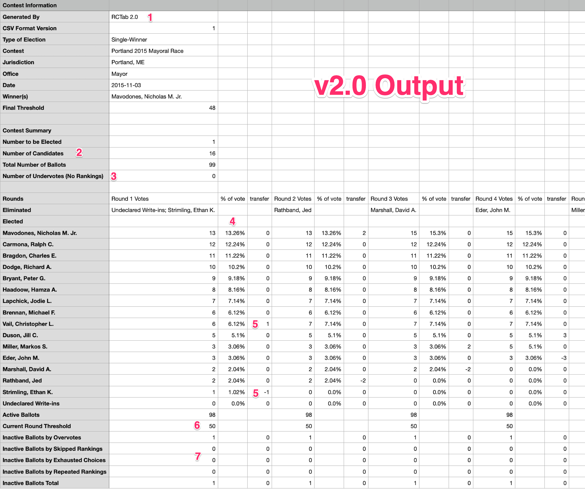

More detailed information about the use of RCTab is available here to complement the [**Quick Start User Guide**](user_guide.md).

## Detailed Report

**1** RCTab Version Number

**2** Contest Summary

- Number to be Elected
- Number of Candidates
- Total Number of Ballots

**3** Number of undervoted ballots. Previously lumped into the ‘Inactive Ballots’ bucket of Round 1.

For each candidate, each round

- **4**  Percentage of total votes for each round. Truncated, not rounded.[^vote_percentages]
- **5** Number of ballots transferred from eliminated candidate(s) in the previous round

[^vote_percentages]: For example, 6 votes of 29 total will be shown as 20.68% when mathematically it is 20.689655%. That means summing the percentages might not always equal exactly 100 but could be a little less than 100.
    
**6** Per-Round winning threshold

**7** Inactive ballots in each round broken down by category. Previously these were all lumped into one Inactive Ballots bucket

- Overvote
- Skipped Ranking
- Repeat Ranking
- Exhausted Choices[^exhausted_choices]

[^exhausted_choices]: When all candidates of a ballot's rankings have been eliminated, but other candidates are still active.

## Round By Round Logic
For any configuration, RCTab follows distinct, logical steps to run the round by round tabulation. 
Detailed round by round logic can be found [here](../tdp/process_ranked_choice_voting_contest.md).

## Running RCTab
Some extended information about running RCTab within the context of its computer hardware and operating system.

### Increasing memory allocated for RCTab
For large contests, RCTab can be told explicitly to use more resources on the computer.
This can speed up tabulation for large contests. Here is how to do that.  

1. Determine how much memory your computer has. On Windows Press Ctrl + Shift + Esc to open Task Manager. Click on the Performance tab. Click Memory on the left. You'll see "Total Installed RAM." 
2. Determine how much to allocate explicitly for RCTab. Use ~80% of your total RAM. Step in chunks of 512MB. So for 16GB use 12,800MB. `.8 * (16*1024)` rounded to the nearest 512 = `12,800`  
3. Open a Command Prompt and navigate to the `rcv` folder where RCTab was installed or unzipped.
4. Launch the tabulator by entering the following command: `.\bin\java -mx12800m -p .\app -m network.brightspots.rcv/network.brightspots.rcv.Main`

## Using This Documentation
Some helpful tips for using the RCTab documentation.

**Permalinks**
Each section header has a permanent link you can share with others. Using permalinks allows you to link someone directly to a specific part of the documentation.
Use these permalinks when you want to send someone to a specific part of the documentation with a single click! To get a permalink for any section, click the paragraph symbol to the right of the section header. 
Then, copy and share the URL!

