<!-- You have some errors, warnings, or alerts. If you are using reckless mode, turn it off to see inline alerts.
* ERRORs: 2
* WARNINGs: 1
* ALERTS: 67 -->

<p style="color: red; font-weight: bold">>>>>>  gd2md-html alert:  ERRORs: 2; WARNINGs: 1; ALERTS: 67.</p>
<ul style="color: red; font-weight: bold"><li>See top comment block for details on ERRORs and WARNINGs. <li>In the converted Markdown or HTML, search for inline alerts that start with >>>>>  gd2md-html alert:  for specific instances that need correction.</ul>

<p style="color: red; font-weight: bold">Links to alert messages:</p><a href="#gdcalert1">alert1</a>
<a href="#gdcalert2">alert2</a>
<a href="#gdcalert3">alert3</a>
<a href="#gdcalert4">alert4</a>
<a href="#gdcalert5">alert5</a>
<a href="#gdcalert6">alert6</a>
<a href="#gdcalert7">alert7</a>
<a href="#gdcalert8">alert8</a>
<a href="#gdcalert9">alert9</a>
<a href="#gdcalert10">alert10</a>
<a href="#gdcalert11">alert11</a>
<a href="#gdcalert12">alert12</a>
<a href="#gdcalert13">alert13</a>
<a href="#gdcalert14">alert14</a>
<a href="#gdcalert15">alert15</a>
<a href="#gdcalert16">alert16</a>
<a href="#gdcalert17">alert17</a>
<a href="#gdcalert18">alert18</a>
<a href="#gdcalert19">alert19</a>
<a href="#gdcalert20">alert20</a>
<a href="#gdcalert21">alert21</a>
<a href="#gdcalert22">alert22</a>
<a href="#gdcalert23">alert23</a>
<a href="#gdcalert24">alert24</a>
<a href="#gdcalert25">alert25</a>
<a href="#gdcalert26">alert26</a>
<a href="#gdcalert27">alert27</a>
<a href="#gdcalert28">alert28</a>
<a href="#gdcalert29">alert29</a>
<a href="#gdcalert30">alert30</a>
<a href="#gdcalert31">alert31</a>
<a href="#gdcalert32">alert32</a>
<a href="#gdcalert33">alert33</a>
<a href="#gdcalert34">alert34</a>
<a href="#gdcalert35">alert35</a>
<a href="#gdcalert36">alert36</a>
<a href="#gdcalert37">alert37</a>
<a href="#gdcalert38">alert38</a>
<a href="#gdcalert39">alert39</a>
<a href="#gdcalert40">alert40</a>
<a href="#gdcalert41">alert41</a>
<a href="#gdcalert42">alert42</a>
<a href="#gdcalert43">alert43</a>
<a href="#gdcalert44">alert44</a>
<a href="#gdcalert45">alert45</a>
<a href="#gdcalert46">alert46</a>
<a href="#gdcalert47">alert47</a>
<a href="#gdcalert48">alert48</a>
<a href="#gdcalert49">alert49</a>
<a href="#gdcalert50">alert50</a>
<a href="#gdcalert51">alert51</a>
<a href="#gdcalert52">alert52</a>
<a href="#gdcalert53">alert53</a>
<a href="#gdcalert54">alert54</a>
<a href="#gdcalert55">alert55</a>
<a href="#gdcalert56">alert56</a>
<a href="#gdcalert57">alert57</a>
<a href="#gdcalert58">alert58</a>
<a href="#gdcalert59">alert59</a>
<a href="#gdcalert60">alert60</a>
<a href="#gdcalert61">alert61</a>
<a href="#gdcalert62">alert62</a>
<a href="#gdcalert63">alert63</a>
<a href="#gdcalert64">alert64</a>
<a href="#gdcalert65">alert65</a>
<a href="#gdcalert66">alert66</a>
<a href="#gdcalert67">alert67</a>

<p style="color: red; font-weight: bold">>>>>> PLEASE check and correct alert issues and delete this message and the inline alerts.<hr></p>


<h2>RCTab v Section 00 - TDP Table of Contents and Abstract v.1.1.0</h2>


[TOC]


**Documentation Abstracts**

**RCTab v**** Section 01 - System Overview v.1.2.1**

The System Overview provides a brief introduction to the RCTab software and its intended use cases. 

**RCTab v1.3.2 Section 02 - Software Design and Specifications v.1.4.2**

The Software Design and Specifications document describes RCTab coding standards, programming language, in-house software, third-party software, and software logic. It is designed to respond to CVSS 9.5. 

**RCTab v1.3.2 Section 03 - System Hardware Specification v.1.1.1**

The System Hardware Specification document describes potential hardware configurations on which the RCTab system can run. 

**RCTab v1.3.2 Section 04 - System Functionality Description v.1.1.1**

The System Functionality Description describes suggested procedures for recovering from potential hardware or software failures when using an RCTab workstation. 

**RCTab v1.3.2 Section 05 - Acceptance Test Procedures v.1.2.1**

Acceptance Test Procedures verify that RCTab is correctly configured and operating properly on an RCTab workstation. Acceptance tests should always be conducted on a new install of RCTab prior to its use in an election. 

**RCTab v1.3.2 Section 06 - System Design Specifications v.1.1.1**

System Design Specifications describe the configuration options available to users when installing the RCTab software and briefly describe voting and audit data retention requirements. 

**RCTab v1.3.2 Section 07 - System Security Specification Requirements v.1.4.0**

The System Security Specification Requirements describe processes and tools necessary to ensure access control, equipment and data security, software installation and security, air gap, event logging, physical security, setup inspection, cryptography, telecommunications, and other elements of an effective security program when deploying RCTab. 

**RCTab v1.3.2 - Section 07I - Design and Interface Specification v.1.0.0**

This document provides a high-level design of RCTab, discusses external interfaces, and identifies threats RCTab protects against.

**RCTab v1.3.2 Section 07J - Security Architecture v.1.0.0**

This document provides an architecture level description of how the security requirements are met, and includes various authentication, access control, audit, confidentiality, integrity, and availability requirements.

**RCTab v1.3.2 Section 07K - Development Environment Specification v.1.0.0**

This document describes the physical, personnel, procedural, and technical security of the development environment including version control, tools used, coding standards used, software engineering model used, and a description of developer and independent testing

**RCTab v1.3.2 - Section 07L - Security Threat Analysis v.1.0.0**

This document identifies the threats the voting system protects against and the implemented security controls on voting system and system components.

**RCTab v1.3.2 - Section 07M - Security Testing and Vulnerability Analysis Documentation v.1.0.0**

This document describes security tests performed to identify vulnerabilities and the results of the testing. This also includes testing performed as part of software development, such as unit, module, and subsystem testing.

**RCTab v1.3.2 Section 09 - System Maintenance Manual v.1.3.2**

This section discusses the support needed to adjust or repair components of RCTab. RCTab leverages content from the jurisdictions voting system, all maintenance on equipment should be referred to your voting system vendor. All RCTab hardware is COTS and software other than RCTab are also COTS. 

**RCTab v1.3.2 Section 10 - Personnel Deployment and Training v.1.2.1**

It is recommended that RCTab is used by at least two people in compliance with the jurisdictions’ guidelines for partisan participation. Personnel should generally have a basic knowledge of desktop applications with some additional skills required for testing. Training requirements vary between two to eight hours depending on the task. 

**RCTab v1.3.2 Section 11 - L&A Testing v.1.3.2**

The Logic & Accuracy Test document lays out an L&A for RCTab that will allow jurisdictions to verify that RCTab is correctly configured and operating properly. 

**RCTab v1.3.2 Section 12 - Configuration Management Plan v.2.3.2**

The Configuration Management Plan describes RCTab’s development processes, how different versions of the software are managed, how to identify specific versions of the software, and provides details for functional and physical configuration audits of RCTab. 

**RCTab v1.3.2 Section 13 - Quality Assurance Plan v.1.2.2**

This section describes the quality assurance plan used in RCTab development. It covers requirements, design process, and definition of RCTab software; determination of the specifications that a COTS device must meet in order to optimize RCTab installation and operation; process recommendations for centralization of CVR data prior to round-by-round counting; the validation and verification of the performance of RCTab; and validation and verification of the process for installation of RCTab on COTS hardware along with the necessary steps to secure the system as would be required in a jurisdiction.


This section explains how to create a trusted build of RCTab. It also provides a method for verifying whether the trusted build was successful. 

**RCTab v1.3.2 Section 15 - System Change Notes v.1.2.1**

This section details the changes for each version of RCTab resulting from previous testing and certification. RCTab is currently used to produce official RCV results, as a testing tool, or as an auditing tool. The State of New York certified RCTab for use in single-winner RCV elections in the State, the State of Utah certified the RCTab for use in local RCV elections, and the State of Michigan certified RCTab for use in Eastpointe, Michigan’s RCV elections.

**RCTab v1.3.2 Section 16 - System Hardening Procedures - Windows OS v.1.3.0**

The system hardening procedures describe the steps that should be taken to secure an RCTab workstation against various potential attacks on the system. It describes how to harden the OS, how to retrieve verifiable versions of software for use on the RCTab workstation, and procedures for locking down external ports on an RCTab workstation. 

**RCTab v1.3.2 Section 17 - System Test and Verification Specification v.1.4.2**

The System Test and Verification Specification lays out all tests regularly conducted on the RCTab software and describes how to determine if a test of RCTab succeeds or fails. It also provides detailed information about each individual test condition used to test the software. 

**RCTab v1.3.2 Section 18 - User Guide v.1.2.2**

The User Guide provides a step-by-step guide for using RCTab. It walks users through launching the software, creating an RCTab configuration file, generating results files, and securing any results files.  

**RCTab v1.3.2 Section 19 - Tabulation Options for RCV Tabulation v.1.2.1**

The Tabulation Options section is an enumeration and discussion of the various tabulation options that exist for Ranked Choice Voting (RCV) elections and how those options are or are not incorporated into RCTab. It also includes a glossary of ranked choice voting terms.

**RCTab v1.3.2 Section 20 - Process Ranked Choice Voting Contest v.1.2.1**

This section consists of an introduction, a flowchart, and a description of the flowchart laying out how RCV contests should be processed according to various rules in place in jurisdictions in the United States. 

**RCTab v1.3.2 Section 21 - Ballot Limitations & Maximum Testing Range v.1.1.1**

This document describes RCVRC’s understanding of the maximum ballot ranges possible when creating RCV data from different voting system vendors. 

**RCTab v1.3.2 Section 22 - Installation Instructions for Windows OS v.1.3.0**

This document describes the Windows OS installation process for RCTab. 

**RCTab v1.3.2 Section 23 - HashCode Instructions - Windows OS v.1.2.1**

This document describes how to generate HashCodes when working on a Windows-based RCTab workstation. 

**RCTab v1.3.2 Section 24 - Tabulator Command Line Instructions v.1.1.2**

This document describes how to launch and operate RCTab from the command line. 

**RCTab v1.3.2 Section 25 - Configuration File Parameters v.1.1.1**

This document describes all parameters included in configuration files in the RCTab software. 

**RCTab v1.3.2 Section 26 - RCTab CVR Files v.1.2.2**

This document describes the different CVR files RCTab is compatible with. It documents how they are laid out and describes relevant file structures that inform how RCTab parses CVR data. 

**RCTab v1.3.2 Section 27 - RCTab Config Files v.1.1.1**

This document provides an example of an RCTab configuration file. 

**RCTab v1.3.2 Section 28 - Post-Election Audit & Clearing RCTab from System v.1.1.1**

This document describes how to run a post-election tabulation audit and software audit of an RCTab installation. It also describes how to clear RCTab from a workstation if a fresh installation of RCTab is required. 

**RCTab v1.3.2 Section 29 - RCTab Operator Log Messages v.1.2.2**

This section lays out all potential messages a user may receive through the RCTab operator log. It also suggests resolutions for any SEVERE errors that cause tabulation to fail. 

**RCTab v1.3.2 Section 30 - RCTab System Tab Hints v.1.1.1**

This section recreates the Hints tab displayed to users in the RCTab UI. 

**RCTab v1.3.2 Section 31 - Coding and Header Comment Standards for RCTab v. 1.0.1 **

This section lays out the coding and header comment standards used in developing RCTab. 


    **RCTab v1.3.2 Section 32 - Secure USB Process v.1.0.1**


    This section outlines the details of how the RCVRC selects and secures a USB for use and transport to the requestee.


    **Appendices**


    **RCTab v1.3.2 - Expected Outcome RCV Test Sets Multi-Winner v.1.1.1**


    These tables lay out various tabulation conditions and expected outcomes in multi-winner RCV contests. They were used when developing the RCTab software to ensure different conditions were correctly handled by the software. 


    **RCTab v1.3.2 - Expected Outcome RCV Test Sets Single-WInner v. 1.1.1**


    These tables lay out various tabulation conditions and expected outcomes in single-winner RCV contests. They were used when developing the RCTab software to ensure different conditions were correctly handled by the software. 


    **RCTab v1.3.2 - Ranked Choice Voting Laws Appendix**


    This spreadsheet lays out the RCV statutes and regulations that governed development of the RCTab software. 


    **RCTab v1.3.2 - 22-Month Archiving Procedure**


    This document provides a procedure for archiving RCTab and any election results data from its use in elections. 


    **Document Revision History **


    ** **


<table>
  <tr>
   <td><strong>Date </strong>
   </td>
   <td>
    <strong>Version </strong>
   </td>
   <td><strong>Description </strong>
   </td>
   <td><strong>Author </strong>
   </td>
  </tr>
  <tr>
   <td>
   </td>
   <td>1.0.0
   </td>
   <td>2.0 Initial 
   </td>
   <td>Mathew Ruberg
   </td>
  </tr>
</table>


<h2></h2>


The Ranked Choice Voting Resource Center (RCVRC), a nonprofit organization, and Bright Spots, a software development team, have joined together to develop RCTab as an open-source software package that provides post-election tabulation to determine results in a ranked choice voting election.


     


RCTab can process data from voting machines that are capable of exporting cast vote records (CVRs) and tabulate a single-winner or multi-winner ranked choice voting election according to the rules used in current state, county, or city election jurisdictions in the United States.


RCTab is hosted and developed on GitHub. This allows individuals and teams to collaborate on the development of RCTab. GitHub allows developers to work on different parts of the codebase simultaneously and merge their changes seamlessly, all under the close supervision of the Ranked Choice Voting Resource Center and Bright Spots.

 


Users of RCTab v1.3.2 should, in accordance with section , procure a Windows PC with the following specifications:

 


Windows 10 or above Operating System 


3.0 GHz processor 


32GB RAM 


10GB disk space 

 


RCTab outputs the tabulation results in comma-separated values (.csv) tabular data format and creates an audit file for the RCV election. More information about the operation, software design, hardware requirements, and system design requirements of RCTab is available in the following sections: 


** **


    **Document Revision History **


    ** **


<table>
  <tr>
   <td><strong>Date </strong>
   </td>
   <td>
    <strong>Version </strong>
   </td>
   <td><strong>Description </strong>
   </td>
   <td><strong>Author </strong>
   </td>
  </tr>
  <tr>
   <td>
   </td>
   <td>1.0.0
   </td>
   <td>2.0 Initial 
   </td>
   <td>Mathew Ruberg
   </td>
  </tr>
</table>


<h2></h2>


<h3>Coding Standards and Style</h3>


We use [Google Java Style Guide](https://google.github.io/styleguide/javaguide.html) as our published, reviewed, and industry-accepted code style. For more details see page 93 of the [VVSG Volume 1.0](https://www.eac.gov/sites/default/files/eac_assets/1/28/VVSG.1.0_Volume_1.PDF) guide.

Code development and review processes are described in **RCTab v1.3.2 Section 13 - Quality Assurance Plan v.1.2.2.**

<h4>Java 17</h4>


The tabulator is written in Java because it meets the VVSG and California requirements for software language selection. It is widely supported and popular in both industry and the open-source community for a wide variety of applications. It offers a mature and robust collection of third-party libraries. The Java Runtime Environment is standard on our target platforms which means a simple installation process. Our specific version of Java is OpenJDK 17.0.2 and it can be downloaded [here](https://jdk.java.net/archive/).

<h4>Open Source</h4>


We develop the tabulator as an open-source project for three main reasons: 

1) Transparency: published source code increases public confidence in the application by giving anyone the opportunity to review our work and the processes and methodology behind it.  

2) Adoption: open-source licensing encourages others to use the software to facilitate the spread of ranked choice voting.

3) Collaboration: open-source licensing enables other software developers to contribute enhancements to the project and incorporate it into other related projects (RCV visualizers, policy research, etc.)

<h4>Architecture</h4>


RCTab consists of one in-house java code module built from 27 source files. These are described in more detail under **Tabulator Java Classes** below. The Tabulator relies on basic java platform libraries (file I/O, string processing, logging) and several 3rd-party modules listed below for reading and writing various file formats. These code modules are compiled and packaged with a minimal java runtime environment (17.0.2) which executes compiled object code when installed and run on the target system.

<h3>Tabulator Java classes</h3>


The following Java classes comprise the entirety of all in-house developed software and implement all core functionality of the Tabulator.

AuditableFile: Create a file that, on close, is read-only and has its hash added to the audit log.

CastVoteRecord: The in-memory representation of each cast vote record read from a source file. When source files are first processed at the beginning of a tabulation, each CastVoteRecord object contains the data parsed from the source, including the candidate rankings, the precinct ID, and other relevant metadata. As the tabulation progresses, the object keeps track of the cast vote record’s fate, including which candidate(s) this ballot is counting toward and whether it has been exhausted.

ClearBallotCvrReader: Contains the logic for parsing a CVR source file in Clear Ballot’s comma-separated value format and populating a list of CastVoteRecord objects.

CommonDataFormatReader: Contains the logic for parsing a CVR source file in the Common Data Format and populating a list of CastVoteRecord objects. It supports both XML and JSON.

ContestConfig: A wrapper around RawContestConfig. It performs extensive validation to confirm that a config file contains parameters that are permitted by the software and consistent with one another. It also has logic for reading a config file from disk, preprocessing the candidate data from a config, and normalizing some of the config values for use during tabulation.

ContestConfigMigration: Provides support for identifying whether a config file’s version is compatible with the version of the application that is running. It also contains logic for automatically migrating a config from an older version to make it compatible with the current version.

DominionCvrReader: Contains the logic for parsing a set of CVR source files in Dominion’s JSON format and populating a list of CastVoteRecord objects.

FileUtils: A few simple utility functions for reading from and writing to directories on disk.

GuiApplication: The simple logic for launching the application’s graphical user interface, including loading the main layout markup stored in the GuiConfigLayout.fxml file.

GuiConfigController: Contains most of the logic for the interactive components of the graphical user interface, ensuring that the application responds appropriately when the user clicks a button, menu item, or other interactive element.

GuiContext: A singleton class that supports the graphical user interface in managing file chooser dialogs for opening and saving config files.

GuiTiebreakerController: Supports the interactive logic for selecting a tie-breaker winner or loser in the graphical user interface when the tie-break mode is set to one of the interactive options.

HartCvrReader: Contains the logic for parsing a CVR source file in the Hart XML format and populating a list of CastVoteRecord objects.

JsonParser: Generic logic for reading JSON files from disk and writing them to disk. It’s used by the JSON parsing code for parsing Common Data Format and Dominion CVR files, as well as for reading and writing tabulator config files.

Logger: Handles the formatting and saving to disk of audit and operator log files.

Main: The main entry point for the application. Depending on the arguments supplied, it either launches the graphical user interface or proceeds with a command-line-based tabulation.

RawContestConfig: A RawContestConfig object is a simple in-memory representation of a config file loaded from disk.

ResultsWriter: After a tabulation completes, a ResultsWriter generates all of the appropriate summary results files and saves them to disk. Results files can include a summary CSV spreadsheet file, a summary JSON file, a full Common Data Format JSON file, and corresponding .hash files. When “tabulate by precinct” is enabled, it also produces separate summary files for each precinct.

SecurityConfig: Configuration for the cryptographic signing of a Hart file.

SecuritySignatureValidation: A set of tools to verify signatures of Hart CVRs.

SecurityTests: Test the cryptographic signature validation functionality.

SecurityXmlParsers: In-memory representation of .sig.xml signature files.

StreamingCvrReader: Contains the logic for parsing a CVR source file and populating a list of CastVoteRecord objects. It also extracts a list of precinct IDs if tabulation by precinct is enabled.

Tabulator: The core logic for tabulating a contest given a list of CastVoteRecord objects and a ContestConfig, it runs the round-by-round tabulation, writing to the tabulation log file as it proceeds, and then calls ResultsWriter to generate results files when it completes.

TabulatorSession: Manages the process of running a single tabulation. Given the path to a config file, it loads and validates the config, loads and parses the cast vote record source files, and runs the tabulation, including generating the results files at the end. It also contains logic for converting a CVR file into a Common Data Format CVR file without actually running a tabulation.

TabulatorTests: Runs all of the regression tests. Each test involves loading a config file and, if it’s valid, running the tabulation and then comparing the output summary JSON file to an existing file containing the expected output. If the config file has generateCdfJson enabled, it also compares the generated CDF JSON file to an existing file containing the expected version of this output.

TallyTransfers: The Tabulator class maintains a TallyTransfers object (and one per precinct if tabulating by precinct is enabled) to keep track of the number of votes transferring from each source to each destination in each round as candidates are eliminated or elected. This data is included in the results summary JSON to enable Sankey plot visualizations.

Tiebreak: Contains the logic for breaking a tie when the tabulation needs to select a candidate for elimination or election and multiple candidates are tied with the same current vote total.

Utils: Miscellaneous utility functions for processing strings and identifying the user’s environment.

<h3>3rd-party Modules</h3>


RCTab incorporates several 3rd-party modules which are all open-source. These meet the VVSG and California requirements for third-party modules. They are mature and widely accepted and used.  None of them are modified in any way.


<table>
  <tr>
   <td>Module Name
   </td>
   <td>Version
   </td>
   <td>Purpose
   </td>
   <td>Link
   </td>
  </tr>
  <tr>
   <td>Apache Commons CSV
   </td>
   <td>1.9
   </td>
   <td>CSV "Comma Separated Values" reader / writer.
   </td>
   <td>https://commons.apache.org/proper/commons-csv/user-guide.html
   </td>
  </tr>
  <tr>
   <td>Apache POI OOXML
   </td>
   <td>5.2.2
   </td>
   <td>Excel spreadsheet reader / writer.
   </td>
   <td>https://poi.apache.org/apidocs/dev/org/apache/poi/ooxml/package-summary.html
   </td>
  </tr>
  <tr>
   <td>Jackson Core
   </td>
   <td>2.13.3
   </td>
   <td>XML / JSON streaming reader / writer core
   </td>
   <td>https://github.com/FasterXML/jackson-core
   </td>
  </tr>
  <tr>
   <td>Jackson Annotations
   </td>
   <td>2.13.3
   </td>
   <td>XML / JSON deserialization annotations
   </td>
   <td>https://github.com/FasterXML/jackson-annotations
   </td>
  </tr>
  <tr>
   <td>Jackson Databind
   </td>
   <td>2.13.3
   </td>
   <td>XML / JSON deserialization
   </td>
   <td>https://github.com/FasterXML/jackson-databind
   </td>
  </tr>
  <tr>
   <td>Jackson Dataformat XML
   </td>
   <td>2.13.3
   </td>
   <td>XML reader / writer
   </td>
   <td>https://github.com/FasterXML/jackson-dataformat-xml
   </td>
  </tr>
  <tr>
   <td>Jupiter JUnit API
   </td>
   <td>5.9.0
   </td>
   <td>Automated testing
<p>
(used only during development)
   </td>
   <td>https://mvnrepository.com/artifact/org.junit.jupiter/junit-jupiter-api
   </td>
  </tr>
  <tr>
   <td>Jupiter JUnit Engine
   </td>
   <td>5.9.0
   </td>
   <td>Automated testing
<p>
(used only during development)
   </td>
   <td>https://mvnrepository.com/artifact/org.junit.jupiter/junit-jupiter-engine
   </td>
  </tr>
  <tr>
   <td>BouncyCastle FIPS API
   </td>
   <td>1.0.2.4
   </td>
   <td>RSA Validation
   </td>
   <td>https://mvnrepository.com/artifact/org.bouncycastle/bc-fips/1.0.2.4
   </td>
  </tr>
</table>


**Software Limits:**

Limitations of the Tabulation software i.e., how many CVRs can be tabulated are detailed in **RCTab v1.3.2 Section 03 - System Hardware Specification v.1.1.1** document. 

<h3>Contest Tabulation Logic</h3>


<h4>Overview</h4>


When the user triggers a contest tabulation, the application creates a new Tabulator Session object to manage the process flow. The Tabulator Session loads, parses, and validates the contest config file. If those steps succeed, it reads the cast vote records into memory, runs the tabulation, and generates the results summary files. Throughout these processes logging output is written to two locations as detailed below under **RCTab Logging**


1. Read the config file
2. Validate the config file
3. Read cvr files
4. Round by round tabulation of votes according to configuration
5. Generate reports

For detailed user guides, see **RCTab v1.3.2 Section 08 - System Operations Procedures v.1.2.2** and **RCTab v1.3.2 Section 25 - Configuration File Parameters v.1.1.1**. Note that this document covers all tabulation logic in RCTab in order to fully describe the software design. All tabulation logic is described in the ‘Tabulation of CVRs’ section below, in conjunction with the draft VVSG 2.0 1500-107 Voting Methods and Tabulation Models document (for which RCTab acts as a reference implementation), as well as with reference to all RCV laws currently in use in the United States. Contact the manufacturer for a folder with all such RCV laws and/or a copy of that unpublished draft standard. 

<h5>Reading a config file</h5>


When a user selects an existing config file to open, the tabulator parses the JSON file and stores the information in a RawContestConfig object. This object is wrapped inside a ContestConfig object. The ContestConfig object serves as an interface between the config file and the rest of the application, providing extensive validation logic and a number of convenience methods for accessing normalized versions of the config settings.

A config file includes a tabulatorVersion string and a collection of parameters organized into four sections.

The tabulatorVersion is used to confirm that the version of the application that’s loading the config file is compatible (specifically: not older than) the version of the application that created the file.

The outputSettings section contains settings related to what forms of output should be generated and where it should be saved on disk.

The cvrFileSources section is a list of one or more source file paths containing cast vote records, along with the parameters necessary for the tabulator to parse the records successfully.

The candidates section lists all of the candidate names/codes that appear in any of the CVR source files.

The rules section contains all of the parameters that determine exactly how the application should tabulate the cast vote records and produce results.

<h5>Writing the config file</h5>


A user can create a new config file or open an existing one and edit it. The GUI allows the user to modify all of the parameters that populate a config file (except for tabulatorVersion, which is determined by the app), run a validation to confirm that all of the settings in the file are valid, and save the file. 

<h5>Validation</h5>


Config file validation checks each aspect of the file and attempts to verify that all of the individual settings are compatible with one another and should result in a successful tabulation. This includes confirming that the tabulation rules are consistent, that the candidate names are valid and don’t contain duplicates, and that each source cvr file exists on disk, and has the proper parameters set for that cvr provider. The GUI prevents the user from creating a config file that would fail many of these checks, but the validation assumes nothing and provides an additional layer of protection against user error.  Because a user can create or modify a config file simply using a text editor the tabulator can’t assume that a config file has only been modified by its own GUI.

<h5>Reading CVR Files</h5>


Reading the cast vote records into memory consists of parsing the source files and creating a CastVoteRecord object to represent each record. This object contains the candidate rankings for the CVR along with additional information parsed from the source file such as an ID and a precinct name. As the tabulation progresses, the CastVoteRecord object also stores information about the CVR’s fate in each round (which candidate(s) its vote is counting toward and what fraction of the vote belongs to each). The details of parsing each source file depend on that file’s provider.

<h5>Tabulation of CVRs </h5>


Note: for all winning modes other than MULTI_SEAT_SEQUENTIAL_WINNER_TAKES_ALL (a.k.a. multi-pass IRV), the application performs a single tabulation when it processes a config file. For multi-pass IRV, it instead performs a sequence of single-seat tabulations in which each tabulation excludes the candidates who have won on prior iterations, continuing until it has run numWinners tabulations and identified numWinners winners.

For the tabulation itself, the application creates a Tabulator object. This object’s tabulation method runs a loop that iterates until it determines that the tabulation is complete. Each iteration of the loop is a new round. Each round starts by calling computeTalliesForRound, which iterates over all of the cast vote records and sums up the total number of current votes for each candidate. This involves a number of steps:


1. If the CVR has already been marked as exhausted, it is skipped.
2. If the CVR was counted toward a candidate in the previous round and that candidate is still active, it’s counted toward that candidate again in this round.
3. If the CVR has no rankings at all, it is marked as exhausted.
4. The tabulator then begins iterating through the rankings in the CVR, starting with the most preferred rank found (i.e., the lowest rank number, which is typically 1) and proceeding in order. At each rank, it checks for a number of possible cases:
    1. If the number of rankings skipped between the last ranking seen and this one exceeds the maxSkippedRanksAllowed value in the config, the CVR is marked as exhausted.
    2. If one or more of the candidates at this rank already appeared at another rank and the config has enabled exhaustOnDuplicateCandidate, the CVR is marked as exhausted.
    3. If the rankings at this rank constitute an overvote, the CVR is handled according to the overvote rule set in the config.
    4. If a continuing candidate is found at this rank, the CVR is marked as counting toward the candidate.
    5. Otherwise, the CVR is marked as exhausted.
5. If the config has enabled tabulation by precinct, the method also updates the per-precinct tallies for this round.

Next, if the tabulation is in the first round and/or the contest is for a single seat or the mode is MULTI_SEAT_SEQUENTIAL_WINNER_TAKES_ALL (multi-pass IRV), the software sets/updates the winning threshold (the number of votes that a candidate must meet or exceed in order to be named a winner) based on the winning rules set in the config. 


1. The threshold in single-seat and MULTI_SEAT_SEQUENTIAL_WINNER_TAKES_ALL is calculated in each round as: 

winningThreshold = floor(V/2) + 1

Where V = the total number of votes counting for continuing candidates in the current round (and continuing refers to non-excluded candidates who have not yet been eliminated -- and, in the case of multi-pass IRV, who have not been elected in a previous pass). 


2. The threshold in MULTI_SEAT_ALLOW_ONLY_ONE_WINNER_PER_ROUND and MULTI_SEAT_ALLOW_MULTIPLE_WINNERS_PER_ROUND is calculated as: 

    winningThreshold = (V/(N+1)) + 10^(-1 * decimalPlacesForVoteArithmetic) if nonIntegerWinningThreshold is set to true


winningThreshold = floor(V/(N+1)) + 1 if nonIntegerWinningThreshold is set to false

winningThreshold = floor(V/N) if hareQuota is set to true

Where V = the sum of the values in currentRoundCandidateToTally in the first round

and n = numWinners


3. The election threshold in MULTI_SEAT_BOTTOMS_UP_USING_PERCENTAGE_THRESHOLD is calculated as:

winningThreshold = V*T

Where V = total number of votes counting for continuing candidates (candidates not eliminated) in the current round 

and T = bottomsUpPercentageThreshold

No threshold is calculated in MULTI_SEAT_BOTTOMS_UP_UNTIL_N_WINNERS mode because the tabulation simply eliminates candidates until exactly numWinners remain, then selects those candidates as the winners. 

The software then checks whether there are any continuing candidates with vote tallies in the current round that meet or exceed the winning threshold. Each of these candidates is marked as a winner and, if the winning rules in the config indicate that surplus votes should be redistributed (which is the case when the winning mode is either MULTI_SEAT_ALLOW_ONLY_ONE_WINNER_PER_ROUND and MULTI_SEAT_ALLOW_MULTIPLE_WINNERS_PER_ROUND), then the software calculates a surplus fraction. The surplus fraction for a winning candidate is calculated as:

surplusFraction = (C - T) / C

Where C = the candidate’s vote tally in the current round

and T = the winning threshold

Each CastVoteRecord object counting towards a winning candidate redistributes an amount equal to its current value multiplied by the surplusFraction according to step 4 in “Tabulation of CVRs” above, based on that CastVoteRecord’s rankings. Each of these CastVoteRecords is also updated to record the portion of that vote that should remain allocated to the candidate in future rounds, which is its current value multiplied by (1 - surplusFraction).

Note that if a CastVoteRecord is involved in multiple surplus redistributions, the fraction of the vote allocated to earlier winners is not affected by subsequent redistributions; only the surplus portion is eligible for further redistribution.

Any decimal values in the above calculations are governed by the decimalPlacesForVoteArithmetic setting. 

More information about how surplus vote values are calculated is included in the fractional transfers discussion in **RCTab v1.3.2 Section 19 - Tabulation Options for RCV Tabulation v.1.2.1**.

If the mode is MULTI_SEAT_ALLOW_ONLY_ONE_WINNER_PER_ROUND and more than one continuing candidate meets or exceeds the winning threshold in a round, only the candidate with the top tally is selected as the winner (and any other continuing candidates meeting the threshold will be selected in subsequent rounds). If multiple candidates are tied for this top tally value, the tie is broken according to the selected tiebreakMode. 

In MULTI_SEAT_BOTTOMS_UP_USING_PERCENTAGE_THRESHOLD, winners are selected in a given round only if every continuing candidate meets or exceeds the winning threshold.

Finally, if no winners have been identified in the current round, the software determines whether it should identify one or more candidates to eliminate. (This is true if a) the number of identified winners is fewer than the number of seats for the contest, b) there are more than two candidates remaining and the winning rules specify a single-seat contest that should continue until only two candidates remain, or c) the winning mode is MULTI_SEAT_BOTTOMS_UP_USING_PERCENTAGE_THRESHOLD.) In this case, the candidate(s) to be eliminated are identified by trying the following methods in order until one of them returns one or more candidates:


1. If the cast vote records include undeclared write-ins and this set of candidates have not been eliminated yet, select them.
2. If the config specifies a minimum vote threshold for a viable candidate and one or more continuing candidates has a tally below that threshold, select them.
3. If the config enables batch elimination, attempt to identify two or more candidates who can be eliminated via this process.
4. Otherwise, select the remaining candidate with the lowest tally. (If multiple candidates are tied for the lowest tally, select one according to the tie-breaking rule specified in the config.)

The tabulator then determines whether it should continue to the next round and repeat the process. It continues if one of the following conditions is true:


1. For a single-seat contest, one of these is true:
    1. A winner has not been identified yet.
    2. “Continue until two candidates remain” is enabled and one of these is true:
        1. There are more than two candidates remaining.
        2. The eliminations that reduced the number of remaining candidates to two happened in the current round. (This condition is included to ensure that the tabulator will generate an additional round showing the final vote tallies when only the last two candidates remain.)
2. For a multi-seat contest, one of these is true:
    3. The winning mode is MULTI_SEAT_BOTTOMS_UP_USING_PERCENTAGE_THRESHOLD and no winners have been identified yet.
    4. The winning mode is not MULTI_SEAT_BOTTOMS_UP_USING_PERCENTAGE_THRESHOLD and the number of winners identified is fewer than the number of seats.
    5. The winning mode is neither MULTI_SEAT_BOTTOMS_UP_USING_PERCENTAGE_THRESHOLD nor MULTI_SEAT_BOTTOMS_UP_UNTIL_N_WINNERS and the number of winners equals the number of seats, but the final winners were identified in the current round. (Similar to above, this condition ensures that the tabulator will generate an additional round showing the final surplus redistribution in MULTI_SEAT_ALLOW_ONLY_ONE_WINNER_PER_ROUND and MULTI_SEAT_ALLOW_MULTIPLE_WINNERS_PER_ROUND.)

When the tabulator determines that it should not continue tabulating, the tabulation is complete.

<h5>Reporting results</h5>


After the tabulation completes, the software generates results files and saves them to disk. These results are based on the following data that the tabulation process has produced and stored in memory:


* Which round each eliminated candidate was eliminated
* Which round each winning candidate was identified as a winner
* The winning threshold that was used to select the winner(s)
* Each candidate’s vote tally in each round
* If the config has enabled tabulating by precinct, each candidate’s vote tally in each precinct in each round
* A record of the number of votes in each round that were transferred from each candidate to each other candidate (or were exhausted)
* In a multi-seat contest involving surplus redistribution, the cumulative amount of residual surplus in each round
* The number of exhausted ballots in each round, which are the number of ballots that cannot be counted for any continuing candidates - those candidates who are still active in the contest. This ranked choice voting specific category of ballots includes undervoted ballots and overvoted ballots. Exhausted ballots are referred to as inactive ballots in summary results files. 

Using this data, the tabulator creates a ResultsWriter object that writes the following files with corresponding hashes to disk:


1. A CSV spreadsheet that includes the round-by-round tally for each candidate, when each candidate won or was eliminated, and related information
2. A JSON file that includes the same information found in the CSV spreadsheet, plus the number of votes transferred from each candidate to each other candidate (or exhaustion) in each round

Each of these files contains a corresponding `fileName.hash` file. These files can be used to verify the content of their corresponding result files.

If tabulating by precinct is enabled, the ResultsWriter also generates a CSV spreadsheet with round-by-round tallies for each precinct found in the cast vote records.

Finally, if the config file specifies that the tabulator should generate CDF (Common Data Format) output, it saves a CDF file in JSON format.

Note: if the winning mode is MULTI_SEAT_SEQUENTIAL_WINNER_TAKES_ALL (multi-pass IRV), the output files described in this section are generated after each pass, i.e., after each single-seat tabulation. The pass number is appended to each filename to allow the user to distinguish among them.

<h4>RCTab Logging</h4>


In addition to results files, RCTab generates various log outputs which describe:

- Program status

- Operations in progress

- Critical errors and warnings

- Tabulation-specific data: e.g., config file contents and how each vote counted in each round

- Additional system information

Log output is logically divided into two data streams:

<h5>Stream 1: Tabulator "Operator" Logging</h5>


This data stream captures the overall operation of the Tabulator which may include loading, editing, validating, and saving multiple config files, running cvr conversion functions, and tabulating multiple contests.

File Name: rcv_0.log

File Rotation:

 When rcv_0.log reaches 50MB size it will be renamed along with any other preceding log files.  For example:

 rcv_0.log -> rcv_1.log

 rcv_1.log -> rcv_2.log

Then a new rcv_0.log file will be created, and logging will continue.

This is a standard log rotation strategy that limits log file sizes for easier management.

File location: The Tabulator Operator Log will be created in the current working directory.  When launched using the rcv.bat file this is next to the rcv.bat file.  For example:   C:\Users\MyUser\rcv\bin\rcv_0.log

Operator logging is duplicated in the black GUI console box at the bottom of the application window.  The console is provided as a convenience primarily for showing validation errors and providing feedback to the user. See screenshot below for example of this console box. 


<p id="gdcalert1" ><span style="color: red; font-weight: bold">>>>>>  gd2md-html alert: inline image link here (to images/image1.png). Store image on your image server and adjust path/filename/extension if necessary. </span><br>(<a href="#">Back to top</a>)(<a href="#gdcalert2">Next alert</a>)<br><span style="color: red; font-weight: bold">>>>>> </span></p>


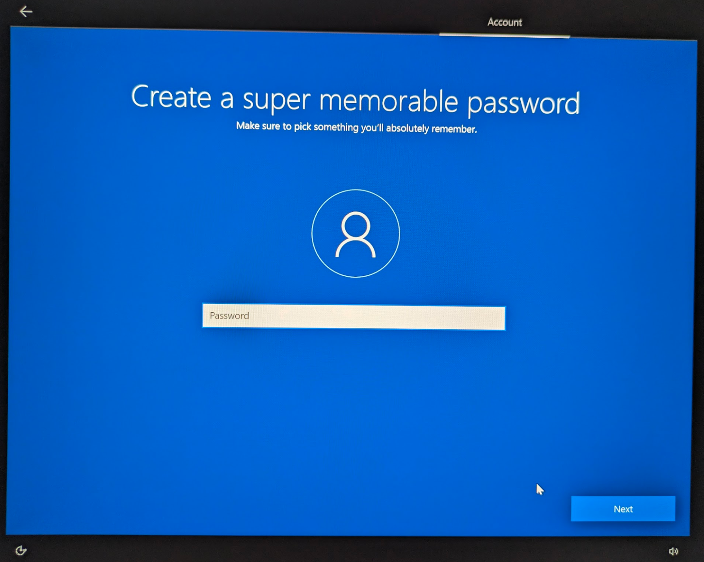


<h5>Stream 2: Contest-Specific "Audit" Logging</h5>


This data stream captures information about a specific contest tabulation.  It includes all the same information written to the Execution Log (within the context of a single contest tabulation) and includes a listing of the config file being tabulated, and a record of how each cvr was counted in each round.

File Name: [time_stamp]_audit_0.log where timestamp is created when the tabulation is triggered and used on all output files for a given tabulation.  For example: 2021-04-24_22-49-49_audit_0.log

File Rotation uses the same strategy as the Execution Logging.  When an audit log reaches 50MB size it will be renamed along with any other preceding log files.  For example:


    2021-04-24_22-49-49_audit_0.log -> 2021-04-24_22-49-49_audit_1.log


    2021-04-24_22-49-49_audit_1.log -> 2021-04-24_22-49-49_audit_2.log

Then a new 2021-04-24_22-49-49_audit_0.log file will be created, and logging will continue.

Each audit__N_.log is created with a corresponding audit__N_.log.hash file. This hash file can be used to validate the contents of its corresponding audit_N.log file with the directions in 

<h4>User Interface</h4>


The tabulator was originally developed for a command-line interface. The GUI (graphical user interface) was introduced both to make the process of configuring and running a tabulation faster and more intuitive and to enable users with a less technical background to use the software. The command-line interface still exists as a way to support execution via script, e.g., for batch processing and test automation. The GUI prevents the user from creating a config file that would fail many of these checks. A brief user guide to the Command Line Interface is available in **RCTab v1.3.2 Section 24 - Tabulator Command Line Instructions v.1.1.2**. More information about error messages can be found in **RCTab v1.3.2 Section 29 - RCTab Operator Log Messages v.1.2.2**.

<h4>Supported File types</h4>


The Tabulator uses the JSON format for contest configuration files and one style of results summary output. JSON is simple, popular, and easy for humans and software to read and write.  The Tabulator uses CSV (comma-separated values) for the tabular version of its results summary output.  CSV is a non-proprietary format that all modern spreadsheet applications can recognize. Tabulation output log files are produced in plain-text with a .log extension for clarity.  RCTab reads .xlsx (Microsoft Excel) and .xml (Extensible Markup Language) cvr and elections metadata files supplied by various manufacturers (ES&S, Hart, CDF, Unisyn).

Additionally, the following documents were used to design the RCTab software:


    **RCTab v1.3.2 Section 07 - System Security Specification Requirements v.1.1.1**


    **RCTab v1.3.2 Section 19 - Tabulation Options for RCV Tabulation v.1.2.1**


    **RCTab v1.3.2 Section 20 - Process Ranked Choice Voting Contest v.1.2.1**


    **RCTab v1.3.2 Section 21 - Ballot Limitations & Maximum Testing Range v.1.1.1**


    **Appendix - RCTab v1.3.2 - Ranked Choice Voting Laws Appendix **


    **Appendix - RCTab v1.3.2 - Expected Outcome RCV Test Sets Single-Winner v.1.1.0**

**Appendix - RCTab v1.3.2 - Expected Outcome RCV Test Sets Multi-Winner v.1.1.0**

<h3>7.4.4 Software Distribution</h3>


b. The documentation shall designate all software files as static, semi-static or dynamic.

The .json config files used to configure RCTab are semi-static. These files are modified for contest-specific configuration options such as the candidate list, winning rules and output locations.

RCTab output files, if considered part of the “software files,” are also semi-static. The `summary.json`, `summary.csv`, `audit.log` and corresponding `.hash` files output for each tabulation are different depending on the configured contest. 

All other RCTab files, excluding the .json config files and output files, are static. All remaining files’ contents (specifically the source code files and 3rd party dependencies) are not modified based on the election being conducted or the equipment upon which it is installed. All executable code files are the same no matter what hardware it is installed on and no matter what voting equipment it is being used with.

<h3>9.5.2 Applicable Documents</h3>


The manufacturer shall list all documents controlling the development of the software and its specifications. Documents shall be listed in order of precedence.


* This is described in the **Coding Standards and Style **paragraph of** RCTab v1.3.2 Section 02 - Software Design and Specifications v.1.4.2.**

<h3>9.5.3 Software Overview</h3>


The manufacturer shall provide an overview of the software that includes the following items:

a. A description of the software system concept, including specific software design objectives, and the logic structure and algorithms used to accomplish these objectives. 


* This is described in the **Contest Tabulation Logic** section of** RCTab v1.3.2 Section 02 - Software Design and Specifications v.1.4.2 **and informed by the following documents: 
* **RCTab v1.3.2 Section 07 - System Security Specification Requirements v.1.4.0**
* **RCTab v1.3.2 Section 19 - Tabulation Options for RCV Tabulation v.1.2.1**
* **RCTab v1.3.2 Section 20 - Process Ranked Choice Voting Contest v.1.2.1**
* **RCTab v1.3.2 Section 21 - Ballot Limitations & Maximum Testing Range v.1.1.1**
* **Appendix - RCTab v1.3.2 - Ranked Choice Voting Laws Appendix **
* **Appendix - RCTab v1.3.2 - Expected Outcome RCV Test Sets Single-Winner v.1.1.0**
* **Appendix - RCTab v1.3.2 - Expected Outcome RCV Test Sets Multi-Winner v.1.1.0**

b. The general design, operational considerations, and constraints influencing the design of the software.


* This is described in the **Contest Tabulation Logic** section of** RCTab v1.3.2 Section 02 - Software Design and Specifications v.1.4.2 **and informed by the following documents: 
* **RCTab v1.3.2 Section 07 - System Security Specification Requirements v.1.4.0**
* **RCTab v1.3.2 Section 19 - Tabulation Options for RCV Tabulation v.1.2.1**
* **RCTab v1.3.2 Section 20 - Process Ranked Choice Voting Contest v.1.2.1**
* **RCTab v1.3.2 Section 21 - Ballot Limitations & Maximum Testing Range v.1.1.1**
* **Appendix - RCTab v1.3.2 - Ranked Choice Voting Laws Appendix **
* **Appendix - RCTab v1.3.2 - Expected Outcome RCV Test Sets Single-Winner v.1.1.0**
* **Appendix - RCTab v1.3.2 - Expected Outcome RCV Test Sets Multi-Winner v.1.1.0**

c. Identification of all software items, indicating items that were:

1) Written in-house.


* All in-house items written in-house are described in this doc under **Tabulator Java Classes **located in **RCTab v1.3.2 Section 02 - Software Design and Specifications v.1.4.2.**

2) Procured and not modified; and


* All third-party modules are not modified. They are described in **RCTab v1.3.2 Section 02 - Software Design and Specifications v.1.4.2** under **Java 17, Architecture, 3rd-party Modules**

3) Procured and modified including descriptions of the modifications to the software and to the default configuration options. The manufacturer shall also include a certification that procured software items were obtained directly from the manufacturer or a licensed dealer or distributor.


* No third-party modules have been modified. 

We affirm that all third-party modules were obtained from the manufacturer.  All of the third-party modules can be freely obtained and updated via the internet.  They are maintained by their respective authors and hosted in the Maven Central Repository. More information on verifying dependencies can be found in 

<h3>9.5.4 Software Standards and Conventions</h3>


The manufacturer shall provide information that can be used by the SOS and S-ATA to support software analysis and test design. The information shall address standards and conventions developed internally by the manufacturer as well as published industry standards that have been applied by the manufacturer. The manufacturer shall provide information that addresses the following standards and conventions:

a. Software System development methodology.

Our software development methodology is feature-driven:


* New customer needs are identified and specified
* Features are designated for a particular release or deferred
* Design new or updated software to meet those needs
* Software is created or updated, reviewed and tested (see **RCTab v1.3.2 Section 13 - Quality Assurance Plan v.1.2.2**)
* Software is submitted for VSTL testing
* Iterate with test lab
* Release

b. Software design standards, including internal manufacturer procedures.

c. Software specification standards, including internal manufacturer procedures.

d. Software coding standards, including internal manufacturer procedures.

e. Testing and verification standards, including internal manufacturer procedures, that can assist in determining the program's correctness and ACCEPT/REJECT criteria; and

f. Quality assurance standards or other documents that can be used by the ITA to examine and test the software. These documents include standards for program flow and control charts, program documentation, test planning, and for test data acquisition and reporting.


* Our software design and coding standards are based on the VVSG 1.0 VOL 1: 5.2 Software Design and Coding Standards. Additionally, we use Google Checkstyle as described in this document under **Coding Standards and Style.**
* Software specifications are described in our Github repo under the related issues. Our software specification standard is ad-hoc.  
* Testing and verification standards are described in **RCTab v1.3.2 Section 13 - Quality Assurance Plan v.1.2.2 **and** RCTab v1.3.2 Section 17 - System Test & Verification v.1.4.1**.

<h3>9.5.5 Software Operating Environment</h3>


This section shall describe or make reference to all operating environment factors that influence the software design.


* RCTab is designed to run on unmodified COTS Windows, Mac, and Linux operating systems as they are very popular, robust, mature, trusted, and they all support Java 17.  For more information see the above section titled **Java 17**.  
* RCTab core processing and tabulation logic is entirely platform (i.e., operating system) agnostic. 
* All platform-specific functionality is encapsulated in the Java language implementation and Java platform libraries, including:
    * Basic OS services for disk IO
    * File path resolution
    * Memory management
    * System interrupt handling.

<h4>9.5.5.1 Hardware Environment and Constraints</h4>


The manufacturer shall identify and describe the hardware characteristics that

influence the design of the software, such as:


1. The logic and arithmetic capability of the processor.
2. Memory read-write characteristics.
3. External memory device characteristics.
4. Peripheral device interface hardware.
5. Data input/output device protocols; and
6. Operator controls, indicators, and displays.
* RCTab is designed to be as efficient as possible with RAM and CPU usage in order to lower the hardware requirements needed to process an election and decrease costs for our users.
* Because the Tabulator creates an in-memory record for each CVR it processes, the maximum number of CVRs that can be processed in a single contest is limited by the amount of available RAM on the host system. See **RCTab v1.3.2 Section 03 - System Hardware Specification v.1.1.1** for more details.

<h4>9.5.5.2 Software Environment</h4>


The manufacturer shall identify the compilers or assemblers used in the generation of executable code and describe the operating system or system monitor.


* We use the javac compiler javac 17.0.2 included with OpenJDK 17.0.2 (build 17.0.2+8).
* See also 

<h3>9.5.6 Software Functional Specification</h3>


The manufacturer shall provide a description of the operating modes of the system and of software capabilities to perform specific functions.

For more information about operating modes of the system and of system capabilities to perform specific functions, please see:


* **RCTab v1.3.2 Section 01 - System Overview v.1.2.1**
* **RCTab v1.3.2 Section 08 - System Operations Procedures v.1.2.2**
* **RCTab v1.3.2 Section 18 - User Guide v.1.2.2**
* **RCTab v1.3.2 Section 19 - Tabulation Options for RCV Tabulation v.1.2.1**
* **RCTab v1.3.2 Section 25 - Configuration File Parameters v.1.1.1**

<h4>9.5.6.1 Configurations and Operating Modes</h4>


The manufacturer shall describe all software configurations and operating modes of the system, such as ballot preparation, election programming, preparation for opening the polling place, recording votes and/or counting ballots, closing the polling place, and generating reports. For each software function or operating mode, the manufacturer shall provide:

a. A definition of the inputs to the function or mode (with characteristics, tolerances or acceptable ranges, as applicable);

b. An explanation of how the inputs are processed; and

c. A definition of the outputs produced (again, with characteristics, tolerances, or acceptable ranges as applicable).

RCTab only processes ballot data once it has been exported from an election management system. It then produces a final report. For more information about the components of RCTab with regard to data input/counting and generating final count that are relevant here, please see:


* **RCTab v1.3.2 Section 01 - System Overview v.1.2.1**
* **RCTab v1.3.2 Section 08 - System Operations Procedures v.1.2.2**
* **RCTab v1.3.2 Section 18 - User Guide v.1.2.2**
* **RCTab v1.3.2 Section 19 - Tabulation Options for RCV Tabulation v.1.2.1**
* **RCTab v1.3.2 Section 25 - Configuration File Parameters v.1.1.1**

<h4>9.5.6.2 Software Functions</h4>


The manufacturer shall describe the software's capabilities or methods for detecting

or handling:

a. Exception conditions.

b. System failures.

c. Data input/output errors.

d. Error logging for audit record generation.


* Exceptions are handled using Java language built-in exception handling.
* Exceptions are logged to the **Operator Log** and, if a contest is being tabulated, the **Audit Log**. 
* Tabulator Exceptions are detailed in **RCTab v1.3.2 Section 29 - RCTab Operator Log Messages v.1.2.2**.
* System failures such as out of memory, disk input/output errors, etc.. will be logged in these locations as well.

e. Production of statistical ballot data.


* Tabulator results are described in **RCTab v1.3.2 Section 18 - User Guide v.1.2.2** under **Running A Tabulation.**

f. Data quality assessment; and


* For data quality assessment, we only operate upon CVR data formatted according to the standards the manufacturers have defined for their CVRs. See election system manufacturer documentation for more information regarding CVR formatting. 
* Additionally, audit logs describe how all ballot data and configuration data in a contest tabulation was read/interpreted by RCTab. 

g. Security monitoring and control.


* Jurisdiction practices and policies govern the security monitoring control when using the tabulator.  We recommend a minimum of 2 trained employees operate the system together at all times. 
* For detailed information about security monitoring and control issues, please see **RCTab v1.3.2 Section 07 - System Security Specification Requirements v.1.4.0.**  
* If there are additional questions outside the scope of the jurisdiction practices and policies or the documentation provided with the software regarding security issues, we recommend consulting with an information technology security specialist. 

<h3>9.5.7 Programming Specifications</h3>


The manufacturer shall provide in this section an overview of the software design, its structure, and implementation algorithms and detailed specifications for individual software modules.

This is described in this document under **Contest Tabulation Logic. **Also see the below diagram located in 9.5.7.1.

<h4>9.5.7.1 Programming Specifications Overview</h4>


This overview shall include such items as flowcharts, HIPOs, data flow diagrams, and other graphical techniques that facilitate understanding of the programming specifications. This section shall be prepared to facilitate understanding of the internal functioning of the individual software modules. Implementation of the functions shall be described in terms of the software architecture, algorithms, and data structures.

This is described in the **Contest Tabulation Logic** section of** RCTab v1.3.2 Section 02 - Software Design and Specifications v.1.4.2. **Also see the below diagram: 


<p id="gdcalert2" ><span style="color: red; font-weight: bold">>>>>>  gd2md-html alert: inline image link here (to images/image2.png). Store image on your image server and adjust path/filename/extension if necessary. </span><br>(<a href="#">Back to top</a>)(<a href="#gdcalert3">Next alert</a>)<br><span style="color: red; font-weight: bold">>>>>> </span></p>


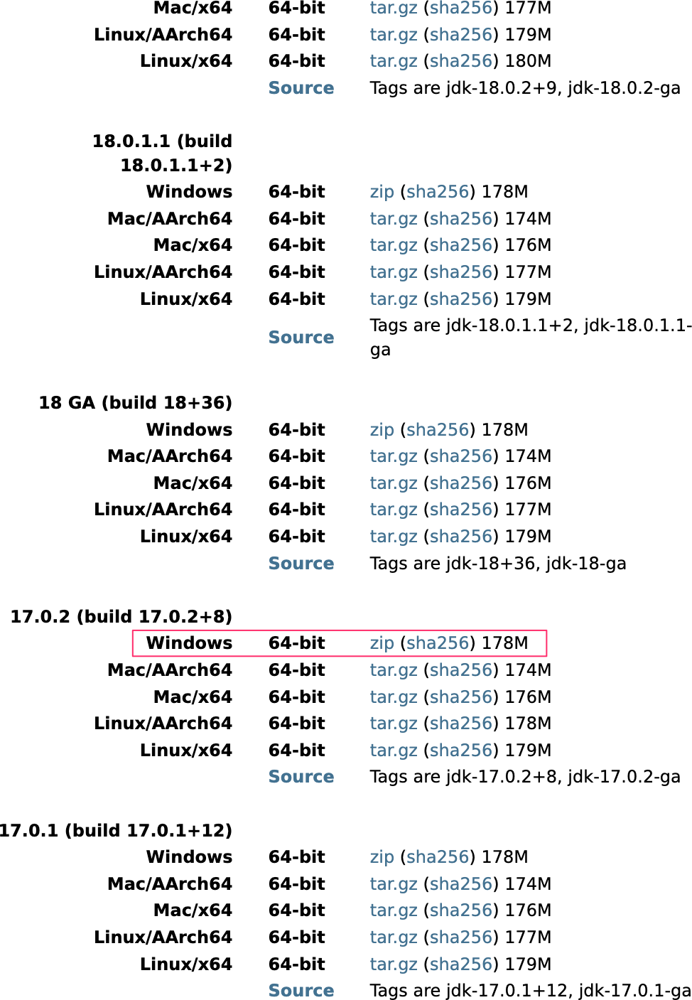


<h4>9.5.7.2 Programming Specifications Details</h4>


The programming specifications shall describe individual software modules and their component units, if applicable. For each module and unit, the manufacturer shall provide the following information:

a. Module and unit design decisions, if any, such as algorithms used.

b. Any constraints, limitations, or unusual features in the design of the software module or unit.

c. The programming language used and rationale for its use, if other than the specified module or unit language

d. If the software module or unit consists of, or contains, procedural commands (such as menu selections in a database management system for defining forms and reports, on-line queries for database access and manipulation, input to a graphical user interface builder for automated code generation, commands to the operating system, or shell scripts), a list of the procedural commands and reference to user manuals or other documents that explain them

e. If the software module or unit contains, receives, or outputs data, a description of its inputs, outputs, and other data elements as applicable.

f. If the software module or unit contains logic, the logic to be used by the software unit, including, as applicable:


    1) Conditions in effect within the software module or unit when its execution is initiated.


    2) Conditions under which control is passed to other software modules or units.

g. Exception and error handling


* The programming specifications that describe individual software modules and their component units are described in the **_Tabulator Java Classes_** and **_3rd Party Modules_** sections of this document.
* For additional information, see the following documents:
    * **_RCTab v1.3.2 Section 01 - System Overview v.1.2.1_**
    * **_RCTab v1.3.2 Section 08 - System Operations Procedures v.1.2.2_**
    * **_RCTab v1.3.2 Section 18 - User Guide v.1.2.2_**
    * **_RCTab v1.3.2 Section 19 - Tabulation Options for RCV Tabulation v.1.2.1_**
    * **_RCTab v1.3.2 Section 25 - Configuration File Parameters v.1.1.1 _**

h. If the software module is a database, provide the information described in Subsection 9.5.8. 

See below. 

 

<h3>9.5.8 Databases </h3>


The RCTab software does not use any databases for its operation. This requirement does not apply to RCTab.

<h3>9.5.9 Interfaces</h3>


RCTab does not rely on any interfaces for its operation. This requirement does not apply to RCTab. 


<table>
  <tr>
   <td colspan="4" ><strong>Document Revision History</strong>
   </td>
  </tr>
  <tr>
   <td><strong>Date </strong>
   </td>
   <td>
    <strong>Version </strong>
   </td>
   <td><strong>Description </strong>
   </td>
   <td><strong>Author </strong>
   </td>
  </tr>
  <tr>
   <td>
   </td>
   <td>1.0.0
   </td>
   <td>2.0 Initial 
   </td>
   <td>Mathew Ruberg
   </td>
  </tr>
</table>


<h2></h2>


Hardware requirements vary depending on the size (number of CVRs) of the contest you wish to tabulate. In general, the more RAM a system has the larger the elections it can run. The more powerful a computer’s CPU is, the faster it will be able to process election results. Please note when tabulating large contests (more than 1 million CVRs) RCTab must be launched from the command line using the launch steps detailed below. In all cases, after running a tabulation, you must exit the tabulator to clear the memory. Launch RCTab again to tabulate another contest. No other applications should be running at the same time, as they may compete with the tabulator for resources (RAM and CPU) and cause it to run more slowly.  

For a jurisdiction with a large number of registered voters, RCTab will need to configure a desktop computer that meets or exceeds the following specifications:

  \
Windows 10 operating system or above

3.0 GHz processor \
32GB RAM \
10GB disk space

The PC/Laptop is required to be set up according to the hardening procedures detailed in **RCTab v1.3.2 Section 16 - System Hardening Procedures - Windows OS v.1.3.0. **

**Please note when tabulating large contests (more than 1 million CVRs) RCTab must be launched from the command line using the launch steps detailed below.**

Large Configuration: up to 6,000,000 CVRs containing up to 40 columns of rankings data each:


    3.0 GHz processor


    32GB RAM


    10GB disk space + room for whatever log files your tabulations generate

Produces ~6GB of audit log output per contest

Runtime: less than 40 minutes

Launch steps for a large election:

Contest with more than 1,000,000 votes


1. Open a Command Prompt by navigating to the start menu and typing in Command Prompt. 
2. Press enter to launch Command Prompt. 
3. Change the current directory to the rcv folder created when you unzipped the Tabulator.
4. First, type in cd (note there should be a space after cd). 
5. Using File Explorer navigate to the folder where RCTab is installed. 
6. Double click on the rctab_v1.3.0_windows folder
7. Click and drag the rcv folder over to the command prompt window
8. Your command prompt will now read something like:
    1. cd C:\Users\user\rctab_v1.3.0_windows\rctab_v1.3.0_windows\rcv
9. Press enter
10. Launch the tabulator by entering the following command:
    2. .\bin\java -mx30G -p .\app -m network.brightspots.rcv/network.brightspots.rcv.Main .

This configuration will run a 6,000,000 record contest in about 30 minutes. 

Additional smaller configurations are possible for smaller contests: 

Small configuration: up to 100,000 CVRs, up to 40 columns of rankings data each:


    1 GHz processor


    4GB of RAM


    1GB of disk space + room for whatever log files your tabulations generate

Produces ~100MB of audit log output per contest

Runtime: less than 2 minutes

To Launch: Double-click the rcv.bat file 

Contests will be run in as long as one minute with this configuration. Smaller contests will run faster. 

Medium Configuration: up to 1,000,000 CVRs, up to 40 columns of rankings data each:


    3.0 GHz processor


    16GB RAM


    2GB disk space + room for whatever log files your tabulations generate

Produces ~1GB of audit log output per contest

Runtime: less than 5 minutes

To Launch: Double-click the rcv.bat file

Contests will run in as long as 5 minutes with this configuration. Smaller contests will run faster. 

Both small and medium contests can be run by using the same launch steps on the recommended computer. Contests of small and medium size can be run on the hardware defined in this document and in** RCTab v1.3.2 Section 08 - System Operations Procedures v.1.2.2 **using the launch steps under the small and medium configurations. 

**Hardware Physical, Reliability, Maintainability, and Environmental Characteristics**

Any machine used to run RCTab does not have any required physical characteristics beyond those expected of commercial off the shelf (COTS) computing equipment. 

The RCTab software itself can be maintained by following **RCTab v1.3.2 Section 09 - System Maintenance Manual v.1.3.2 **and following **RCTab v1.3.2 Section 29 - RCTab Operator Log Messages v.1.2.2. **These documents are written in a manner to be understood by non-technical election workers with sufficient training in the RCTab software. Any COTS hardware or software used to run RCTab should be maintained with reference to the Maintenance Procedures and to any relevant user guides and maintenance manuals included with that COTS equipment. 

Any machine used to run RCTab should follow basic environmental conditions required of any COTS computing equipment. 

**Document Revision History**


<table>
  <tr>
   <td><strong>Date </strong>
   </td>
   <td>
    <strong>Version </strong>
   </td>
   <td><strong>Description </strong>
   </td>
   <td><strong>Author </strong>
   </td>
  </tr>
  <tr>
   <td>
   </td>
   <td>1.0.0
   </td>
   <td>2.0 Initial 
   </td>
   <td>Mathew Ruberg
   </td>
  </tr>
</table>


<h2></h2>


RCTab is developed to run using the Java Development Kit (JDK) version 17.0.2. The Java platform includes an execution engine, a compiler, and a set of libraries used by RCTab. For more information, see **RCTab v1.3.2 Section 02 - Software Design and Specifications v.1.4.2.**

RCTab is designed to run as a stand-alone software compatible with Windows Operating System. Java 17 compatibility and system requirements are listed in the [Java 17 Compatibility Document](https://www.oracle.com/java/technologies/javase/products-doc-jdk17certconfig.html).

RCTab is normally received by the user election jurisdictions as a fully-compiled program in a Trusted Build by contacting the relevant authority directly for directions and procedures to receive the Trusted Build.

Git is the distributed version-control system used to track changes in the source code during software development. It is designed for coordinating work among programmers and is used to track changes in any set of the files. Its goals include speed, data integrity, and support for distributed, non-linear workflows. Here is a link to additional Git information: [Git External Documentation](https://git-scm.com/doc/ext).

**Hardware Functionality and Recovery Requirements**

a. Restoration of the device to the operating condition existing immediately prior to an error or failure, without loss or corruption of voting data previously stored in the device

RCTab relies upon exportable data from a jurisdiction’s voting system. Data operated upon by RCTab may be stored on external devices such as flash drives or copied directly into the memory of the hardware RCTab software is installed on. If RCTab fails while tabulating results, the original files used should not be altered because the Tabulator does not directly operate upon CVR data. However, any loss of data caused by a failure of RCTab or the hardware upon which RCTab is installed should be rectified by exporting a new copy of the same data from the jurisdiction’s voting system.

If the hardware RCTab software is installed upon fails while tabulating results, a user should first restart the machine and RCTab and run the tabulation again. There is no persistent state of RCTab that would persist after a crash or after a machine restart.

Original versions of voting data used in RCTab should be maintained on the jurisdiction’s voting systems for as long as required by jurisdiction rules. See **RCTab v1.3.2 Section 06 - System Design Specifications v.1.1.1** and **RCTab v1.3.2 Section 08 - System Operations Procedures v.1.2.2** for more.

b. Resumption of normal operation following the correction of a failure in a memory component, or in a data processing component, including the central processing unit.

If the hardware RCTab software is installed upon fails while tabulating results, a user should first restart the machine and RCTab and run the tabulation again. If the hardware continues to fail, users should consult the documentation included with the hardware to determine any error resolution steps. See **RCTab v1.3.2 Section 09 - System Maintenance Manual v.1.3.2** for more.

c. Recovery from any other external condition that causes equipment to become inoperable, provided that catastrophic electrical or mechanical damage due to external phenomena has not occurred 

If the hardware that RCTab is installed upon fails while tabulating results, a user should first restart the machine and RCTab and run the tabulation again. There is no persistent state of RCTab that would persist after a crash or after a machine restart. If failure persists, users should consult the documentation included with the hardware to determine any error resolution steps. See **RCTab v1.3.2 Section 09 - System Maintenance Manual v.1.3.2** for more. 

**Vote Tabulating Information**

RCTab processes vote tabulation data exported from a jurisdiction’s voting systems according to the rules as set up in the configuration file used by the user when operating RCTab. See **RCTab v1.3.2 Section 02 - Software Design and Specifications v.1.4.2** for more.

a. Monitor system status and generate machine-level audit reports

RCTab provides users system status information through the log box in the user interface and through log documents (both tabulation audit logs produced after successful tabulation and the operator log file, which is available in the /bin folder on Windows computers). Audit logs capture details of successful tabulations, including all configuration file details, CVR parsing information, details on how every ballot was processed in every round of counting, and summary round-by-round results. The operator log captures all messages produced by RCTab: those produced during a failed tabulation, messages sent during a successful tabulation, messages sent while validating configuration files, and any other messages sent via the log box in the user interface. See **RCTab v1.3.2 Section 02 - Software Design and Specifications v.1.4.2** for more about audit reports and system status reports. 

b. Accommodate device control functions performed by polling place officials and maintenance personnel

Polling place officials will not interact with the RCTab software. Maintenance personnel should refer to **RCTab v1.3.2 Section 09 - System Maintenance Manual v.1.3.2** and **RCTab v1.3.2 Section 08 - System Operations Procedures v.1.2.2** when interacting with RCTab. All device control functions are laid out in those materials. 

c. Register and accumulate votes

RCTab processes digital cast vote records of ballots as cast by voters. Part of this requires the accumulation of cast vote record data; this is done in accordance with configuration requirements as set by users. See **RCTab v1.3.2 Section 06 - System Design Specifications v.1.1.1** and **RCTab v1.3.2 Section 08 - System Operations Procedures v.1.2.2** for more information about how RCTab handles cast vote records.

d. Accommodate variations in ballot counting logic

RCTab relies upon cast-vote record data from a jurisdiction’s voting system. CVR data must be adjudicated before being processed by RCTab. That cast-vote record data will have varying types of ballot data depending on how voters marked their ballots and how ballots were adjudicated, including candidate names, overvoted markings, skipped rankings, undervoted ballots, and write-in markings. RCTab has settings for users to determine how each of these different types of markings is processed by the software. RCTab performs no interpretation of voter marks on ballots, however, as CVR data used in RCTab software will include only non-ambiguous marks and data representing how voters marked their ballots. See **RCTab v1.3.2 Section 25 - Configuration File Parameters v.1.1.1** and **RCTab v1.3.2 Section 08 - System Operations Procedures v.1.2.2** for more information on the settings available to users for processing these varying voter marks. 

The only voting variation RCTab supports is ranked order voting. RCTab supports many permutations of ranked order voting (referred to as ranked choice voting in the documentation). See **RCTab v1.3.2 Section 08 - System Operations Procedures v.1.2.2** for more information on the permutations and settings available to users.


<table>
  <tr>
   <td colspan="4" ><strong>Document Revision History</strong>
   </td>
  </tr>
  <tr>
   <td><strong>Date </strong>
   </td>
   <td>
    <strong>Version </strong>
   </td>
   <td><strong>Description </strong>
   </td>
   <td><strong>Author </strong>
   </td>
  </tr>
  <tr>
   <td>
   </td>
   <td>1.0.0
   </td>
   <td>2.0 Initial 
   </td>
   <td>Mathew Ruberg
   </td>
  </tr>
</table>


<h2></h2>


**This Acceptance Test is designed to verify that RCTab is correctly configured and operating properly. Acceptance tests should always be conducted on a new install of RCTab prior to its use in an election. Also, acceptance tests should be conducted when there are significant changes or repairs made to the hardware where the software is installed. Example: If the RCTab computer is sent out for repair or if a new version of the operating system or RCTab is installed, an acceptance test should be conducted on RCTab as soon as it is returned.**

<h3>Required Materials</h3>


In addition to the following, you must know the correct version of your operating system and RCTab. The manufacturer can provide assistance in determining the correct version. Users can also find that information in **RCTab v1.3.2 Section 22 - Installation Instructions for Windows OS v.1.3.0** documentation. The following components of a voting system are required to complete the acceptance testing procedures:


1. One Computer with RCTab installed. Installation instructions can be found in **RCTab v1.3.2 Section 22 - Installation Instructions for Windows OS v.1.3.0** document.
2. Recommended battery backup if the user jurisdiction facility does not have generator capabilities in the event of a power failure.

The RCTab computer system, consisting of items 1 & 2 above, should have been set up and tested for functionality before beginning this test. IT staff may do this part of the setup if properly supervised by election staff who have been trained in accordance with procedures laid out in the personnel documentation. Requirements are included in **RCTab v1.3.2 Section 03 - System Hardware Specification v.1.1.1** and in **RCTab v1.3.2 Section 16 - System Hardening Procedures - Windows OS v.1.3.0.** 

<h3>Verify RCTab Hardware</h3>


Verify that all hardware components of the RCTab computer are turned on and functioning properly. This includes checks of the printer(s), flash drives, USB port, etc.

<h3>Verify Correct Operating System and RCTab Software</h3>


Turn on the RCTab computer. As the computer boots up, verify that the correct versions of the operating system and the RCTab software are installed. Compute the hash codes for the RCTab voting system software and compare them with the hash value provided with the trusted build. See **RCTab v1.3.2 Section 03 - System Hardware Specification v.1.1.1.** document and **RCTab v1.3.2 Section 22 - Installation Instructions for Windows OS v.1.3.0** document for procedures and more information.

Manufacturer recommendation: When your election management system successfully passes the acceptance test, affix to the top of the computer case a label with the date of the test and the initials of the person conducting the test. This information should also be recorded on the access log as per the user jurisdiction’s security guidelines and protocols.


<table>
  <tr>
   <td colspan="4" ><strong>Document Revision History</strong>
   </td>
  </tr>
  <tr>
   <td><strong>Date </strong>
   </td>
   <td>
    <strong>Version </strong>
   </td>
   <td><strong>Description </strong>
   </td>
   <td><strong>Author </strong>
   </td>
  </tr>
  <tr>
   <td>
   </td>
   <td>1.0.0
   </td>
   <td>2.0 Initial 
   </td>
   <td>Mathew Ruberg
   </td>
  </tr>
</table>


<h2></h2>


5.1.1 - Configuration of software, both operating systems and applications, is critical to proper system functioning. Correct test design and sufficient test execution must account for the intended and proper configuration of all system components. Therefore, the vendors shall submit a record of all user selections made during software installation as part of the Technical Data Package. The vendor shall also submit a record of all configuration changes made to the software following its installation. The accredited test lab shall confirm the propriety and correctness of these user selections and configuration changes.  


* RCTab software does not permit installation configuration changes by the user at any time during or after the installation process. 
* RCTab software installation must be conducted according to **RCTab v1.3.2 Section 22 - Installation Instructions for Windows OS v.1.3.0.**
* See **RCTab v1.3.2 Section 08 - System Operations Procedures v.1.2.2** and **RCTab v1.3.2 Section 16 - System Hardening Procedures - Windows OS v.1.3.0** document for more information about RCTab operation and other software requirements on hardware used for RCTab software.

5.3.a - Maintain the integrity of voting and audit data during an election, and for at least 22 months thereafter, a time sufficient in which to resolve most contested elections and support other activities related to the reconstruction and investigation of a contested election.


* The user jurisdiction should follow all record retention policy requirements set by the jurisdiction itself and all other higher governing authorities with respect to the appropriate retention and storage of any materials generated by the software.
* The manufacturer recommends that in the absence of any user controlling records retention schedule, all materials generated by the software for a particular election be securely stored for a minimum period of 22 months.  
* User must save all results files created for each contest in an election, including all configuration files used for those contests. This should also include testing data. User must export files to a hard drive secured and stored according to jurisdiction policies. For every contest processed through RCTab at least four files must be exported: 
    * Contest configuration.json file
    * Contest summary .csv file
    * Contest summary .json file
    * Contest audit .log file(s)
        * Depending on the size of the contest multiple .log files may be created. .log files have a maximum size of 50MB. Large contests frequently have many .log files. 
    * The **RCTab v1.3.2 Section 08 - System Operations Procedures v.1.2.2** suggests users create a folder for each contest where all relevant files for the contest are saved. If these procedures are followed, users will be able to copy whole sets of contest files over, folder by folder, on the external hard drive to be used for records retention. 
    * At the close of an election, users must also export any operator .log files, located in the bin folder of the RCTab installation folder. These .log files will be named rcv_0.log, rcv_1.log, and so on, depending upon how many .log files were produced during use of RCTab. These files must also be placed on the secured hard drive. 
    * After successfully copying over all relevant files to a secured hard drive, the hard drive should be stored in a temperature and humidity controlled area that meets the criteria for such media.

 


<table>
  <tr>
   <td colspan="4" ><strong>Document Revision History</strong>
   </td>
  </tr>
  <tr>
   <td><strong>Date </strong>
   </td>
   <td>
    <strong>Version </strong>
   </td>
   <td><strong>Description </strong>
   </td>
   <td><strong>Author </strong>
   </td>
  </tr>
  <tr>
   <td>
   </td>
   <td>1.0.0
   </td>
   <td>2.0 Initial 
   </td>
   <td>Mathew Ruberg
   </td>
  </tr>
</table>


<h2> </h2>


<h3>9.6.1 Access Control</h3>


a. Manufacturers shall provide user and TDP documentation of access control capabilities of the voting system.


* **RCTab v1.3.2 Section 16 - System Hardening Procedures - Windows OS v.1.3.0** enumerates steps for creating a ‘RCTab’ Windows Standard user account on the RCTab machine. Installation instructions for RCTab in ** **describe how to set up and run the RCTab software using the ‘RCTab’ user account which has the absolute minimum permissions necessary. Following these instructions ensures the following:
    * RCTab users cannot edit or delete RCTab summary output files or audit logs. 
    * RCTab users cannot edit or delete corresponding `.hash` files that can be used to verify the contents of all output files and audit logs.  

b. Manufacturers shall provide descriptions and specifications of all access control mechanisms of the voting system including management capabilities of authentication, authorization, and passwords in the TDP.


* Access to RCTab should be at minimum made by no less than two employees within the user jurisdiction. These employees should have received the suggested training time provided by the manufacturer before accessing the software. See **RCTab v1.3.2 Section 10 - Personnel Deployment and Training v.1.2.1 **for more**. **
* **RCTab v1.3.2 Section 16 - System Hardening Procedures - Windows OS v.1.3.0** enumerates steps for creating two Windows OS Accounts. One Administrator level Windows account for installation and initial configuration. A separate ‘RCTab’ Windows Standard user account with only necessary permissions that will not have access to make administrative changes to the machine that could be security issues.  \
 \
Installation instructions for RCTab in **RCTab v1.3.2 Section 22 - Installation Instructions for Windows OS v.1.2.2 **describe how to properly run RCTab with minimum permissions necessary - being logged into the Windows OS as the ‘RCTab’ Windows standard user while using Window’s ‘Run As’ capability to run the RCTab software **only **with Administrator privileges.  \
 \
This ensures that RCTab has the privileges necessary to ensure security (like setting output files to read-only) while simultaneously preventing the logged in human user from inheriting any of the same privileges or having any extra privileges not necessary for running a Tabulation. 
* ** **describe setting a hardware BIOS password to protect the system BIOS settings from tampering. This locks down attempts to boot from unauthorized devices and prevents system configuration settings from being changed at a BIOS level.

c. Manufacturers shall provide descriptions and specifications of methods to prevent unauthorized access to the access control mechanisms of the voting system in the TDP.


* Access to RCTab should be at minimum made by no less than two employees within the user jurisdiction. These employees should have received the suggested training time provided by the manufacturer before accessing the software. See **RCTab v1.3.2 Section 10 - Personnel Deployment and Training v.1.2.1 **for more**. **
* Access to the desktop or laptop should require password entry from the initial operating system for all users assigned to operate RCTab. Instructions in **RCTab v1.3.2 Section 16 - System Hardening Procedures - Windows OS v.1.3.0**  and ** **provide all necessary steps so that RCTab users have the minimum permissions necessary to run and verify a contest tabulation.
* Jurisdictions shall restrict access to Windows Admin account and BIOS password to the minimum number of users necessary for initial setup. Election officials running the tabulation shall not have access to the Windows Admin account. 

d. Manufacturers shall provide descriptions and specifications of all other voting system mechanisms that are dependent upon, support, and interface with access controls in the TDP.


* RCTab is hosted on a separate, standalone tabulation workstation. Users can bring flash drives holding cast vote record (CVR) data to and from the RCTab workstation to produce RCV results and bring RCV results back into the main voting system. \
 \
The RCTab workstation does not directly interface, control, or support any other functions of the voting system. 

e. Manufacturers shall provide a list of all of the operations possible on the voting system and list the default roles that have permission to perform each such operation as part of the TDP.


* After installation and set up following the instructions in  and ** **the only operations possible on an RCTab workstation are RCTab rules configuration, production of round-by-round RCV results, review of CVR data when setting up rules, review of audit logs and other event logs, and read-only review of round-by-round results after tabulation completes. All features are available to users once they have logged into the RCTab workstation. 

<h4>9.6.1.1 General Access Control Policy </h4>


The manufacturer shall specify the features and capabilities of the access control policy recommended to purchasing jurisdictions to provide effective voting system security. The access control policy shall address the general features and capabilities and individual access privileges.


* Access to RCTab should be at minimum made by no less than two employees within the user jurisdiction. These employees should have received the suggested training time provided by the manufacturer before accessing the software. See **RCTab v1.3.2 Section 10 - Personnel Deployment and Training v.1.2.1 **for more**. **
* Access to the desktop or laptop must require password entry from the initial operating system for all users assigned to operate RCTab. See **RCTab v1.3.2 Section 16 - System Hardening Procedures - Windows OS v.1.3.0** document for more information. 
* Installation instructions for RCTab in **RCTab v1.3.2 Section 22 - Installation Instructions for Windows OS v.1.2.2** describe how to set up and run the RCTab software using the ‘RCTab’ Windows standard user account which has the absolute minimum permissions necessary to operate the software. Following these instructions ensures the following
    * RCTab users cannot edit or delete RCTab summary output files or audit logs. 
    * RCTab users cannot edit or delete corresponding `.hash` files that can be used to verify the contents of all output files and audit logs.
* Employees accessing the software should be provided a paper log tracking for the purposes of establishing a recorded access record. The log should require the name of the personnel accessing the system, purpose of access, and the start and end times.  This log should be maintained as part of the official election record and for as long as the user jurisdiction is required to maintain records per their controlling records retention schedule.
* The RCTab software provides full capabilities and access upon start-up and the manufacturer recommends not less than two user employees access the system simultaneously to prevent incorrect, accidental or on purpose, use of the features to tabulate ranked choice voting results.

    a. Suggested software access controls 

* After successful completion of the steps to harden Windows OS and workstation hardware in **RCTab v1.3.2 Section 16 - System Hardening Procedures - Windows OS v.1.3.0 **and steps to install the RCTab software in** RCTab v1.3.2 Section 22 - Installation Instructions for Windows OS v.1.2.2 RCTab **the following software access controls apply to RCTab 
    * RCTab users cannot edit or delete RCTab summary output files or audit logs. 
    * RCTab users cannot edit or delete corresponding `.hash` files that can be used to verify the contents of all output files and audit logs.
    * RCTab software will automatically, programmatically verify the cryptographic signature of the Hart CVRs used as input. If unable to verify, the software will not begin tabulation.
* The RCTab software employs a single user level, and the user has access to the capabilities of the software described in the **RCTab v1.3.2 Section 25 - Configuration File Parameters v.1.1.1** document and described by **RCTab v1.3.2 Section 08 - System Operations Procedures v.1.2.2**. The manufacturer recommends that at least two users visually observe the software during use.
* Access to RCTab should be at minimum no less than 2 employees within the user jurisdiction. These employees should have received the suggested training time provided by the manufacturer before accessing the software.  See **RCTab v1.3.2 Section 10 - Personnel Deployment and Training v.1.2.1.**

    b. Suggested hardware access controls 

* Maintaining proper physical security to all computers is absolutely essential. When the equipment is in use, no less than two properly trained and trusted election officials should be present in the room with the equipment at all times. When the equipment is not being used (for instance, between elections), the computer and any backup hardware should be kept in a locked room, and entry to that room should be restricted and logged. 

    c. Suggested communications controls

* **RCTab v1.3.2 Section 16 - System Hardening Procedures - Windows OS v.1.3.0** requires users to turn off all networking features on hardware. No RCTab installed computer should ever run with its Wi-Fi enabled. No RCTab computer should ever be connected to any public network. For software installation, files should be captured to a USB flash drive using only secure methods. See also **RCTab v1.3.2 Section 16 - System Hardening Procedures - Windows OS v.1.3.0**

    d. Suggestions for effective password management. 

* Access to the desktop or laptop should require password entry from the initial operating system for all users assigned to operate RCTab. Any additional user jurisdiction security requirements should also be maintained when accessing any user jurisdiction owned equipment.

    e. Suggestions for protection abilities of a particular operating system 

* The user jurisdiction is fully responsible for maintaining owned hardware in keeping with universal maintenance and security standards including all updates and security patches for the operating system in use. See also **RCTab v1.3.2 Section 16 - System Hardening Procedures - Windows OS v.1.3.0 **and **RCTab v1.3.2 Section 09 - System Maintenance Manual v.1.3.2.**
* Following the instructions in **RCTab v1.3.2 Section 16 - System Hardening Procedures - Windows OS v.1.3.0 **and **RCTab v1.3.2 Section 22 - Installation Instructions for Windows OS v.1.2.2 RCTab **enables the following protection abilities for the Windows Operating system
    * Sets up an RCTab Windows standard user account with minimum permissions required to run RCTab
    * Restricts OS folder permissions on the RCTab output folder to read only** **
    * Enables Windows OS drive encryption
    * Disables all OS-level network connections

    f. Suggested general characteristics of supervisory access privileges 

* Access to RCTab should be at minimum no less than 2 employees within the user jurisdiction. These employees should have received the suggested training time provided by the manufacturer before accessing the software.  See **RCTab v1.3.2 Section 10 - Personnel Deployment and Training v.1.2.1**
* The user jurisdiction is fully responsible for assigning access to the software and procuring the suggested training (see **RCTab v1.3.2 Section 10 - Personnel Deployment and Training v.1.2.1**) for those employees.  
* The user jurisdiction is also responsible for creating and maintaining a segregation of duties plan and a backup plan where there will be no less than two employees identified in the event that assigned personnel are unable to fulfill their assigned roles.

    g. Suggested policies for segregation of duties 

* Access to RCTab should be at minimum no less than 2 employees within the user jurisdiction. These employees should have received the suggested training time provided by the manufacturer before accessing the software.  See **RCTab v1.3.2 Section 10 - Personnel Deployment and Training v.1.2.1.**
* The user jurisdiction is fully responsible for assigning access to the software and procuring the suggested training (see **RCTab v1.3.2 Section 10 - Personnel Deployment and Training v.1.2.1**) for those employees.  
* The user jurisdiction is also responsible for creating and maintaining a segregation of duties plan and a backup plan where there will be no less than two employees identified in the event that assigned personnel are unable to fulfill their assigned roles.

    h. Suggestions for any additional relevant characteristics 

* There are no additional relevant characteristics associated with RCTab.

<h4>9.6.1.2 Access Control Measures</h4>


The manufacturer shall provide a detailed description of all system access control measures and mandatory procedures designed to permit access to system states in accordance with the access policy, and to prevent all other types of access to meet the specific requirements.


* RCTab uses two Windows OS accounts. The first is a Windows Administrator level account. Steps for its creation are described in **.** RCTab shall be installed and initial configuration done by an election administrator with access to this account.  describes steps for the creation of a ‘RCTab’ Windows standard account. This new account does not have OS administrative privileges. Running a tabulation will be done only with the ‘RCTab’ standard user account. This ensures that once installation and initial configuration is complete, RCTab users will have minimum OS privileges necessary to run a tabulation and will not have access to make administrative changes to the machine that could be security issues. Election officials running the tabulation shall not have access to the Windows Admin account. The Windows Admin account credentials should be shared with the fewest number of users necessary to complete installation and initial configuration. 
* Access to RCTab should be a minimum of two employees within the user jurisdiction. These employees should have received the suggested training time provided by the manufacturer before accessing the software. See **RCTab v1.3.2 Section 10 - Personnel Deployment and Training v.1.2.1.**

    a. Suggested measures for use of data and user authorization

* Access to RCTab should be limited to no less than 2 employees within the user jurisdiction.
* Upon startup, the software provides capabilities as described in **RCTab v1.3.2 Section 25 - Configuration File Parameters v.1.1.1 **and **RCTab v1.3.2 Section 08 - System Operations Procedures v.1.2.2**. The manufacturer recommends that at least two users visually observe the software during use simultaneously to prevent incorrect, accidental or on purpose, use of the features to tabulate ranked choice voting results.
* Access to RCTab should only be permitted during pre-election logic & accuracy testing and post-election tabulation of ranked choice voting results from the voting system generated cast vote records (CVR).

    b. Suggested measures for program unit ownership and other regional boundaries 

* The user jurisdiction is fully responsible for assigning access to the software and procuring the suggested training (see **RCTab v1.3.2 Section 10 - Personnel Deployment and Training v.1.2.1**) for those employees.
* The user jurisdiction is also responsible for creating and maintaining a backup plan in the event that assigned personnel are unable to fulfill their assigned roles.

    c. Suggested measures for one-end or two-end port protection devices

* RCTab software does not use any one-end or two-end port encryption devices.

    d. Suggested measures for security kernels

* RCTab software does not use security kernels.

    e. Suggested measures for Computer-generated password keys

* RCTab software does not use computer-generated password keys. 

    f. Suggested measures for special protocols

* RCTab software does not require special protocols as data does not transmit in or out via a web-based system.
* The manufacturer does recommend a dedicated USB flash drive and backup be secured with the hardware and used for no other purpose than software use.

    g. Suggested measures for message encryption 

* RCTab does not require message encryption as data does not transmit in or out via a web-based system.

    h. Suggested measures for controlled access security 

* RCTab access takes place at a single central-count location. The software and hardware resides at this location. All election personnel are present at this location. 
* Physical access to the site is controlled by policy and procedures under control of the jurisdiction. 
* Physical access to the system hardware is controlled by policy and procedures under control of the jurisdiction. 
* At no time should the hardware with installed software be connected to the internet via WiFi or ethernet.
* The user jurisdiction is fully responsible for assigning access to the software and procuring the suggested training (see **RCTab v1.3.2 Section 10 - Personnel Deployment and Training v.1.2.1**) for those employees.  
* The user jurisdiction is also responsible for creating and maintaining a backup plan in the event that assigned personnel are unable to fulfill their assigned roles.

<h3>9.6.2 Equipment and Data Security</h3>


The manufacturer shall provide a detailed description of system capabilities and mandatory procedures for purchasing jurisdictions to prevent disruption of the voting process and corruption of voting data to meet the specific requirements. This information shall address measures for polling place security and central count location security.


* Access to RCTab should only be permitted during pre-election logic & accuracy testing and post-election tabulation of ranked choice voting results from the voting system generated cast vote records (CVR). RCTab should not be deployed in polling places. If the RCTab workstation is deployed and in use in a central count location, no less than two properly trained and trusted election officials should be present in the room with the equipment at all times. When the equipment is not being used (for instance, between elections), the computer and any backup hardware should be kept in a locked room, and entry to that room should be restricted and logged. 
* Transportation of CVR data from the voting system to the RCTab workstation should follow jurisdiction procedures for handling election data. Any results data produced by RCTab should be secured following jurisdiction procedures.** **
* After successful completion of the steps in **RCTab v1.3.2 Section 16 - System Hardening Procedures - Windows OS v.1.3.0 **and** RCTab v1.3.2 Section 22 - Installation Instructions for Windows OS v.1.2.2 RCTab **RCTab contains the following capabilities to prevent corruption of voting data
    * RCTab users cannot edit or delete RCTab summary output files or audit logs. 
    * RCTab users cannot edit or delete corresponding `.hash` files that can be used to verify the contents of all output files and audit logs.
    * RCTab software will automatically, programmatically verify the cryptographic signature of the Hart CVRs used as input. If unable to verify, the software will not begin tabulation.

<h3>9.6.3 Software Installation and Security</h3>


    a. The manufacturer shall provide a detailed description of the system capabilities and mandatory procedures for purchasing jurisdictions to ensure secure software (including firmware) installation to meet specific requirements. This information shall address software installation for all system components.


* User jurisdictions should install RCTab on a workstation configured according to the requirements laid out in **RCTab v1.3.2 Section 16 - System Hardening Procedures - Windows OS v.1.3.0. **
* RCTab installation should follow the steps laid out in** RCTab v1.3.2 Section 22 - Installation Instructions for Windows OS v.1.3.0 **and** RCTab v1.3.2 Section 05 - Acceptance Test Procedures v.1.2.1.**

    b. Manufacturers shall provide a list of all software related to the voting system in the technical data package (TDP).  

* Software that must be installed on RCTab system:
    * Windows 10 Pro, or above
    * RCTab v1.3.2
    * LibreOffice
    * XML Notepad
    * Users must also retain access to: 
        * Command Prompt
        * Notepad
    * Optional UPS
    * See also **RCTab v1.3.2 Section 16 - System Hardening Procedures - Windows OS v.1.3.0**. 
* No other software is necessary for user operation of RCTab.  

    c. Manufacturers shall provide at a minimum in the TDP the following information for each piece of software related to the voting system: software product name, software version number, software manufacturer name, software manufacturer contact information, type of software (application logic, border logic, third party logic, COTS software, or installation software), list of software documentation, component identifier(s) (such as filename(s)) of the software, type of software component (executable code, source code, or data).

* Documentation, manufacturer name, product name, version, certification application number of voting system, and file names and paths are all referred to with unique labels in documentation and in the system itself. See also **RCTab v1.3.2 Section 16 - System Hardening Procedures - Windows OS v.1.3.0 **and **RCTab v1.3.2 Section 13 - Quality Assurance Plan v.1.2.2** document for information about version numbers and documentation numbers. 

    d. As part of the TDP, manufacturers shall provide the location (such as full path name or memory address) and storage device (such as type and part number of storage device) where each piece of software is installed on the voting system.

* RCTab does not require election specific programming to be created or installed. See also **RCTab v1.3.2 Section 22 - Installation Instructions for Windows OS v.1.3.0 **and **RCTab v1.3.2 Section 08 - System Operations Procedures v.1.2.2.**

    e. As part of the TDP, manufacturers shall document the functionality provided to


    the voting system by the installed software.

* All RCTab functionality is described in **RCTab v1.3.2 Section 02 - Software Design and Specifications v.1.4.2**,  **RCTab v1.3.2 Section 08 - System Operations Procedures v.1.2.2**, and** RRCTab v1.3.2 Section 18 - User Guide v.1.2.2**.

    f. As part of the TDP, manufacturers shall map the dependencies and interactions


    between software installed on the voting system.

* RCTab is designed to operate as a standalone piece of software on a tabulation workstation. RCTab is dependent upon the CVRs from the configured voting systems as input. RCTab does not depend on or interface with any other software installed on a voting system. 
* Depending on the needs of user jurisdictions, users may use LibreOffice or NotePad to inspect CVRs when generating RCTab configuration files and may depend on Windows PowerShell or the Command Line to produce hash codes using the procedures in **RCTab v1.3.2 Section 23 - HashCode Instructions - Windows OS v.1.2.1.**
* There are no interactions between software installed on the system. 

    g. The manufacturer shall provide a detailed description of the system capabilities


    and mandatory procedures for purchasing jurisdictions used to provide


    protection against threats to third party products and services.

* Third party products and services installed on RCTab workstations should be configured according to the steps laid out in **RCTab v1.3.2 Section 16 - System Hardening Procedures - Windows OS v.1.3.0**. 

<h4>9.6.3.1 Air Gap</h4>


The TDP for the voting system shall provide full procedures and instructions, to be incorporated into the Official Use Procedures for the voting system, to implement the segregated dual-installation architecture. Those procedures and instructions shall:


    a. Require elections officials to use the permanent installation to lay out the ballot, define the election, and program all of the memory cards, including any DRE, ballot marking device, optical scan unit, etc.


* RCTab is not used to lay out ballots, define elections, or program memory cards. 

    b. Require elections officials to write a backup of the election database from the permanent installation onto write-once media (e. g., CD-R or DVD-R), carry the media by hand to the sacrificial installation, and install that database onto the sacrificial installation. After this point, the permanent installation shall not be used for the remainder of the election.

* RCTab is not used to set up election databases. 

    c. Require that, after the close of the polls, memory cards or other equipment containing votes returned from polling locations are uploaded to the sacrificial installation (not the permanent installation).

* RCTab does not interface directly with memory cards or other equipment after its return from polling locations. 

    d. Require that the sacrificial installation, not the permanent installation, is used to accumulate and tabulate election results, produce reports, and calculate the official election results.

* RCTab only interacts with cast vote records from sacrificial installations. It should therefore be used as part of any sacrificial installation. 

    e. Require that the "sacrificial" installation is treated as presumed-to-be-infected, so any machine or equipment that is ever connected to the sacrificial installation must never again be connected to the permanent installation.

* Results created by RCTab shall never be connected back to any permanent installation. 

    f. Ensure that any media that has been connected to the sacrificial installation is securely erased or reformatted before being used with the permanent installation.

* Any media connected to RCTab shall be erased or reformatted if it will be used with a permanent installation. 

<h3>9.6.4 System Event Logging</h3>


    a. Manufacturers shall provide TDP documentation of event logging capabilities of the voting devices.


* RCTab produces audit logs and tabulator operator logs. Logging capabilities are described in the RCTab Logging section of **RCTab v1.3.2 Section 02 - Software Design and Specifications v.1.4.2** and **RCTab v1.3.2 Section 29 - RCTab Operator Log Messages v.1.2.2**
* Windows OS also logs all events on the OS. Those event logs are available via the Windows Event Log application. 

    b. Manufacturers shall provide a technical data package that describes system event logging design and implementation.

* RCTab produces audit logs and tabulator operator logs. Log design and implementation are described in the RCTab Logging section of **RCTab v1.3.2 Section 02 - Software Design and Specifications v.1.4.2**. Detailed documentation describing how to read and make use of these logs is provided in **RCTab v1.3.2 Section 28 - Post-Election Audit & Clearing RCTab from System v.1.1.1**.

    c. The technical data package shall provide the location (i.e. full path name or memory address) where each log is saved.

* RCTab saves event logs according to user settings as described in the RCTab logging section of **RCTab v1.3.2 Section 02 - Software Design and Specifications v.1.4.2 **and the Generating Results Files section of **RCTab v1.3.2 Section 08 - System Operations Procedures v.1.2.2**.  

<h3>9.6.5 Physical Security</h3>


    a. Manufacturers shall provide a list of all voting system components to which access must be restricted and a description of the function of each said component.


* Maintaining proper physical security to all computers is absolutely essential. All RCTab workstations should have restricted physical access. When the RCTab workstation is in use, no less than two properly trained and trusted election officials should be present in the room with the equipment at all times. When the equipment is not being used (for instance, between elections), the computer and any backup hardware should be kept in a locked room, and entry to that room should be restricted and logged. 

    b. As part of the TDP, manufacturers shall provide a listing of all ports and access points of the voting system.

* Any RCTab workstation will have a varying set of ports depending upon the laptop or desktop on which RCTab is installed. Users must physically seal all external ports on hardware where RCTab is installed, except ports used for power supply, necessary external displays, and one (1) USB port. The user jurisdiction should employ a policy where the use of tamper evident and tamper resistant seals are used to identify ports that should never be accessed, unlikely to be accessed, and can be accessed if necessary.

    c. For each physical lock used on a voting system, manufacturers shall document whether the lock was installed to secure an access point.

* Any RCTab workstation will have a varying set of ports depending upon the laptop or desktop on which RCTab is installed. Users must physically seal all external ports on hardware where RCTab is installed, except ports used for power supply, necessary external displays, and one (1) USB port. The user jurisdiction should employ a policy where the use of tamper evident and tamper resistant seals are used to identify ports that should never be accessed, unlikely to be accessed, and can be accessed if necessary.

    d. Manufacturers shall provide a list of all physical security countermeasures that require power supplies.

* No RCTab physical security countermeasures require power supplies. 

    e. Manufacturers shall provide a technical data package that documents the design and implementation of all physical security controls for the voting system.

* Physical security controls and design are discussed in this section. 

<h3>9.6.6 Setup Inspection</h3>


    a. Manufacturers shall provide the technical specifications of how voting systems identify installed software in the TDP.


* RCTab relies on hash codes to verify that the correct version of the software has been installed. See **RCTab v1.3.2 Section 05 - Acceptance Test Procedures v.1.2.1**, **RCTab v1.3.2 Section 22 - Installation Instructions for Windows OS v.1.3.0** and **RCTab v1.3.2 Section 23 - HashCode Instructions - Windows OS v.1.2.1** for details.  

    b. Manufacturers shall provide a technical specification of how the integrity of software installed on the voting system is verified as part of the TDP. Software integrity verification techniques used to support the integrity verification of software installed on voting systems need to be able to detect the modification of software.

* RCTab relies on hash codes to verify that the correct version of the software has been installed. See **RCTab v1.3.2 Section 05 - Acceptance Test Procedures v.1.2.1**, **RCTab v1.3.2 Section 22 - Installation Instructions for Windows OS v.1.3.0,** and **RCTab v1.3.2 Section 23 - HashCode Instructions - Windows OS v.1.2.1** for details.  

    c. Manufacturers shall provide a technical specification of how the inspection of all the voting system registers and variables is implemented by the voting device in the TDP.

* RCTab does not have a voting device. 

<h3>9.6.7 Cryptography</h3>


    a. Manufacturers shall provide a list of all cryptographic algorithms and key sizes supported by the voting system.


* RSA Cipher with a 2048 bit key size 

    b. Manufacturers shall provide the technical specification of all cryptographic protocols supported by the voting system.

* We support validation of files encrypted using a detached Signature File, created by Hart Verity with .NET Framework 4.8.1. We do not sign any files, but only validate the signature of files signed by Hart Verity. Below, we outline exactly what that library does, and how we validate the files it produces. \
 \
.NET Framework 4.8.1 creates a “Signature File” with the file extension .sig.xml. This Signature File includes data about both the signature itself, and about the file it is signing (the “Signed File”). The Signature File file includes the public key used to sign the file, the signature value, the file path to where the Signed File was originally signed, and the SHA-256 digest of the Signed File. \
 \
From the Signature File, .NET Framework 4.8.1 constructs the following XML snippet, hashes it using SHA-256, then signs the hash of this snippet:
* The following variables, above surrounded by curly brackets {}, are replaced with values specific to each signed file
    * The value {SHA256HASH} is the SHA-256 hash of the Signed File
    * The value {FILE} is the filename and filepath of the Signed File
    * The value {CANONICALIZATION_URL} is the URL used to uniquely identify the canonicalization algorithm
* To validate the signature, we require three files:
    * The Public Key, which we store in a String in the source code to prevent runtime tampering, for which only one is valid for each release of RCTab.
    * The Signed File
    * The Signature File (.sig.xml) generated by .NET Framework 4.8.1
* We validate that the signature is valid using the following procedure:
    * We verify that the Signed File matches the SHA-256 hash {SHA256HASH} provided in the Signature File
    * We verify that the Signed File’s filename matches the expected filename {FILE} found in the Signature File
    * We verify that the public key found in the Signature File matches the expected Public Key that we have included in our source code
    * We verify the cryptographic signature of the XML snippet above using a 2048 bit RSA with a 256 bit SHA hash.
* Additional notes:
    * The original path of the signed file at the time of signature is included in the signed message. The path at the time of signature verification may be different - the files will have been moved from the Verity machine they were signed on to the RCTab machine for tabulation. The filename and a hash of the file contents, both of which are included in the signature itself, verify the contents of the signed file.
    * We allow the Algorithm attribute of CanonicalizationMethod to vary, and support all CanonicalizationMethods supported by the Java.Security library in JDK 17.
    * If the Signed File is an XML, it is not canonicalized before being hashed.
    * The signature file IS canonicalized before being hashed.

    c. Manufacturers shall provide the cryptographic module name, identification information (such as hardware/firmware/software name, model name, and revision/version number) and NIST FIPS 140-2 validation certificate number for all cryptographic modules that implement the cryptographic algorithms of the voting systems.

* RCTab uses [#4616](https://csrc.nist.gov/projects/cryptographic-module-validation-program/certificate/4616) BC-FJA (Bouncy Castle FIPS Java API), a Level 1 FIPS 140-2 Validated Cryptographic Module to verify the cryptographic signature of Hart Verity Signed CVRs.  \
 \
Note: We have BouncyCastle implemented as a provider, but we still use a non-FIPS-certified Sun implementation of a random number generator. The random number generator is only used to validate that the chosen public key is valid -- it's used as part of a primality-checking algorithm. Since we know that the public key we're given is already valid (as it is created by Hart Verity using their FIPS 140-2 certified implementation), this check is superfluous. \
 \
We ensure that only FIPS 140-2 certified modules are used for the RSA algorithm by programmatically removing the non-certified providers before and re-adding them after. 

    d. Manufacturers shall map the cryptographic modules to the voting system functions the modules support. This requirement documents the actions of the voting system that invoke the cryptographic module.


<table>
  <tr>
   <td>
<strong>RCTab Function</strong>
   </td>
   <td><strong>Module</strong>
   </td>
  </tr>
  <tr>
   <td>Verify Hart CVR cryptographic signatures
   </td>
   <td>Java.Security (JDK 17) \
BouncyCastle Provider (bc-fips) 1.0.2.3
   </td>
  </tr>
</table>


    e. When public key information is stored in a digital certificate (such as an X.509 certificate), manufacturers shall provide a description of all the certificate fields (such as names, algorithm, expiration date, etc.) including the default values for the voting system. If they exist, manufacturers shall provide any certificate policies associated with the digital certificate.


* The public key is stored in the Java source code. It has only two fields, the Exponent and the Modulus, which refer to the values in an RSA 2048-bit public key.

    f. Manufacturers shall provide documentation describing how cryptographic keys are created, stored, imported/exported, and deleted by the voting system.

* Cryptographic public keys are provided via secure file transfer, and then included as part of the source code. As they are loaded, we use the Sun implementation of a random number generator to conduct a Miller-Rabin Test to ensure primality. \
 \
We ensure that only FIPS 140-2 certified modules are used for the RSA algorithm by programmatically removing the non-certified providers before and re-adding them after. 

<h3>9.6.8 Telecommunications and Data Transmission Security</h3>


The manufacturer shall provide a detailed description of the system capabilities and mandatory procedures for purchasing jurisdictions to ensure secure data transmission to meet specific requirements:


    a. For all systems, this information shall address access control, and prevention of data interception


* Jurisdictions should follow their election data handling procedures to ensure prevention of data interception. See also **RCTab v1.3.2 Section 16 - System Hardening Procedures - Windows OS v.1.3.0**, the Access Control section of this document, and the Physical Security section of this document.

<h3>9.6.9 Other Elements of an Effective Security Program</h3>


The manufacturer shall provide a detailed description of the following additional procedures required for use by the purchasing jurisdiction:


    a. Administrative and management controls for the voting system and election management, including access controls


* See sections [9.6.1](#9-6-1-access-control-42) and 

<p id="gdcalert3" ><span style="color: red; font-weight: bold">>>>>>  gd2md-html alert: undefined internal link (link text: "9.6.1.2"). Did you generate a TOC with blue links? </span><br>(<a href="#">Back to top</a>)(<a href="#gdcalert4">Next alert</a>)<br><span style="color: red; font-weight: bold">>>>>> </span></p>

[9.6.1.2](#heading=h.b2rwcwkm4aa9) detailed description of access control in RCTab
* The user jurisdiction should assign and train employees as per **RCTab v1.3.2 Section 10 - Personnel Deployment and Training v.1.2.1** documentation. These employees should work in pairs whenever accessing the hardware where the software is installed and during actual use of the software itself.

    b. Internal security procedures, including operating procedures for maintaining the security of the software for each system function and operating mode; 

* The user jurisdiction should assign and train employees as per **RCTab v1.3.2 Section 10 - Personnel Deployment and Training v.1.2.1** documentation. These employees should work in pairs whenever accessing the hardware where the software is installed and during actual use of the software itself.
* The hardware containing installed software should be secured in a reasonably climate controlled area with access being permitted and monitored through the use of signed access logs and in compliance with any of the user jurisdiction’s own facility security policies.

    c. Adherence to, and enforcement of, operational procedures (e.g., effective password management); 

* The user jurisdiction should assign and train employees as per **RCTab v1.3.2 Section 10 - Personnel Deployment and Training v.1.2.1** documentation. These employees should work in pairs whenever accessing the hardware where the software is installed and during actual use of the software itself.
* The user jurisdiction should only install the software on hardware that is not ever connected to the internet via WiFi or ethernet connections. See also **RCTab v1.3.2 Section 16 - System Hardening Procedures - Windows OS v.1.3.0**. 
* The hardware containing installed software should be secured in a reasonably climate controlled area with access being permitted and monitored through the 

        use of signed access logs and in compliance with any of the user jurisdiction’s own facility security policies.


    d. Physical facilities and arrangements; and 

* The hardware containing installed software should be secured in a reasonably climate controlled area with access being permitted and monitored through the use of signed access logs and in compliance with any of the user jurisdiction’s own facility security policies.

    e. Organizational responsibilities and personnel screening. 

* The user jurisdiction should assign and train employees as per **RCTab v1.3.2 Section 10 - Personnel Deployment and Training v.1.2.1** documentation.  These employees should work in pairs whenever accessing the hardware where the software is installed and during actual use of the software itself.
* The user jurisdiction is responsible for contacting the manufacturer to procure the recommended number of hours of training as per **RCTab v1.3.2 Section 10 - Personnel Deployment and Training v.1.2.1** documentation.  This training may be done virtually or in person.

<table>
  <tr>
   <td colspan="4" >
<strong>Document Revision History</strong>
   </td>
  </tr>
  <tr>
   <td><strong>Date </strong>
   </td>
   <td>
    <strong>Version </strong>
   </td>
   <td><strong>Description </strong>
   </td>
   <td><strong>Author </strong>
   </td>
  </tr>
  <tr>
   <td>
   </td>
   <td>1.0.0
   </td>
   <td>2.0 Initial 
   </td>
   <td>Mathew Ruberg
   </td>
  </tr>
</table>


<h2></h2>


<h2></h2>


**Objective:** This document shall identify the threats the voting system protects against. This document shall provide a high-level design of the overall voting system and of each voting system component. It shall also describe external interfaces (programmatic, human, and network) provided by each of the computer components of the voting system (examples of components are DRE, Central Tabulator, Independent Audit machine).

RCTab is an open-source software package that provides post-election tabulation to determine results in a ranked choice voting election. RCTab can process data from voting machines that are capable of exporting cast vote records (CVRs) and tabulate a single-winner or multi-winner ranked choice voting election according to the rules used in current state, county, or city election jurisdictions in the United States.


The RCTab software is designed to tabulate results based on CVR data from voting system vendors such as ES&S and Hart InterCivic. RCTab does not rely on any network connections to produce results; it only needs compatible CVR data and a set of tabulation rules created by the user in the RCTab UI to produce RCV results.

<h3>
System Security</h3>


When used with Hart Verity, RCTab 1.3.2 includes the following programmatic security mechanisms


* When tabulation begins, RCTab automatically, programmatically verifies the cryptographic signature of all Hart CVRs used as input for contest tabulation. This verification step ensures both the integrity (CVR contents have not been edited) and provenance (CVRs came from the Hart voting system) of the Hart CVRs. RCTab will throw a halting error and tabulation will not begin if cryptographic validation of Hart’s CVR signature is not successful. This is to protect against tampering of CVRs between Hart Verity export and RCTab import by malicious internal actors.
* After successfully following installation instructions in  _only_ the RCTab software is run with administrator privileges, the logged in Windows user does **not** have administrative privileges. All RCTab output files (audit logs, summary .csv and .json, corresponding .hash files) are programmatically set to Read-Only and cannot be edited by the RCTab Windows Standard user.  \
 \
This is to protect against any tampering with the content of the summary files or audit log by malicious internal actors. This also ensures that the tabulation user does not have admin-level OF privileges to make changes that could be security issues e.g. disabling read-only access or enabling network adaptors. 
* Additionally, RCTab automatically, programmatically creates a cryptographic hash of all output files - audit logs, summary .csv and .json - that can be used to validate that those files have not been edited. This is to protect against any tampering with the content of the summary files and audit log. 

The objective of these programmatic and procedural security improvements is to make the execution of internal malicious tampering so onerous that it will not be a viable target. The combination of procedural and new programmatic controls require significantly more time and complexity for any malicious actor - this makes RCTab a less appealing target. Additionally, these procedural and programmatic controls make auditing a tabulation to ensure secure, successful execution easier and quicker.


There are still security threats that exist. Certain programmatic requirements continue to require procedural steps. For example, properly setting read-only permissions on RCTab output folders and proper account credential security for the Windows Admin user account. By following the detailed installation instructions and initial configuration instructions in  and ** **these threats can be addressed.


RCTab is meant to be run on an air-gapped, non-internet-connected computer. This protects against any network-based attacks on the software. Any RCTab workstation should also be hardened against physical attacks by physically securing and/or shutting down access to any unnecessary ports on the RCTab workstation hardware. RCTab workstations should also be encrypted, physically secured under lock and key when not in use, and require a username and login to access the OS where RCTab is installed. This is to protect against a malicious internal actor who might attempt to connect to the internet to install malicious software/code.


RCTab relies on a human-computer interface to create tabulation rules configuration files and run any round-by-round tabulation. RCTab does not rely on any network or programmatic interfaces.


<table>
  <tr>
   <td colspan="4" >
<strong>Document Revision History</strong>
   </td>
  </tr>
  <tr>
   <td><strong>Date </strong>
   </td>
   <td>
    <strong>Version </strong>
   </td>
   <td><strong>Description </strong>
   </td>
   <td><strong>Author </strong>
   </td>
  </tr>
  <tr>
   <td>
   </td>
   <td>1.0.0
   </td>
   <td>2.0 Initial 
   </td>
   <td>Mathew Ruberg
   </td>
  </tr>
</table>


<h2></h2>


<h2>RCTab v1.3.2 Section 07J - Security Architecture v.1.0.2</h2>


**Objective:** This document shall provide an architecture level description of how the security requirements are met, and shall include the various authentication, access control, audit, confidentiality, integrity, and availability requirements.

**Authentication: **Access to RCTab should be at minimum, made by no less than two employees within the user jurisdiction. These employees should have received the suggested training time provided by the manufacturer before accessing the software. See also **RCTab v1.3.2 Section 10 - Personnel Deployment and Training v.1.2.1.**  Access to the desktop or laptop should require password entry from the initial operating system for all users assigned to operate RCTab. See also **RCTab v1.3.2 Section 16 - System Hardening Procedures - Windows OS v.1.3.0 **document for more information.

**Access Control: RCTab v1.3.2 Section 16 - System Hardening Procedures - Windows OS v.1.3.0** enumerates steps for creating a ‘RCTab’ Windows Standard user account on the RCTab machine. Installation instructions for RCTab in **RCTab v1.3.2 Section 22 - Installation Instructions for Windows OS v.1.2.2** describe how to set up and run the RCTab software using the ‘RCTab’ user account which has the absolute minimum permissions necessary. 

Users should only access the software per jurisdiction approved rules and after users have obtained the recommended training as outlined in **RCTab v1.3.2 Section 10 - Personnel Deployment and Training v.1.2.1**. See also:  **RCTab v1.3.2 Section 07 - System Security Specification Requirements v.1.4.0.**

Further description of the two Windows OS Accounts and they offer access control can be found in  under headings [9.6.1](#9-6-1-access-control-42) and 

<p id="gdcalert4" ><span style="color: red; font-weight: bold">>>>>>  gd2md-html alert: undefined internal link (link text: "9.6.1.2"). Did you generate a TOC with blue links? </span><br>(<a href="#">Back to top</a>)(<a href="#gdcalert5">Next alert</a>)<br><span style="color: red; font-weight: bold">>>>>> </span></p>

[9.6.1.2](#heading=h.b2rwcwkm4aa9).

**Audit: **RCTab produces audit logs and tabulator operator logs. Logging capabilities are described in the RCTab Logging section of **RCTab v1.3.2 Section 02 - Software Design and Specifications v.1.4.2**. Detailed documentation describing how to read and make use of these logs is provided in **RCTab v1.3.2 Section 28 - Post-Election Audit & Clearing RCTab from System v.1.1.1**. Windows OS also logs all events on the OS. Those event logs are available via the Windows Event Log application.

** \
Confidentiality: **While RCTab does use cast vote records to tabulate results, those records do not contain any voter-identifying information. Use of RCTab should only be performed by trained personnel.  See also **RCTab v1.3.2 Section 10 - Personnel Deployment and Training v.1.2.1.**

**Integrity: **See **RCTab v1.3.2 Section 03 - System Hardware Specification v.1.1.1** for minimum operating specifications and **RCTab v1.3.2 Section 16 - System Hardening Procedures - Windows OS v.1.3.0** for procedures to ensure the hardware is adequately protected against unauthorized access, theft of data, and/or malicious attacks. Following any maintenance or replacement of equipment used to operate RCTab, users should refer to **RCTab v1.3.2 Section 05 - Acceptance Test Procedures v.1.2.1. **Integrity of CVR inputs as well as summary file and audit log outputs is addressed in 

**Availability:  **RCTab is used on COTS equipment.  While equipment failure is rare, it should be recognized as a possibility.  Jurisdiction backup and disaster plans should include strategies for handling equipment failures and replacements before they occur. See **RCTab v1.3.2 Section 03 - System Hardware Specification v.1.1.1** for minimum operating specifications and **RCTab v1.3.2 Section 16 - System Hardening Procedures - Windows OS v.1.3.0** for procedures to ensure the hardware is adequately protected against unauthorized access, theft of data, and/or malicious attacks. Following any maintenance or replacement of equipment used to operate RCTab, users should refer to **RCTab v1.3.2 Section 05 - Acceptance Test Procedures v.1.2.1. **The manufacturer also recommends conducting a post-installation and post-election hashing as outlined in **RCTab v1.3.2 Section 23 - HashCode Instructions - Windows OS v.1.2.1.**


<table>
  <tr>
   <td colspan="4" ><strong>Document Revision History</strong>
   </td>
  </tr>
  <tr>
   <td><strong>Date </strong>
   </td>
   <td>
    <strong>Version </strong>
   </td>
   <td><strong>Description </strong>
   </td>
   <td><strong>Author </strong>
   </td>
  </tr>
  <tr>
   <td>
   </td>
   <td>1.0.0
   </td>
   <td>2.0 Initial 
   </td>
   <td>Mathew Ruberg
   </td>
  </tr>
</table>


<h2></h2>


<h2>RCTab v1.3.2 Section 07K - Development Environment Specification v.1.0.1</h2>


**Objective**: This document shall provide descriptions of the physical, personnel, procedural, and technical security of the development environment, including version control, tools used, coding standards used, software engineering model used, and description of developer and independent testing.

**Version Control**: We use Git version control software (git-scm.com) in conjunction with Github (github.com/BrightSpots/rcv) to coordinate the efforts of our developers and maintain a complete record of all software code changes to RCTab and the reasoning behind them. 

**Coding Standards**: We use _Google Checkstyle for Java_ as our published, reviewed, and industry-accepted code style. For details, see [Google Java Style Guide](https://google.github.io/styleguide/javaguide.html) and page 93 of the [VVSG Volume 1.0](https://www.eac.gov/sites/default/files/eac_assets/1/28/VVSG.1.0_Volume_1.PDF) guide.

**Software Engineering Model**: RCTab development uses the Waterfall model. 

**Description of Developer**: The Ranked Choice Voting Resource Center (RCVRC), a nonprofit organization, and Bright Spots, a software development team, have joined together to develop RCTab as an open-source software package that provides post-election tabulation to determine results in a ranked choice voting election.

**Independent Testing**: We have developed a suite of  Tabulation Regression Tests and continue to add more tests as new features and bug fixes are added. These are designed to verify that various aspects of Tabulator functionality behave as expected. They also verify that new code changes do not inadvertently alter Tabulator behavior. The entire test suite must be run, and all tests must pass before any new code changes can be merged into the main Tabulator repository. See **RCTab v1.3.2 Section 17 - System Test and Verification Specification v.1.4.2 **for additional information.

The RCTab software is developed with the following tools, policies, and practices to ensure robust software quality and reliability. RCTab testing relates only to the function of the software and performs no parts and materials testing as we produce only software and do not design or manufacture hardware. Testing follows standards laid out in the VVSG Volume 2:2.12.1 with regard to V1:8.5.


<table>
  <tr>
   <td colspan="4" ><strong>Document Revision History</strong>
   </td>
  </tr>
  <tr>
   <td><strong>Date </strong>
   </td>
   <td>
    <strong>Version </strong>
   </td>
   <td><strong>Description </strong>
   </td>
   <td><strong>Author </strong>
   </td>
  </tr>
  <tr>
   <td>
   </td>
   <td>1.0.0
   </td>
   <td>2.0 Initial 
   </td>
   <td>Mathew Ruberg
   </td>
  </tr>
</table>


<h2>RCTab v1.3.2 Section 07L - Security Threat Analysis v.1.0.2</h2>


**Objective:** This document shall identify the threats the voting system protects against and the implemented security controls on voting system and system components.

**Identified Threats & Mitigation**


* Equipment Failure - RCTab is used on COTS equipment.  While equipment failure is rare, it should be recognized as a possibility.  Jurisdiction backup and disaster plans should include strategies for handling equipment failures and replacements before they occur. 
    * See **RCTab v1.3.2 Section 03 - System Hardware Specification v.1.1.1** for minimum operating specifications and **RCTab v1.3.2 Section 16 - System Hardening Procedures - Windows OS v.1.3.0** for procedures to ensure the hardware is adequately protected against unauthorized access, theft of data, and/or malicious attacks. 
    * Following any maintenance or replacement of equipment used to operate RCTab, users should refer to **RCTab v1.3.2 Section 05 - Acceptance Test Procedures v.1.2.1. **
    * The manufacturer also recommends conducting a post-installation and post-election hashing as outlined in **RCTab v1.3.2 Section 23 - HashCode Instructions - Windows OS v.1.2.1.**
    * If the user elects to use USB devices to move installation files and/or data to and from devices, the manufacturer recommends using instructions as outlined in  **RCTab v1.3.2 Section 32 - Secure USB Process v.1.0.1.**
* Unauthorized Access - Software itself is vulnerable to attack if someone gains access to the tabulation computer/RCTab workstation without jurisdiction approval or knowledge because of violation of access controls
    * Users should only access the software per jurisdiction approved rules and after users have obtained the recommended training as outlined in **RCTab v1.3.2 Section 10 - Personnel Deployment and Training v.1.2.1**. See also **RCTab v1.3.2 Section 07 - System Security Specification Requirements v.1.4.0.**
    * When used with Hart Verity, RCTab 1.3.2 includes the following programmatic security mechanisms
        * When tabulation begins, RCTab automatically, programmatically verifies the cryptographic signature of all Hart CVRs used as input for contest tabulation. This verification step ensures both the integrity (CVR contents have not been edited) and provenance (CVRs came from the Hart voting system) of the Hart CVRs. RCTab will throw a halting error and tabulation will not begin if cryptographic validation of Hart’s CVR signature is not successful. This is to protect against tampering of CVRs between Hart Verity export and RCTab import by malicious internal actors.
        * After successfully following installation instructions in  _only_ the RCTab software is run with administrator privileges, the logged in Windows user does **not** have administrative privileges. All RCTab output files (audit logs, summary .csv and .json, corresponding .hash files) are programmatically set to Read-Only and cannot be edited by the RCTab Windows Standard user.  \
 \
This is to protect against any tampering with the content of the summary files or audit log by malicious internal actors. This also ensures that the tabulation user does not have admin-level OF privileges to make changes that could be security issues e.g. disabling read-only access or enabling network adaptors. 
        * Additionally, RCTab automatically, programmatically creates a cryptographic hash of all output files - audit logs, summary .csv and .json - that can be used to validate that those files have not been edited. This is to protect against any tampering with the content of the summary files and audit log. 
    * The objective of these programmatic and procedural security improvements is to make the execution of malicious tampering so onerous that it will not be a viable target. The combination of procedural and new programmatic controls require significantly more time and complexity for any malicious actor - this makes RCTab a less appealing target. Additionally, these procedural and programmatic controls make auditing a tabulation to ensure secure, successful execution easier and quicker.
    * Though perfect security is the goal of RCTab, threats still exist. Certain programmatic requirements continue to require procedural steps. Not following the procedural steps could make it easier for a malicious actor to tamper with an election. For example,  describes explicitly setting permissions for the RCTab output folder to ensure read only access. If this is not done - either by not setting permissions during installation, or by configuring RCTab during tabulation to use a different folder - RCTab users cannot edit RCTab output but they can delete RCTab output. Someone could 
        * Copy the contents of the output
        * Create a new file
        * Edit the contents of that new file
        * Delete the original file
        * Then rename the edited file to the original

        But this is mitigated by the other security additions to v1.3.2. To successfully tamper with the `summary.csv` file for example, a malicious actor must also

        * Rehash the edited file, delete the corresponding `.hash` file and recreate it with the new hash
        * Delete the` summary.json` file, recreate it with the same edits to `summary.csv`, hash the `summary.json` file, delete it’s corresponding `.hash` file and recreate it with the edited hash
        * Find the` audit_X.log`, copy its contents to a new file, search through it to find and edit original hashes of the output files, rehash the` audit_X.log`, delete the corresponding `audit_X.log.hash`, and recreate it with the edited hash, delete the original `audit_X.log` and rename the edited one

        And all of these steps described above would be moot if installation instruction procedures are properly followed and permissions on the output folder set correctly. In that case, all RCTab output files are read only and cannot be edited, deleted, or recreated by the user running the tabulation. 

* Incorrect assignment of RCV rules as set by the jurisdiction - Jurisdictions establish rules for interpreting and counting ranked choice voting results.  Failure to correctly set up the RCTab configuration file according to jurisdiction requirements could lead to incorrect results.
    * Pre-election testing should be performed as per jurisdiction policies and procedures.  Instructions for conducting those tests can be found at **RCTab v1.3.2 Section 11 - L&A Testing v.1.3.2.  ** 

<table>
  <tr>
   <td colspan="4" >
<strong>Document Revision History</strong>
   </td>
  </tr>
  <tr>
   <td><strong>Date</strong>
   </td>
   <td><strong>Version</strong>
   </td>
   <td><strong>Description</strong>
   </td>
   <td><strong>Author</strong>
   </td>
  </tr>
  <tr>
   <td>
   </td>
   <td>1.0.0
   </td>
   <td>2.0 Initial 
   </td>
   <td>Mathew Ruberg
   </td>
  </tr>
</table>


<h2></h2>


<h2>RCTab v1.3.2 Section 07M - Security Testing and Vulnerability Analysis v.1.0.2</h2>


**Objective:** This document shall describe security tests performed to identify vulnerabilities and the results of the testing. This also includes testing performed as part of software development, such as unit, module, and subsystem testing.


* We have developed a suite of  Tabulation Regression Tests and continue to add more tests as new features and bug fixes are added. These are designed to verify that various aspects of Tabulator functionality behave as expected. They also verify that new code changes do not inadvertently alter Tabulator behavior. The entire test suite must be run, and all tests must pass before any new code changes can be merged into the main Tabulator repository. See **RCTab v1.3.2 Section 17 - System Test and Verification Specification v.1.4.2 **for additional information.
* Previous VSTL tests with Pro V&V conducted security regression reviews of RCTab versions 1.0.1, 1.1.0, and 1.2.0, all of which incorporated the security policies of the baseline system. Those tests found RCTab to have an applied level of security compliant with the verified VVSG 1.0 security provisions. Testing also found that RCTab does not impact the ability of the baseline system as modified to satisfy the VVSG 1.0 security requirements.
    * These tests also concluded that hash code procedures during the installation process and post-election process would help verify that the RCTab software as installed matches the trusted build of the software. Se**e RCTab v1.3.2 Section 22 - Installation Instructions for Windows OS v.1.3.0** and **RCTab v1.3.2 Section 23 - HashCode Instructions - Windows OS v.1.2.1** for more. 
* A March 2021 test with SLI found that, “other than some high level access control assertions, RCVRC depends heavily on the security policies of the accompanying voting system, as well as the security policies of local jurisdictions.” Voting System Test Lab report results in early 2023 also found the need for enhanced security control. In response, version 1.3.2 was released with the following updates
    * **RCTab v1.3.2 Section 16 - System Hardening Procedures - Windows OS v.1.3.0** enumerates steps for creating a ‘RCTab’ Windows Standard user account on the RCTab machine. Installation instructions for RCTab in **RCTab v1.3.2 Section 22 - Installation Instructions for Windows OS v.1.2.2** describe how to set up and run the RCTab software using the ‘RCTab’ user account which has the absolute minimum permissions necessary. Following these instructions ensures the following
        * RCTab users cannot edit or delete RCTab summary output files or audit logs. 
        * RCTab users cannot edit or delete corresponding `.hash` files that can be used to verify the contents of all output files and audit logs.  
    * When tabulation begins, RCTab automatically, programmatically verifies the cryptographic signature of all Hart CVRs used as input for contest tabulation. This verification step ensures both the integrity (CVR contents have not been edited) and provenance (CVRs came from the Hart voting system) of the Hart CVRs. RCTab will throw a halting error and tabulation will not begin if cryptographic validation of Hart’s CVR signature is not successful. 
* See **RCTab v1.3.2 - Section 07L - Security Threat Analysis v.1.0.1 **for additional analysis of potential threats to the RCTab software. 

**Document Revision History**


<table>
  <tr>
   <td><strong>Date</strong>
   </td>
   <td><strong>Version</strong>
   </td>
   <td><strong>Description</strong>
   </td>
   <td><strong>Author</strong>
   </td>
  </tr>
  <tr>
   <td>
   </td>
   <td>1.0.0
   </td>
   <td>2.0 Initial 
   </td>
   <td>Mathew Ruberg
   </td>
  </tr>
</table>


<h2></h2>


RCTab leverages content from the jurisdictions voting system, all maintenance on equipment should be referred to your voting system vendor. All RCTab hardware is COTS. All software other than RCTab software itself is also COTS. Refer to a COTS Maintenance Manuals for maintenance procedures.

Maintenance of RCTab software: Obtain an encrypted version of the trusted build from the governing body of your jurisdiction or the VSTL. Maintain that original copy in a secure, temperature- and humidity-controlled environment. Label it with the system version and hash value. 

Recommended service actions to correct malfunctions or problems shall be discussed, along with personnel and expertise required to repair and maintain the system; and equipment, materials, and facilities needed for proper maintenance. This manual shall include the sections listed below.

<h3>9.9.1. Introduction</h3>


The manufacturer shall describe the structure and function of the equipment (and related software) for election preparation, programming, vote recording, tabulation, and reporting in sufficient detail to provide an overview of the system for maintenance and for identification of faulty hardware or software.


* Election preparation:
    * The software can be used to set up jurisdiction configurations according to the ranked choice voting rules used in the jurisdiction’s RCV election(s). Tabulation rules options are menu selectable using the GUI. See also: 

        **RCTab v1.3.2 Section 08 - System Operations Procedures v.1.2.2**


        **RCTab v1.3.2 Section 11 - L&A Testing v.1.3.2**


        **RCTab v1.3.2 Section 25 - Configuration File Parameters v.1.1.1 **

* Programming
    * RCTab is not used for programming elections
* Vote Recording
    * RCTab processes RCV election data according to rules users input in configuration files. See also **_RCTab v1.3.2 Section 08 - System Operations Procedures v.1.2.2_**. 
    * If users have issues with CVR files, refer to CVR procedures from jurisdiction and relevant procedures in **_RCTab v1.3.2 Section 08 - System Operations Procedures v.1.2.2_.**
* Tabulation
    * Tabulator is used solely with properly adjudicated CVR export files from the user jurisdiction and user jurisdiction’s primary voting system vendor.
* Reporting
    * RCTab reports out summary results files in .csv and .json formats as well as an audit log in .log format. See also **RCTab v1.3.2 Section 02 - Software Design and Specifications v.1.4.2**. 

The description shall include a concept of operations that fully describes such items as:


1. The electrical and mechanical functions of the equipment  
    1. RCTab runs using the power from the hardware referenced in **RCTab v1.3.2 Section 03 - System Hardware Specification v.1.1.1**.
2. How the processes of ballot handling and reading are performed (paper-based systems)  
    2. RCTab does not handle or read ballots. 
3. How vote selection and casting of the ballot are performed (DRE systems);  
    3. RCTab does not handle vote selection or ballot casting. 
4. How transmission of data over a network is performed (DRE systems, where applicable) 
    4. RCTab does not transmit data over a network.  
5. How data are handled in the processor and memory units  
    5. Data are loaded from disk, stored in RAM, then processed in the CPU, periodically writing the data back to RAM and to disk.
6. How data output is initiated and controlled  
    6. In the output tab within RCTab, users can select the path for all RCTab output files. Output files will be .csv contest summary files, .json contest summary files, .log audit files and corresponding .hash files Optionally, users can configure RCTab to export .json CDF (common data format) files if “Generate a CDF JSON” is checked. See **RCTab v1.3.2 Section 18 - User Guide v.1.2.2** for additional information. \
 \
When installed using the instructions in  RCTab output is read-only and cannot be modified or deleted. The contents of the output can also be verified cryptographically with their corresponding `.hash` using the instructions in 
7. How power is converted or conditioned  
    7. Power comes from the hardware referenced in **RCTab v1.3.2 Section 03 - System Hardware Specification v.1.1.1**.
8. How test and diagnostic information is acquired and used  
    8. See **RCTab v1.3.2 Section 11 - L&A Testing v.1.3.2**

<h3>9.9.2 Maintenance Procedures</h3>


The manufacturer shall describe preventive and corrective maintenance procedures for hardware and software.  

<h4>9.9.2.1 Preventative Maintenance Procedures</h4>


The manufacturer shall identify and describe:


1. All required and recommended preventive maintenance tasks, including software tasks such as software backup, database performance analysis, and database tuning  
    1. Confirm that you are using the most recent version of the software. Confirm this by reviewing the black log box at the bottom of RCTab, as seen in the screenshot below. The second line of text will read “Welcome to RCTab version [version number].” Confirm that this version number matches up with the version number required of your jurisdiction. This system’s number will be version 1.3.2.  
    2. All ballot adjudication must be completed prior to using CVR file(s) with RCTab. Such review must ensure the configuration file conforms to candidate names, undervote, overvote, and other labels used in CVR files. See also **RCTab v1.3.2 Section 08 - System Operations Procedures v.1.2.2**.
2. Number and skill levels of personnel required for each task  
    3. Minimum of 2. ( in compliance with the jurisdiction’s guidelines/rules regarding partisan participation in tabulation functions). Skill level: basic knowledge of how to interact with a desktop application. 
3. Parts, supplies, special maintenance equipment, software tools, or other resources needed for maintenance  
    4. Recommend backup  computer as well as backup USB stick stored in accordance with user jurisdiction security policies. See also:

        **RCTab v1.3.2 Section 03 - System Hardware Specification v.1.1.1,**


        **RCTab v1.3.2 Section 16 - System Hardening Procedures - Windows OS v.1.3.0,**


        **RCTab v1.3.2 Section 22 - Installation Instructions for Windows OS v.1.3.0**

4. Any maintenance tasks that must be coordinated with the manufacturer or a third party (such as coordination that may be needed for off-the-shelf items used in the system)  
    5. The manufacturer will confirm with user jurisdiction two months prior, or as time permits, to an election in which RCTab will be used that the user jurisdiction is using the most recently certified version of the software. 
    6. User jurisdiction must review relevant state and local laws regulating ranked choice voting elections. Ensure that configuration files produced in the use of RCTab conform to relevant laws. See **RCTab v1.3.2 Section 08 - System Operations Procedures v.1.2.2** for more.
    7. User jurisdiction must review cast-vote record file formats from the voting system vendor providing CVRs for use with RCTab. 

<h4>9.9.2.2.Corrective Maintenance Procedures</h4>


The manufacturer shall provide fault detection, fault isolation, correction procedures, and logic diagrams for all operational abnormalities identified by design analysis and operating experience.

The manufacturer shall identify specific procedures to be used in diagnosing and correcting problems in the system hardware (or user-controlled software).  Descriptions shall include: 


1. Steps to replace failed or deficient equipment  
    1. Use **RCTab v1.3.2 Section 29 - RCTab Operator Log Messages v.1.2.2** and information provided by Operator Log Box to determine if the error has a known correction.
2. Steps to correct deficiencies or faulty operations in software  
    2. Use **RCTab v1.3.2 Section 29 - RCTab Operator Log Messages v.1.2.2** and information provided by Operator Log Box to determine if the error has a known correction.
3. Modifications that are necessary to coordinate any modified or upgraded software with other software modules  
    3. Any additional software should conform to the requirements described in this document and in **RCTab v1.3.2 Section 16 - System Hardening Procedures - Windows OS v.1.3.0**. 
4. The number and skill levels of personnel needed to accomplish each procedure  
    4. Minimum of 2 (in compliance with the jurisdiction’s guidelines/rules regarding partisan participation in tabulation functions). Skill level: knowledge of how to retrieve and install RCTab software from a trusted source (requires one-hour training). 
5. Special maintenance equipment, parts, supplies, or other resources needed to accomplish each procedure  
    5. Recommend backup Tabulator computer as well as backup Tabulator USB stick stored in accordance with user jurisdiction security policies. See also:

        **RCTab v1.3.2 Section 03 - System Hardware Specification v.1.1.1, **


        **RCTab v1.3.2 Section 16 - System Hardening Procedures Windows OS - v.1.2.1,**


        **RCTab v1.3.2 Section 22 - Installation Instructions for Windows OS v.1.2.0**

6. Any coordination required with the manufacturer, or other party, for off the shelf items  
    6. If no known correction, contact the manufacturer to review procedures already completed by the jurisdiction and propose resolution steps. 

<h3>9.9.3 Maintenance Equipment</h3>


The manufacturer shall identify and describe a special purpose test or maintenance equipment recommended for fault isolation and diagnostic purposes.


* JUnit Jupiter 5.6.2 and JUnit Platform 1.6.2 are used for all automated testing of RCTab.  See also **RCTab v1.3.2 Section 03 - System Hardware Specification v.1.1.1.**

<h3>9.9.4 Parts and Materials </h3>


Manufacturers shall provide detailed documentation of parts and materials needed to operate and maintain the system. Additional requirements apply for paper-based systems.  

<h4>9.9.4.1. Common Standards</h4>


The manufacturer shall provide a complete list of approved parts and materials needed for maintenance.


* A computer conforming to the requirements laid out in **RCTab v1.3.2 Section 03 - System Hardware Specification v.1.1.1.**
* A backup USB drive with a copy of certified voting system software retrieved from a trusted source. 

<h4>9.9.4.2 Paper-based Systems </h4>


RCTab is entirely software based. It does not rely upon any insertion of paper to produce results. This section does not apply to RCTab. 

<h3>9.9.5 Maintenance Facilities and Support  </h3>


The manufacturer shall identify all facilities, furnishings, fixtures, and utilities that will be required for equipment maintenance. In addition, manufacturers shall specify the assumptions made with regard to any parameters that impact the mean time to repair. These factors shall include at a minimum:  


1. Recommended number and locations of spare devices or components to be kept on hand for repair purposes during periods of system operation  
    1. Recommend backup Tabulator computer as well as backup Tabulator USB stick stored in accordance with user jurisdiction security policies. See also:

        **RCTab v1.3.2 Section 03 - System Hardware Specification v.1.1.1, **


        **RCTab v1.3.2 Section 16 - System Hardening Procedures - Windows OS - v.1.2.1, **


        **RCTab v1.3.2 Section 22 - Installation Instructions for Windows OS v.1.3.0**

2. Recommended number and locations of qualified maintenance personnel who need to be available to support repair calls during system operation  
    2. 1-2 qualified personnel. Personnel who have been adequately trained, as required above, may serve as maintenance personnel. Recommend at least one person available in or near the tabulation location.  Manufacturer personnel can be made available for support and consultation both via phone/virtually and in-person.
3. Organizational affiliation (i.e., jurisdiction, manufacturer) of qualified maintenance personnel 
    3. Staff from the user jurisdiction should maintain the system. 

<h3>9.9.6 Appendices</h3>


The manufacturer may provide descriptive material and data supplementing the various sections of the body of the System Maintenance Manual. The content and arrangement of appendices shall be at the discretion of the manufacturer. Topics recommended for amplification or treatment in the appendix include:

Glossary: A listing and brief definition of all terms that may be unfamiliar to persons not trained in either voting systems or computer maintenance;


* See **RCTab v1.3.2 Section 08 - System Operations Procedures v.1.2.2** for all relevant terms used in RCTab. 
* See**_ _RCTab v1.3.2 Section 25 - Configuration File Parameters v.1.1.1** for details on all parameters in RCTab software. 

References: A list of references to all manufacturer documents and other sources related to maintenance of the system;


* **RCTab v1.3.2 Section 03 - System Hardware Specification v.1.1.1**
* **RCTab v1.3.2 Section 08 - System Operations Procedures v.1.2.2**
* **RCTab v1.3.2 Section 16 - System Hardening Procedures - Windows OS v.1.3.0**
* **RCTab v1.3.2 Section 25 - Configuration File Parameters v.1.1.1**

Detailed Examples: Detailed scenarios that outline correct system responses to every conceivable faulty operator input; alternative procedures may be specified depending on the system state. 


* **RCTab v1.3.2 Section 29 - RCTab Operator Log Messages v.1.2.2**

Maintenance and Security Procedures: This appendix shall contain technical illustrations and schematic representations of electronic circuits unique to the system.


* No unique electronic circuits. No such illustrations are relevant.

<table>
  <tr>
   <td colspan="4" >
<strong>Document Revision History</strong>
   </td>
  </tr>
  <tr>
   <td><strong>Date</strong>
   </td>
   <td><strong>Version</strong>
   </td>
   <td><strong>Description</strong>
   </td>
   <td><strong>Author</strong>
   </td>
  </tr>
  <tr>
   <td>
   </td>
   <td>1.0.0
   </td>
   <td>2.0 Initial 
   </td>
   <td>Mathew Ruberg
   </td>
  </tr>
</table>


<h2></h2>


The manufacturer shall describe the personnel resources and training required for a jurisdiction to operate and maintain the system.

<h3>9.10.1 Personnel  </h3>


The manufacturer shall specify the number of personnel and skill levels required to perform each of the following functions:


1. Pre-election or election preparation functions (e.g., entering an election, race and candidate information; designing a ballot; generating pre-election reports;)
* Minimum of 2. (in compliance with the jurisdiction’s guidelines/rules regarding partisan participation in tabulation functions). Skill level: basic knowledge of how to interact with a desktop application. 
2. System operations for voting system functions performed at the polling place;
* No functions are performed at the polling place by this equipment. 
3. System operations for voting system functions performed at the central count facility;
* Minimum of 2. (in compliance with the jurisdiction’s guidelines/rules regarding partisan participation in tabulation functions). Skill level: basic knowledge of how to interact with a desktop application. 
4. Preventive maintenance tasks;
* Minimum of 2. (in compliance with the jurisdiction’s guidelines/rules regarding partisan participation in tabulation functions). Skill level: basic knowledge of how to interact with a desktop application. 
5. Diagnosis of faulty hardware or software;
* Minimum of 2 (in compliance with the jurisdiction’s guidelines/rules regarding partisan participation in tabulation functions). Skill level: knowledge of how to retrieve and install RCTab software from a trusted source (requires one-hour training). 
6. Corrective maintenance tasks; and
* Minimum of 2. (in compliance with the jurisdiction’s guidelines/rules regarding partisan participation in tabulation functions). Skill level: basic knowledge of how to interact with a desktop application. 
7. Testing to verify the correction of problems.
* Minimum of 2. (in compliance with the jurisdiction’s guidelines/rules regarding partisan participation in tabulation functions). Skill level: basic knowledge of how to interact with a desktop application and review ranked choice voting results.

A description shall be presented of which functions may be carried out by user personnel, and those that must be performed by manufacturer personnel.


* All functions can be performed by user personnel. Manufacturer personnel are not needed to perform any of the above functions. Manufacturer personnel are available to support as needed. 

<h3>9.10.2 Training</h3>


The manufacturer shall specify requirements for the orientation and training of the following personnel:

a. Poll workers supporting polling place operations.


* None. No functions are performed at the polling place by this equipment, so no poll workers will interact with the software. 

b. System support personnel involved in election programming.


* 2-6 hours of training provided by previously agreed-upon methods between manufacturer and user. Training may include but is not limited to video calls, in-person training, and tutorial videos.

c. User system maintenance technicians.


* 2-6 hours of training provided by previously agreed-upon methods between manufacturer and user. Training may include but is not limited to video calls, in-person training, and tutorial videos.

d. Network/system administration personnel (if a network is used). 


* No network is used in the software. 

e. Information Systems personnel; and


* 2-6 hours of training provided by agreed-upon methods between manufacturer and user. Training may include but is not limited to video calls, in-person training, and tutorial videos.

f. Manufacturer personnel.


* 4-8 hours of training. Training may include but is not limited to video calls, in-person training, and tutorial videos.

<table>
  <tr>
   <td colspan="4" >
<strong>Document Revision History</strong>
   </td>
  </tr>
  <tr>
   <td><strong>Date</strong>
   </td>
   <td><strong>Version</strong>
   </td>
   <td><strong>Description</strong>
   </td>
   <td><strong>Author</strong>
   </td>
  </tr>
  <tr>
   <td>
   </td>
   <td>1.0.0
   </td>
   <td>2.0 Initial 
   </td>
   <td>Mathew Ruberg
   </td>
  </tr>
</table>


<h2></h2>


The Logic & Accuracy Test is designed to verify that RCTab is correctly configured and operating properly. Logic & accuracy tests should always be conducted on RCTab prior to its use in an election as part of the user jurisdiction’s full logic & accuracy tests for each election. Post-election logic & accuracy testing should also be performed where possible and in keeping with the established policies and procedures of the user jurisdiction.

<h3>Required Materials</h3>


In addition to the following, you must know the correct version of your operating system and RCTab. The manufacturer can provide assistance in determining the correct version. Users can also find that information in **RCTab v1.3.2 Section 22 - Installation Instructions for Windows OS v.1.3.0** documentation. The following components of a voting system are required to complete the acceptance testing procedures:


1. One Computer with RCTab installed. Installation instructions can be found **RCTab v1.3.2 Section 22 - Installation Instructions for Windows OS v.1.3.0 **document.
2. A general use and directly connected printer (this includes necessary printer cable and power supply).
3. Recommended battery backup if the user jurisdiction facility does not have generator capabilities in the event of a power failure.
4. At minimum, one flash drive containing a CVR from your voting system with ranked choice voting results.
5. One additional storage device that can be used for saving summary files.

The RCTab computer system, consisting of items 1 through 3 above, should have been set up and tested before beginning this test. IT staff may do this part of the setup if properly supervised by election staff who have been trained in accordance with procedures laid out in the personnel documentation.

<h3>Verify RCTab Hardware</h3>


Verify that all hardware components of the RCTab computer are turned on and functioning properly. This includes checks of the printer(s), flash drives, USB port, etc.

<h3>Verify Correct Operating System and RCTab Software</h3>


Turn on the computer with RCTab installed. As the computer boots up, verify that the correct versions of the operating system and the RCTab software are installed. Compute the hash codes for the RCTab voting system software and compare them with the hash value provided with the trusted build. See also **RCTab v1.3.2 Section 03 - System Hardware Specification v.1.1.1** document and **RCTab v1.3.2 Section 22 - Installation Instructions for Windows OS v.1.3.0** document for procedures and more information.

<h3>Logic & Accuracy Procedures</h3>


**The procedures should be done with all assigned personnel in no less than teams of two who have received the recommended manufacturer-led training. All manufacturer-recommended and jurisdiction-required security procedures should be observed at all times during this process.**


1. **Assemble all required materials.** The next step will cover exporting a CVR from EMS to a flash drive if this step has not already been completed as part of the voting system L&A.
2. **Export CVR File from EMS System.** This step assumes the user has completed logic & accuracy checks on all parts of their voting system, including EMS, as recommended by the system vendor. This step also requires the users to have a known outcome from the test deck prepared as part of logic and accuracy testing as required by the voting system vendor. Users should also confirm the known outcome from the test deck is, in fact, correct, and the voting system used to tabulate the ballots is also working properly. The text deck should be counted by hand BEFORE the actual L&A testing begins on both the user jurisdiction’s voting system and RCTab. This includes a headcount of the round-by-round RCV outcomes as well.
    1. Following L&A testing procedures conducted in EMS, export the L&A CVR file from the jurisdiction’s EMS System and save the file to an empty USB flash drive. Please see the appropriate EMS procedures for the specific steps of this process.
    2. Take the USB containing the exported CVR to the hardware where the RCTab software is installed.
3. **Transfer the CVR File to the PC**
    3. Create a folder on the hard drive of the RCTab PC. The manufacturer recommends a name associated with the specific election (sample: “LA - RCV Election 11-5-2019”). The manufacturer recommends the user specifically identify the folder as LA to avoid any confusion with outdated CVRs or other data. See point 14, page 7, for further information.
    4. Insert USB into the hardware where the RCTab software is installed and open the file with Excel.
    5. Copy the CVR export file from the USB to the new folder. 
    6. Enter the file path of the CVR file into the Election Data Form.
    7. Remove the USB from the USB port and attach a label with the election name. 
    8. Place the USB in a secure storage location.
4. **Enter Data into an Election Data Form.** Entering this information will make interacting with RCTab faster and lessen the chances that information will be entered incorrectly. All entries should be carefully reviewed by at least two team members assigned to work with the RCTab software. Using your Election Data Form, record the following information:
    9. Contest Name:  Name of the election – sample: LA-General Election, Primary Election, Municipal Election
    10. Contest Date: Date of the actual election – sample: 11-05-2019
    11. Contest Jurisdiction: Actual voting jurisdiction – sample: LA-Johnson County, City of Peoria, Town of Salem
    12. Contest Office: RCV office being tabulated – sample: LA-City Council, County Commissioner 
    13. Decide if you are going to print Precinct Reports and enter Y or N on the Election Data Form. 
    14. Indicate on the Election Data Form if you are generating a CDF JSON file for export totals (Y or N). Generally, this setting will be left unchecked as it is not required in most tabulations.
    15. Record the file path of the CVR as noted in step 3f, page 2, if you have not already done so.
    16. Enter the Rules into the Election Data Form. The settings entered here must be in full compliance with the governing guidelines for ranked choice voting elections in the jurisdiction.  (check with City, County, or State for guidance)
5. **Open CVR File and Review**
    17. Locate the CVR file in the election folder you created in step 3a and right-click, scroll down, and hover over “Open with.” Select LibreOffice to view the file.
    18. Locate the Column where the First Vote is and enter the Column in the Election Data Form.
    19. Locate the Row where the First Vote is and enter the Row in the Election Data Form.
    20. Locate the ID Column (leave blank if not used) and enter the Column in the Election Data Form.
    21. Locate the Precinct Column and enter the Column in the Election Data Form.
    22. Exit the CVR file.

**Before moving to step 6, your Election Data Form should be completed with the exception of the Configuration File Name and required signatures. Confirm and enter any missing information before proceeding.**


6. **Creating the Configuration File**
    23. Start RCTab - RCTab will start ready to create a new config file.
    24. Contest Info Tab
        1. On the tab labeled “Contest Info,” enter the Contest Name, Contest Date, Contest Jurisdiction, and Contest Office. For Rules Description, enter a name that is easy to remember, as this can be used as the name for your final configuration file.
        2. Only the Contest Name is required for this tab; however, we recommend all fields be completed to assist in identifying output files in the future.
    25. CVR Files Tab
        3. Select the voting system provider from the drop-down menu.
        4. Using the “Select” button, locate the CVR file in the election folder and load the CVR file path. 
        5. Enter the remaining required information from the Election Data Form into the remaining fields and click Add. 
        6. The added information should populate in the listing just below the entry fields.
    26. Candidates Tab
        7. Click on the “Candidates” tab. Enter the first candidate name and press Add. Enter all candidates.
        8. If you are using Code, you can return to each name and enter Code, and press enter on the keyboard.
        9. You will not enter Exclude unless instructed to do so by the Election Administration Team.
    27. Winning Rules Tab
        10. Use the completed Election Data Form to enter all applicable rule selections here.
        11. Depending on the required settings you enter, some options may remain grayed out and unselectable by the user. This is normal and should be expected, as all fields may not require input.
        12. If there are any questions or concerns about the information needed to complete this tab, STOP and consult your controlling governing body for additional guidance about the jurisdiction’s particular ranked choice voting requirements.
    28. Voter Error Rules
        13. Use the completed Election Data Form to enter all applicable rules selections here.
        14. Depending on the required settings you enter, some options may remain grayed out and unselectable by the user. This is normal and should be expected, as all fields may not require input.
        15. If there are any questions or concerns about the information needed to complete this tab, STOP and consult your controlling governing body for additional guidance about the jurisdiction’s particular ranked choice voting requirements.
    29. Output Tab
        16. In the output directory field, enter the file path to your election folder set up in 3a. This will place all tabulation files in this folder once the tabulation is complete.
        17. If you are tabulating by precinct, check the box labeled “Tabulate by Precinct.”
        18. If you are generating a CDF JSON, check the box labeled Generate CDF JSON. Generally, this setting will be left unchecked as it is not required in most tabulations.
7. **Validating the Configuration File**
    30. Click on “Tabulation” at the top of the software window.
    31. Click on “Validate”
    32. Refer to the log box at the bottom of the application. If the message “Contest config validation successful.” appears, your contest configuration has been successfully completed. 
    33. If any error messages appear in the log box, refer to **RCTab v1.3.2 Section 29 - RCTab Operator Log Messages v.1.2.2** and messages in the log box for how to resolve errors. If the error persists, restart the RCTab software.
8. **Saving the Configuration File**
    34. Click on “File” at the top of the software window.
    35. Click on “Save…”
    36. Select a location to save the configuration file. The manufacturer suggests users save the configuration file to the same location set in the Output Directory setting.
    37. Refer to the log box at the bottom of the application. If the message “Successfully saved file: Filepath” your configuration .json file has been successfully saved. 
    38. If any error messages appear in the log box, refer to **RCTab v1.3.2 Section 29 - RCTab Operator Log Messages v.1.2.2** documentation and messages in the log box for how to resolve errors. If the error persists, restart the RCTab software. 
9. **Once a configuration is saved, the user is ready to run a tabulation. **
    39. Click on “Tabulation” at the top of the software window.
    40. Click on “Tabulate” 
    41. Tabulation will begin. 
    42. If all the above steps were successfully completed, tabulation will run until complete.
    43. The Tabulator log box will update with messages as Tabulation proceeds. 
    44. Once complete, the Tabulator log box will display a message stating, “Results written to: [filepath from Output Directory]”
10. **Output files will be: **
    45. .csv contest summary files
        19. Whole-contest summary files
    46. .json contest summary files
        20. Whole-contest summary files
    47. .log audit files
        21. .log audit files are exported in 50MB sections. If a .log file exceeds 50MB, an additional .log file is started by RCTab.
    48. .hash files
        22. Cryptographic hashes of the output files above
11. Once output files have been generated, users should compare the results to the known test deck outcome prepared for the current election. If the results do not match, the settings entered into RCTab should be confirmed with officials that the configuration settings are in compliance with law and policy set by the user jurisdiction. Users should also confirm the known outcome from the test deck is, in fact, correct, and the voting system used to tabulate the ballots is also working properly. The test deck should be counted by hand BEFORE the actual L&A testing begins on both the user jurisdiction’s voting system and RCTab. This includes a headcount of the round-by-round RCV outcomes as well.
12. Users can then navigate to “File” and click “Exit” if all contests are tabulated. 
13. Users can verify result file hashes by following the instructions in 
14. If any errors arise in the use of RCTab, refer to the relevant documentation for the source of the error. RCTab errors should refer to **RCTab v1.3.2 Section 29 - RCTab Operator Log Messages v.1.2.2**. Errors arising out of any hardware or software other than RCTab should refer to the **RCTab v1.3.2 Section 09 - System Maintenance Manual v.1.3.2** and any relevant user and maintenance manual.
15. We recommend that the configuration file be set up fully each time the user accesses RCTab. Starting a new configuration file each time will lessen the chances that outdated CVRs or other data is inadvertently introduced into the system.


**Using Preloaded Sample CVRs to perform L&A**


* As part of the download, RCTab includes three test CVR files along with configuration files and summary results. To test, the user access RCTab and should do the following:
    * Access the sample_input folder. This folder is part of the installation files created on the computer when RCTab was installed.
    * Choose the 2015_Portland_Mayor folder
    * Load the file 2015_portland_mayor_config.json
    * Load the file 2015_portalnd_mayor_cvr.xlsx
    * Validate the configuration file and run the tabulation
    * Compare the results to the summary file “2015_portland_mayor_expected_summary.json” contained below. If results do not match, the user should confirm the correct configuration and CVR files were correctly selected and repeat the test. Any irreconcilable issues should be reported to the RCVRC for further examination.

    2015_portland_mayor_expected_summary.pdf


    { 


 "config" : { 

 "contest" : "Portland 2015 Mayoral Race",  "date" : "2015-11-03", 

 "jurisdiction" : "Portland, ME",  "office" : "Mayor", 

 "threshold" : "48" 

 }, 

 "results" : [ { 

 "round" : 1, 

 "tally" : { 

 "Bragdon, Charles E." : "11",  "Brennan, Michael F." : "6",  "Bryant, Peter G." : "9", 

 "Carmona, Ralph C." : "12", 

 "Dodge, Richard A." : "10", 

 "Duson, Jill C." : "5", 

 "Eder, John M." : "3", 

 "Haadoow, Hamza A." : "8", 

 "Lapchick, Jodie L." : "7", 

 "Marshall, David A." : "2", 

 "Mavodones, Nicholas M. Jr." : "13",  "Miller, Markos S." : "3", 

 "Rathband, Jed" : "2", 

 "Strimling, Ethan K." : "1",  "Undeclared Write-ins" : "0",  "Vail, Christopher L." : "6"  }, 

 "tallyResults" : [ { 

 "eliminated" : "Undeclared Write-ins",  "transfers" : { } 

 }, { 

 "eliminated" : "Strimling, Ethan K.",  "transfers" : { 

 "Vail, Christopher L." : "1"  } 

 } ] 

 }, { 

 "round" : 2, 

 "tally" : { 

 "Bragdon, Charles E." : "11",  "Brennan, Michael F." : "6",  "Bryant, Peter G." : "9", 

 "Carmona, Ralph C." : "12", 

 "Dodge, Richard A." : "10", 

 "Duson, Jill C." : "5", 

 "Eder, John M." : "3", 

 "Haadoow, Hamza A." : "8", 

 "Lapchick, Jodie L." : "7", 

 "Marshall, David A." : "2", 

 "Mavodones, Nicholas M. Jr." : "13",  "Miller, Markos S." : "3", 

 "Rathband, Jed" : "2", 

 "Vail, Christopher L." : "7"  }, 

 "tallyResults" : [ {

 "eliminated" : "Rathband, Jed",  "transfers" : { 

 "Mavodones, Nicholas M. Jr." : "2"  } 

 } ] 

 }, { 

 "round" : 3, 

 "tally" : { 

 "Bragdon, Charles E." : "11",  "Brennan, Michael F." : "6",  "Bryant, Peter G." : "9", 

 "Carmona, Ralph C." : "12",  "Dodge, Richard A." : "10",  "Duson, Jill C." : "5", 

 "Eder, John M." : "3", 

 "Haadoow, Hamza A." : "8",  "Lapchick, Jodie L." : "7",  "Marshall, David A." : "2",  "Mavodones, Nicholas M. Jr." : "15",  "Miller, Markos S." : "3",  "Vail, Christopher L." : "7"  }, 

 "tallyResults" : [ { 

 "eliminated" : "Marshall, David A.",  "transfers" : { 

 "Miller, Markos S." : "2"  } 

 } ] 

 }, { 

 "round" : 4, 

 "tally" : { 

 "Bragdon, Charles E." : "11",  "Brennan, Michael F." : "6",  "Bryant, Peter G." : "9", 

 "Carmona, Ralph C." : "12",  "Dodge, Richard A." : "10",  "Duson, Jill C." : "5", 

 "Eder, John M." : "3", 

 "Haadoow, Hamza A." : "8",  "Lapchick, Jodie L." : "7",  "Mavodones, Nicholas M. Jr." : "15",  "Miller, Markos S." : "5",  "Vail, Christopher L." : "7"  }, 

 "tallyResults" : [ { 

 "eliminated" : "Eder, John M.",  "transfers" : { 

 "Duson, Jill C." : "3" 

 } 

 } ] 

 }, { 

 "round" : 5, 

 "tally" : { 

 "Bragdon, Charles E." : "11",  "Brennan, Michael F." : "6",  "Bryant, Peter G." : "9", 

 "Carmona, Ralph C." : "12",

 "Dodge, Richard A." : "10",  "Duson, Jill C." : "8", 

 "Haadoow, Hamza A." : "8", 

 "Lapchick, Jodie L." : "7",  "Mavodones, Nicholas M. Jr." : "15",  "Miller, Markos S." : "5", 

 "Vail, Christopher L." : "7"  }, 

 "tallyResults" : [ { 

 "eliminated" : "Miller, Markos S.",  "transfers" : { 

 "Mavodones, Nicholas M. Jr." : "5"  } 

 } ] 

 }, { 

 "round" : 6, 

 "tally" : { 

 "Bragdon, Charles E." : "11",  "Brennan, Michael F." : "6",  "Bryant, Peter G." : "9", 

 "Carmona, Ralph C." : "12",  "Dodge, Richard A." : "10",  "Duson, Jill C." : "8", 

 "Haadoow, Hamza A." : "8", 

 "Lapchick, Jodie L." : "7",  "Mavodones, Nicholas M. Jr." : "20",  "Vail, Christopher L." : "7"  }, 

 "tallyResults" : [ { 

 "eliminated" : "Brennan, Michael F.",  "transfers" : { 

 "Bragdon, Charles E." : "3",  "Bryant, Peter G." : "2",  "Carmona, Ralph C." : "1"  } 

 } ] 

 }, { 

 "round" : 7, 

 "tally" : { 

 "Bragdon, Charles E." : "14",  "Bryant, Peter G." : "11", 

 "Carmona, Ralph C." : "13",  "Dodge, Richard A." : "10",  "Duson, Jill C." : "8", 

 "Haadoow, Hamza A." : "8", 

 "Lapchick, Jodie L." : "7",  "Mavodones, Nicholas M. Jr." : "20",  "Vail, Christopher L." : "7"  }, 

 "tallyResults" : [ { 

 "eliminated" : "Vail, Christopher L.",  "transfers" : { 

 "Mavodones, Nicholas M. Jr." : "6",  "exhausted" : "1" 

 } 

 } ] 

 }, {

 "round" : 8, 

 "tally" : { 

 "Bragdon, Charles E." : "14",  "Bryant, Peter G." : "11",  "Carmona, Ralph C." : "13",  "Dodge, Richard A." : "10",  "Duson, Jill C." : "8", 

 "Haadoow, Hamza A." : "8",  "Lapchick, Jodie L." : "7",  "Mavodones, Nicholas M. Jr." : "26"  }, 

 "tallyResults" : [ { 

 "eliminated" : "Lapchick, Jodie L.",  "transfers" : { 

 "Haadoow, Hamza A." : "1",  "Mavodones, Nicholas M. Jr." : "6"  } 

 } ] 

 }, { 

 "round" : 9, 

 "tally" : { 

 "Bragdon, Charles E." : "14",  "Bryant, Peter G." : "11",  "Carmona, Ralph C." : "13",  "Dodge, Richard A." : "10",  "Duson, Jill C." : "8", 

 "Haadoow, Hamza A." : "9",  "Mavodones, Nicholas M. Jr." : "32"  }, 

 "tallyResults" : [ { 

 "eliminated" : "Duson, Jill C.",  "transfers" : { 

 "Bryant, Peter G." : "1",  "Dodge, Richard A." : "5",  "Mavodones, Nicholas M. Jr." : "2"  } 

 } ] 

 }, { 

 "round" : 10, 

 "tally" : { 

 "Bragdon, Charles E." : "14",  "Bryant, Peter G." : "12",  "Carmona, Ralph C." : "13",  "Dodge, Richard A." : "15",  "Haadoow, Hamza A." : "9",  "Mavodones, Nicholas M. Jr." : "34"  }, 

 "tallyResults" : [ { 

 "eliminated" : "Haadoow, Hamza A.",  "transfers" : { 

 "Carmona, Ralph C." : "2",  "Mavodones, Nicholas M. Jr." : "7"  } 

 } ] 

 }, { 

 "round" : 11, 

 "tally" : {

 "Bragdon, Charles E." : "14", 

 "Bryant, Peter G." : "12", 

 "Carmona, Ralph C." : "15", 

 "Dodge, Richard A." : "15", 

 "Mavodones, Nicholas M. Jr." : "41"  }, 

 "tallyResults" : [ { 

 "eliminated" : "Bryant, Peter G.",  "transfers" : { 

 "Bragdon, Charles E." : "9",  "Carmona, Ralph C." : "2", 

 "Mavodones, Nicholas M. Jr." : "1"  } 

 } ] 

 }, { 

 "round" : 12, 

 "tally" : { 

 "Bragdon, Charles E." : "23", 

 "Carmona, Ralph C." : "17", 

 "Dodge, Richard A." : "15", 

 "Mavodones, Nicholas M. Jr." : "42"  }, 

 "tallyResults" : [ { 

 "eliminated" : "Dodge, Richard A.",  "transfers" : { 

 "Bragdon, Charles E." : "1",  "Carmona, Ralph C." : "11", 

 "Mavodones, Nicholas M. Jr." : "3"  } 

 } ] 

 }, { 

 "round" : 13, 

 "tally" : { 

 "Bragdon, Charles E." : "24", 

 "Carmona, Ralph C." : "28", 

 "Mavodones, Nicholas M. Jr." : "45"  }, 

 "tallyResults" : [ { 

 "eliminated" : "Bragdon, Charles E.",  "transfers" : { 

 "Carmona, Ralph C." : "12", 

 "Mavodones, Nicholas M. Jr." : "9",  "exhausted" : "3" 

 } 

 } ] 

 }, { 

 "round" : 14, 

 "tally" : { 

 "Carmona, Ralph C." : "40", 

 "Mavodones, Nicholas M. Jr." : "54"  }, 

 "tallyResults" : [ { 

 "elected" : "Mavodones, Nicholas M. Jr.",  "transfers" : { } 

 } ] 

 } ] 


    }


<table>
  <tr>
   <td colspan="4" ><strong>Document Revision History</strong>
   </td>
  </tr>
  <tr>
   <td><strong>Date</strong>
   </td>
   <td><strong>Version</strong>
   </td>
   <td><strong>Description</strong>
   </td>
   <td><strong>Author</strong>
   </td>
  </tr>
  <tr>
   <td>
   </td>
   <td>1.0.0
   </td>
   <td>2.0 Initial 
   </td>
   <td>Mathew Ruberg
   </td>
  </tr>
</table>


<h2></h2>


<h3>9.1 Configuration management plan</h3>


This document describes the Configuration Management Plan for the RCTab software. 

<h3>9.2 Configuration management policy</h3>


RCTab v1.3.2 is a software-only utility. Tools and practices used to track development of RCTab are described below. In brief, we rely on the below practices to track and manage development of RCTab:


* Software tools for version control and update and issue tracking
* Configuration management policies, as outlined in this document
* Quality Assurance practices, as described in the QA Document and reflected in the GitHub issues tracking software 

<h3>9.3 Configuration identification</h3>


RCTab consists of one non-COTS component: The RCTab software itself. A release of the RCTab software consists of the correctly identified version of the RCTab software, as identified following **RCTab v1.3.2 Section 22 - Installation Instructions for Windows OS v.1.3.0**.

Any RCTab workstation should include the correct version of the RCTab software. For this version, that is: 


* RCTab v1.3.2

Any hardware used should conform to the requirements described in **RCTab v1.3.2 Section 03 - System Hardware Specification v.1.1.1**. Any additional software should conform to the requirements described in this document and in **RCTab v1.3.2 Section 16 - System Hardening Procedures - Windows OS v.1.3.0**. 

<h4>9.3.1 and 9.3.2: Software Versioning and Naming conventions</h4>


Our versioning conventions follow the conventions for semantic versioning as described at [https://semver.org/](https://semver.org/) and [https://datasift.github.io/gitflow/Versioning.html](https://datasift.github.io/gitflow/Versioning.html). In brief:

Given a version number MAJOR.MINOR.PATCH-buildNo, we increment:


* **PATCH** when we fix something
* **MINOR** when we add a new feature
* **MAJOR** when we break backwards-compatibility or add major features
* We use the **buildNo** to differentiate different builds off the same branch, and to differentiate between development, test and production builds.

A major release significantly alters the functionality of RCTab and changes how the user interacts with RCTab. 

A minor release makes small improvements, contains a collection of bug fixes, or otherwise adds functionality to RCTab without changing the user experience.

Patch releases fix any critical bugs that must be fixed before a user can use the RCTab software.

File naming conventions for files produced by RCTab are described in **_RCTab v1.3.2 Section 02 - Software Design and Specifications v.1.3.1._**

**Documentation Naming and Versioning**

All documentation in this submission is named according to the formula: 

[Software version] [Document Number-] [Document Name] [Document version]

Software Version: RCTab v1.3.2

Document version: 1.0.1 

Example:

RCTab v1.3.2 Section 11 - Quality Assurance Plan v.1.0.1

Document names either reference the set of VVSG standards the document is responsive to or provide a brief description of the purpose or function of the information included in the document. 

<h3>9.4 Baseline and promotion activities </h3>


The below sections describe how baseline software versions of RCTab are defined and how documentation baseline versions are defined. 

<h4>Establishing a baseline for RCTab</h4>


RCVRC & Bright Spots define a baseline for the RCTab software when a software release version of RCTab is merged and tested following the configuration control procedures described below. 

<h4>Promoting a subsequent version to baseline status & Maintenance Until Retirement</h4>


RCVRC & Bright Spots use an internal versioning scheme based upon the semantic versioning described above. Upon release of a version to the Voting System Test Lab, Bright Spots gives that version a three-part version number. If any bug fixes are needed in response to test findings, the third part of the version number (the PATCH label) is incremented to reflect the change. 

The official version number is updated after a certification process completes. 

Once a baseline is established, Bright Spots configures and incorporates all code changes according to the configuration control procedures described below. After code changes are regression tested and all tests pass, that version of the software is promoted to being the new baseline version of the software.

We use tags to track issues while they are being worked on, when any code updates are merged, and after issues are closed. Release notes for each release of RCTab note any changes made to the software and link out to the relevant issue for each change in the release. See [https://github.com/BrightSpots/rcv/releases/](https://github.com/BrightSpots/rcv/releases/) for examples of how these issues are tracked in release notes.  

RCTab will be updated as necessary in the future, following the version control and source control procedures described in this document, until such time as the RCTab software itself is retired. 

<h3>9.5 Configuration control procedures</h3>


<h4>9.5(a) Developing and Maintaining Internally Developed Items</h4>


We use Git version control software (git-scm.com) in conjunction with Github (github.com/BrightSpots/rcv) to coordinate the efforts of our developers and maintain a complete record of ALL software code changes to RCTab and the reasoning behind them. 

All code changes submitted for incorporation into the RCTab software must undergo a manual code review from at least one developer other than the original drafter/developer.  Other stakeholders and experts are involved with code reviews as needed.  Code reviews offer an additional opportunity to identify potential issues, improve code structure, clarity, performance, and robustness.  Code merges are blocked until at least one developer explicitly approves the code submission, at which point the code is merged, and regression tests will be run.  For code review examples, see:  github.com/BrightSpots/rcv/pulls.

Documentation was all drafted in Google Docs, which tracks changes to all documents through its built-in document history. However, our TDP documentation was written to address compliance issues and not as a proactive feature of development. We plan to conduct an audit of all documentation after certification and plan to create a system for tracking and updating documentation into the future to ensure compliance with all requirements. Documents also include a Document Revision History box at the bottom of each document which notes dates of revision, describes any revisions made, tracks authors, and provides document version numbers. Document versioning will follow the versioning described above. 

<h4>9.5(b) Acquiring and maintaining third party items</h4>


Third-party items included in the RCTab submission can be divided into two categories:  


* COTS hardware that runs the RCTab software
* Open-source software artifacts included in the RCTab software

<h4>Hardware</h4>


RCTab software runs on COTS computers. Jurisdictions purchase this COTS hardware directly, based on requirements provided by RCVRC and Bright Spots. The hardware used for RCTab software is discussed in **RCTab v1.3.2 Section 03 - System Hardware Specification v.1.1.1**. 

<h4>Software</h4>


All open-source software libraries and other tools included with RCTab software can be obtained and updated using the internet and are maintained by their respective authors unless stated otherwise in that product’s documentation. 

Bright Spots downloads the versions it requires and tracks the software versions needed for the operation of RCTab. 

All third-party software included in RCTab software is unmodified. 

Trusted Build instructions and verification steps are available in **.**

The document **RCTab v1.3.2 Section 02 - Software Design and Specifications v.1.3.1 **maintains a record of the software libraries and artifacts used in the RCTab software. For details on the software tools used to create RCTab, see **RCTab v1.3.2 Section 02 - Software Design and Specifications v.1.3.1**.

<h4>Additional COTS Software</h4>


Any RCTab workstation should also include the following COTS software:


* Windows 10 Pro, or above
* LibreOffice
* XML Notepad
* Users must also retain access to: 
    * Command Prompt
    * Notepad
* UPS

All COTS software should be obtained from the original provider, as described in **RCTab v1.3.2 Section 16 - System Hardening Procedures - Windows OS v.1.3.0.** 

<h4>9.5(c) & (d) Resolving internally and externally identified defects</h4>


Any defects discovered through testing or reported by users are recorded and tracked using Github issue tracking tools.  We confirm the existence of the defect, evaluate its severity, and mark it accordingly.  Depending on user impact, development resources, and release timelines, we schedule developers to address the defects in order of priority and then do the actual work.  Typically, this involves: 


1. reproducing the defect;
2. making necessary code changes to fix the defect on an isolated git branch;
3. requesting a code review and implementing any changes arising from the code review
4. verifying that regression tests pass;
5. pushing the code change to the main branch and linking the issue in the commit message; and
6. closing the issue and linking to the commit in Github issue tracker.

In this way, we are able to ensure that all known issues are tracked, and the most important ones are mitigated according to criticality.  For more details, see: [https://github.com/BrightSpots/rcv/issues](https://github.com/BrightSpots/rcv/issues).

<h3>9.6 Release process</h3>


This section describes how RCTab is released to test labs and end users. 

<h4>9.6.1 First release to an accredited test lab</h4>


RCVRC submits all RCTab artifacts necessary for testing to state election officials, or the relevant election officials. Those officials then submit materials to the test lab. 

When RCTab is ready to download, RCVRC & Bright Spots sends an email to state election officials or test lab representatives. That email will contain a link to a downloadable version of the most recent build of RCTab and a SHA-512 hash code for the RCTab build shared. Downloads will either be provided through a Google Drive link or via the RCTab releases page on GitHub (https://github.com/brightspots/rcv). This SHA-512 hash code can be used to validate the version of the RCTab downloaded using the download link by following the instructions in **_RCTab v1.3.2 Section_** **_23 - HashCode Instructions - Windows OS v.1.2.1_**.

After downloading and verifying files, the test lab will install the software as described in **_RCTab v1.3.2 Section 22 - Installation Instructions for Windows OS v.1.3.0._**

<h4>9.6.2 Upgrade Release Scenario</h4>


In the event that any upgrades or changes are made to the RCTab system, the RCVRC & Bright Spots will send a new download link as described above to download a new version of RCTab. Any previous versions of RCTab on hardware being used by the test lab will need to be uninstalled, which can be done by deleting RCTab folder and any files created or used by RCTab (such as configuration .json files, summary result .csv and .json files, audit .log files, and any CVRs used with RCTab). 

<h4>9.6.3 & 9.6.5 Delivery and Installation of System to Jurisdiction</h4>


Jurisdictions will obtain the Trusted Build version of RCTab from the relevant State Election Officials on a flash drive or some other form of digital media. **_RCTab v1.3.2 Section 22 - Installation Instructions for Windows OS v.1.3.0_** explains how to install and verify RCTab. The RCTab version installed is also included in the operator log box at the bottom of the RCTab user interface. 

<h4>9.6.4 Maintenance or Upgrade Release of System to Jurisdiction</h4>


RCTab upgrades will be released to jurisdictions after they have gone through necessary testing by state officials and test labs. Releases will be provided to jurisdictions as described in 9.6.3.

<h3>9.8 Configuration management resources</h3>


RCTab v1.3.2 is a software-only utility. The manufacturer uses Git as its distributed version-control system to track changes in the source code during software development. It is designed for coordinating work among programmers and is used to track changes in any set of files. Its goals include speed, data integrity, and support for distributed, non-linear workflows. Here is a link to additional Git information: [Git External Documentation](https://git-scm.com/doc/ext) (https://git-scm.com/doc/ext). 

Git may be downloaded free via this link: [Git Download](https://git-scm.com/) (https://git-scm.com/).

The Bright Spots developers use GitVersion as the tool to achieve _Semantic Versioning_ on the RCTab software development and upgrades.  Additional information is available in **_RCTab v1.3.2 Section 13 - Quality Assurance Plan v.1.2.2_** and here:  [GitVersion Information](https://datasift.github.io/gitflow/Versioning.html) ([https://datasift.github.io/gitflow/Versioning.html](https://datasift.github.io/gitflow/Versioning.html)).

<h3>9.11 Configuration audits</h3>


The guidelines require two kinds of configuration audits: 


* Physical Configuration Audits (PCA)
* Functional Configuration Audits (FCA)

<h4>9.11.1 Physical Configuration Audit</h4>


The Physical Configuration Audit is conducted by the S-ATA to compare the voting system components submitted for certification to the manufacturer’s technical documentation.

For the PCA, a manufacturer shall provide:  


1. Identification of all items that are to be a part of the software release  

<h5>RCTab Software</h5>


Any RCTab workstation should include the correct version of the RCTab software. For this version, that is: 


* RCTab v1.3.2

<h5>COTS Software</h5>


Any RCTab workstation should also include the following COTS software:


* Windows 10 Pro, or above
* LibreOffice
* XML Notepad
* Users must also retain access to: 
    * Command Prompt
    * Notepad
* UPS

All COTS software should be obtained from the original provider, as described in **RCTab v1.3.2 Section 16 - System Hardening Procedures - Windows OS v.1.3.0**. 

<h5>RCTab Documentation</h5>


For a list of documentation, see **RCTab v1.3.2 Section 00 - Table of Contents v.1.1.0**. Documentation is also provided on a flash drive along with the installation .zip for RCTab. 

<h5>Acceptance test procedures and criteria</h5>


Acceptance test procedures and criteria are included in the following section: 


    * **_RCTab v1.3.2 Section 05 - Acceptance Test Procedures v.1.2.1_**
    * **_RCTab v1.3.2 Section 11 - L&A Testing v.1.3.2_**
    * **_RCTab v1.3.2 Section 17 - System Test & Verification Specification v.1.3.1_**
    * **_RCTab v1.3.2 Section 22 - Installation Instructions for Windows OS v.1.3.0_**

There are no changes between the system used for the PCA and the system used for the FCA. 

Materials needed for a configuration audit:

<h5>Software</h5>


<table>
  <tr>
   <td><strong>Software</strong>
   </td>
   <td><strong>Description</strong>
   </td>
   <td><strong>SHA 512 Hash Value</strong>
   </td>
  </tr>
  <tr>
   <td>RCTab v1.3.2
   </td>
   <td>RCTab Software
   </td>
   <td>See  for instructions on generating a SHA512 to validate RCTab
   </td>
  </tr>
  <tr>
   <td colspan="3" >Any RCTab workstation should also include the following COTS software:
   </td>
  </tr>
  <tr>
   <td>LibreOffice 7.5.7
   </td>
   <td>For viewing formatted .csv output
   </td>
   <td>30dd3e7f158d3a6289d474d8d8a90eb8995ff5847aab0b23dd4dcc6455e36374
   </td>
  </tr>
  <tr>
   <td>UPS 
   </td>
   <td>
   </td>
   <td rowspan="3" >All COTS software should be obtained from the original provider, as described in 
<p>
All COTS software should be obtained from the original provider, as described in 
   </td>
  </tr>
  <tr>
   <td colspan="2" >Users must also retain access to or be granted access to built-in Windows 10, or above, components: 
   </td>
  </tr>
  <tr>
   <td>
<ul>

<li>Notepad

<li>Command Prompt
</li>
</ul>
   </td>
   <td>
   </td>
  </tr>
</table>


2. Specification of compiler (or choice of compilers) to be used to generate executable programs  
    1. See RCTab v1.3.2 **Section 03- System Hardware Specification v.1.1.1** for additional hardware requirements.
3. Identification of all hardware that interfaces with the software  
    2. See RCTab v1.3.2 **Section 03- System Hardware Specification v.1.1.1** for additional hardware requirements.
4. Configuration baseline data for all hardware that is unique to the system  

<h5>RCTab Hardware</h5>


RCTab relies on COTS hardware. See also **RCTab v1.3.2 Section 03 - System Hardware Specification v.1.1.1** for a complete list. 

<h5>**Hardware** </h5>


<table>
  <tr>
   <td><strong>Component Name</strong>
   </td>
   <td><strong>Model/Version Number</strong>
   </td>
   <td><strong>Operating System</strong>
   </td>
   <td rowspan="2" ><strong>See </strong><strong> for additional hardware requirements. </strong>
   </td>
  </tr>
  <tr>
   <td>RCTab Workstation
   </td>
   <td>HP Z4 G4 workstation
   </td>
   <td>Windows 10 Pro or above
   </td>
  </tr>
</table>


<h5>Peripherals</h5>


<table>
  <tr>
   <td><strong>Part Name</strong>
   </td>
   <td><strong>Model Number</strong>
   </td>
   <td><strong>Description</strong>
   </td>
  </tr>
  <tr>
   <td>Printer
   </td>
   <td>Samsung Xpress M2020W Printer (or similar)
   </td>
   <td>RCV Printer
   </td>
  </tr>
  <tr>
   <td>Uninterruptible Power Supply
   </td>
   <td>APC Backup UPS 600 (or similar)
   </td>
   <td>RCV External Power Supply
   </td>
  </tr>
</table>


<h5>Test Support Equipment/Materials</h5>


<table>
  <tr>
   <td><strong>Component Name</strong>
   </td>
   <td><strong>Quantity</strong>
   </td>
   <td><strong>Description</strong>
   </td>
  </tr>
  <tr>
   <td>8.5 x 11 Printer Paper
   </td>
   <td>As needed
   </td>
   <td>HP 200350
   </td>
  </tr>
  <tr>
   <td>Flash drive
   </td>
   <td>2+
   </td>
   <td>For transporting cast-vote records and files produced by RCTab
   </td>
  </tr>
</table>


5. Copies of all software documentation intended for distribution to users, including program listings, specifications, operations manual, voter manual, and maintenance manual  
    3. See also:

            **RCTab v1.3.2 Section 18 - User Guide v.1.2.2**, 

6. User acceptance test procedures and acceptance criteria  
    4. See **[RCTab v1.3.2 Section 05 - Acceptance Test Procedures v.1.2.1](https://docs.google.com/document/d/1cSzY5KTO-u7w1QuiPIU-ZK2Sv_ExojtS/edit#heading=h.tkfg5gstznzu)**
7. Identification of any changes between the physical configuration of the system submitted for the PCA and that submitted for the FCA, with a certification that any differences do not degrade the functional characteristics  
    5. See also:

            **RCTab v1.3.2 Section 08 - System Operations Procedures v.1.2.2**, **RCTab v1.3.2 Section 09 - System Maintenance Manual v.1.3.2**, ** RCTab v1.3.2 Section 15 - System Change Notes v.1.2.1**

8. Complete descriptions of its procedures and related conventions used to support this audit by:   
    6. Establishing a configuration baseline of the software and hardware to be tested 
        1. One Computer with RCTab installed. Installation instructions can be found in RCTab v1.3.2 Section 22 - Installation Instructions for Windows OS v.1.3.0 document.
        2. Recommended battery backup if the user jurisdiction facility does not have generator capabilities in the event of a power failure.
        3. Verify that all hardware components of the RCTab computer are turned on and functioning properly. This includes checks of the printer(s), flash drives, USB port, etc.
        4. Turn on the RCTab computer. As the computer boots up, verify that the correct versions of the operating system and the RCTab software are installed. Compute the hash codes for the RCTab voting system software and compare them with the hash value provided with the trusted build.
    7. Confirming whether the system documentation matches the corresponding system components  
        5. Documentation is broken down into different sections to make identification of a specific procedure easier for the user. Documentation uses language directly from the RCTab software that the user would see as well as including images where applicable. Additionally, the **RCTab v. 1.3.1 Section 08 - System Operations Procedures v. 1.2.1** and **RCTab v1.3.2 Section 18 - User Guide v.1.2.2 **sections** **provide step-by-step instructions for the user with reference to other sections for additional details as needed. 

<h4>9.11.2 Functional Configuration Audit</h4>


The Functional Configuration Audit is conducted by the S-ATA to verify that the system performs all the functions described in the system documentation. The manufacturer shall: 


1. Completely describe its procedures and related conventions used to support this audit for all system components 
2. Provide the following information to support this audit: 
    1. Copies of all procedures used for module or unit testing, integration testing, and system testing 
    2. Copies of all test cases generated for each module and integration test, and sample ballot formats or other test cases used for system tests   
    3. Records of all tests performed by the procedures listed above, including error corrections and retests 

All test cases for RCTab are available at [https://github.com/BrightSpots/rcv/tree/master/src/test/resources/network/brightspots/rcv/test_data](https://github.com/BrightSpots/rcv/tree/master/src/test/resources/network/brightspots/rcv/test_data). Test and Verification requirements are also described in: 


* **RCTab v1.3.2 Section 05 - Acceptance Test Procedures v.1.2.1**
* **RCTab v1.3.2 Section 11 - L&A Testing v.1.3.2**
* **RCTab v1.3.2 Section 17 - Test & Verification Specifications v.1.3.1**

<table>
  <tr>
   <td colspan="4" >
<strong>Document Revision History</strong>
   </td>
  </tr>
  <tr>
   <td><strong>Date</strong>
   </td>
   <td><strong>Version</strong>
   </td>
   <td><strong>Description</strong>
   </td>
   <td><strong>Author</strong>
   </td>
  </tr>
  <tr>
   <td>
   </td>
   <td>1.0.0
   </td>
   <td>2.0 Initial 
   </td>
   <td>Mathew Ruberg
   </td>
  </tr>
</table>


<h2></h2>


<h3>Scope</h3>


This document outlines the general Quality Assurance processes and procedures of the RCTab counting software. 

The RCTab software is designed for use as a round-by-round counting software and installed on COTS equipment after centralization of the cast vote record data. Centralization of data occurs based on the policies, procedures, and laws of the jurisdiction using the counting software. This software is designed specifically for use in ranked choice voting elections. 

The software is simple to install and utilize with proper training of election officials. From the earliest concept of this product, RCTab was designed to provide confidence and accuracy in the round-by-round count of any jurisdiction. The software is designed for election official input based on jurisdiction RCV rules. The software uses CVR data exports from election tabulation equipment. 

<h4>Items Covered in the Scope</h4>


* Requirements, design process, and definition of RCTab software. 
* Determination of the specifications that a COTS device must meet in order to optimize RCTab installation and operation. 
* The process recommendations for centralization of CVR data prior to round-by-round counting. 
* The validation and verification of the performance of RCTab. 
* Validation and verification of the process for installation of RCTab on COTS hardware along with the necessary steps to secure the system as would be required in a jurisdiction. 

<h3>Requirements, Design Process, and Definition of RCTab Software</h3>


<h4>Requirements</h4>


RCTab is tabulation software that is designed to use voting system data (such as the Cast Vote Record (CVR) from a tabulation system) to run a round-by-round tabulation of a ranked choice voting contest. The software must be installed on a computer configured according to the specifications listed in **RCTab v1.3.2 Section 03 - System Hardware Specification v.1.1.1.** 

The computer must be a standalone computer that is not connected to an internet connection or a network of any kind. Wireless connection must be disabled if available on the computer. All industry standard security configurations must be set up and any security policies must be followed, included but not limited to: computer hardening and installation of a recommended antivirus software. For additional information, see documentation listed below. 

<h4>Description of Parts and Materials Necessary for RCTab Use: (V.2: 2.12.2--Description) </h4>


Trusted build of RCTab to be acquired from the Ranked Choice Voting Resource Center or State Agency. 

COTS computer that is not connected to the internet and is configured according to all 

specifications laid out in the following documents: 


* **RCTab v1.3.2 Section 03 - System Hardware Specification v.1.1.1**
* **RCTab v1.3.2 Section 07 - System Security Specification Requirements v.1.4.0**
* **RCTab v1.3.2 Section 12 - Configuration Management Plan v.2.3.2**
* **RCTab v1.3.2 Section 16 - System Hardening Procedures - Windows OS v.1.3.0 **

● Battery backup is also recommended if the facility does not have a generator. This is not required to run the software. 

<h4>Ensuring Proper Functionality of the Parts and Materials</h4>


* The parts were chosen in the following manner in accordance with VVSG Volume 2: 2:12.1 as it refers to Volume 1:8.5 and Volume 1:8.6. 
    * RCTab software--the voting tabulation product. (See below for all testing information regarding the product.) 
    * COTS hardware was chosen as an industry standard for a Windows machine. All set up should refer to the documentation listed above. RCVRC does not design, manufacture, or resale any hardware. 
* Test data storage process has been updated to meet the specifications outlined in the VVSG Volume 1:8.5c 

<h3>Design Process</h3>


The RCTab software is developed with the following tools, policies, and practices to ensure robust software quality and reliability. RCTab testing relates only to the function of the software and performs no parts and materials testing as we produce only software and do not design or manufacture hardware. Testing follows standards laid out in the VVSG Volume 2:2.12.1 with regard to V1:8.5. 

**RCTab v1.3.2 Section 04 - System Functionality Description v.1.1.1 **incorporates general functional requirements for the tabulation software system. Requirements for accuracy were taken into account when designing and performing all testing including stress tests. The VVSG 2.0 requirements with regard to accuracy were also utilized when designing and performing stress tests. V2:2.12.1 also refers to V1:8.5, V1:8.6 and V1:8.7 and were followed throughout the process. Regression testing is completed for each design change or addition, whether minor or major. For additional information about testing, refer to **RCTab v1.3.2 Section 17 - System Test and Verification Specification v.1.4.2_._ **

<h4>Design, Testing, and QA Process Responsibilities</h4>


The design process and QA assessments are performed by a joint team that includes the developers from Bright Spots and software team from EARC/RCVRC. Project managers may be used on a contract basis to manage QA responsibilities such as testing. 

<h4>Documentation of Quality Conformance Procedures</h4>


The RCTab development team uses a ticketing system to identify bugs as well as design issues. All procedures below reflect this process and are managed through the Resource Center and Bright Spots using GitHub. See also **RCTab v1.3.2 Section 12 - Configuration Management Plan v.2.3.2 **to understand the process more fully. 

<h4>QA Processes and Procedures</h4>


_1) Version Control Software: _

We use Git version control software (git-scm.com) in conjunction with Github (github.com/BrightSpots/rcv) to coordinate the efforts of our developers and maintain a complete record of ALL software code changes to the RCTab and the reasoning behind them. 

_2) Software Revision Control Branching Policy: _

To isolate code in development from production code (released), we use Git-Flow: a branching policy built on top of Git. The policy coordinates development, testing, review, and deployment of code throughout the development life-cycle. Details can be found here: (www.atlassian.com/git/tutorials/comparing-workflows/gitflow-workflow) 

_3) Code reviews: _

All code changes submitted for incorporation into the RCTab software must undergo a manual code review from at least one developer other than the original drafter/developer. Other stakeholders and experts are involved with code reviews as needed. Code reviews offer an additional opportunity to identify potential defects, improve code structure, clarity, performance, and robustness. Code merges are blocked until at least one developer explicitly approves the code submission, at which point the code is merged, and regression tests will be run. For code review examples, see: github.com/BrightSpots/rcv/pulls. 

_4) Regression Tests: _

See **RCTab v1.3.2 Section 17 - System Test and Verification Specification v.1.4.2** for detailed information on the  RCTab regression tests. 

<h4>Quality Conformance Inspections and Documentation </h4>


_1) System Requirements Testing: _

Minimum system requirements were determined by repeated tabulation of elections with 100,000 CVRs, 1,000,000 CVRs, and 6,000,000 CVRs on each target platform. These tests were timed to ensure they complete in a reasonable amount of time successfully. 

_2) Ad-hoc user testing: _

When developing new features, we try to recruit as much user feedback and user testing as possible. These testers are typically from the RCVRC staff, manufacturer partners, election administrators, and RCV activists. 

_3) Process for Handling of deficiencies: _

Any defects discovered through testing or reported by users are recorded and tracked using Github issue tracking tools. We confirm the existence of the defect, evaluate its severity, and mark it accordingly. Depending on user impact, development resources, and release timelines, we schedule developers to address the defects in order of priority and then do the actual work. Typically, this involves: 


1. reproducing the defect 
2. making necessary code changes to fix the defect on an isolated git branch 3) requesting a code review and implementing any changes arising from the code review 4) verifying that regression tests pass 
3. pushing the code change to the main branch and linking the issue in the commit message 
4. closing the issue and linking to the commit in Github issue tracker 

In this way, we are able to ensure that all known issues are tracked, and the most important ones are mitigated according to criticality. For more details, see: 

<span style="text-decoration:underline;">https://github.com/BrightSpots/rcv/issues</span>. 

<h4>Testing Documentation</h4>


The full suite of programmatic tests that are run with every update to RCTab are located in **RCTab v1.3.2 Section 17 - System Test and Verification Specification v.1.4.2.**

<h4>Product Documentation</h4>


All documentation in this submission is named according to the formula: 

[System Version][Document/Section Number] - [Document Name] [Document version] 

System Version: RCTab v1.3.2 

Document version: 1.0.0

Example: RCTab v1.3.2 Section 13 - Quality Assurance Plan v.1.0.0 

RCTab provides documentation in order to meet the VVSG standards outlined in Volume 2, Section 2, Description of the Technical Data Package. Refer to this reference list of documentation for more information: 


    ● **RCTab v1.3.2 Section 01 - System Overview v.1.2.1**


    **● RCTab v1.3.2 Section 02 - Software Design and Specifications v.1.4.2**


    **● RCTab v1.3.2 Section 03 - System Hardware Specification v.1.1.1**


    **● RCTab v1.3.2 Section 04 - System Functionality Description v.1.1.1**


    **● RCTab v1.3.2 Section 07 - System Security Specification Requirements v.1.4.0**


    **● RCTab v1.3.2 Section 08 - System Operations Procedures v.1.2.2**


    **● RCTab v1.3.2 Section 09 - System Maintenance Manual v.1.3.2**


    **● RCTab v1.3.2 Section 10 - Personnel Deployment and Training v.1.2.1**


    **● RCTab v1.3.2 Section 12 - Configuration Management Plan v.2.3.2**


    **● RCTab v1.3.2 Section 13 - Quality Assurance Plan v.1.2.2**


    **● RCTab v1.3.2 Section 15 - System Change Notes v.1.3.1 **


    **● RCTab v1.3.2 Section 16 - System Hardening Procedures - Windows OS v.1.3.0**


    **● RCTab v1.3.2 Section 17 - System Test and Verification Specification v.1.4.2**


    **● RCTab v1.3.2 Section 18 - User Guide v.1.2.2**

**Document Revision History**


<table>
  <tr>
   <td><strong>Date </strong>
   </td>
   <td><strong>Version </strong>
   </td>
   <td><strong>Description </strong>
   </td>
   <td><strong>Author</strong>
   </td>
  </tr>
  <tr>
   <td>
   </td>
   <td>1.0.0
   </td>
   <td>2.0 Initial 
   </td>
   <td>Mathew Ruberg
   </td>
  </tr>
</table>


<h2></h2>


<h3>Environment variables</h3>


Other than where specifically indicated below, building the application and generating hashes does not require that the system have any environment variables defined in advance.

<h3>Full build</h3>


RCTab can be built on any COTS x64 Windows machine with


* Windows 10 or greater
* At least 1GB of free space
* 4GB of RAM

To generate a build from the source code and then generate a hash of that build, use the following steps. 

There are 4 setup steps that must be followed before you can build RCTab. Those steps are


1. Get the source code
2. Prepare Java
3. Prepare Gradle
4. Get third party dependencies

<h5>Source Code</h5>


First, you need a local copy of the source code. You can either get it from the [RCTab Release page](https://github.com/BrightSpots/rcv/releases) or directly from Git.

<h6>RCTab Release Page</h6>


Navigate to the [RCTab Release page](https://github.com/BrightSpots/rcv/releases). Find your version. For v1.3.2 in California it is v1.3.2 (). Download and extract the Source code (zip).

<h6>Git</h6>


Important note for Windows users: to ensure that the files in your copy of the repository exactly match the ones that were originally used to generate the Windows release build, you must have Git’s autocrlf setting enabled before you clone the repository. This setting will cause Git to automatically convert the line endings in each source file from Unix-style (\n) to DOS-style (\r\n) when it clones the repository to your machine.


1. If Git is not already present on the machine, install it. The Windows version of Git is available here: [https://github.com/git-for-windows/git/releases/tag/v2.42.0.windows.2](https://github.com/git-for-windows/git/releases/tag/v2.42.0.windows.2)
    1. X64 git installer is Git-2.42.0.2-64-bit.exe with a SHA256 of bd9b41641a258fd16d99beecec66132160331d685dfb4c714cea2bcc78d63bdb
    2. Run through the installer with all default settings
2. Open Command Prompt
3. Enable the autocrlf setting by running this command in the command prompt: `git config --global core.autocrlf true`
4. Clone the repository with this command:  \
`git clone --branch `<code> [https://github.com/BrightSpots/rcv.git](https://github.com/BrightSpots/rcv.git)</code>

For the rest of this example we’ll refer to the folder that your source code is in as <code>.\</code> In the example below, that corresponds to <code>f:\localrepo\rctab_airgap_84df706\rcv\</code>


<p id="gdcalert5" ><span style="color: red; font-weight: bold">>>>>>  gd2md-html alert: inline image link here (to images/image3.png). Store image on your image server and adjust path/filename/extension if necessary. </span><br>(<a href="#">Back to top</a>)(<a href="#gdcalert6">Next alert</a>)<br><span style="color: red; font-weight: bold">>>>>> </span></p>


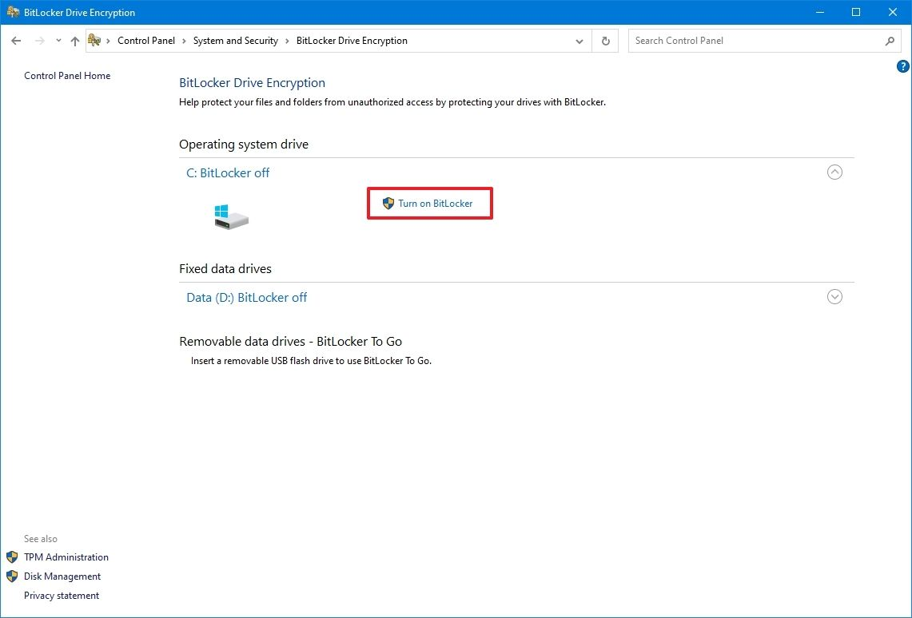


<h5>Java</h5>


<h6>Java JDK</h6>


Building the application will also require the proper version of the Java development kit to be located on the machine. 


* Navigate to [https://jdk.java.net/archive/](https://jdk.java.net/archive/#:~:text=17.0.2%20(build%2017.0.2%2B8)). 
* Download the .zip for the Windows x64 version of OpenJDK 17.0.2 (build 17.0.2+8). 
    * The SHA256 for the build 17.0.2+8 Windows x64 zip is `b2208206bda47f2e0c971a39e057a5ec32c40b503d71e486790cb728d926b615 `
    * The .zip file when downloaded is named `openjdf-17.0.2_windows-x64_bin.zip `
* Extract the `openjdf-17.0.2_windows-x64_bin.zip`. When unzipped, the folder it creates will be named `jdk-17.0.2`. Note the location of this folder for the next step


<p id="gdcalert6" ><span style="color: red; font-weight: bold">>>>>>  gd2md-html alert: inline image link here (to images/image4.png). Store image on your image server and adjust path/filename/extension if necessary. </span><br>(<a href="#">Back to top</a>)(<a href="#gdcalert7">Next alert</a>)<br><span style="color: red; font-weight: bold">>>>>> </span></p>


(Note that you must use this exact version of the JDK. If you obtain the JDK from a different location, even if the version and build numbers are the same, it may have subtle differences that will prevent your build from matching ours via the process we’ve developed. Specifically, we’ve determined that the Oracle-licensed build of OpenJDK is not identical to the London Jamocha Community CIC-licensed build.)

<h6>Set JAVA_HOME variable</h6>


Use the following instructions to set your JAVA_HOME variable, a requirement for building the source code


* Go to Start Menu and search for “Advanced System Settings”
* Click ‘View Advanced System Settings’
* Go to the Advanced Tab and click ‘Environment Variables’ button \


<p id="gdcalert7" ><span style="color: red; font-weight: bold">>>>>>  gd2md-html alert: inline image link here (to images/image5.png). Store image on your image server and adjust path/filename/extension if necessary. </span><br>(<a href="#">Back to top</a>)(<a href="#gdcalert8">Next alert</a>)<br><span style="color: red; font-weight: bold">>>>>> </span></p>


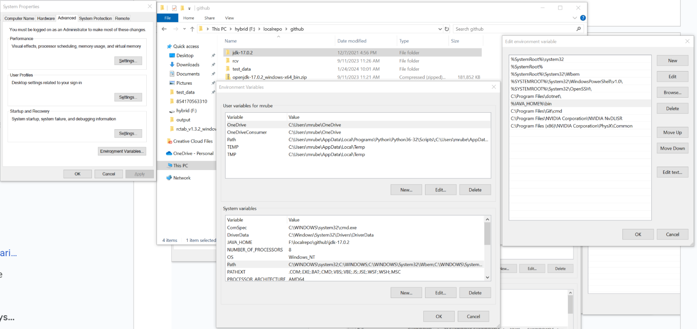

* In the Environment Variables window that pops up, in the bottom **System variables** section click ‘New’ and add `JAVA_HOME` as the Variable name and click ‘Browse Directory’ to browse to your **unzipped** java folder `jdk-17.0.2` and set it’s path as the Variable value \


<p id="gdcalert8" ><span style="color: red; font-weight: bold">>>>>>  gd2md-html alert: inline image link here (to images/image6.png). Store image on your image server and adjust path/filename/extension if necessary. </span><br>(<a href="#">Back to top</a>)(<a href="#gdcalert9">Next alert</a>)<br><span style="color: red; font-weight: bold">>>>>> </span></p>


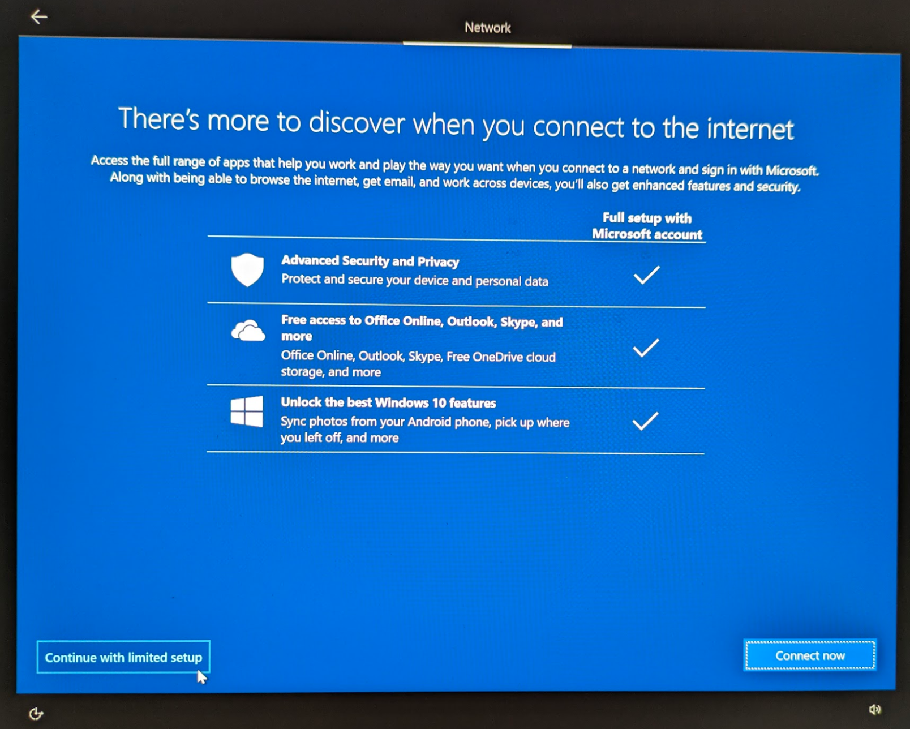

* Go back to the Environment Variables window, find the `Path` entry in the bottom System Variables section and click edit
* Click ‘New’ and add `%JAVA_HOME%\bin`
* Click ‘Ok’
* Click ‘Ok’ in Environment Variables window
* Click ‘Ok’ in System Properties window
* Close any Command Prompt Windows you have open
* Re-open Command Prompt and confirm that Java 17.0.2 is properly installed by running this command in the cmd prompt `java –version` you should see an entry for `openjdk 17.0.2 2022-01-18`

<h5>Gradle</h5>


* Download [Gradle 7.5.1](https://gradle.org/releases/#:~:text=Release%20Notes-,v7.5.1,-Aug%2005%2C%202022) from [the Gradle release page](https://gradle.org/releases) 
* Download the ‘binary-only’ option. This should download `gradle-7.5.1-bin.zip` with a hash of `f6b8596b10cce501591e92f229816aa4046424f3b24d771751b06779d58c8ec4 `
* Extract the zip. Add the `bin` folder of the extracted zip to your System Path like you did for Java \


<p id="gdcalert9" ><span style="color: red; font-weight: bold">>>>>>  gd2md-html alert: inline image link here (to images/image7.png). Store image on your image server and adjust path/filename/extension if necessary. </span><br>(<a href="#">Back to top</a>)(<a href="#gdcalert10">Next alert</a>)<br><span style="color: red; font-weight: bold">>>>>> </span></p>


* Open Command Prompt and type `gradle -version` to confirm \


<p id="gdcalert10" ><span style="color: red; font-weight: bold">>>>>>  gd2md-html alert: inline image link here (to images/image8.png). Store image on your image server and adjust path/filename/extension if necessary. </span><br>(<a href="#">Back to top</a>)(<a href="#gdcalert11">Next alert</a>)<br><span style="color: red; font-weight: bold">>>>>> </span></p>


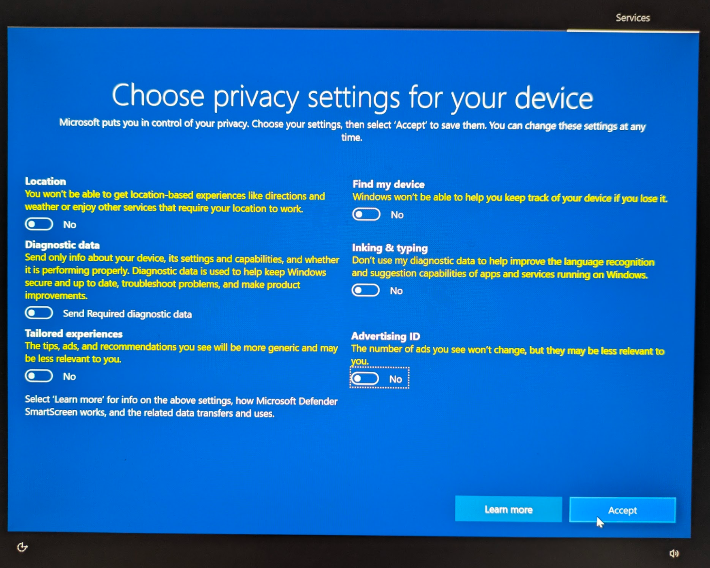

* Type `gradle -stop` in Command Prompt.

<h5>Third Party Dependencies</h5>


The final step before building requires you to have the third party dependencies that RCTab relies on. 


* Download the .zip of all necessary dependencies. The zip of all necessary dependencies for the  [v1.3.2 California release](https://github.com/BrightSpots/rcv/releases/tag/v1.3.2) is called `v1.3.2_84df706_Windows_X64.cache.zip` and can be downloaded from the release page under ‘Assets’ \


<p id="gdcalert11" ><span style="color: red; font-weight: bold">>>>>>  gd2md-html alert: inline image link here (to images/image9.png). Store image on your image server and adjust path/filename/extension if necessary. </span><br>(<a href="#">Back to top</a>)(<a href="#gdcalert12">Next alert</a>)<br><span style="color: red; font-weight: bold">>>>>> </span></p>


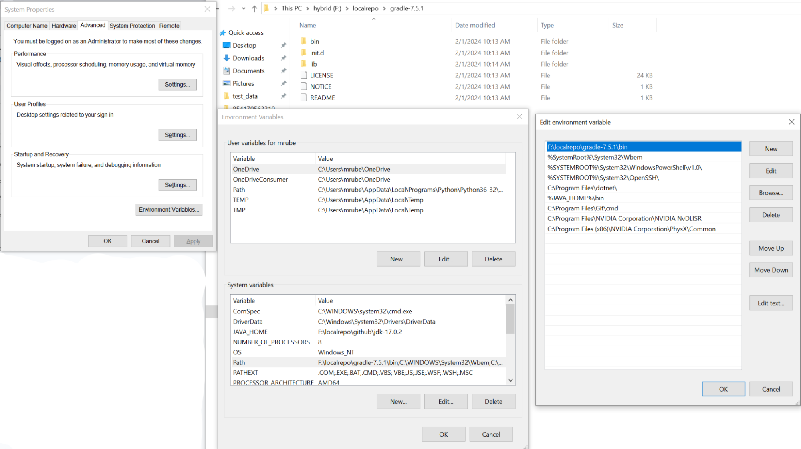

* Extracting the .zip should create a `modules-2` folder. Move that folder to `~\.gradle\caches\` If that folder doesn’t exist you should create it. `~\` in this step represents the logged-in Windows User folder. For example, if my Windows Username is `RCTabUser` then at the end of this step I would have `C:\users\RCTabUser\.gradle\caches\modules-2` 
    * You can check which folder to substitute `~\` for by typing `echo %userprofile%` into Command Prompt
* If required, use jurisdiction rules to verify dependencies with `~\.gradle\caches\checksums.csv`. This file contains a line for each necessary dependency that has
    * Filename
    * SHA-1 Checksum
    * SHA-256 Checksum
    * Maven Dependency URL
    * Direct URL to SHA-1
    * Direct URL to SHA-256

<h4>Building From Source</h4>


Next, navigate into the source code directory in Command Prompt. We will run a command that will build the RCTab source code along with all of the third party dependencies (which are listed in **RCTab v1.3.2 Section 02 - Software Design and Specifications v.1.4.4 **). This command will build RCTab from source using Java 17.0.2 and Gradle 7.5.1

In Command Prompt, type the Gradle build command for Windows


```
gradle jlinkZip
```


The output of the Gradle build command is a single ZIP file called `rcv.zip` that will be located in the `.\build\` subdirectory. To complete the build process, rename the ZIP file to reflect the platform and version of the application.

On Windows, building version 1.3.2 for example


```
rename build\rcv.zip rctab_v1.3.2_windows.zip
```


To generate a hash signature for the completed build, run this command on Windows:


```
C:\Windows\System32\certutil.exe -hashfile build\rctab_v1.3.2_windows.zip sha512
```


Example output on Windows:


```
SHA512 hash of build\rctab_v1.3.2_windows.zip:
f1b05aa5cdff8c01ee220579d5b5310911a75d0e58bc5568113b893845a31c47abab8a0875bda78f29a89e8218d22af00ea770c83ff39eb5b68b41ddfb8254ee
CertUtil: -hashfile command completed successfully.
```


Note, however, that two independent runs of the jlinkZip task will result in ZIP files with different hashes! Although the file contents in the two ZIP files will be identical, the timestamps of those files will not be. Those timestamps are included in the hash and thus, the hashes will not match. As a result, generating a hash for the ZIP file itself is only suitable for verifying that **this build has not been modified.**

To confirm that the file _contents_ of one build match those of another, for example that the local build matches the [official release on the BrightSpots github](https://github.com/BrightSpots/rcv/releases), see ‘Comparing Two Builds’ below.

<h3>Comparing two builds</h3>


As noted above, two independent builds of the same source code will have different hashes due to the presence of file timestamps within the ZIP file. It is, however, possible to demonstrate that two builds are equivalent by stripping the timestamps.

The process for generating a single timestamp-independent hash signature for a build ZIP requires a few steps: not only does the ZIP file store timestamps for the files it contains, but one of the files within the ZIP file, lib/modules, is, in turn, a collection of time stamped files. Fully decomposing the build to its individual constituent files thus requires using the jimage utility (part of the Java 17 development kit) to extract the files contained within lib/modules.


* First, unzip the ZIP you built locally (by following the precise instructions in the “Full build” section above). For the rest of this example we’ll assume that you extracted the zip files to `c:\rctab_v1.3.2_windows\` 
* ****Make sure not to execute any other commands that create, modify, or delete files within this directory (like opening the application). Any modifications to these files will change the result of the hashing process.**
* Create a `hash.bat` file in the `c:\rctab_v1.3.2_windows\` folder with the following command `echo.>hash.bat`
* Open hash.bat in notepad and paste in the text below these bullets (starting with ::hash.bat)
* Run the batch file in the cmd prompt by typing `hash.bat` then enter. ****It can take 30-45 minutes to complete as it is computing a hash for every single file **


<p id="gdcalert12" ><span style="color: red; font-weight: bold">>>>>>  gd2md-html alert: Definition &darr;&darr; outside of definition list. Missing preceding term(s)? </span><br>(<a href="#">Back to top</a>)(<a href="#gdcalert13">Next alert</a>)<br><span style="color: red; font-weight: bold">>>>>> </span></p>


_:: hash.bat_

_@echo off_


<p id="gdcalert13" ><span style="color: red; font-weight: bold">>>>>>  gd2md-html alert: Definition &darr;&darr; outside of definition list. Missing preceding term(s)? </span><br>(<a href="#">Back to top</a>)(<a href="#gdcalert14">Next alert</a>)<br><span style="color: red; font-weight: bold">>>>>> </span></p>


_:: NOTE: This script must be placed one level up from the rcv directory_

_echo Initiating batch hash procedure_

_set startTime=%date% %time%_

_echo %startTime%_

_setlocal EnableExtensions EnableDelayedExpansion_

_set "HASHFILE=all_hashes.txt"_

_set "TEMPHASHFILE=all_hashes_temp.txt"_

_set "EXTRACTIONDIR=.\rcv\modules_extracted"_

_set "MODULESFILE=.\rcv\lib\modules"_

_if exist %HASHFILE% (_

_	echo Deleting existing hash file, %HASHFILE% ..._

_    del %HASHFILE%_

_)_

_if exist %EXTRACTIONDIR% (_

_	echo Deleting existing extracted modules directory, %EXTRACTIONDIR% ..._

_    rmdir /s /q %EXTRACTIONDIR%_

_)_

_echo Extracting contents of modules file..._

_mkdir %EXTRACTIONDIR%_

_cd %EXTRACTIONDIR%_

_jimage extract ..\..\%MODULESFILE%_

_echo Temporarily relocating modules file..._

_cd ..\.._

_copy %MODULESFILE% ._

_del %MODULESFILE%_


<p id="gdcalert14" ><span style="color: red; font-weight: bold">>>>>>  gd2md-html alert: Definition &darr;&darr; outside of definition list. Missing preceding term(s)? </span><br>(<a href="#">Back to top</a>)(<a href="#gdcalert15">Next alert</a>)<br><span style="color: red; font-weight: bold">>>>>> </span></p>


_:: Calculate the hash for every file here and in all subdirectories, appending to the file (format "(filename) = (hash)")_

_echo Calculating hashes..._

_for /r .\rcv %%f in (*) do (_

_    <NUL set /p ="%%f = " >> %HASHFILE%_

_    C:\Windows\System32\certutil.exe -hashfile "%%f" SHA512 | findstr /v ":" >> %HASHFILE%_

_    echo hashing %%f_

_)_

_echo Restoring modules file..._

_move .\modules %MODULESFILE%_


<p id="gdcalert15" ><span style="color: red; font-weight: bold">>>>>>  gd2md-html alert: Definition &darr;&darr; outside of definition list. Missing preceding term(s)? </span><br>(<a href="#">Back to top</a>)(<a href="#gdcalert16">Next alert</a>)<br><span style="color: red; font-weight: bold">>>>>> </span></p>


_:: Replace the absolute paths to each file with relative paths (e.g. C:\temp\rcv => .\rcv)_

_echo Replacing absolute paths with relative paths in hash file..._

_set "SEARCHTEXT=%cd%"_

_set "REPLACETEXT=."_

_for /f "delims=" %%A in ('type "%HASHFILE%"') do (_

_    set "string=%%A"_

_    set "modified=!string:%SEARCHTEXT%=%REPLACETEXT%!"_

_    echo !modified!>>"%TEMPHASHFILE%"_

_)_

_del "%HASHFILE%"_

_rename "%TEMPHASHFILE%" "%HASHFILE%"_

_echo Sorting the hash file..._

_sort "%HASHFILE%" > "%TEMPHASHFILE%"_

_del "%HASHFILE%"_

_rename "%TEMPHASHFILE%" "%HASHFILE%"_

_echo Calculating the hash of the entire sorted hash file..._

_C:\Windows\System32\certutil.exe -hashfile %HASHFILE% SHA512_

_endlocal_

Example output (Windows):


```
SHA512 hash of all_hashes.txt:
CertUtil: -hashfile command completed successfully.


<table>
  <tr>
   <td colspan="4" >```

<strong>Document Revision History</strong>
   </td>
  </tr>
  <tr>
   <td><strong>Date</strong>
   </td>
   <td><strong>Version</strong>
   </td>
   <td><strong>Description</strong>
   </td>
   <td><strong>Author</strong>
   </td>
  </tr>
  <tr>
   <td>
   </td>
   <td>1.0.0
   </td>
   <td>
<ul>

<li>2.0 Initial 
</li>
</ul>
   </td>
   <td>Mathew Ruberg
   </td>
  </tr>
</table>


<h2>RCTab v1.3.2 Section 15 - System Change Notes v.1.3.1 </h2>


<h3>
    9.12 System Change Notes</h3>


    Manufacturers submitting modifications for a system that has been tested previously and received national certification shall submit system change notes. These will be used by the S-ATA to assist in developing and executing the test plan for the modified system. The system change notes shall include the following information:  


1. Summary description of the nature and scope of the changes, and reasons for each change  
2. A listing of the specific changes made, citing the specific system configuration items changed and providing detailed references to the documentation sections changed   
3. The specific sections of the documentation that are changed (or completely revised documents, if more suitable to address a large number of changes)  
4. Documentation of the test plan and procedures executed by the manufacturer for testing the individual changes and the system as a whole, and records of test results  

<h3>RCTab Version 1.3.2</h3>


RCTab version 1.3.1 was submitted with Hart InterCivic’s Verity Voting 3.2 to SLI  for initial testing to California Voting System Standards.  After an initial round of testing we received SLI’s report. Some of the report results identified recommendations for RCTab mostly related to access control and programmatically verifying RCTab input and output. Ranked Choice Voting Resource Center (RCVRC) submitted a new version, v1.3.2, to address each of the report results. v1.3.2 updates apply to Windows only. ***In 2.0**, Hart Cryptographic Signature verification is not enabled by default as it would only work in the state of California. 

**New Features**


* Two Windows OS accounts. One Administrator level Windows account for installation and initial configuration. A separate ‘RCTab’ Windows standard account for running the tabulation with only necessary permissions and **will not have access to make administrative changes to the machine** that could be security issues
* Read-Only RCTab output files, each with a corresponding read-only .hash file that contains the hash of file contents to ensure they haven’t been edited
* Automatic, programmatic verification of the cryptographic signature of Hart input CVRs. This verification step ensures both the integrity (CVR contents have not been edited) and provenance (CVRs came from the Hart voting system) of the Hart CVRs. RCTab will throw a halting error and tabulation will not begin if cryptographic validation of Hart’s CVR signature is not successful. 

**Hardware Setup Improvements**


* Explicit TDP directions for a secure, hardened OS install
* Password secured BIOS

**TDP Updates**


* **RCTab v1.3.2 Section 02 - Software Design and Specifications** 
    *  Includes .hash file descriptions in **Reporting Results** header, **RCTab Logging Stream 2: Contest-Specific "Audit" Logging** header, ResultsWriter Java class
    *  Removes paragraph in **RCTab Logging - Stream 2: Contest-Specific "Audit" Logging** header about config validation missing from audit log. That was fixed in 1.3.1 
    *  9.5.3.c.3 updated with link to Section 14 - Tabulator Trusted Build Instructions
    * 3rd Party Modules section updated with new version numbers and added BouncyCastle FIPS API module
    * Include new 1.3.2 Java classes: AuditableFile, SecurityConfig, SecuritySignatureValidation, SecurityXmlParsers, SecurityTests
* **RCTab v1.3.2 Section 07 - System Security Specification Requirements**
    * Add RCTab Windows standard user account, read-only outputs, .hash files for RCTab output and Hart CVR signature verification throughout CVSS security & access control requirements
        * 9.6.1.a, 9.6.1.b, 9.6.1.c, 9.6.1.d, 9.6.1.e, 9.6.1.1, 9.6.1.1.a, 9.6.2
    * 9.6.1.b updated to include Windows OS Account and BIOS Password access control mechanisms
    * 9.6.1.2 updated to include full description of two tier Windows OS accounts for access control
    * 9.6.1.1.e updated to include explicit overview of Operating System protection abilities
    * 9.6.3.f describes in detail the signature verification interaction with Hart Verity
    * 9.6.7 Cryptography header updated with explicit cryptographic signature verification details
* **RCTab v1.3.2 Section 07I - Design and Interface Specification**
    * Includes all security enhancements for 1.3.2 and describes the threat that they protect against as well as the threats that still exist
    * Added explicit system security objectives and known vulnerabilities
* **RCTab v1.3.2 Section 07J - Security Architecture **
    * Include 1.3.2 updates in Access Control and Integrity sections
* **RCTab v1.3.2 Section 07L - Security Threat Analysis **
    * Include all 1.3.2 updates and describe the threats that they protect against
* **RCTab v1.3.2 Section 07M - Security Testing and Vulnerability Analysis**
    * Include all 1.3.2 updates to describe how initial testing report results have all been addressed
* **RCTab v1.3.2 Section 08 - System Operations Procedures**
    * Include automatic signature verification of Hart signed CVRs, .hash output files and read-only output.
    * Output Directory instructions detail explicit steps to ensure read-only permissions are set
    * Include directions to configure Verity Count to sign CVR exports
    * Remove manual hash steps in ‘Generating Results Files’ header
* **RCTab v1.3.2 Section 09 - System Maintenance Manual**
    * Includes read-only output and .hash file verification in 9.9.1.f
* **RCTab v1.3.2 Section 11 - L&A Testing**
    * Update hash verification of output with .hash files
* **RCTab v1.3.2 Section 12 - Configuration Management Plan**
    * Update RCTab Workstation model, hash value of v1.3.2, required software
* **RCTab v1.3.2 Section 13 - Quality Assurance Plan**
    * Adds security tests for v1.3.2
* **RCTab v1.3.2 Section 14 - Tabulator Trusted Build Instructions**
    * Clarify Java install check
    * Add step to confirm gradle install
    * Clarify jlinkZip should be done in the cmd prompt
    * v5 - Add steps for offline build
        * Third party dependencies cache
        * Gradle
    * v5 - Fix --branch instead of -branch in git clone command
    * v5 - Clarify git instructions to use specific version
    * v5 - Clarify instructions for JAVA_HOME variable, hash.bat
    * Added explicit instructions for setting JAVA_HOME variable
    * Updated Comparing Two Builds section to explain more clearly how we get a single hash, remove ‘Individual Files’ section
* **RCTab v1.3.2 Section 15 - System Change Notes**
    * Include code updates, TDP updates
* **RCTab v1.3.2 Section 16 - System Hardening Procedures - Windows OS**
    * Clarify and clean up Windows OS install steps
    * Remove UPS step
    * Included BIOS password, Windows OS Installation
    * Make clear the distinction between online prep and offline updates
    * Explicit steps for enabling Bitlocker device encryption 
    * Edit ‘Operating System Hardening’ header to disable screensaver and correctly disable Remote Desktop
    * Remove additional optional antivirus, Windows Update
    * Replace Excel with LibreOffice
    * Remove manual driver installation
* **RCTab v1.3.2 Section 17 - System Test and Verification Specification**
    * Adds security tests for v1.3.2
* **RCTab v1.3.2 Section 18 - User Guide**
    * Programmatic CVR signature verification in Hart CVR Files Options header and Prepping CVRs For Use header
    * Instructions for Read-Only output in Generating Results Files - Output Tab header
    * Running A Tabulation header output files updated to include .hash files
    * Remove CVR .csv from list of output files as it doesn’t apply to Hart
* **RCTab v1.3.2 Section 22 - Installation Instructions for Windows OS**
    * Include instructions for creating ‘RCTab’ Windows Standard User
    * Explicit instructions for RCTab Windows Standard user vs. Windows Administrator user
    * Include directions for enforcing read-only permissions on output folder
    * Include directions for creating desktop shortcut 
* **RCTab v.1.3.1 Section 23 - Trusted Build & Output Hash Verification - Windows OS**
    * Use .hash files for output summary file verification. Use different example path that doesn’t use user folders 
* **RCTab v1.3.2 Section 24 - Tabulator Command Line Instructions**
    * Use different example path outside of user paths
* **RCTab v1.3.2 Section 26 - RCTab CVR Files**
    * Include .sig.xml file description for required Hart CVR archive cryptographic signature
* **RCTab v1.3.2 Section 28 - Post-Election Audit & Clearing RCTab from System**
    * Include comparing the text of output file .hash files to the hash text in the audit log as another auditable check
* **RCTab v1.3.2 Section 29 - RCTab Operator Log Messages**
    * Added additional v1.3.2 Severe messages

<h3>RCTab Version v.1.3.1</h3>


    **Bug fixes:**


* Fixed XML parsing failing when running built version ([#625](https://github.com/BrightSpots/rcv/issues/625))

    **Backend updates:**

* Releases for all platforms are now automatically built by GitHub when published ([#282](https://github.com/BrightSpots/rcv/issues/282))
<h3>
    RCTab Version v.1.3.0</h3>


    **New features:**

* Added support for multi-file Dominion format ([#569](https://github.com/BrightSpots/rcv/pull/569))
* Allows batch elimination and "continue until two candidates remain" to be enabled in multi-pass IRV mode ([#611](https://github.com/BrightSpots/rcv/pull/611))
* Allows users to specify multiple CVR files at once in the GUI ([#617](https://github.com/BrightSpots/rcv/pull/617))
* Adds validation highlighting to the GUI when clicking the "add" buttons for candidates and CVRs ([#618](https://github.com/BrightSpots/rcv/pull/618))
* Changed audit logs to include validation outcome ([#616](https://github.com/BrightSpots/rcv/pull/616))

    **Bug fixes:**

* Fixed Hare Quota ([#562](https://github.com/BrightSpots/rcv/pull/562))
* Fixed build for M1 Macbooks ([#586](https://github.com/BrightSpots/rcv/pull/586))
* Fixed crashes when % was in file paths ([#601](https://github.com/BrightSpots/rcv/pull/601))
* Fixed inaccurate overvoteRule error message ([#609](https://github.com/BrightSpots/rcv/pull/609))
* Fixed bug in logic for exhaustIfMultipleContinuing overvote rule ([#610](https://github.com/BrightSpots/rcv/pull/610))
* Fixed bug where treatBlankAsUndeclaredWriteIn validation failure for certain providers wouldn't actually fail validation ([#618](https://github.com/BrightSpots/rcv/pull/618))

    **Other improvements**

* Rebranded "Universal RCV Tabulator" as "RCTab" ([#603](https://github.com/BrightSpots/rcv/pull/603))
* Updated license from AGPL to MPL 2.0 ([#604](https://github.com/BrightSpots/rcv/pull/604))
* Exits gracefully if all declared candidates fall beneath minimum vote threshold ([#608](https://github.com/BrightSpots/rcv/pull/608))
* Moved validation of provided overvote delimiter and overvote label into performBasicCvrSourceValidation so user is alerted when clicking the "add" button in the CVR tab ([#618](https://github.com/BrightSpots/rcv/pull/618))
* Updated documentation and help text ([#547](https://github.com/BrightSpots/rcv/pull/547), [#614](https://github.com/BrightSpots/rcv/pull/614), [#617](https://github.com/BrightSpots/rcv/pull/617))

    **Backend updates:**

* Enabled CI, which runs tests, Checkstyle, and Spotbugs ([#576](https://github.com/BrightSpots/rcv/pull/576))
* Addressed all outstanding Checkstyle and Spotbugs warnings ([#587](https://github.com/BrightSpots/rcv/pull/587))
* Internal clean-up to conform to VVSG coding requirements ([#600](https://github.com/BrightSpots/rcv/pull/600), [#602](https://github.com/BrightSpots/rcv/pull/602), [#606](https://github.com/BrightSpots/rcv/pull/606))
* Changed ContestConfig.validate() and associated methods to return a set of validation errors instead of an isValid boolean ([#618](https://github.com/BrightSpots/rcv/pull/618))
* checkstyle-suppressions.xml location is now handled in build.gradle to avoid needing to manually modify google_checks.xml in the future ([#544](https://github.com/BrightSpots/rcv/pull/544))
* Updated dependencies to latest versions:
    * JDK 17.0.2
    * JavaFX 18
    * Gradle 7.5.1
    * Checkstyle google_checks.xml 10.3.2
    * Checkstyle plugin 10.3.2
    * spotbugs 4.7.1
    * spotbugs-gradle-plugin 5.0.9
    * org.openjfx.javafxplugin 0.0.11
    * org.beryx.jlink 2.25.0
    * com.fasterxml.jackson.core:jackson-* 2.13.3
    * org.junit.jupiter.junit-jupiter-* 5.9.0
    * org.apache.commons:commons-csv 1.9.0
    * org.apache.poi:poi-ooxml 5.2.2
<h3>
    Universal RCV Tabulator (RCTab) Version v.1.2.0 </h3>


    **Certification: **


    Based on the testing performed by Pro V&V, a certified Voting System Testing Laboratory, and  the results obtained, the modified RCV-Tabulator v.1.2.0 solution identified in this test report  meets the requirements set forth by the VVSG 1.0. 


    **New features: **


    • Added support for new manufacturer formats: 


        o Clear Ballot (<span style="text-decoration:underline;">#400</span>) 


        o Dominion (<span style="text-decoration:underline;">#119</span>, <span style="text-decoration:underline;">#438</span>, <span style="text-decoration:underline;">#533</span>) 


        o Hart (<span style="text-decoration:underline;">#401</span>, <span style="text-decoration:underline;">#457</span>, <span style="text-decoration:underline;">#460</span>) 


        o Unisyn (<span style="text-decoration:underline;">#402</span>) 


        • Redesigned GUI to be more user-friendly (<span style="text-decoration:underline;">#461</span>, <span style="text-decoration:underline;">#123</span>, <span style="text-decoration:underline;">#128</span>, <span style="text-decoration:underline;">#152</span>) (see "GUI redesign"  section below for more details) 


    • Added support for "Overvote Delimiter" field (<span style="text-decoration:underline;">#482</span>) 


    • "Minimum Vote Threshold" field is now optional (<span style="text-decoration:underline;">#483</span>) 


        • "Undeclared Write-In Label", "Overvote Label", "Undervote Label", and "Treat Blank as  Undeclared Write-in" fields are now defined on a per-CVR level (<span style="text-decoration:underline;">#508</span>) 


    **GUI redesign: **


    • Added hint panels for each tab (<span style="text-decoration:underline;">#499</span>) 


    • Added help menu option for the config documentation (<span style="text-decoration:underline;">#497</span>, <span style="text-decoration:underline;">#528</span>) 


    • Changed "Continue until Two Candidates Remain" to a boolean config setting (<span style="text-decoration:underline;">#481</span>) 


    • Combo text box / check box input for "How Many Consecutive Skipped Ranks Are  Allowed" and "Maximum Number of Candidates That Can Be Ranked" (<span style="text-decoration:underline;">#498</span>) 


    • Disabled "Decimal Places for Vote Arithmetic" in non-multi-seat modes (<span style="text-decoration:underline;">#500</span>) 


    • Redesigned nonIntegerWinningThreshold and hareQuota as a three-way radio button  and added new validation rules (<span style="text-decoration:underline;">#501</span>) 


        • Disabled editing existing candidates and CVR sources after adding to prevent confusing  UX (<span style="text-decoration:underline;">#502</span>) 


        • Added support for multiple contests via implementation of "Contest ID" field  (<span style="text-decoration:underline;">#456</span>, <span style="text-decoration:underline;">#472</span>, <span style="text-decoration:underline;">#478</span>) 


    **Additional GUI changes: **


    • Split Output tab into new Contest Info and Output tabs 


<p style="text-align: right">
• Redesigned GUI CVR Files tab, adding Clear button, and changing Add button so it only </p>


        enter multiple sources that share fields clears the file path to make it easier to manually • Improved visual presentation of Candidate tab; added Clear button and adds checkBoxCandidateExcluded when adding a candidate 


    • Reorganized presentation of rules in "Winning Rules" and "Voter Error Rules" tabs 


    • Winner Election Mode and Tiebreak Mode now start undefined with all relevant fields  disabled; choosing specific modes enables applicable fields 


        • Changed Winner Election Modes and Tiebreak Modes to be more user-friendly,  including necessary migration logic to update older config files 


    • Expanded footprint of GUI window to 1200x1000 


    • Implemented bordered boxes 


    • Converted overvoteRule from a ChoiceBox to an array of RadioButtons;  changed overvoteRule string display in config files and adds migration logic 


    • Disabled decimalPlacesForVoteArithmetic and nonIntegerWinningThreshold except  when winnerElectionMode is "Multi-winner allow only one winner per round" or "Multi winner allow multiple winners per round" (fixes <span style="text-decoration:underline;">#500</span>) 


        • Added suggested values for overvoteLabel, undervoteLabel, and ES&S column and row  indices 


    • Replaced checkBoxNonIntegerWinningThreshold and checkBoxHareQuota with a radio  button array, and added new validation rules for those settings (fixing <span style="text-decoration:underline;">#501</span>) 


    • GUI now disables numberOfWinners field and sets it to 1 only  


        when winnerElectionMode is "Single-winner majority determines winner" 


        • GUI now disables numberOfWinners field and sets it to 0 when winnerElectionMode is  "Bottoms-up using percentage threshold" 


    • Fixed bugs in validation error messages when numberOfWinners is 0 **Bug fixes: **


    • Fixes CDF JSON reading and writing (<span style="text-decoration:underline;">#505</span>) 


    • Fixed being unable to tabulate multiple CDF sources (<span style="text-decoration:underline;">#536</span>) 


    • Fixed user and computer name logging (<span style="text-decoration:underline;">#521</span>) 


    • Fixed config referencing nonexistent CDF source leading to uncaught exception (<span style="text-decoration:underline;">#347</span>) • Fixed incorrect overvote label in CDF leading to NPE (<span style="text-decoration:underline;">#453</span>) 


    • Fixed config file with bad provider value failing with NPE (<span style="text-decoration:underline;">#531</span>) 


    **Other improvements: **


        • Removed "Convert Dominion to Generic Format..." functionality since direct Dominion  tabulation is now possible (<span style="text-decoration:underline;">#476</span>) 


        • Registers explicit overvote as valid candidate / contest selection in CDF output when  needed (<span style="text-decoration:underline;">#451</span>) 


    • Handles bad path to CDF CVR source gracefully (<span style="text-decoration:underline;">#452</span>) 


    • Handles empty rows at end of CVR (<span style="text-decoration:underline;">#455</span>) 


    • Made sure all providers work with the CLI (<span style="text-decoration:underline;">#471</span>) 


        • Raises error if we encounter an unrecognized candidate while loading Dominion CVRs  during direct tabulation (<span style="text-decoration:underline;">#473</span>) 


    • Reports error if config specifies any column indexes for a CDF source (<span style="text-decoration:underline;">#276</span>) **Backend updates: **


    • Created separate MigrationHelper class (<span style="text-decoration:underline;">#507</span>) 


    • Addressed warnings during Gradle build (<span style="text-decoration:underline;">#280</span>) 


    • Upgrading to a more recent version of Gradle no longer causes test failures (<span style="text-decoration:underline;">#283</span>) • Addressed all relevant Checkstyle warnings and disabled all invalid ones (<span style="text-decoration:underline;">#490</span>, <span style="text-decoration:underline;">#489</span>) • Enum parameters now use camel case for backend and user-friendly strings for frontend  (<span style="text-decoration:underline;">#494</span>)


    • Fixed noinspection unchecked for excluded CheckBox in GuiConfigController (<span style="text-decoration:underline;">#304</span>) • Now  


        use UnrecognizedCandidatesException in ClearBallotCvrReader and HartCvrReader (<span style="text-decoration:underline;">#4</span> <span style="text-decoration:underline;">91</span>) 


    • Updated dependencies to latest version: 


        o JDK 14.0.1 


        o JavaFX 14.0.1 


        o Gradle 6.5.1 


        o Checkstyle google_checks.xml 8.36.2 


        o Checkstyle plugin 8.36.2 


        o org.openjfx.javafxplugin 0.0.9 


        o org.beryx.jlink 2.20.0 


        o com.fasterxml.jackson.core:jackson-* 2.11.1 


        o org.junit.jupiter.junit-jupiter-* 5.6.2 

<h3>
    Universal RCV Tabulator (RCTab) Version v.1.1.0 </h3>


    **Certification: **


    Based on the testing performed by Pro V&V, a certified Voting System Testing Laboratory, and  the results obtained, the Universal RCV Tabulator v1.1.0 solution is believed to meet the  applicable requirements set forth by the EAC-approved VVSG 1.0. 


    **New features: **


        • Added support for converting Dominion JSON CVRs to generic .csv format (including  precinct portions) (<span style="text-decoration:underline;">#404</span>, <span style="text-decoration:underline;">#406</span>, <span style="text-decoration:underline;">#407</span>, <span style="text-decoration:underline;">#408</span>, <span style="text-decoration:underline;">#415</span>, <span style="text-decoration:underline;">#439</span>) 


    • Added multiSeatBottomsUpPercentageThreshold option (<span style="text-decoration:underline;">#403</span>) 


    • Added CLI option to convert Dominion CVR to generic .csv (<span style="text-decoration:underline;">#408</span>) 


        • New GUI menu and conversion options (can now convert to CDF and convert Dominion  to generic via the GUI) (<span style="text-decoration:underline;">#408</span>, <span style="text-decoration:underline;">#421</span>) 


    • Added Dominion Alaska CVR to sample_input folder 


    **Bug fixes: **


    • Batch elimination now works properly with  


        singleSeatContinueUntilTwoCandidatesRemain (<span style="text-decoration:underline;">#396</span>) 


        • In a multi-seat contest, if someone wins in the first round, we now automatically  eliminate undeclared write-ins before we eliminate any other candidates; previously, we  treated UWIs like a normal candidate, which meant we potentially eliminated other  candidates with lower tallies first (<span style="text-decoration:underline;">#397</span>) 


        • If UWI exceeds the winning threshold in the initial count, we no longer mistakenly elect  this candidate (<span style="text-decoration:underline;">#398</span>) 


    **Backend updates: **


        • Updated dependencies to latest version: JDK, JavaFX, Checkstyle google_checks.xml,  Checkstyle plugin, org.openjfx.javafxplugin, org.beryx.jlink,  


        org.apache.commons:commons-csv, org.apache.poi:poi-ooxml,  


        com.fasterxml.jackson.core:jackson-* 


        • Added special code to test configs to obviate the need to update the version with each  increment (<span style="text-decoration:underline;">#426</span>) 


    • Updated tests and improved test coverage 


    • Copyright update (<span style="text-decoration:underline;">#414</span>) 


    • Code cleanup

<h3>
    Universal RCV Tabulator (RCTab) Version v.1.0.1 </h3>


    Based on the testing performed by Pro V&V, a certified Voting System Testing Laboratory, and  the results obtained, the Universal RCV Tabulator solution meets the requirements set forth by  the EAC-approved VVSG 1.0 to be used with the ES&S EVS 5.0.0.0 through 6.0.4.0 software. Changelog: 


    • Added Checkstyle plugin to Gradle and set it up for Google format 


    • Minor refactoring to address Checkstyle issues 

<p style="text-align: right">
<strong>Document Revision History</strong></p>


<table>
  <tr>
   <td><strong>Date </strong>
   </td>
   <td><strong>Version </strong>
   </td>
   <td><strong>Description </strong>
   </td>
   <td><strong>Author</strong>
   </td>
  </tr>
  <tr>
   <td>
   </td>
   <td>1.0.0
   </td>
   <td>2.0 Initial 
   </td>
   <td>Mathew Ruberg
   </td>
  </tr>
</table>


<h2></h2>


    The hardware used to house RCTab software should, at minimum, follow the steps below to ensure the hardware is adequately protected against unauthorized access, theft of data, and/or malicious attacks.


    Hardening of the operating system (i.e. Windows) is a way to make the computer and data more secure. It may include removing unused applications and files, establishing password login protection on Windows OS, disabling automatic windows login, and proper configuration of the system among other things. No unauthorized software should be installed on the computer unless authorized by your jurisdiction. All RCTab systems must include only the following software:


* Windows 10 Pro (or newer) 
* RCTab v1.3.2
* LibreOffice 7.5.7 - For viewing formatted cvr output
* XML Viewer - For viewing CVR information
* Users must also retain access to:

	○	Command Prompt

	○	Notepad


* UPS

    See below for procedures for securing verified versions of COTS software listed above.


    Note: that none of the steps below requires the presence of any special environment variables.


    In addition to the system hardening protocols, it is recommended that only authorized users (no less than two employees) should have physical access to the standalone computer.


    The computer should be in a secure location.

<h3>
Required Items for System Setup & Hardening</h3>


Jurisdictions should have the following artifacts for System Setup & Hardening


* HP Z4 G4 workstation
* USB 1 - contains HpSetup.txt file for Bios Password setup
* USB 2 - contains bootable Windows 10 image

Note: Jurisdiction should follow secure password practices and provide access to the least amount of users necessary for the BIOS password and Windows OS Admin password created in the following steps. These passwords shall be used for installation and initial configuration. Users running the tabulation shall not have access to these passwords.

<h3>
Bios Password</h3>


The following steps will set a BIOS password and relevant boot security settings to harden the computer. 


1. Power on the workstation.
2. Press F10 repeatedly until the BIOS menu appears.
3. Create a Workstation BIOS password for the workstation.
4. Navigating to ‘Security’ → ‘Create a BIOS Administrator Password’: Enter a Workstation BIOS password (at least 8 characters. Uppercase, Lowercase, 0-9, and symbol characters are all acceptable)
    1. Enter the password and press Enter.
    2. Enter the password again (to verify), and press Enter.
    3. **Please Note: There is no recovery to reset and re-enter the BIOS if the BIOS password is forgotten or lost.**
5. Insert a USB Stick with the Replicated Setup HpSetup.txt file.
6. Go to ‘Main’ → ‘Replicated Setup.’
7. Click ‘Restore current settings from USB device.’
8. Click ‘Browse for Configuration File’ and navigate to the HpSetup.txt on the USB 1 stick.
9. A prompt will appear that says ‘Number of settings successfully restored (239). Number of settings that were invalid (0).’ Hit ‘OK.’
10. Press F10 to save changes and exit.
11. The system will reboot multiple times. Confirm the settings change when prompted during the reboot processes.

<h3>Windows OS Install</h3>


First, enable USB boot.


1. Turn on the workstation.
2. Press F10 repeatedly until the BIOS menu appears.
3. Enter the Workstation BIOS Password.
4. Navigate to ‘Advanced > Boot Options.’
5. Check the box to enable ‘USB Storage Boot.’
6. Press F10 and follow the prompts to save changes and exit.
7. Following OS deployment, follow the same process to disable USB Storage Boot.

Then, using USB 2 with the Windows 10 image install the Windows OS


1. Insert USB and restart the computer. When it restarts you should see a Windows OS installation screen. Follow the instructions. 
    1. On the "Let's connect you to a network" screen select 'I don't have internet' button in bottom left then 'Continue with limited setup' \


<p id="gdcalert16" ><span style="color: red; font-weight: bold">>>>>>  gd2md-html alert: inline image link here (to images/image10.png). Store image on your image server and adjust path/filename/extension if necessary. </span><br>(<a href="#">Back to top</a>)(<a href="#gdcalert17">Next alert</a>)<br><span style="color: red; font-weight: bold">>>>>> </span></p>


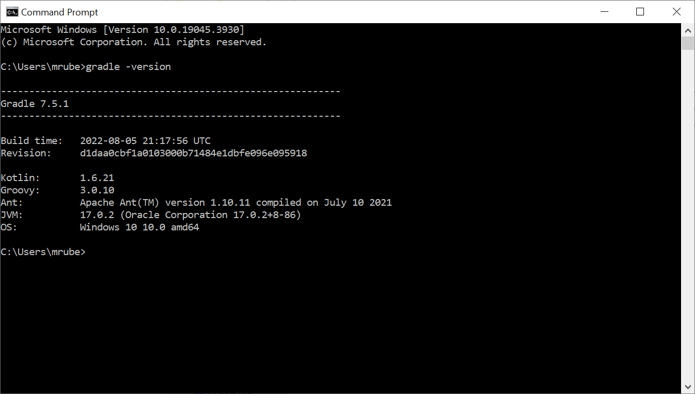
 \


<p id="gdcalert17" ><span style="color: red; font-weight: bold">>>>>>  gd2md-html alert: inline image link here (to images/image11.png). Store image on your image server and adjust path/filename/extension if necessary. </span><br>(<a href="#">Back to top</a>)(<a href="#gdcalert18">Next alert</a>)<br><span style="color: red; font-weight: bold">>>>>> </span></p>


    2. 
    3. When it asks Who’s going to use this PC? this will be the Windows Administrator Account. After providing an account name it will ask for a password. \


<p id="gdcalert18" ><span style="color: red; font-weight: bold">>>>>>  gd2md-html alert: inline image link here (to images/image12.png). Store image on your image server and adjust path/filename/extension if necessary. </span><br>(<a href="#">Back to top</a>)(<a href="#gdcalert19">Next alert</a>)<br><span style="color: red; font-weight: bold">>>>>> </span></p>


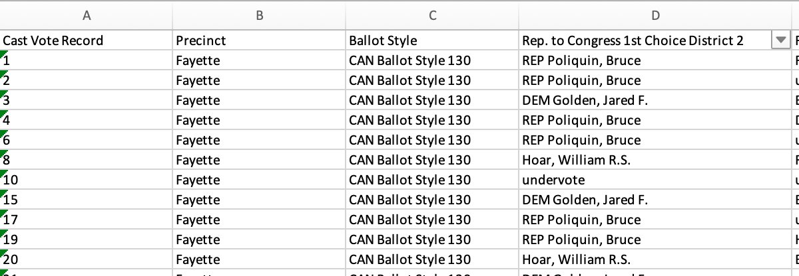
 \


<p id="gdcalert19" ><span style="color: red; font-weight: bold">>>>>>  gd2md-html alert: inline image link here (to images/image13.png). Store image on your image server and adjust path/filename/extension if necessary. </span><br>(<a href="#">Back to top</a>)(<a href="#gdcalert20">Next alert</a>)<br><span style="color: red; font-weight: bold">>>>>> </span></p>


    4. When asked, select the following settings to disable all Windows telemetry \


<p id="gdcalert20" ><span style="color: red; font-weight: bold">>>>>>  gd2md-html alert: inline image link here (to images/image14.png). Store image on your image server and adjust path/filename/extension if necessary. </span><br>(<a href="#">Back to top</a>)(<a href="#gdcalert21">Next alert</a>)<br><span style="color: red; font-weight: bold">>>>>> </span></p>


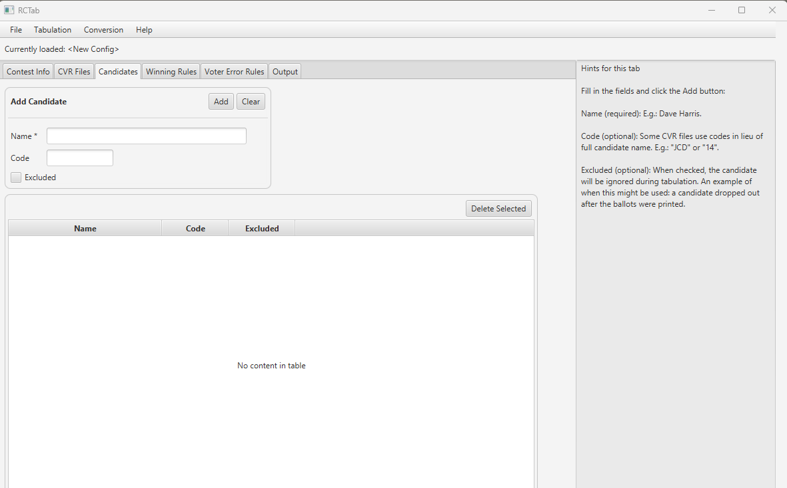


Then, disable USB boot.


1. Restart the workstation.
2. Press F10 repeatedly until the BIOS menu appears.
3. Enter the Workstation BIOS Password.
4. Navigate to ‘Advanced > Boot Options.’
5. Check the box to disable ‘USB Storage Boot.’
6. Press F10 and follow the prompts to save changes and exit.

<h3>Step 1: Prepare Updates on Internet Connected Computer</h3>


    RCTab should run on a airgapped workstation that is in a closed environment (not on a network) without access to the internet.  Hardware drivers, updates, and virus protection should be downloaded on another computer and transferred to the workstation by a removable device such as a USB flash drive.  Prepare for offline updates by downloading the following to the USB drive designated for use for this purpose:  Hardware Drivers, Windows Updates, Windows Defender Offline Updates.

<h4>
Preparing Windows Defender Offline Updates</h4>


* Navigate to the following website: [www.microsoft.com/en-us/wdsi/definitions](http://www.microsoft.com/en-us/wdsi/definitions)
* Go to the ‘Manually Download the Update’ section. Download the update for your OS. 
* Transfer the downloaded file to a USB drive and keep for later installation. As a note, all USB drives used for these purposes should be kept in a safe place in manufacturer recommended conditions.
<h4>
    Prepare LibreOffice Offline Installer</h4>


Download LibreOffice 7.6.4 installer `LibreOffice_7.6.4_Win_x86-64.msi` [here](https://www.libreoffice.org/download/download-libreoffice/?type=win-x86_64&version=7.6.4&lang=en-US). SHA256: 65678ac729cd0b545d14703879b601872d285c2934ae8d76452f7c2fb2c62d15

<h4>Prepare XML Notepad Installer</h4>


XML Notepad can be used to find the Contest ID from `.xml` CVR files. The standalone installer can be downloaded as `XmlNotepadSetup.zip` from [here](https://microsoft.github.io/XmlNotepad/#install/). SHA256: 00cdfb1888cddf5507e691d610b3959428599317db97ac3de763e0e8940aef36

<h3>
Step 2: Applying Offline Updates</h3>


    This section covers the configuration of the operating system and other software on the airgapped computer. Since the workstation is not connected to the internet, updates and security patches that were prepped in the previous step must be installed manually.


    Note:  Depending on the build of your Windows, the UI might be slightly different than described in the section below.

<h4>Install Xml Notepad</h4>


* Extract XmlNotepadSetup.zip
* Double click the XmlNotepadSetup.msi to install Xml Notepad.

<h4>Install LibreOffice</h4>


* Double click the LibreOffice_7.6.2_Win_x86-64.msi
* Run through the installer with all default settings to install LibreOffice
<h4>
    Windows Defender</h4>


* Connect the USB drive prepared in the section above.
* On a non-internet connected workstation, double click the _mpam _file to install it.  There will be no prompts or installation process.
* To verify the update was applied, open Windows Defender by searching for ‘Virus and Threat Protection’ in Windows Search, locate _Virus and threat protection updates _section.  It will say _Up to date _if installation was successful.
<h4>
Device Encryption</h4>


Use the following steps to encrypt the hard drive with Windows Bitlocker

1. Open Start.
2. Search for Control Panel and click the top result to open the app.
3. Click on System and Security.
4. Click on "BitLocker Drive Encryption."


<p id="gdcalert21" ><span style="color: red; font-weight: bold">>>>>>  gd2md-html alert: inline image link here (to images/image15.png). Store image on your image server and adjust path/filename/extension if necessary. </span><br>(<a href="#">Back to top</a>)(<a href="#gdcalert22">Next alert</a>)<br><span style="color: red; font-weight: bold">>>>>> </span></p>


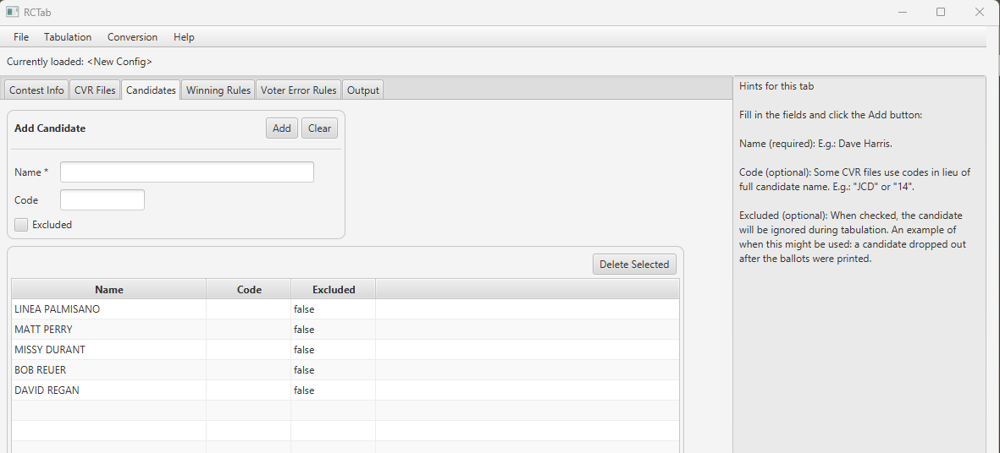


1. Under the "Operating system drive" section, click the "Turn on BitLocker" option.


<p id="gdcalert22" ><span style="color: red; font-weight: bold">>>>>>  gd2md-html alert: inline image link here (to images/image16.png). Store image on your image server and adjust path/filename/extension if necessary. </span><br>(<a href="#">Back to top</a>)(<a href="#gdcalert23">Next alert</a>)<br><span style="color: red; font-weight: bold">>>>>> </span></p>


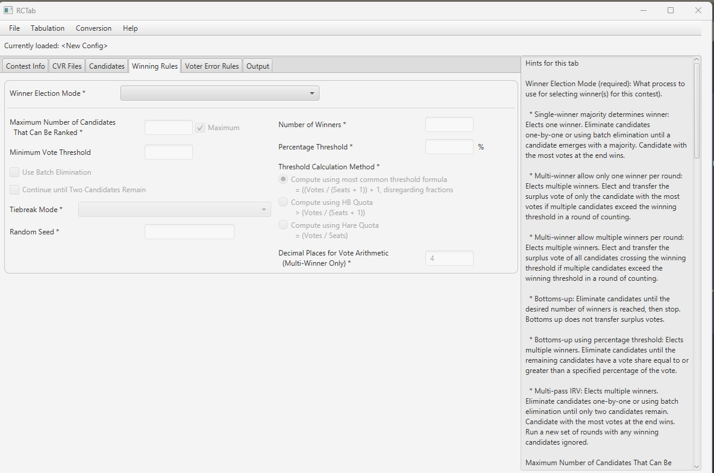


1. Select the option to save the recovery key. 
1. Click the Next button.
1. Select how much the drive space to encrypt:
* Encrypt the entire drive (slower but best for PCs and drives already in use).
1. Choose between the two encryption options:
* New encryption mode (best for fixed drives on this device).


<p id="gdcalert23" ><span style="color: red; font-weight: bold">>>>>>  gd2md-html alert: inline image link here (to images/image17.png). Store image on your image server and adjust path/filename/extension if necessary. </span><br>(<a href="#">Back to top</a>)(<a href="#gdcalert24">Next alert</a>)<br><span style="color: red; font-weight: bold">>>>>> </span></p>


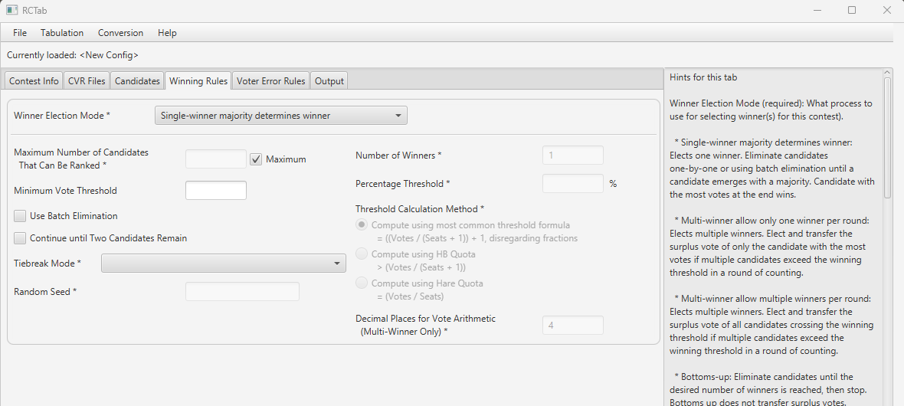


1. Click the Next button.
2. Check the "Run BitLocker system check" option.


<p id="gdcalert24" ><span style="color: red; font-weight: bold">>>>>>  gd2md-html alert: inline image link here (to images/image18.png). Store image on your image server and adjust path/filename/extension if necessary. </span><br>(<a href="#">Back to top</a>)(<a href="#gdcalert25">Next alert</a>)<br><span style="color: red; font-weight: bold">>>>>> </span></p>


1. Click the Continue button.
2. Click the Restart now button.
<h4>
Physical Security</h4>


    Users must physically seal all external ports on hardware where RCTab is installed, except ports used for power supply, necessary external displays, and one (1) USB port. The user jurisdiction should employ a policy where the use of tamper evident and tamper resistant seals are used to identify ports that should never be accessed, unlikely to be accessed, and can be accessed if necessary.

<h4>
Operating System Hardening</h4>


    Operating system hardening can reduce the risk of a security breach by removing or disabling many non-essential software and hardware components that could act as a back door for attackers.  Manufacturer highly recommends the following hardening procedures to protect your standalone computer.


**_NOTE: Before hardening, make sure all system and third-party components are installed and configured.  After security settings are applied, some earlier steps may be impossible to perform due to the hardened state of the Operating System.  Once applied, security settings cannot be undone._**

<h5>
Disable Network Connection From Network Connection Settings</h5>


1. Press Win+R and enter _ncpa.cpl _to open the Network Connection window.
2. For each network connection right click on it: 4) Select disable.
<h5>
Disable Screen Saver</h5>


This will ensure that users will always have to log in with their passwords.


1. Open the Control Panel.
2. Search ‘Screen Saver’ and select ‘Change Screen Saver’
3. In the ‘Screen Saver’ dropdown select ‘None’
<h5>
Disable Remote Access</h5>


1. Type _remote desktop settings _into the Windows search box.
2. Select _Remote Desktop Settings _to access the ‘Remote Desktop’ settings
3. Ensure ‘Enable Remote Desktop’ setting is set to **off**
<h5>
Enable Firewall</h5>


1. Open the Control Panel in Windows.
2. Click on System and Security.
3. Click on Windows Firewall.
4. In the left navigation pane click _Turn Windows Firewall On_.
<h5>
Disable all network interfaces</h5>


1. Enter cmd in the windows search bar.
2. _Command Prompt _application shows up in search results.
3. Right-click on the _Command Prompt_.
4. Select _Run as administrator_.
5. Type `C:\Windows\System32\netsh.exe interface show interface` and press Enter.
6. For each network device listed enter the following command, replacing "Interface Name" with each of the names returned from step 5 (include the double-quotes):

```
C:\Windows\System32\netsh.exe interface set interface "Interface Name" disable
```


<h5>
Global Disclaimer for non-RCTab software processes and procedures</h5>


    Always refer to the manufacturer's current documentation and recommendations for the latest and most secure manner to download, store, and verify the installation of software dependencies.  If questions or issues arise, consult with an information technology security professional for additional information and assistance.


    **Document Revision History**


<table>
  <tr>
   <td>
<strong>Date</strong>
   </td>
   <td>
    <strong>Version</strong>
   </td>
   <td><strong>Description</strong>
   </td>
   <td>
    <strong>Author</strong>
   </td>
  </tr>
  <tr>
   <td>
   </td>
   <td>1.0.0
   </td>
   <td>2.0 Initial 
   </td>
   <td>Mathew Ruberg
   </td>
  </tr>
</table>


<h2></h2>


<h3>9.7 System Test and Verification Specification  </h3>


The manufacturer shall provide test and verification specifications for: Development test specifications. 

<h4>9.7.1 Development Test Specifications  </h4>


a. The manufacturer shall describe the plans, procedures, and data used during software development and system integration to verify system logic correctness, data quality, and security.  

b. This description shall include: Test identification and design, including:  

i. Test structure 

ii. Test sequence or progression; and  

iii. Test conditions

<h5>Test Structure</h5>


Included below is the basic template used to define every setting for each test set used to test RCTab. This form is filled out with the settings for the relevant test. Testers can compare the information in this form to the information in the configuration file loaded from the relevant folder in test_data to ensure that all settings are correct. Each setting selected in this form has been tested. RCTab has not yet created a Test Structure Form for every RCTab test but will set up a form for all RCTab regression tests based on this form. Questions about this form can be made to the Ranked Choice Voting Resource Center at info@rcvresources.org or by calling 1-833-868-3728. We also have included an example Test Structure Form filled out according to the requirements of the Portland 2015 Mayor test.

<h5>Regression Test Overview</h5>


We have developed a suite of  Tabulation Regression Tests and continue to add more tests as new features and bug fixes are added. These are designed to verify that various aspects of Tabulator functionality behave as expected. They also verify that new code changes do not inadvertently alter Tabulator behavior. The entire test suite must be run, and all tests must pass before any new code changes can be merged into the main Tabulator repository.

<h5>Design Overview</h5>


Each test contains a set of normal tabulation inputs (config file and cvr files) and a known valid "expected" results summary file. The test runs a tabulation with new code, and compares the results of that tabulation to previous, expected, correct results. In essence, we isolate and analyze the effects any new code changes may have on the tabulation output. This is a classic regression test design. 

<h5>Test Execution Details</h5>


  

The test suite will run through all tests automatically as follows:  


1. Tabulator is built from source code.
2. For each test:
    1. Run a tabulation using the test config file and cvr files.
    2. Compare tabulation output summary file to reference expected summary file.
    3. If the files match exactly (except for timestamps) the test passes.
    4. If the files do not match the test fails.
    5. Test execution and test results are written to a log file and console.

<h5>Test Conditions</h5>


Test conditions require the following files for input for each test case:  Configuration file (JSON), Cast Vote Record (typically CSV format). Confirm appropriate files are uploaded to proceed with appropriate testing conditions.

For more information on the development process as it relates to testing see **RCTab v1.3.2 Section 13 - Quality Assurance Plan v.1.2.2**. 

c. Standard test procedures, including any assumptions or constraints

<h5>Testing Procedures</h5>


When new code is ready for submission, a developer will follow these procedures to ensure the code is safe for incorporation:


1. Run test suite:  in a console, from the rcv root directory, enter:  _./gradlew.bat test_
2. Observe the test output. If _any_ test fails the source of the failure must be identified and either:
    1. Fixed. Usually, a test failure is caused by a bug in logic or data which can be fixed.
    2. Update the reference test asset.  Sometimes bug fixes cause tests to fail because they are now operating correctly.  In these cases, test output must be manually verified and peer-reviewed (like any code change) before it can be updated.

Example test outputs are included in: TabulatorTests_example_console_output.txt and Test_Results_TabulatorTests.html

For actual test data, including configuration files and expected results, see: [github.com/BrightSpots/rcv/tree/master/src/test/resources/network/brightspots/rcv/test_data](https://github.com/BrightSpots/rcv/tree/master/src/test/resources/network/brightspots/rcv/test_data). To download the data, go to this page: [https://github.com/BrightSpots/rcv/tree/v1.3.2](https://github.com/BrightSpots/rcv/tree/hotfix/1.3.2). This is the location on GitHub where version 1.3.2 of the RCTab source code is hosted. Click on “Code” and select “Download ZIP.” Once the ZIP is downloaded, extract it. Navigate to the unzipped folder and navigate to src/test/resources/network/brightspots/rcv/test_data. All test data files will be included in this folder.   

Users can also manually run each test. The steps required to run tests manually are as follows: 


1. Open RCTab
2. Click “File” 
3. Click “Load”
4. Navigate to the configuration file for the test you wish to run
5. Select the configuration file and load it into RCTab
6. Confirm that the configuration file properly loaded into RCTab by checking that the relevant fields are filled in
7. Click “Tabulation”
8. Click “Tabulate”
9. Wait for RCTab to finish tabulating
10. Navigate to the output location for your results
11. Compare your results .json summary file to the .json summary file included with the data. If this matches exactly, the test passes. 

<h5>Additional Testing Procedures</h5>


In addition to regression testing of all changes, new features are tested by developers and RCVRC staff to ensure that they work as expected. If any features did not work as expected, a ticket was filed on GitHub with the test data and an explanation of how the achieved results differed from the expected results. 

The RCVRC and Bright Spots also conduct scale tests of the RCTab. Tests include a contest with 100 CVR files composed of 100,000 individual cast vote records each, a contest with 1,000 CVR files composed of 1,000,000 individual cast vote records each, a contest with 6,000 CVR files composed of 6,000,000 individual cast vote records each, and a set of 11 CVRs composed of 9,200,000 individual cast vote records each. Volume tests with these records were conducted throughout March and April 2021. 

d. Special purpose test procedures including any assumptions or constraints;  

No special-purpose test procedures are followed. 

e. Test data, test data source, whether it is real or simulated, and how test data are controlled;  

<h5>Test Data</h5>


The data for 2017 Minneapolis Mayor, 2013 Minneapolis Mayor, 2013 Minneapolis Park, 2018 Maine Governor Democratic Primary are all from real-world elections and were procured directly from the websites of the jurisdictions listed in the name of the data. All other data was manufactured by Bright Spots developers, RCVRC staff, voting system vendors, or election jurisdictions. Any data with vendor names included (Unisyn, Clear Ballot, Dominion, Hart, CDF) was procured from vendors directly or from jurisdictions working with those vendors. Any data not falling in those categories was manufactured by RCTab developers according to the CVR requirements of the software to test specific functionalities of the RCTab software. 

Regression test data are controlled by hosting them on GitHub and updating tests as new features are added to RCTab. Other test data, for tests run by RCVRC staff, Bright Spots developers, or others, did not previously have clear controls on data. Data was procured from trusted sources, such as actual election jurisdictions and voting system vendors, as much as possible or generated according to the specifications of previously used CVR data from vendors. However, no formal controls were in place for test data or for tracking results. Results were communicated via the relevant issue(s) on GitHub. We are implementing formal control methods for tests and test data going forward. 

f. Expected test results;  

Expected results for regression tests are included in the test folders available in the test_data.zip that includes all test data and was submitted with documentation.  

g. Criteria for evaluating test results.  

The names of the tests are mostly self-explanatory. For example, _test_set_1_exhaust_at_overvote_ tests whether the tabulator correctly interprets the overvoteRule = "exhaust immediately" setting.  Some of the tests aren't testing specific features but instead are testing a known data set, e.g., _2018_maine_governor_primary_.  The complete list is included below. 

Results from any tests run on regression test data should 100% match the expected results in each individual test’s folder on GitHub. Note that test folders include only .json summary result files, while tests run by users will produce .json summary results, .csv summary results, and .log audit log files. The .json summary results should therefore be compared when evaluating test results. 

In tests run by RCVRC staff and Bright Spots developers when incorporating new features, any features were tested according to requirements as laid out in RCV laws or regulations being incorporated into RCTab. 

<h4>9.7.2 Test Specifications  </h4>


The manufacturer shall provide specifications for verification and validation of overall software performance. These specifications shall cover:

a. Control and data input/output;  


* Data input:  Data used in RCTab should come directly from the user jurisdiction certified voting system.  When exporting the data from the certified voting system the users should adhere to all export procedures as outlined by the voting system vendor.  
* Data output:  Data created via RCTab should be created using the guidelines and procedures outlined in **RCTab v1.3.2 Section 18 - User Guide v.1.2.2**.

b. Acceptance criteria;  


* Tests in the set of regression tests are designed to test one or more functionalities of RCTab. When each test is performed, the results of the test will reveal whether RCTab meets the functionality described in the TDP. Information about how each functionality of RCTab is intended to function is provided in **RCTab v1.3.2 Section 02 - Software Design and Specifications v.1.4.2** and **RCTab v1.3.2 Section 18 - User Guide v.1.2.2_._**

c. Processing accuracy; 


* All functions tested must produce a result that matches the expected results. Matching results means a test passed this requirement. Processing accuracy procedures are outlined in **RCTab v1.3.2 Section 18 - User Guide v.1.2.2**.

d. These specifications shall cover: Data quality assessment and maintenance;  


* Data quality is tested by ensuring that data used in RCTab comes directly from the user jurisdiction certified voting system and by producing expected results for a test before running a test itself. Once a test is run, results should be inspected to confirm that they match the expected outcome. Data should be maintained on secure drives or secured computers/networks, as required by the user jurisdiction. 

e. Ballot interpretation logic;  


* Regression tests can be used to test ballot interpretation logic. All CVR data will include discrete and clearly defined values for how each ranking on an RCV ballot was used. Ballot interpretation via RCTab relies upon the candidate names, winning election rules, and voter error rules a user specifies in a configuration file. If the produced results match the expected results, then a test passed the ballot interpretation logic requirement. 

f.  Exception handling;  


* The invalid_params_test and invalid_sources_test can be used to test exception handling in RCTab. When run through RCTab these tests will cause RCTab to produce errors in the operator log box at the bottom of the user interface. If those errors shown match those in the below screenshot, the test was successful. 


<p id="gdcalert25" ><span style="color: red; font-weight: bold">>>>>>  gd2md-html alert: inline image link here (to images/image19.png). Store image on your image server and adjust path/filename/extension if necessary. </span><br>(<a href="#">Back to top</a>)(<a href="#gdcalert26">Next alert</a>)<br><span style="color: red; font-weight: bold">>>>>> </span></p>


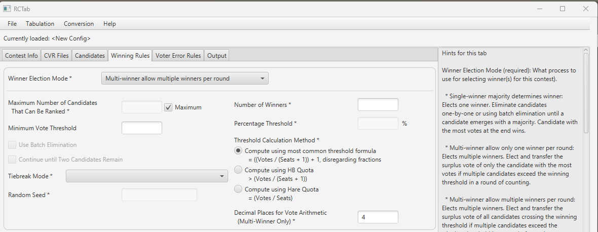


g. Security;  


* RCTab has no tests specifically designed to test security. RCTab relies on a jurisdiction’s security policies, as laid out in **RCTab v1.3.2 Section 06 - System Design Specifications v.1.1.1**. Security can be maintained by ensuring that all security procedures follow the requirements set out in **RCTab v1.3.2 Section 06 - System Design Specifications v.1.1.1**.

h. Production of audit trails and statistical data.  


* Regression tests will produce .log audit files and will log general information about the contest tabulation to the operator .log file. Production of these files can be tested using any regression test files, so long as the user activates the “Tabulate” function. All tests that produce a successful tabulation will also create .csv summary results files and .json summary results files. If these .log files are generated and updated, and .csv and .json summary files are produced when RCTab successfully completes a tabulation, then this requirement passes. 

The specifications shall identify procedures for assessing and demonstrating the suitability of the software for election use. 


* For additional user jurisdiction testing specifications, please see **RCTab v1.3.2 Section 05 - Acceptance Test Procedures v.1.2.1 **and **RCTab v1.3.2 Section 11 - L&A Testing v.1.3.2 **to review manufacturer procedures to ensure the user jurisdiction has received and is using the correct trusted build for the state of California. 
* **RCTab v1.3.2 Section 18 - User Guide v.1.2.2** also includes a detailed guide to expected user operation of RCTab, which can be used to create tests of the user interface, tabulation functionalities, and other functionalities of RCTab software. The manufacturer is available to support development of additional tests. 

<h3>RCTab Test Structure Form</h3>


<table>
  <tr>
   <td colspan="8" ><strong>RCTab Test Structure Form</strong>
   </td>
  </tr>
  <tr>
   <td rowspan="3" colspan="8" >This form is the basic template used to define every test setting for each test set used to test RCTab. This form is filled out with the settings for the [TEST NAME]. Testers can compare the information in this form to the information in the configuration file loaded from the relevant folder in test_data to ensure that all settings are correct. Each setting selected in this form is a setting tested by this test. RCTab has not yet created a Test Structure Form for every RCTab test, but will set up a form for all RCTab regression tests based on this form. Questions about this form can be made to the Ranked Choice Voting Resource Center at info@rcvresources.org or by calling 1-833-868-3728.
   </td>
  </tr>
  <tr>
  </tr>
  <tr>
  </tr>
  <tr>
   <td colspan="8" >
   </td>
  </tr>
  <tr>
   <td colspan="8" ><strong>Contest Info</strong>
   </td>
  </tr>
  <tr>
   <td colspan="4" >Contest Name*:
   </td>
   <td colspan="2" >
   </td>
   <td>Contest Date:
   </td>
   <td>
   </td>
  </tr>
  <tr>
   <td colspan="4" >Contest Jurisdiction:
   </td>
   <td colspan="2" >
   </td>
   <td>Contest Office:
   </td>
   <td>
   </td>
  </tr>
  <tr>
   <td colspan="4" >Rules Description:
   </td>
   <td colspan="4" >
   </td>
  </tr>
  <tr>
   <td colspan="8" ><strong>CVR Files</strong>
   </td>
  </tr>
  <tr>
   <td colspan="2" >Provider*:
   </td>
   <td colspan="3" >
   </td>
   <td colspan="3" ><em>Enter Vendor (ES&S, Hart, etc.)</em>
   </td>
  </tr>
  <tr>
   <td colspan="2" >File Path*:
   </td>
   <td colspan="3" >
   </td>
   <td colspan="3" ><em>Location of the cvr export file.</em>
   </td>
  </tr>
  <tr>
   <td colspan="2" >First Vote Column Index*:
   </td>
   <td colspan="3" >
   </td>
   <td colspan="3" ><em>Enter the Column where the First Vote is in the CVR export file.</em>
   </td>
  </tr>
  <tr>
   <td colspan="2" >First Vote Row Index*:
   </td>
   <td colspan="3" >
   </td>
   <td colspan="3" ><em>Enter the Row where the First Vote is in the CVR export file.</em>
   </td>
  </tr>
  <tr>
   <td colspan="2" >ID Column Index:
   </td>
   <td colspan="3" >
   </td>
   <td colspan="3" ><em>Enter the ID Column (if being used)</em>
   </td>
  </tr>
  <tr>
   <td colspan="2" >Precinct Column Index:
   </td>
   <td colspan="3" >
   </td>
   <td colspan="3" ><em>Enter the Precinct Column in the CVR export file.</em>
   </td>
  </tr>
  <tr>
   <td colspan="2" >Overvote Label
   </td>
   <td colspan="3" >
   </td>
   <td colspan="3" >
   </td>
  </tr>
  <tr>
   <td colspan="2" >Undervote Label
   </td>
   <td colspan="3" >
   </td>
   <td colspan="3" >
   </td>
  </tr>
  <tr>
   <td colspan="2" >Undeclared Write-In Label
   </td>
   <td colspan="3" >
   </td>
   <td colspan="3" ><em>User will define.  Must match case and spelling with CVR </em>
   </td>
  </tr>
  <tr>
   <td colspan="2" >Treat Blank as Undeclared WI
   </td>
   <td colspan="3" >
   </td>
   <td colspan="3" ><em>Circle One</em>
   </td>
  </tr>
  <tr>
   <td colspan="8" ><strong>Candidates</strong>
   </td>
  </tr>
  <tr>
   <td>Name*:
   </td>
   <td colspan="2" >
   </td>
   <td colspan="5" ><em>Obtain a list of candidates from the EMS System (Attach the list of candidates to this form)</em>
   </td>
  </tr>
  <tr>
   <td>Code:
   </td>
   <td colspan="2" >
   </td>
   <td colspan="5" ><em>Enter the Code for each candidate (if being used) example: DDE </em>
   </td>
  </tr>
  <tr>
   <td>Excluded:
   </td>
   <td colspan="2" >
   </td>
   <td colspan="5" ><em>Check box if a candidate is not being counted in this tabulation</em>
   </td>
  </tr>
  <tr>
   <td colspan="8" ><strong>Winning Rules</strong>
   </td>
  </tr>
  <tr>
   <td colspan="4" >Winner Election Mode*
   </td>
   <td colspan="2" >
   </td>
   <td rowspan="6" colspan="2" >Any user jurisdiction guidelines which identify the specific rules for ranked choice voting elections should be attached to this form for easy reference. Please see the RCTab User Guide for more information about the available selections that can be made.
   </td>
  </tr>
  <tr>
   <td colspan="4" >Maximum # of Ranked Candidates*
   </td>
   <td colspan="2" >
   </td>
  </tr>
  <tr>
   <td colspan="4" >Minimum Vote Threshold
   </td>
   <td colspan="2" >
   </td>
  </tr>
  <tr>
   <td colspan="4" >Use Batch Elimination
   </td>
   <td colspan="2" >  Y   N (Circle One)
   </td>
  </tr>
  <tr>
   <td colspan="4" >Continue until Two Candidates Remain
   </td>
   <td colspan="2" >  Y   N (Circle One)
   </td>
  </tr>
  <tr>
   <td colspan="4" >Tiebreak Mode*
   </td>
   <td colspan="2" >
   </td>
  </tr>
  <tr>
   <td colspan="4" >Random Seed*
   </td>
   <td colspan="2" >
   </td>
   <td rowspan="8" colspan="2" >Any user jurisdiction guidelines which identify the specific rules for ranked choice voting elections should be attached to this form for easy reference. Please see the RCTab User Guide for more information about the available selections that can be made.
   </td>
  </tr>
  <tr>
   <td colspan="4" >Number of Winners*
   </td>
   <td colspan="2" >
   </td>
  </tr>
  <tr>
   <td colspan="4" >Percentage Threshold*
   </td>
   <td colspan="2" >
   </td>
  </tr>
  <tr>
   <td colspan="4" >Threshold Calculation Method*
   </td>
   <td colspan="2" >
   </td>
  </tr>
  <tr>
   <td colspan="4" >Most Common Threshold
   </td>
   <td colspan="2" >
   </td>
  </tr>
  <tr>
   <td colspan="4" >HB Quota
   </td>
   <td colspan="2" >
   </td>
  </tr>
  <tr>
   <td colspan="4" >Hare Quota‡
   </td>
   <td colspan="2" >
   </td>
  </tr>
  <tr>
   <td colspan="4" >Decimal Places for Vote Arith (MW ONLY)*
   </td>
   <td colspan="2" >
   </td>
  </tr>
  <tr>
   <td colspan="8" ><strong>Voter Error Rules</strong>
   </td>
  </tr>
  <tr>
   <td colspan="4" >Overvote Rule*
   </td>
   <td colspan="2" >
   </td>
   <td colspan="2" >Choose one of the three available options.
   </td>
  </tr>
  <tr>
   <td colspan="4" >Skip to next rank
   </td>
   <td colspan="2" >
   </td>
   <td colspan="2" >
   </td>
  </tr>
  <tr>
   <td colspan="4" >Exhaust Immediately
   </td>
   <td colspan="2" >
   </td>
   <td colspan="2" >
   </td>
  </tr>
  <tr>
   <td colspan="4" >Exhaust if mult. cont.
   </td>
   <td colspan="2" >
   </td>
   <td colspan="2" >
   </td>
  </tr>
  <tr>
   <td colspan="4" >Consecutive Skip Ranks Allowed
   </td>
   <td colspan="2" >
   </td>
   <td colspan="2" >Enter the number of consecutive skipped rankings or check Unlimited if permitted.
   </td>
  </tr>
  <tr>
   <td colspan="4" >Exhaust on multi ranks for same candidate
   </td>
   <td colspan="2" >  Y N (Circle One)
   </td>
   <td colspan="2" >Check if multiple ranks for the same candidate are not permitted.
   </td>
  </tr>
  <tr>
   <td colspan="8" ><strong>Output</strong>
   </td>
  </tr>
  <tr>
   <td colspan="8" >Output Directory (where should results file go on PC?):
   </td>
  </tr>
  <tr>
   <td colspan="4" >Tabulate by Precinct:
   </td>
   <td colspan="2" >  Y      N     (Circle One)
   </td>
   <td>Generate CDF JSON:
   </td>
   <td>  Y N (Circle One)
   </td>
  </tr>
  <tr>
   <td colspan="8" >Configuration File Name:
   </td>
  </tr>
  <tr>
   <td colspan="5" >Date of Test:
   </td>
   <td colspan="3" >Passed?:   YES   NO
   </td>
  </tr>
  <tr>
   <td colspan="8" >Name of tester(s)
   </td>
  </tr>
  <tr>
   <td colspan="5" >Name 1
   </td>
   <td colspan="3" >Name 2
   </td>
  </tr>
  <tr>
   <td colspan="8" >
   </td>
  </tr>
  <tr>
   <td colspan="8" >‡Disclaimer: The Hare Quota tabulation option in the RCTab software has not been thoroughly tested in a controlled testing lab environment. Do not attempt to implement this option without first testing in a non-operational environment. Please contact the Ranked Choice Voting Resource Center for additional information.
   </td>
  </tr>
</table>


<h3>RCTab Test Structure Form Example:</h3>


<table>
  <tr>
   <td colspan="8" ><strong>RCTab Test Structure Form</strong>
   </td>
  </tr>
  <tr>
   <td rowspan="3" colspan="8" >This form is the basic template used to define every test setting for each test set used to test the RCTab. This form is filled out with the settings for the 2015 Portland Mayor test. Testers can compare the information in this form to the information in the configuration file loaded from the relevant folder in test_data to ensure that all settings are correct. Each setting selected in this form is a setting tested by this test. RCTab has not yet created a Test Structure Form for every RCTab test, but will set up a form for all RCTab regression tests based on this form. Questions about this form can be made to the Ranked Choice Voting Resource Center at info@rcvresources.org or by calling 1-833-868-3728.
   </td>
  </tr>
  <tr>
  </tr>
  <tr>
  </tr>
  <tr>
   <td colspan="8" >
   </td>
  </tr>
  <tr>
   <td colspan="8" ><strong>Contest Info</strong>
   </td>
  </tr>
  <tr>
   <td colspan="4" >Contest Name*:
   </td>
   <td colspan="2" >Portland 2015 Mayoral Race
   </td>
   <td>Contest Date:
   </td>
   <td><p style="text-align: right">
2015-11-03</p>

   </td>
  </tr>
  <tr>
   <td colspan="4" >Contest Jurisdiction:
   </td>
   <td colspan="2" >Portland, ME
   </td>
   <td>Contest Office:
   </td>
   <td>Portland, ME
   </td>
  </tr>
  <tr>
   <td colspan="4" >Rules Description:
   </td>
   <td colspan="4" >
   </td>
  </tr>
  <tr>
   <td colspan="8" ><strong>CVR Files</strong>
   </td>
  </tr>
  <tr>
   <td colspan="2" >Provider*:
   </td>
   <td colspan="3" >ES&S
   </td>
   <td colspan="3" ><em>Enter Vendor (ES&S, etc.)</em>
   </td>
  </tr>
  <tr>
   <td colspan="2" >File Path*:
   </td>
   <td colspan="3" >2015_portland_mayor_cvr.xlsx
   </td>
   <td colspan="3" ><em>Location of the cvr export file.</em>
   </td>
  </tr>
  <tr>
   <td colspan="2" >First Vote Column Index*:
   </td>
   <td colspan="3" ><p style="text-align: right">
4</p>

   </td>
   <td colspan="3" ><em>Enter the Column where the First Vote is in the CVR export file.</em>
   </td>
  </tr>
  <tr>
   <td colspan="2" >First Vote Row Index*:
   </td>
   <td colspan="3" ><p style="text-align: right">
2</p>

   </td>
   <td colspan="3" ><em>Enter the Row where the First Vote is in the CVR export file.</em>
   </td>
  </tr>
  <tr>
   <td colspan="2" >ID Column Index:
   </td>
   <td colspan="3" >Leave blank
   </td>
   <td colspan="3" ><em>Enter the ID Column (if being used)</em>
   </td>
  </tr>
  <tr>
   <td colspan="2" >Precinct Column Index:
   </td>
   <td colspan="3" ><p style="text-align: right">
2</p>

   </td>
   <td colspan="3" ><em>Enter the Precinct Column in the CVR export file.</em>
   </td>
  </tr>
  <tr>
   <td colspan="2" >Overvote Label
   </td>
   <td colspan="3" >overvote
   </td>
   <td colspan="3" ><em>ES&S will default to “overvote”</em>
   </td>
  </tr>
  <tr>
   <td colspan="2" >Undervote Label
   </td>
   <td colspan="3" >undervote
   </td>
   <td colspan="3" ><em>ES&S will default to “undervote”</em>
   </td>
  </tr>
  <tr>
   <td colspan="2" >Undeclared Write-In Label
   </td>
   <td colspan="3" >UWI
   </td>
   <td colspan="3" ><em>User will define.  Must match case and spelling with CVR </em>
   </td>
  </tr>
  <tr>
   <td colspan="2" >Treat Blank as Undeclared WI
   </td>
   <td colspan="3" >FALSE
   </td>
   <td colspan="3" ><em>Circle One</em>
   </td>
  </tr>
  <tr>
   <td colspan="8" ><strong>Candidates</strong>
   </td>
  </tr>
  <tr>
   <td>Name*:
   </td>
   <td colspan="2" >See below for a list of candidates.
   </td>
   <td colspan="5" ><em>Obtain a list of candidates from the EMS System (Attach the list of candidates to this form)</em>
   </td>
  </tr>
  <tr>
   <td>Code:
   </td>
   <td colspan="2" >
   </td>
   <td colspan="5" ><em>Enter the Code for each candidate (if being used) example: DDE </em>
   </td>
  </tr>
  <tr>
   <td>Excluded:
   </td>
   <td colspan="2" >
   </td>
   <td colspan="5" ><em>Check box if a candidate is not being counted in this tabulation</em>
   </td>
  </tr>
  <tr>
   <td colspan="8" ><strong>Winning Rules</strong>
   </td>
  </tr>
  <tr>
   <td colspan="4" >Winner Election Mode*
   </td>
   <td colspan="2" >singleWinnerMajority
   </td>
   <td rowspan="6" colspan="2" >Any user jurisdiction guidelines which identify the specific rules for ranked choice voting elections should be attached to this form for easy reference. Please see the RCTab User Guide for more information about the available selections that can be made.
   </td>
  </tr>
  <tr>
   <td colspan="4" >Maximum # of Ranked Candidates*
   </td>
   <td colspan="2" ><p style="text-align: right">
15</p>

   </td>
  </tr>
  <tr>
   <td colspan="4" >Minimum Vote Threshold
   </td>
   <td colspan="2" ><p style="text-align: right">
0</p>

   </td>
  </tr>
  <tr>
   <td colspan="4" >Use Batch Elimination
   </td>
   <td colspan="2" ><strong>  Y</strong>      N     (Circle One)
   </td>
  </tr>
  <tr>
   <td colspan="4" >Continue until Two Candidates Remain
   </td>
   <td colspan="2" >  Y      <strong>N</strong>     (Circle One)
   </td>
  </tr>
  <tr>
   <td colspan="4" >Tiebreak Mode*
   </td>
   <td colspan="2" >useCandidateOrder
   </td>
  </tr>
  <tr>
   <td colspan="4" >Random Seed*
   </td>
   <td colspan="2" >N/A
   </td>
   <td rowspan="8" colspan="2" >Any user jurisdiction guidelines which identify the specific rules for ranked choice voting elections should be attached to this form for easy reference. Please see the RCTab User Guide for more information about the available selections that can be made.
   </td>
  </tr>
  <tr>
   <td colspan="4" >Number of Winners*
   </td>
   <td colspan="2" ><p style="text-align: right">
1</p>

   </td>
  </tr>
  <tr>
   <td colspan="4" >Percentage Threshold*
   </td>
   <td colspan="2" >N/A
   </td>
  </tr>
  <tr>
   <td colspan="4" >Threshold Calculation Method*
   </td>
   <td colspan="2" >N/A
   </td>
  </tr>
  <tr>
   <td colspan="4" >Most Common Threshold
   </td>
   <td colspan="2" >N/A
   </td>
  </tr>
  <tr>
   <td colspan="4" >HB Quota
   </td>
   <td colspan="2" >N/A
   </td>
  </tr>
  <tr>
   <td colspan="4" >Hare Quota‡
   </td>
   <td colspan="2" >N/A
   </td>
  </tr>
  <tr>
   <td colspan="4" >Decimal Places for Vote Arith (MW ONLY)*
   </td>
   <td colspan="2" >N/A
   </td>
  </tr>
  <tr>
   <td colspan="8" ><strong>Voter Error Rules</strong>
   </td>
  </tr>
  <tr>
   <td colspan="4" >Overvote Rule*
   </td>
   <td colspan="2" >Exhaust Immediately
   </td>
   <td colspan="2" >Choose one of the three available options.
   </td>
  </tr>
  <tr>
   <td colspan="4" >Skip to next rank
   </td>
   <td colspan="2" >-
   </td>
   <td colspan="2" >
   </td>
  </tr>
  <tr>
   <td colspan="4" >Exhaust Immediately
   </td>
   <td colspan="2" >X
   </td>
   <td colspan="2" >
   </td>
  </tr>
  <tr>
   <td colspan="4" >Exhaust if mult. cont.
   </td>
   <td colspan="2" >-
   </td>
   <td colspan="2" >
   </td>
  </tr>
  <tr>
   <td colspan="4" >Consecutive Skip Ranks Allowed
   </td>
   <td colspan="2" ><p style="text-align: right">
1</p>

   </td>
   <td colspan="2" >Enter the number of consecutive skipped rankings or check Unlimited if permitted.
   </td>
  </tr>
  <tr>
   <td colspan="4" >Exhaust on multi ranks for same candidate
   </td>
   <td colspan="2" >  Y      <strong>N</strong>     (Circle One)
   </td>
   <td colspan="2" >Check if multiple ranks for the same candidate are not permitted.
   </td>
  </tr>
  <tr>
   <td colspan="8" ><strong>Output</strong>
   </td>
  </tr>
  <tr>
   <td colspan="8" >Output Directory (where should results file go on PC?): output
   </td>
  </tr>
  <tr>
   <td colspan="4" >Tabulate by Precinct:
   </td>
   <td colspan="2" >  Y      <strong>N</strong>     (Circle One)
   </td>
   <td>Generate CDF JSON:
   </td>
   <td>  Y      <strong>N</strong>     (Circle One)
   </td>
  </tr>
  <tr>
   <td colspan="8" >Configuration File Name: 2015_portland_mayor_config.json
   </td>
  </tr>
  <tr>
   <td colspan="5" >Date of Test:
   </td>
   <td colspan="3" >Passed?:   YES   NO
   </td>
  </tr>
  <tr>
   <td colspan="8" >Name of tester(s)
   </td>
  </tr>
  <tr>
   <td colspan="5" >Name 1
   </td>
   <td colspan="3" >Name 2
   </td>
  </tr>
  <tr>
   <td rowspan="2" colspan="8" >‡Disclaimer: The Hare Quota tabulation option in the RCTab software has not been thoroughly tested in a controlled testing lab environment. Do not attempt to implement this option without first testing in a non-operational environment. Please contact the Ranked Choice Voting Resource Center for additional information.
   </td>
  </tr>
  <tr>
  </tr>
  <tr>
   <td>Candidates
   </td>
   <td>Brennan, Michael F.
   </td>
   <td>
   </td>
   <td>
   </td>
   <td>
   </td>
   <td>
   </td>
   <td>
   </td>
   <td>
   </td>
  </tr>
  <tr>
   <td>
   </td>
   <td>Bragdon, Charles E.
   </td>
   <td>
   </td>
   <td>
   </td>
   <td>
   </td>
   <td>
   </td>
   <td>
   </td>
   <td>
   </td>
  </tr>
  <tr>
   <td>
   </td>
   <td>Bryant, Peter G.
   </td>
   <td>
   </td>
   <td>
   </td>
   <td>
   </td>
   <td>
   </td>
   <td>
   </td>
   <td>
   </td>
  </tr>
  <tr>
   <td>
   </td>
   <td>Carmona, Ralph C.
   </td>
   <td>
   </td>
   <td>
   </td>
   <td>
   </td>
   <td>
   </td>
   <td>
   </td>
   <td>
   </td>
  </tr>
  <tr>
   <td>
   </td>
   <td>Dodge, Richard A.
   </td>
   <td>
   </td>
   <td>
   </td>
   <td>
   </td>
   <td>
   </td>
   <td>
   </td>
   <td>
   </td>
  </tr>
  <tr>
   <td>
   </td>
   <td>Duson, Jill C.
   </td>
   <td>
   </td>
   <td>
   </td>
   <td>
   </td>
   <td>
   </td>
   <td>
   </td>
   <td>
   </td>
  </tr>
  <tr>
   <td>
   </td>
   <td>Eder, John M.
   </td>
   <td>
   </td>
   <td>
   </td>
   <td>
   </td>
   <td>
   </td>
   <td>
   </td>
   <td>
   </td>
  </tr>
  <tr>
   <td>
   </td>
   <td>Haadoow, Hamza A.
   </td>
   <td>
   </td>
   <td>
   </td>
   <td>
   </td>
   <td>
   </td>
   <td>
   </td>
   <td>
   </td>
  </tr>
  <tr>
   <td>
   </td>
   <td>Lapchick, Jodie L.
   </td>
   <td>
   </td>
   <td>
   </td>
   <td>
   </td>
   <td>
   </td>
   <td>
   </td>
   <td>
   </td>
  </tr>
  <tr>
   <td>
   </td>
   <td>Marshall, David A.
   </td>
   <td>
   </td>
   <td>
   </td>
   <td>
   </td>
   <td>
   </td>
   <td>
   </td>
   <td>
   </td>
  </tr>
  <tr>
   <td>
   </td>
   <td>Mavodones, Nicholas M. Jr.
   </td>
   <td>
   </td>
   <td>
   </td>
   <td>
   </td>
   <td>
   </td>
   <td>
   </td>
   <td>
   </td>
  </tr>
  <tr>
   <td>
   </td>
   <td>Miller, Markos S.
   </td>
   <td>
   </td>
   <td>
   </td>
   <td>
   </td>
   <td>
   </td>
   <td>
   </td>
   <td>
   </td>
  </tr>
  <tr>
   <td>
   </td>
   <td>Rathband, Jed
   </td>
   <td>
   </td>
   <td>
   </td>
   <td>
   </td>
   <td>
   </td>
   <td>
   </td>
   <td>
   </td>
  </tr>
  <tr>
   <td>
   </td>
   <td>Strimling, Ethan K.
   </td>
   <td>
   </td>
   <td>
   </td>
   <td>
   </td>
   <td>
   </td>
   <td>
   </td>
   <td>
   </td>
  </tr>
  <tr>
   <td>
   </td>
   <td>Vail, Christopher L.
   </td>
   <td>
   </td>
   <td>
   </td>
   <td>
   </td>
   <td>
   </td>
   <td>
   </td>
   <td>
   </td>
  </tr>
</table>


<h3>List of Tabulator Tests</h3>


<table>
  <tr>
   <td><strong>Name of Test</strong>
   </td>
   <td><strong>Name of Test Folder</strong>
   </td>
   <td><strong>Description of test</strong>
   </td>
   <td><strong>Purpose of Test</strong>
   </td>
  </tr>
  <tr>
   <td>RCVRC & Bright Spots name for regression test
   </td>
   <td><a href="https://github.com/BrightSpots/rcv/tree/master/src/test/resources/network/brightspots/rcv/test_data">Test folder name in:</a>
<p>
Refer to test_data.zip that includes all test data and was submitted with documentation.  
   </td>
   <td>Brief description of test and identification of RCTab functionalities tested by test files.
   </td>
   <td>Unless otherwise noted, each regression test can be used to test control and data input/output, acceptance criteria, processing accuracy, ballot interpretation logic, and production of audit trails and statistical data.
<p>
Processes for exporting and handling data, under control and data input, should also follow CVR handling procedures in a jurisdiction.
<p>
Security processes should be tested according to the requirements in 06 - System Security Specifications.
<p>
Exception handling tests are directly identified below.
   </td>
  </tr>
  <tr>
   <td>2013 Minneapolis Mayor
   </td>
   <td>2013_minneapolis_mayor
   </td>
   <td>Test the ability of RCTab to read and process ES&S CVR files and CVR settings usable with ES&S CVR files. Test RCTab's ability to properly count real-life RCV elections.
   </td>
   <td>Control and data input/output;
<p>
Processing accuracy;
<p>
Ballot interpretation logic;
   </td>
  </tr>
  <tr>
   <td>2013 Minneapolis Mayor Scale
   </td>
   <td>2013_minneapolis_mayor_scale
   </td>
   <td>Tests the ability of RCTab to process a contest with 1,000,000 records. Test the ability of RCTab to read and process ES&S CVR files and CVR settings usable with ES&S CVR files.
   </td>
   <td>Control and data input/output;
<p>
Processing accuracy;
<p>
Ballot interpretation logic;
   </td>
  </tr>
  <tr>
   <td>2013 Minneapolis Park
   </td>
   <td>2013_minneapolis_park
   </td>
   <td>Test the ability of RCTab to read and process ES&S CVR files and CVR settings usable with ES&S CVR files. Test the functionality of the "multi-winner allow multiple winners per round" functionality.
   </td>
   <td>Control and data input/output;
<p>
Processing accuracy;
<p>
Ballot interpretation logic;
   </td>
  </tr>
  <tr>
   <td>test bottoms-up multi-seat logic
   </td>
   <td>2013_minneapolis_park_bottoms_up
   </td>
   <td>Test the functionality of the bottoms-up winner election mode setting. Test the ability of RCTab to read and process ES&S CVR files and CVR settings usable with ES&S CVR files.
   </td>
   <td>Control and data input/output;
<p>
Processing accuracy;
<p>
Ballot interpretation logic;
   </td>
  </tr>
  <tr>
   <td>2017 Minneapolis Park
   </td>
   <td>2017_minneapolis_park
   </td>
   <td>Test the ability of RCTab to read and process ES&S CVR files and CVR settings usable with ES&S CVR files. Test the functionality of the "multi-winner allow multiple winners per round" functionality.
   </td>
   <td>Control and data input/output;
<p>
Processing accuracy;
<p>
Ballot interpretation logic;
   </td>
  </tr>
  <tr>
   <td>test Hare quota
   </td>
   <td>2013_minneapolis_park_hare
   </td>
   <td>Test the functionality of the Hare Quota Threshold Calculation Mode setting. Note that while RCTab passes this test the Hare Quota functionality has been updated but requires additional testing. Test the functionality of the "multi-winner allow multiple winners per round" functionality. Test the ability of RCTab to read and process ES&S CVR files and CVR settings usable with ES&S CVR files.
   </td>
   <td>Control and data input/output;
<p>
Processing accuracy;
<p>
Ballot interpretation logic;
   </td>
  </tr>
  <tr>
   <td>test sequential multi-seat logic
   </td>
   <td>2013_minneapolis_park_sequential
   </td>
   <td>Test the functionality of the multi-pass IRV winner election mode setting. Test the ability of RCTab to read and process ES&S CVR files and CVR settings usable with ES&S CVR files.
   </td>
   <td>Control and data input/output;
<p>
Processing accuracy;
<p>
Ballot interpretation logic;
   </td>
  </tr>
  <tr>
   <td>2015 Portland Mayor
   </td>
   <td>2015_portland_mayor
   </td>
   <td>Test the ability of RCTab to read and process ES&S CVR files and CVR settings usable with ES&S CVR files. Test ability to process a single-winner RCV contest.
   </td>
   <td>Control and data input/output;
<p>
Processing accuracy;
<p>
Ballot interpretation logic;
   </td>
  </tr>
  <tr>
   <td>2015 Portland Mayor Candidate Codes
   </td>
   <td>2015_portland_mayor_codes
   </td>
   <td>Test the ability of RCTab to read and process ES&S CVR files and CVR settings usable with ES&S CVR files; ability to process a single-winner RCV contest; ability to process a CVR using Candidate Codes instead of Candidate Names
   </td>
   <td>Control and data input/output;
<p>
Processing accuracy;
<p>
Ballot interpretation logic;
   </td>
  </tr>
  <tr>
   <td>2017 Minneapolis Mayor
   </td>
   <td>2017_minneapolis_mayor
   </td>
   <td>Test the ability of RCTab to read and process ES&S CVR files and CVR settings usable with ES&S CVR files, as well as RCTab's ability to properly count real-life RCV elections.
   </td>
   <td>Control and data input/output;
<p>
Processing accuracy;
<p>
Ballot interpretation logic;
   </td>
  </tr>
  <tr>
   <td>2018 Maine Governor Democratic Primary
   </td>
   <td>2018_maine_governor_primary
   </td>
   <td>Test the ability of RCTab to read and process ES&S CVR files and CVR settings usable with ES&S CVR files, as well as RCTab's ability to properly count real-life RCV elections.
   </td>
   <td>Control and data input/output;
<p>
Processing accuracy;
<p>
Ballot interpretation logic;
   </td>
  </tr>
  <tr>
   <td>Clear Ballot - Kansas Primary
   </td>
   <td>clear_ballot_kansas_primary
   </td>
   <td>Tests the ability of RCTab to read and process Clear Ballot CVR data
   </td>
   <td>Control and data input/output;
<p>
Processing accuracy;
<p>
Ballot interpretation logic;
   </td>
  </tr>
  <tr>
   <td>Continue Until Two Candidates Remain
   </td>
   <td>continue_tabulation_test
   </td>
   <td>Tests the ability of RCTab to properly count a single-winner contest down to two final candidates
   </td>
   <td>Control and data input/output;
<p>
Processing accuracy;
<p>
Ballot interpretation logic;
   </td>
  </tr>
  <tr>
   <td>Continue Until Two Candidates Remain with Batch Elimination
   </td>
   <td>continue_until_two_with_batch_elimination_test
   </td>
   <td>Tests the ability of RCTab to count a single-winner contest using both batch elimination and continue until two candidates remain settings simultaneously.
   </td>
   <td>Control and data input/output;
<p>
Processing accuracy;
<p>
Ballot interpretation logic;
   </td>
  </tr>
  <tr>
   <td>Dominion test - Alaska test data
   </td>
   <td>dominion_alaska
   </td>
   <td>Tests the ability of RCTab to read and process Dominion CVR data and to run an RCV count on that data.
   </td>
   <td>Control and data input/output;
<p>
Processing accuracy;
<p>
Ballot interpretation logic;
   </td>
  </tr>
  <tr>
   <td>Dominion test - Kansas test data
   </td>
   <td>dominion_kansas
   </td>
   <td>Tests the ability of RCTab to read and process Dominion CVR data and to run an RCV count on that data.
   </td>
   <td>Control and data input/output;
<p>
Processing accuracy;
<p>
Ballot interpretation logic;
   </td>
  </tr>
  <tr>
   <td>Dominion - Multi-File
   </td>
   <td>dominion_multi_file
   </td>
   <td>Tests the ability of RCTab to read and process Dominion CVR data spread across multiple CVR files and to run an RCV count on that data. 
   </td>
   <td>Control and data input/output;
<p>
Processing accuracy;
<p>
Ballot interpretation logic;
   </td>
  </tr>
  <tr>
   <td>Dominion - No Precinct Data
   </td>
   <td>dominion_no_precinct_data
   </td>
   <td>Tests the ability of RCTab to read and process Dominion CVR data and to run an RCV count on that data.
   </td>
   <td>Control and data input/output;
<p>
Processing accuracy;
<p>
Ballot interpretation logic;
   </td>
  </tr>
  <tr>
   <td>Dominion test - Wyoming test data
   </td>
   <td>dominion_wyoming
   </td>
   <td>Tests the ability of RCTab to read and process Dominion CVR data and to run an RCV count on that data.
   </td>
   <td>Control and data input/output;
<p>
Processing accuracy;
<p>
Ballot interpretation logic;
   </td>
  </tr>
  <tr>
   <td>test inactivating ballot after encountering duplicate ranking of same candidate
   </td>
   <td>duplicate_test
   </td>
   <td>Tests the ability of RCTab to properly detect and inactivate a ballot due to the same candidate being ranked multiple times on that ballot. 
   </td>
   <td>Control and data input/output;
<p>
Processing accuracy;
<p>
Ballot interpretation logic;
   </td>
  </tr>
  <tr>
   <td>test excluding candidates in config file
   </td>
   <td>excluded_test
   </td>
   <td>Test the "Exclude" function in the Candidate settings of RCTab.
   </td>
   <td>Control and data input/output;
<p>
Processing accuracy;
<p>
Ballot interpretation logic;
   </td>
  </tr>
  <tr>
   <td>Hart - Cedar Park School Board
   </td>
   <td>hart_cedar_park_school_board
   </td>
   <td>Tests the ability of RCTab to read and process Hart CVR data
   </td>
   <td>Control and data input/output;
<p>
Processing accuracy;
<p>
Ballot interpretation logic;
   </td>
  </tr>
  <tr>
   <td>Hart - Travis County Officers
   </td>
   <td>hart_travis_county_officers
   </td>
   <td>Tests the ability of RCTab to read and process Hart CVR data
   </td>
   <td>Control and data input/output;
<p>
Processing accuracy;
<p>
Ballot interpretation logic;
   </td>
  </tr>
  <tr>
   <td>test invalid params in config file
   </td>
   <td>invalid_params_test
   </td>
   <td>Tests the ability of RCTab show errors if a configuration file is incomplete or improperly filled out.
   </td>
   <td>Exception handling
   </td>
  </tr>
  <tr>
   <td>test invalid source files
   </td>
   <td>invalid_sources_test
   </td>
   <td>Tests the ability of RCTab to show errors if CVR files are incompatible
   </td>
   <td>Exception handling
   </td>
  </tr>
  <tr>
   <td>test minimum vote threshold setting
   </td>
   <td>minimum_threshold_test
   </td>
   <td>Test the "minimum vote threshold" setting in winner election mode.
   </td>
   <td>Control and data input/output;
<p>
Processing accuracy;
<p>
Ballot interpretation logic;
   </td>
  </tr>
  <tr>
   <td>testMinneapolisMultiSeatThreshold
   </td>
   <td>minneapolis_multi_seat_threshold
   </td>
   <td>Test the ability of RCTab to determine winning candidates according to the default Threshold Calculation method in multi-winner elections. Test the functionality of the "multi-winner allow multiple winners per round" functionality.
   </td>
   <td>Control and data input/output;
<p>
Processing accuracy;
<p>
Ballot interpretation logic;
   </td>
  </tr>
  <tr>
   <td>missing precinct example
   </td>
   <td>missing_precinct_example
   </td>
   <td>Test the ability of RCTab to continue tabulating if "Precinct Column ID" is supplied but precinct information is missing in part of a CVR file.
   </td>
   <td>Control and data input/output;
<p>
Processing accuracy;
<p>
Ballot interpretation logic;
   </td>
  </tr>
  <tr>
   <td>test bottoms-up multi-seat with threshold logic
   </td>
   <td>multi_seat_bottoms_up_with_threshold
   </td>
   <td>Test the functionality of the bottoms-up using percentage threshold winner election mode setting.
   </td>
   <td>Control and data input/output;
<p>
Processing accuracy;
<p>
Ballot interpretation logic;
   </td>
  </tr>
  <tr>
   <td>multi-seat UWI test
   </td>
   <td>multi_seat_uwi_test
   </td>
   <td>Undeclared write-ins should not win elections. This test ensures that RCTab properly handles this exception by not awarding a win to an undeclared write-in candidate in a multi-winner contest.
   </td>
   <td>Control and data input/output;
<p>
Processing accuracy;
<p>
Ballot interpretation logic;
   </td>
  </tr>
  <tr>
   <td>NIST XML CDF 2
   </td>
   <td>nist_xml_cdf_2
   </td>
   <td>Tests the ability of RCTab to read and process CDF data in XML format
   </td>
   <td>Control and data input/output;
<p>
Processing accuracy;
<p>
Ballot interpretation logic;
   </td>
  </tr>
  <tr>
   <td>No candidates meet minimum vote threshold
   </td>
   <td>no_candidates_meet_minimum
   </td>
   <td>Tests the ability of RCTab to provide an accurate error message if all candidates fall below the value set in the Minimum Vote Threshold field. 
   </td>
   <td>Exception handling. 
   </td>
  </tr>
  <tr>
   <td>precinct example
   </td>
   <td>precinct_example
   </td>
   <td>Test the ability of RCTab to detect precinct information based on CVR file data and the ability to produce precinct results using the Tabulate by Precinct functionality. Note that Tabulate by Precinct function produces precinct-level results of the RCV contest but does not identify precinct-level winners. This functionality needs updating to identify in-precinct winners.
   </td>
   <td>Control and data input/output;
<p>
Processing accuracy;
<p>
Ballot interpretation logic;
   </td>
  </tr>
  <tr>
   <td>sample interactive tiebreak
   </td>
   <td>sample_interactive_tiebreak
   </td>
   <td>Test the functionality of the interactive tiebreak function available in "Stop counting and ask," or "Previous round counts (then stop counting and ask)" tiebreaking modes. This is not a regression test as it requires user input. It is included in the "sample_input" folder of RCTab installation folder as an additional test of RCTab.
   </td>
   <td>Control and data input/output;
<p>
Processing accuracy;
<p>
Ballot interpretation logic;
   </td>
  </tr>
  <tr>
   <td>Sequential with batch
   </td>
   <td>sequential_with_batch
   </td>
   <td>Tests the ability of RCTab to properly batch eliminate candidates in a multi-pass IRV tabulation scenario. 
   </td>
   <td>
   </td>
  </tr>
  <tr>
   <td>Sequential with continue until two
   </td>
   <td>sequential_with_continue_until_two
   </td>
   <td>Tests the ability of RCTab to eliminate down to the final two candidates in a multi-pass IRV tabulation scenario. 
   </td>
   <td>
   </td>
  </tr>
  <tr>
   <td>test skipping to next candidate after overvote
   </td>
   <td>skip_to_next_test
   </td>
   <td>Test the functionality of the "Always skip to next rank" overvote setting.
   </td>
   <td>Control and data input/output;
<p>
Processing accuracy;
<p>
Ballot interpretation logic;
   </td>
  </tr>
  <tr>
   <td>skipped first choice
   </td>
   <td>test_set_0_skipped_first_choice
   </td>
   <td>Test the ability of RCTab to properly process CVR data with a skipped first ranking. Test the ability of RCTab to export CVR data in the CDF.
   </td>
   <td>Control and data input/output;
<p>
Processing accuracy;
<p>
Ballot interpretation logic;
   </td>
  </tr>
  <tr>
   <td>exhaust at overvote rule
   </td>
   <td>test_set_1_exhaust_at_overvote
   </td>
   <td>Test the functionality of the "Exhaust immediately" overvote setting. Test the ability of RCTab to export CVR data in the CDF.
   </td>
   <td>Control and data input/output;
<p>
Processing accuracy;
<p>
Ballot interpretation logic;
   </td>
  </tr>
  <tr>
   <td>overvote skips to next rank
   </td>
   <td>test_set_2_overvote_skip_to_next
   </td>
   <td>Test the functionality of the "Always skip to next rank" overvote setting. Test the ability of RCTab to export CVR data in the CDF.
   </td>
   <td>Control and data input/output;
<p>
Processing accuracy;
<p>
Ballot interpretation logic;
   </td>
  </tr>
  <tr>
   <td>skipped choice exhausts option
   </td>
   <td>test_set_3_skipped_choice_exhaust
   </td>
   <td>Test the functionality of the "how many consecutive skipped ranks are allowed" setting when ballots exhaust after a single skipped ranking. Test the ability of RCTab to export CVR data in the CDF.
   </td>
   <td>Control and data input/output;
<p>
Processing accuracy;
<p>
Ballot interpretation logic;
   </td>
  </tr>
  <tr>
   <td>skipped choice next option
   </td>
   <td>test_set_4_skipped_choice_next
   </td>
   <td>Test the functionality of the "how many consecutive skipped ranks are allowed" setting when ballots don't exhaust after skipped rankings. Test the ability of RCTab to export CVR data in the CDF.
   </td>
   <td>Control and data input/output;
<p>
Processing accuracy;
<p>
Ballot interpretation logic;
   </td>
  </tr>
  <tr>
   <td>two skipped ranks exhausts option
   </td>
   <td>test_set_5_two_skipped_choice_exhaust
   </td>
   <td>Test the functionality of the "how many consecutive skipped ranks are allowed" setting when ballots exhaust after multiple skipped rankings. Test the ability of RCTab to export CVR data in the CDF.
   </td>
   <td>Control and data input/output;
<p>
Processing accuracy;
<p>
Ballot interpretation logic;
   </td>
  </tr>
  <tr>
   <td>duplicate rank exhausts
   </td>
   <td>test_set_6_duplicate_exhaust
   </td>
   <td>Test the functionality of the "Exhaust on multiple ranks for the same candidate" function, if function is turned on - ballots should exhaust when a duplicate ranking is encountered. Test the ability of RCTab to export CVR data in the CDF.
   </td>
   <td>Control and data input/output;
<p>
Processing accuracy;
<p>
Ballot interpretation logic;
   </td>
  </tr>
  <tr>
   <td>duplicate rank skips to next option
   </td>
   <td>test_set_7_duplicate_skip_to_next
   </td>
   <td>Test the functionality of the "Exhaust on multiple ranks for the same candidate" function, if function is turned off - RCTab will ignore duplicate candidate rankings. Test the ability of RCTab to export CVR data in the CDF.
   </td>
   <td>Control and data input/output;
<p>
Processing accuracy;
<p>
Ballot interpretation logic;
   </td>
  </tr>
  <tr>
   <td>multi-cdf tabulation
   </td>
   <td>test_set_8_multi_cdf
   </td>
   <td>Tests the ability of RCTab to read and process multiple CDF data files in XML format. Test the ability of RCTab to export CVR data in the CDF.
   </td>
   <td>Control and data input/output;
<p>
Processing accuracy;
<p>
Ballot interpretation logic;
   </td>
  </tr>
  <tr>
   <td>test allow only one winner per round logic
   </td>
   <td>test_set_allow_only_one_winner_per_round
   </td>
   <td>Test the functionality of the multi-winner allow only one winner per round logic.
   </td>
   <td>Control and data input/output;
<p>
Processing accuracy;
<p>
Ballot interpretation logic;
   </td>
  </tr>
  <tr>
   <td>multi-seat fractional number threshold
   </td>
   <td>test_set_multi_winner_fractional_threshold
   </td>
   <td>Test the functionality of the HB Quota Threshold Calculation Mode setting. Test the ability of RCTab to export CVR data in the CDF.
   </td>
   <td>Control and data input/output;
<p>
Processing accuracy;
<p>
Ballot interpretation logic;
   </td>
  </tr>
  <tr>
   <td>multi-seat whole number threshold
   </td>
   <td>test_set_multi_winner_whole_threshold
   </td>
   <td>Test the functionality of the default Threshold Calculation Mode setting. Test the ability of RCTab to export CVR data in the CDF.
   </td>
   <td>Control and data input/output;
<p>
Processing accuracy;
<p>
Ballot interpretation logic;
   </td>
  </tr>
  <tr>
   <td>overvote delimiter test
   </td>
   <td>test_set_overvote_delimiter
   </td>
   <td>Test the functionality of the "overvote delimiter" setting. 
   </td>
   <td>Control and data input/output;
<p>
Processing accuracy;
<p>
Ballot interpretation logic;
   </td>
  </tr>
  <tr>
   <td>treat blank as undeclared write-in
   </td>
   <td>test_set_treat_blank_as_undeclared_write_in
   </td>
   <td>Test the functionality of the "Treat Blank as Undeclared Write-In" setting for CVRs.
   </td>
   <td>Control and data input/output;
<p>
Processing accuracy;
<p>
Ballot interpretation logic;
   </td>
  </tr>
  <tr>
   <td>tiebreak using generated permutation
   </td>
   <td>tiebreak_generate_permutation_test
   </td>
   <td>Test the functionality of the "Generate permutation" tiebreak setting.
   </td>
   <td>Control and data input/output;
<p>
Processing accuracy;
<p>
Ballot interpretation logic;
   </td>
  </tr>
  <tr>
   <td>tiebreak using previousRoundCountsThenRandom
   </td>
   <td>tiebreak_previous_round_counts_then_random_test
   </td>
   <td>Test the functionality of the "Previous Round Counts then Random" tiebreak setting.
   </td>
   <td>Control and data input/output;
<p>
Processing accuracy;
<p>
Ballot interpretation logic;
   </td>
  </tr>
  <tr>
   <td>test tiebreak seed
   </td>
   <td>tiebreak_seed_test
   </td>
   <td>Test the functionality of the "random seed" setting required for any of the Random Tiebreak modes ("Random" "Previous Round Counts then Random" and "Generate Permutation")
   </td>
   <td>Control and data input/output;
<p>
Processing accuracy;
<p>
Ballot interpretation logic;
   </td>
  </tr>
  <tr>
   <td>tiebreak using permutation in config
   </td>
   <td>tiebreak_use_permutation_in_config
   </td>
   <td>Test the functionality of the "Use candidate order in config file" tiebreak setting.
   </td>
   <td>Control and data input/output;
<p>
Processing accuracy;
<p>
Ballot interpretation logic;
   </td>
  </tr>
  <tr>
   <td>unisyn_xml_cdf_city_chief_of_police
   </td>
   <td>unisyn_xml_cdf_city_chief_of_police
   </td>
   <td>Tests the ability of RCTab to read and process CDF data in XML format
   </td>
   <td>Control and data input/output;
<p>
Processing accuracy;
<p>
Ballot interpretation logic;
   </td>
  </tr>
  <tr>
   <td>unisyn_xml_cdf_city_coroner
   </td>
   <td>unisyn_xml_cdf_city_coroner
   </td>
   <td>Tests the ability of RCTab to read and process CDF data in XML format
   </td>
   <td>Control and data input/output;
<p>
Processing accuracy;
<p>
Ballot interpretation logic;
   </td>
  </tr>
  <tr>
   <td>unisyn_xml_cdf_city_council_member
   </td>
   <td>unisyn_xml_cdf_city_council_member
   </td>
   <td>Tests the ability of RCTab to read and process CDF data in XML format
   </td>
   <td>Control and data input/output;
<p>
Processing accuracy;
<p>
Ballot interpretation logic;
   </td>
  </tr>
  <tr>
   <td>unisyn_xml_cdf_city_mayor
   </td>
   <td>unisyn_xml_cdf_city_mayor
   </td>
   <td>Tests the ability of RCTab to read and process CDF data in XML format
   </td>
   <td>Control and data input/output;
<p>
Processing accuracy;
<p>
Ballot interpretation logic;
   </td>
  </tr>
  <tr>
   <td>unisyn_xml_cdf_city_tax_collector
   </td>
   <td>unisyn_xml_cdf_city_tax_collector
   </td>
   <td>Tests the ability of RCTab to read and process CDF data in XML format
   </td>
   <td>Control and data input/output;
<p>
Processing accuracy;
<p>
Ballot interpretation logic;
   </td>
  </tr>
  <tr>
   <td>unisyn_xml_cdf_county_coroner
   </td>
   <td>unisyn_xml_cdf_county_coroner
   </td>
   <td>Tests the ability of RCTab to read and process CDF data in XML format
   </td>
   <td>Control and data input/output;
<p>
Processing accuracy;
<p>
Ballot interpretation logic;
   </td>
  </tr>
  <tr>
   <td>unisyn_xml_cdf_county_sheriff
   </td>
   <td>unisyn_xml_cdf_county_sheriff
   </td>
   <td>Tests the ability of RCTab to read and process CDF data in XML format
   </td>
   <td>Control and data input/output;
<p>
Processing accuracy;
<p>
Ballot interpretation logic;
   </td>
  </tr>
  <tr>
   <td>undeclared write-in (UWI) cannot win test
   </td>
   <td>uwi_cannot_win_test
   </td>
   <td>Undeclared write-ins (UWIs) cannot win elections in RCTab tabulation. This test ensures that RCTab properly handles this exception by not awarding a win to an undeclared write-in candidate in a single-winner contest.
   </td>
   <td>Control and data input/output;
<p>
Processing accuracy;
<p>
Ballot interpretation logic;
   </td>
  </tr>
</table>


<h3>
        List of Security Tests</h3>


<table>
  <tr>
   <td><strong>Name of Test</strong>
   </td>
   <td><strong>Description of test</strong>
   </td>
   <td><strong>Purpose of Test</strong>
   </td>
  </tr>
  <tr>
   <td>RCVRC & Bright Spots name for regression test
   </td>
   <td>Brief description of test and identification of RCTab functionalities tested by test files.
   </td>
   <td>Unless otherwise noted, each regression test can be used to test control and data input/output, acceptance criteria, processing accuracy, ballot interpretation logic, and production of audit trails and statistical data.
<p>
Processes for exporting and handling data, under control and data input, should also follow CVR handling procedures in a jurisdiction.
<p>
Security processes should be tested according to the requirements in 06 - System Security Specifications.
<p>
Exception handling tests are directly identified below.
   </td>
  </tr>
  <tr>
   <td>Succeeds using the default, valid files
   </td>
   <td>Tests that properly signed Hart CVRs succeed cryptographic validation
   </td>
   <td>Ensuring cryptographic validation of signed Hart CVRs is implemented correctly
   </td>
  </tr>
  <tr>
   <td>Verification fails when the signature is incorrect
   </td>
   <td>When the cryptographic signature of the Hart CVR is incorrect, confirm that it successfully throws an exception
   </td>
   <td>Ensuring cryptographic validation of signed Hart CVRs is implemented correctly
   </td>
  </tr>
  <tr>
   <td>Exception is thrown when the data file is modified
   </td>
   <td>Confirms that if the signed Hart CVR file itself is modified that signature validation should fail
   </td>
   <td>Ensuring cryptographic validation of signed Hart CVRs is implemented correctly
   </td>
  </tr>
  <tr>
   <td>Succeeds when data file is in a different folder (but has the right filename)
   </td>
   <td>Hart includes a path in the data that is signed. Since CVRs will be moved from their original location to the RCTab machine, we make sure that this doesn’t affect signature verification.
   </td>
   <td>Ensuring cryptographic validation of signed Hart CVRs is implemented correctly
   </td>
  </tr>
  <tr>
   <td>Exception is thrown when the filenames differ
   </td>
   <td>Though files can move, we require that file names stay the same.
   </td>
   <td>Ensuring cryptographic validation of signed Hart CVRs is implemented correctly
   </td>
  </tr>
  <tr>
   <td>Exception is thrown when the file is signed with an unsupported key
   </td>
   <td>When the public key is not a valid public key, ensure that signature verification fails
   </td>
   <td>Ensuring cryptographic validation of signed Hart CVRs is implemented correctly
   </td>
  </tr>
  <tr>
   <td>Ensure FIPS Compliance check is run
   </td>
   <td>Tests that Java Security Providers are properly setup to ensure FIPS compliance
   </td>
   <td>Ensuring cryptographic validation of signed Hart CVRs is implemented correctly
   </td>
  </tr>
</table>


<table>
  <tr>
   <td colspan="4" ><strong>Document Revision History</strong>
   </td>
  </tr>
  <tr>
   <td><strong>Date</strong>
   </td>
   <td><strong>Version</strong>
   </td>
   <td><strong>Description</strong>
   </td>
   <td><strong>Author</strong>
   </td>
  </tr>
  <tr>
   <td>
   </td>
   <td>1.0.0
   </td>
   <td>2.0 Initial 
   </td>
   <td>Mathew Ruberg
   </td>
  </tr>
</table>


<h2></h2>


Users should ensure instructions below have been followed and completed prior to operating RCTab:


    **RCTab v1.3.2 Section 05 - Acceptance Test Procedures v.1.2.1**


    **RCTab v1.3.2 Section 16 - System Hardening Procedures - Windows OS v.1.3.0**


    **RCTab v1.3.2 Section 22 - Installation Instructions for Windows OS v.1.3.0**


    **RCTab v1.3.2 Section 23 - HashCode Instructions - Windows OS v.1.2.1**

**RCTab v1.3.2 Section 25 - Configuration File Parameters v.1.1.1**

Any interaction with RCTab, including producing configuration files, running tabulations, hashing results files, and transmission of files from RCTab on USB drives should follow transmission procedures required in the jurisdiction, including the use of a team with no less than two trained personnel. This document describes all interfaces and options in the RCTab software. 

<h3>Launching RCTab</h3>


The manufacturer recommends RCTab be installed as part of the pre-election preparation process.  In order to determine the appropriate launch procedure for a jurisdiction, users should consider the maximum possible number of votes that could occur in the event all eligible voters presented themselves to vote. Jurisdictions should, as part of their pre-election procedure, launch RCTab according to the relevant launch instructions described below to ensure they launch it in accordance with the below requirements. The manufacturer is available for support with this process. For acceptance testing and L&A procedures to set up and use of RCTab, see: 


* **RCTab v1.3.2 Section 05 - Acceptance Test Procedures v.1.2.1**
* **RCTab v1.3.2 Section 11 - L&A Testing v.1.3.2**

Contests with fewer than 1,000,000 votes

To Launch:


1. Navigate to the rcv folder created when you unzipped RCTab.
2. Open the bin folder
3. Right- click on the `rcv.bat` file. Click ‘Run as Administrator.’ If a ‘Windows protected your PC’ window pops up click ‘More Info’ then click the ‘Run anyway’ button. Enter the administrator password

Contest with more than 1,000,000 votes


1. Open a Command Prompt by navigating to the start menu and typing in Command Prompt. 
2. Press enter to launch Command Prompt. 
3. Change the current directory to the rcv folder created when you unzipped RCTab.
4. First, type in cd (note there should be a space after cd). 
5. Using File Explorer navigate to the folder where RCTab is installed. 
6. Double click on the rctab_v1.3.0_windows folder
7. Click and drag the rcv folder over to the command prompt window
8. Your command prompt will now read something like:
    1. cd C:\RCTab\rctab_v1.3.0_windows\rcv
9. Press enter
10. Launch the tabulator by entering the following command:
    2. .\bin\java -mx30G -p .\app -m network.brightspots.rcv/network.brightspots.rcv.Main .

<h3>Prepping CVRs for use with RCTab Software</h3>


All exports of CVR records for use with RCTab and migration of CVR records for use with RCTab should follow CVR procedures required by the jurisdiction. Users must keep track of the path to each file that is needed to tabulate the RCV contests. This will be needed when configuring the RCTab software. 

<h3>Setting up a configuration file for RCTab</h3>


All settings in the RCTab software are described in technical detail in **RCTab v1.3.2 Section 25 - Configuration File Parameters v.1.1.1**, including brief descriptions of how options impact the operational validity of other options. This document will describe how to set up a configuration for a contest using your jurisdiction's  ranked choice voting rules. This guide also includes screenshots of the interfaces described. The values a user inputs into any of these fields depend upon the relevant laws and regulations in place in their jurisdiction, as well as the voting system vendor used to produce cast-vote records for their elections. Users must understand the requirements of their laws, regulations, and vendor CVR data in order to fill out these fields accurately for their needs. 

RCTab is organized into tabs: the Contest Info Tab, the CVR Files Tab, the Candidates Tab, the Winning Rules Tab, the Voter Error Rules Tab, and the Output Tab. These tabs each include a set of fields that users fill out - some fields are always required, some fields are required based on previous input, and some fields are always optional. This guide will take the user through basic descriptions of each of these tabs and each of these fields. Additional technical information about these fields can be found in **RCTab v1.3.2 Section 25 - Configuration File Parameters v.1.1.1**. As users navigate through each tab they are building a configuration .json file which must be saved when complete. If RCTab is closed and the configuration is not saved, no information will be stored. The next time RCTab is opened all fields will be blank. Once a configuration is saved, it can be used by RCTab to process RCV election results according to the rules laid out in that configuration, provided all rules necessary are filled out. 

Each individual contest run through RCTab requires its own configuration with contest-specific information such as the contest name and candidate names. This guide will run through setting up the winning rules and voter error rules requirements that will apply in your election and will discuss procedures for how to properly fill out other fields in the software. Operation of RCTab must be conducted by a team of no less than two trained personnel. Note: Including a % symbol anywhere in a configuration file results in a crash of the software. Do not use % symbols in any portion of a configuration file, including settings such as file paths and candidate names. 

The following guide describes how to operate RCTab. See also **RCTab v1.3.2 Section 11 - L&A Testing v.1.3.2** document for additional detail on system operations. 

<h4>Contest Info Tab</h4>


Below is what the contest info tab looks like when a user first navigates to it. This is also the first screen a user will see upon successfully launching RCTab. Contest info fields are in the middle of the screen. The black box at the bottom of the screen is called the operation log box. It sends the user messages about the tabulation process, any errors encountered in using a configuration file, any errors in tabulation, and other software errors. Information in this panel is saved to the rcv_0.log file. Users cannot turn this feature off while using the RCTab software. The panel on the right side of the document is the “Hints'' tab which includes any interaction with RCTab, including producing configuration files, running tabulations, hashing results files, and transmission of files from RCTab on USB drives should follow transmission procedures required in the jurisdiction, including the use of a team with no less than two trained personnel.


<p id="gdcalert26" ><span style="color: red; font-weight: bold">>>>>>  gd2md-html alert: inline image link here (to images/image20.png). Store image on your image server and adjust path/filename/extension if necessary. </span><br>(<a href="#">Back to top</a>)(<a href="#gdcalert27">Next alert</a>)<br><span style="color: red; font-weight: bold">>>>>> </span></p>


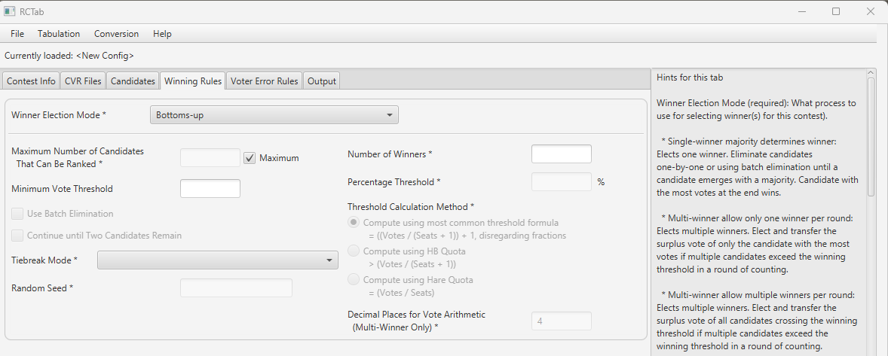


These settings appear on the “Contest Info” tab in RCTab. 


* Contest Name
* Contest Date 
* Contest Jurisdiction
* Contest Office 
* Rules Description 

The tabulator calculates results for one contest at a time, rather than the results of several contests for an election all at once. The information on this tab is for the particular contest you will be tabulating.

These fields do not influence the computations. Contest Name, Contest Date, Contest Jurisdiction, and Contest Office are shown in the final output file(s) to help connect the data (results) with the contest the results belong to. 


* Think long term, e.g. from the perspective of looking at the results files 6 months after the election and wanting to be clear what contest the results belong to.
* You may find it helpful to revisit this tab once you have done a few test runs and see what the output looks like.

Contest Name (required): Enter a name to identify it.

  Examples: City Council 2018, Board of Election Ward 13 2017, Mayor, Referendum 289b

Contest Date (optional): The date on which the election for this contest was run.


* Clear permits user to clear this field
* The calendar button allows a user to navigate through a calendar to select the date of the contest

Contest Jurisdiction (optional): E.g.: Minneapolis, Eastpointe

  Whether this is helpful may depend on what you put into the Contest Name field

Contest Office (optional): E.g.: Mayor, County Clerk

  Whether this is helpful may depend on what you put into the Contest Name field

Rules Description (optional): What short description of this configuration would help you remember in, say, six months what election this specific rule configuration is for? This option’s use impacts no other options. It is included in configuration .json files and audit .log files.


<p id="gdcalert27" ><span style="color: red; font-weight: bold">>>>>>  gd2md-html alert: inline image link here (to images/image21.png). Store image on your image server and adjust path/filename/extension if necessary. </span><br>(<a href="#">Back to top</a>)(<a href="#gdcalert28">Next alert</a>)<br><span style="color: red; font-weight: bold">>>>>> </span></p>


Example Completed Contest Info tab

<h4>CVR Files Options</h4>


This is what the CVR Files tab looks like when a user first navigates to it. 


<p id="gdcalert28" ><span style="color: red; font-weight: bold">>>>>>  gd2md-html alert: inline image link here (to images/image22.png). Store image on your image server and adjust path/filename/extension if necessary. </span><br>(<a href="#">Back to top</a>)(<a href="#gdcalert29">Next alert</a>)<br><span style="color: red; font-weight: bold">>>>>> </span></p>


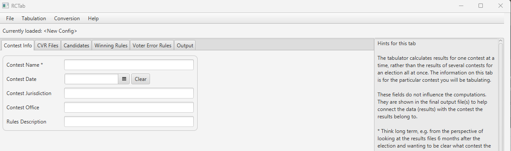


The tabulator needs a configuration file laying out where each of its user’s CVR files for the contest to be tabulated are and how to interpret each of them. Only add files to the configuration that contain data for the contest you are tabulating. CVRs that do not include data for the contest to be tabulated will cause tabulation to fail. Fields used to describe CVRs are on the top half of the tab, while the table on the bottom half of the tab will display each CVR file you have added to your configuration file so far. All information in this tab directs RCTab on where to find files and how to read those files, it does not actually pull in any vote information. Vote information is only used after a user clicks the “Tabulate'' button under “Tabulation” as described later in this guide. 

For each of your CVR files, provide the necessary information and then use the Add button to add it to the list.

Provider (required): The vendor/machine that generated (produced) the file. After you select the field, the tabulator will fill in as many of the other fields as it can, based on what it knows about that provider. You can adjust those values as necessary. Different options are active for different providers. 

See below for a break down of each field and what is require: 

Path (required): Location of the CVR file.


* Example: /Users/test data/2015-portland-mayor-cvr.xlsx
* Select allows a user to navigate using Windows Explorer to select a location. 

Contest ID: Some CVRs assign an ID label to each contest in the CVR. The tabulator needs to know which contest is being tabulated when multiple contests are included in one CVR. Enter the ID of the contest being tabulated in this field.

First Vote Column: the column where the first vote record is.

First Vote Row: the row where the first vote record is.

ID Column: The column the IDs are in. Not all CVR files contain an ID column.

Precinct Column: The column that contains the precinct.

Overvote Delimiter (optional, but must be blank if "Overvote Label" is provided): If using a CVR in ES&S style, overvotes can be reflected in a CVR by displaying all candidates marked at a ranking. Those candidate names will be differentiated from each other by a delimiter, something like a vertical bar | or a slash /. If your overvotes are delimited like this, enter the delimiter used in this field. Note: that ES&S files may include only the label "overvote" and no additional information, in which case the "Overvote Label" field should be used instead.

Overvote Label (optional, but must be blank if Overvote Rule is): Some CDF and ES&S CVRs use a particular word/phrase to indicate an overvote.

Undervote Label(optional): Some ES&S CVRs use a particular word/phrase to indicate an undervote.

Undeclared Write-in Label (optional): Some CVRs use a particular word/phrase to indicate a write-in.

Treat Blank as Undeclared Write-in (optional for ES&S): When checked, the tabulator will interpret blank cells in this ES&S CVR as votes for undeclared write-ins.

Add: Adds CVR to the configuration file. Impacts no other option. Operation impacted by whether required fields (depending on Provider selected) are filled in. 

Clear: Clears all fillable values in CVR Files tab above the CVR Files table. 

Delete Selected: Deletes CVR file information listed in the CVR table. Impacted by and impacts no options.

This guide will now briefly show which provider settings permit users to edit which additional settings.


* Provider options:
    * CDF
    * Clear Ballot
    * Dominion
    * ES&S
    * Hart

<h5></h5>


<h5>CDF</h5>


<p id="gdcalert29" ><span style="color: red; font-weight: bold">>>>>>  gd2md-html alert: inline image link here (to images/image23.png). Store image on your image server and adjust path/filename/extension if necessary. </span><br>(<a href="#">Back to top</a>)(<a href="#gdcalert30">Next alert</a>)<br><span style="color: red; font-weight: bold">>>>>> </span></p>


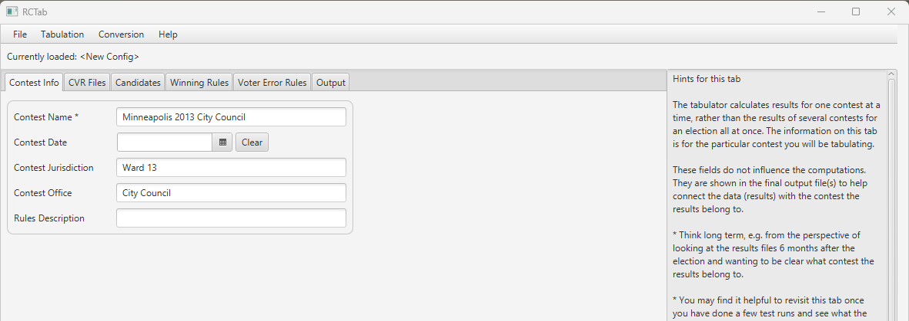


Permits user to edit these options: 


* Path
* Contest ID
* Overvote Label (Default value: overvote)
* Undeclared write-in label

Does not permit user to edit these options: 


* First Vote Column
* First Vote Row
* ID Column
* Precinct Column
* Overvote Delimiter
* Undervote Label
* Treat Blank as Undeclared Write-In


<h5>Clear Ballot</h5>


<p id="gdcalert30" ><span style="color: red; font-weight: bold">>>>>>  gd2md-html alert: inline image link here (to images/image24.png). Store image on your image server and adjust path/filename/extension if necessary. </span><br>(<a href="#">Back to top</a>)(<a href="#gdcalert31">Next alert</a>)<br><span style="color: red; font-weight: bold">>>>>> </span></p>


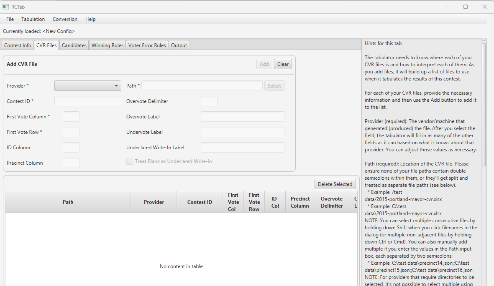


Permits user to edit these options: 


* Path
* Contest ID
* Undeclared Write-In Label

Does not permit user to edit these options: 


* First Vote Column
* First Vote Row
* ID Column
* Precinct Column
* Overvote Delimiter
* Overvote Label
* Undervote Label
* Treat Blank as Undeclared Write-In


<h5>Dominion</h5>


<p id="gdcalert31" ><span style="color: red; font-weight: bold">>>>>>  gd2md-html alert: inline image link here (to images/image25.png). Store image on your image server and adjust path/filename/extension if necessary. </span><br>(<a href="#">Back to top</a>)(<a href="#gdcalert32">Next alert</a>)<br><span style="color: red; font-weight: bold">>>>>> </span></p>


Permits user to edit these options: 


* Path
* Contest ID
* Undeclared Write-In Label

Does not permit user to edit these options: 


* First Vote Column
* First Vote Row
* ID Column
* Precinct Column
* Overvote Delimiter
* Overvote Label
* Undervote Label
* Treat Blank as Undeclared Write-In


<h5>ES&S</h5>


<p id="gdcalert32" ><span style="color: red; font-weight: bold">>>>>>  gd2md-html alert: inline image link here (to images/image26.png). Store image on your image server and adjust path/filename/extension if necessary. </span><br>(<a href="#">Back to top</a>)(<a href="#gdcalert33">Next alert</a>)<br><span style="color: red; font-weight: bold">>>>>> </span></p>


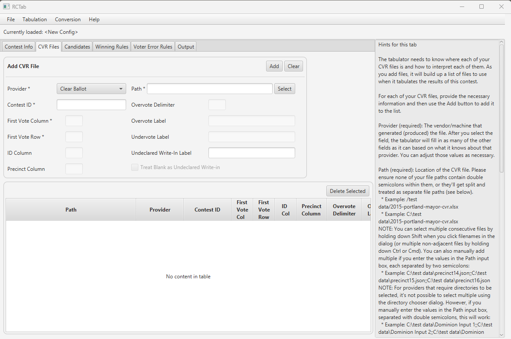


Permits user to edit these options:


* Path
* First Vote Column (Default Value: 4)
* First Vote Row (Default Value: 2)
* ID Column (Default Value: 1)
* Precinct Column (Default Value: 2)
* Overvote Delimiter
* Overvote Label (Default Value:

    overvote)

* Undervote Label (Default Value: undervote)
* Undeclared Write-In Label
* Treat Blank as Undeclared Write-In

Does not permit user to edit this option:


* Contest ID

It is assumed that the ES&S export uses the default settings so below are the ES&S default settings. The user will only need to enter the path, but all other default settings are included. If the default settings are not used in the ES&S export file, the user must determine the values to be used. If defaults are not being used, users should confirm the proper values for First Vote Column, First Vote Row, ID Column, Precinct Column, Overvote Label, Undervote Label, and Undeclared Write-In Label by referencing the CVRs files to be used in the Tabulation. 

The First Vote Column location depends on the information users choose to export in their CVR exports from ES&S’s system. ES&S systems can include individual CVR ID information, Precinct information, and ballot style label information in the first three columns of a CVR, as shown in the below screenshot. Column A (aka Column 1) has CVR ID numbers; Column B (Column 2) has Precinct information, Column C (3) has ballot style information, and Column D (4) includes the first ranking in the RCV contest in this CVR. This is the standard CVR layout for ES&S. More information is available from ES&S. 


<p id="gdcalert33" ><span style="color: red; font-weight: bold">>>>>>  gd2md-html alert: inline image link here (to images/image27.png). Store image on your image server and adjust path/filename/extension if necessary. </span><br>(<a href="#">Back to top</a>)(<a href="#gdcalert34">Next alert</a>)<br><span style="color: red; font-weight: bold">>>>>> </span></p>


CVR exports from ES&S contain columns for each ranking in an RCV contest. See the above screenshot for an example. This screenshot includes the five rankings voters had in the contest, arranged in sequential order. This CVR export included only data for the one RCV contest to be run. The setting “Maximum Number of Candidates That Can Be Ranked” (covered below in Winning Rules) instructs RCTab how many columns to process when running the round-by-round count. If that setting is set to five and the First Vote Column setting is set to four (Column D), RCTab will process this CVR starting at Column D/4 (column number 4) and continue through columns E/5, F/6, G/7, and H/8 - five columns for the five rankings voters have. 


<h5>Hart</h5>


<p id="gdcalert34" ><span style="color: red; font-weight: bold">>>>>>  gd2md-html alert: inline image link here (to images/image28.png). Store image on your image server and adjust path/filename/extension if necessary. </span><br>(<a href="#">Back to top</a>)(<a href="#gdcalert35">Next alert</a>)<br><span style="color: red; font-weight: bold">>>>>> </span></p>


Permits user to edit these options: 


* Path
* Contest ID
* Undeclared Write-In Label

Does not permit user to edit these options: 


* First Vote Column
* First Vote Row
* ID Column
* Precinct Column
* Overvote Delimiter
* Overvote Label
* Undervote Label
* Treat Blank as Undeclared Write-In

**Path:** Select the path of the folder that contains signed Hart CVRs. 

<h4></h4>


<h4>Candidates Tab</h4>


The candidates tab allows users to put in information about how candidates are referred to in cast-vote record files. These settings impact how CVR files are read. Candidate names entered on this tab will also be used to display candidate names in results files. Below is a screenshot of the Candidates Tab when a user first navigates to it. 


<p id="gdcalert35" ><span style="color: red; font-weight: bold">>>>>>  gd2md-html alert: inline image link here (to images/image29.png). Store image on your image server and adjust path/filename/extension if necessary. </span><br>(<a href="#">Back to top</a>)(<a href="#gdcalert36">Next alert</a>)<br><span style="color: red; font-weight: bold">>>>>> </span></p>


Fill in the fields and click the Add button:

Name (required): E.g.: Dave Harris. This information is used to display candidate names in results files. 

Code (optional): Some CVR files use codes in lieu of the full candidate name. E.g.: "JCD" or "14". 

Excluded (optional): When checked, the candidate will be ignored during tabulation. An example of when this might be used: a candidate dropped out after the ballots were printed.

Add: Adds Name, code, and/or excluded information to the Candidates Table. 

Clear: Clears any information in Name, Code, and Excluded. 

Delete Selected: Deletes selected candidate data from the Candidate Table. 

Below is a screenshot of an example of a Candidates Tab while being filled out:


<p id="gdcalert36" ><span style="color: red; font-weight: bold">>>>>>  gd2md-html alert: inline image link here (to images/image30.png). Store image on your image server and adjust path/filename/extension if necessary. </span><br>(<a href="#">Back to top</a>)(<a href="#gdcalert37">Next alert</a>)<br><span style="color: red; font-weight: bold">>>>>> </span></p>


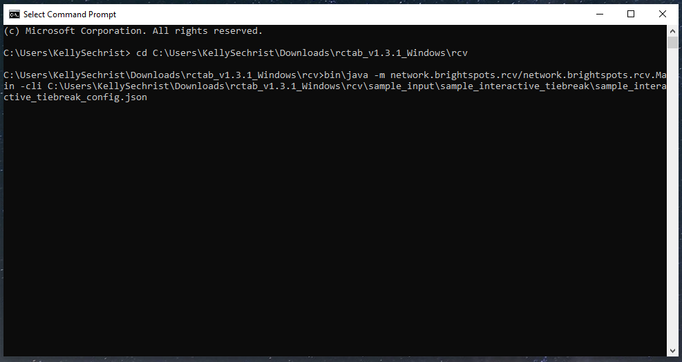


<h4>Winning Rules Options</h4>


Winning Rules options tell RCTab what kind of ranked choice voting election to run and how to handle details required for each kind of ranked choice voting RCTab can run. 

This is a screenshot of what winning rules look like when a user first navigates to them. 


<p id="gdcalert37" ><span style="color: red; font-weight: bold">>>>>>  gd2md-html alert: inline image link here (to images/image31.png). Store image on your image server and adjust path/filename/extension if necessary. </span><br>(<a href="#">Back to top</a>)(<a href="#gdcalert38">Next alert</a>)<br><span style="color: red; font-weight: bold">>>>>> </span></p>


There are two main sets of options on the Winning Rules tab: Winner Election Mode options and Tiebreak Mode options.

Winner election mode options have many options that interact in many different ways. Which options are required and which options users can edit ultimately depend on the winner election mode option itself. Options are described below. Screenshots are then provided of each interface for each winner election mode. 

Winner Election Mode (required): What process to use for selecting winner(s) for this contest.


* Single-winner majority determines winner: Elects one winner. Eliminate candidates one-by-one or using batch elimination until a candidate emerges with a majority. Candidate with the most votes at the end wins.
* Multi-winner allows only one winner per round: Elects multiple winners. Elect and transfer the surplus vote of only the candidate with the most votes if multiple candidates exceed the winning threshold in a round of counting.
* Multi-winner allows multiple winners per round: Elects multiple winners. Elect and transfer the surplus vote of all candidates crossing the winning threshold if multiple candidates exceed the winning threshold in a round of counting.
* Bottoms-up: Eliminate candidates until the desired number of winners is reached, then stop. Bottoms up does not transfer surplus votes.
* Bottoms-up using percentage threshold: Elects multiple winners. Eliminate candidates until the remaining candidates have a vote share equal to or greater than a specified percentage of the vote.
* Multi-pass IRV: Elects multiple winners. Eliminate candidates one-by-one or using batch elimination until only two candidates remain. Candidate with the most votes at the end wins. Run a new set of rounds with any winning candidates ignored.

Maximum Number of Candidates That Can Be Ranked (required): How many rankings each voter has in this contest. This tells RCTab how many rankings to read from each CVR. This option can be filled out in the text box or by selecting a checkbox. Selecting the checkbox disables the text box option and inserts the value “maximum”. The checkbox can be unselectedDefault value: Maximum. Available in all winner election modes. 

Minimum Vote Threshold (optional): The number of first-choice votes a candidate must receive in order to remain in the race. Any candidates falling below the minimum vote threshold are eliminated and have their votes transferred. Most jurisdictions do not set a minimum vote threshold. Note that if no candidate exceeds the minimum vote threshold, vote tabulation will silently fail. Be sure not to set a minimum vote threshold beyond the number of votes candidates have. This option can impact how any winner election mode tabulation runs. Its validity is not impacted by any other option. Available in all winner election modes. 

Use Batch Elimination (optional): Batch elimination, or simultaneous elimination of all candidates for whom it is mathematically impossible to be elected, eliminates all candidates who cannot receive enough votes to surpass the candidate with the next highest number of votes. Example: in a six candidate contest with 200 votes, Candidate A has 80 votes, Candidate B has 70, and the other four combined have 50. Because those four candidates can never combine their votes to surpass Candidate B, they can be batch eliminated. This option impacts how single-winner majority determines winner tabulation runs. Its validity is impacted by the winner election mode. It will not impact who wins the election. Available only when Winner Election Mode is "Single-winner majority determines winner". 

Continue until Two Candidates Remain (optional): Single-winner ranked choice voting elections can stop as soon as a candidate receives a majority of votes, even though 3 or more candidates may still be in the race. Selecting this option will run the round-by-round count until only two candidates remain, regardless of when a candidate wins a majority of votes. It will not impact who wins the election.  Available only when Winner Election Mode is "Single-winner majority determines winner".

Number of Winners (required): The number of seats to be filled in the contest. This option impacts the calculation of the election threshold. Its validity and editability is impacted by the winner election mode. It sets the value for “S” in the calculations described in the UI/configuration file parameters. Available and required for Multi-winner allow only one winner per round, Multi-winner allow multiple winners per round, Bottoms-up, and Multi-pass IRV. Set to 1 by RCTab for Single-winner majority determines winner. 


* Note that multi-pass IRV does not use this value to calculate its election threshold. The election threshold in multi-pass IRV is always calculated using an S value of 1. This number is used in multi-pass IRV to determine how many instances of a single-winner majority determines winner tabulation must be run on CVR files. See Configuration Parameters for more details. 

Percentage Threshold: The share of votes a candidate must have in order to win. Used to calculate the election threshold in “Bottoms-up using percentage threshold.” Candidates falling below this threshold are eliminated one-by-one beginning with the candidate with the fewest votes. Required and Available only when Winner Election Mode is "Bottoms-up using percentage threshold".

Threshold Calculation Method: The threshold of election is the number of votes a candidate must receive in order to win the election. There are three primary ways to calculate the threshold of election in multi-winner RCV contests. This will be set in law (either by statute or regulation) in your jurisdiction. Required and available only when Winner Election Mode is "Multi-winner allow only one winner per round" or "Multi-winner allow multiple winners per round".


* **Compute using most common threshold formula**: The most common threshold formula is calculated by dividing the number of votes by the number of seats plus one, then adding one to that number. Fractions are disregarded. This is also known as the Droop quota. Candidates must receive this number of votes (or more) to win. This is the default threshold calculation. 
* **Compute using HB Quota**: The HB, or Hagenbach-Bischoff, Quota divides the number of votes by the number of seats plus one, leaving fractions. Candidates must receive more than this number of votes to win.
* **Compute using Hare Quota**: The Hare quota divides the number of votes by the number of seats. Fractions are disregarded. It requires candidates to receive that number of votes (or more) to win. 

Decimal Places for Vote Arithmetic (Multi-Winner Only): Sets how many decimal places after the decimal point are used in surplus transfers and in calculating the threshold. Its validity and editability is impacted by the winner election mode. Required and available only when Winner Election Mode is "Multi-winner allow only one winner per round" or "Multi-winner allow multiple winners per round". Default value: 4. 

**Tiebreaking**

There are six tiebreak modes (described in technical detail in **RCTab v1.3.2 Section 25 - Configuration File Parameters v.1.1.1**). Tiebreak modes impact the validity/operation of one other option: random seed. Tiebreak mode is required for all winner election modes.

Tiebreak Mode (required for all winner election modes): Ties in ranked choice voting contests can occur when eliminating candidates or when electing candidates. All winner election modes may have a tie for last place. Tiebreak mode breaks the tie and determines which candidate loses the tie. Multi-winner allows only one winner per round contests can have ties between candidates who have both crossed the threshold of election; in that case, ties are broken to determine whose surplus vote value transfers first. Tiebreak procedures are set in law, either in the ranked choice voting law used in your jurisdiction or in the elections code more generally. Select the option from this list that complies with the law and procedure in your jurisdiction.


* Random: Randomly select a tied candidate to eliminate or, in multi-winner allow only one winner per round contests only, elect. Requires a random seed.
* Stop counting and ask: Pause count when a tie is reached.  The user is prompted to select any tied candidate to eliminate or, in multi-winner allow only one winner per round contests only, elect.
* Previous round counts (then random): The tied candidate with the least votes in the previous round loses the tie. If there is a tie in the previous round, the tie is broken randomly. Requires a random seed.
* Previous round counts (then stop counting and ask): The tied candidate with the least votes in the previous round loses the tie. If there is a tie in the previous round, the user is prompted to select any tied candidate to eliminate or, in multi-winner allow only one winner per round contests only, elect.
* Use candidate order in the config file: Use the order of candidates in the config file to determine tiebreak results. Candidates lower in the list lose the tiebreaker.
* Generate permutation: Generate a randomly ordered list of candidates in the contest. Candidates lower in the permutation lose the tiebreaker. Requires a random seed.

Random Seed (required if Tiebreak Mode is "Random", "Previous round counts (then random)", or "Generate permutation"): Enter a positive or negative integer to generate random orders. Impacts operation of randomized functions for tiebreaking. Unavailable if Tiebreak Mode is Stop Counting and Ask, Previous round counts (then stop counting and ask) or Use candidate order in the config file. 

Following are screenshots of each of the winning rules interfaces on RCTab. 


<h5>Single-winner majority determines winner</h5>


<p id="gdcalert38" ><span style="color: red; font-weight: bold">>>>>>  gd2md-html alert: inline image link here (to images/image32.png). Store image on your image server and adjust path/filename/extension if necessary. </span><br>(<a href="#">Back to top</a>)(<a href="#gdcalert39">Next alert</a>)<br><span style="color: red; font-weight: bold">>>>>> </span></p>


Permits user to edit these options (required settings denoted with *): 


* Maximum Number of Candidates That Can Be Ranked*
* Minimum Vote Threshold
* Use Batch Elimination
* Continue until Two Candidates Remain
* Tiebreak Mode*
* Random Seed (* if using randomized)

Automatically fills in and locks this option:


* Number of Winners*

Invalid options, locked for this mode: 


* Percentage Threshold
* Threshold Calculation Method
* Decimal Places for Vote Arithmetic


<h5>Multi-winner allow only one winner per round</h5>


<p id="gdcalert39" ><span style="color: red; font-weight: bold">>>>>>  gd2md-html alert: inline image link here (to images/image33.png). Store image on your image server and adjust path/filename/extension if necessary. </span><br>(<a href="#">Back to top</a>)(<a href="#gdcalert40">Next alert</a>)<br><span style="color: red; font-weight: bold">>>>>> </span></p>


Permits user to edit these options (required settings denoted with *): 


* Maximum Number of Candidates That Can Be Ranked*
* Minimum Vote Threshold
* Tiebreak Mode*
* Random Seed (* if using randomized tiebreak mode)
* Number of Winners*
* Threshold Calculation Method*
* Decimal Places for Vote Arithmetic*


Invalid options, locked for this mode:


* Percentage Threshold
* Use Batch Elimination
* Continue until Two Candidates Remain

<h5></h5>


<h5>Multi-winner allow multiple winners per round</h5>


<p id="gdcalert40" ><span style="color: red; font-weight: bold">>>>>>  gd2md-html alert: inline image link here (to images/image34.png). Store image on your image server and adjust path/filename/extension if necessary. </span><br>(<a href="#">Back to top</a>)(<a href="#gdcalert41">Next alert</a>)<br><span style="color: red; font-weight: bold">>>>>> </span></p>


Permits user to edit these options (required settings denoted with *):


* Maximum Number of Candidates That Can Be Ranked*
* Minimum Vote Threshold
* Tiebreak Mode*
* Random Seed (* if using randomized tiebreak mode)
* Number of Winners*
* Threshold Calculation Method*
* Decimal Places for Vote Arithmetic*

Invalid options, locked for this mode:


* Use Batch Elimination
* Continue until Two Candidates Remain
* Percentage Threshold


<h5>Bottoms-Up</h5>


<p id="gdcalert41" ><span style="color: red; font-weight: bold">>>>>>  gd2md-html alert: inline image link here (to images/image35.png). Store image on your image server and adjust path/filename/extension if necessary. </span><br>(<a href="#">Back to top</a>)(<a href="#gdcalert42">Next alert</a>)<br><span style="color: red; font-weight: bold">>>>>> </span></p>


Permits user to edit these options (required settings denoted with *): 


* Maximum Number of Candidates That Can Be Ranked*
* Minimum Vote Threshold
* Tiebreak Mode*
* Random Seed (* if using randomized tiebreak mode)
* Number of Winners*


Invalid options, locked for this mode: 


* Use Batch Elimination
* Continue until Two Candidates Remain
* Percentage Threshold
* Threshold Calculation Method
* Decimal Places for Vote Arithmetic

<h5>Bottoms-up using percentage threshold</h5>


<p id="gdcalert42" ><span style="color: red; font-weight: bold">>>>>>  gd2md-html alert: inline image link here (to images/image36.png). Store image on your image server and adjust path/filename/extension if necessary. </span><br>(<a href="#">Back to top</a>)(<a href="#gdcalert43">Next alert</a>)<br><span style="color: red; font-weight: bold">>>>>> </span></p>


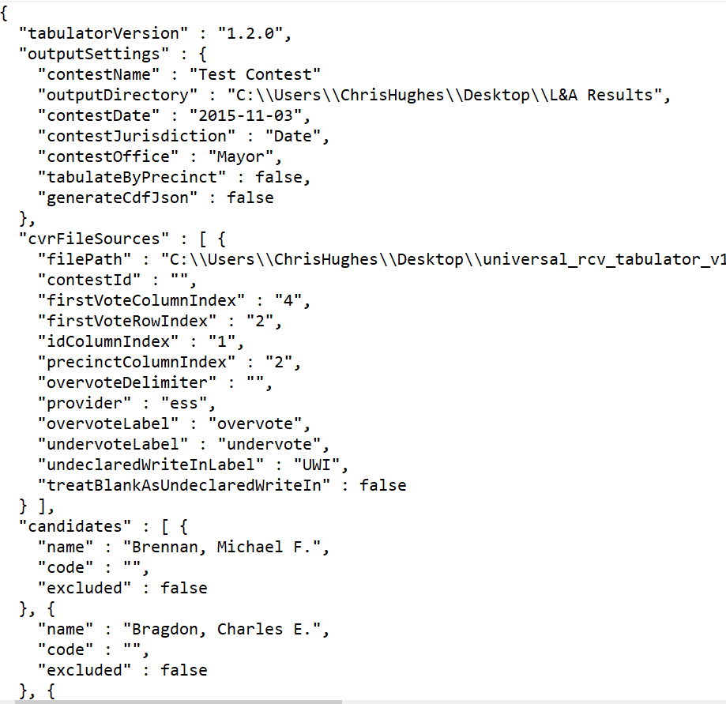


Permits user to edit these options (required settings denoted with *): 


* Maximum Number of Candidates That Can Be Ranked*
* Minimum Vote Threshold
* Tiebreak Mode*
* Random Seed (* if using randomized tiebreak mode)
* Percentage Threshold*

Automatically fills in and locks this option:


* Number of Winners*

Invalid options, locked for this mode: 


* Use Batch Elimination
* Continue until Two Candidates Remain
* Threshold Calculation Method
* Decimal Places for Vote Arithmetic


<h5>Multi-pass IRV</h5>


<p id="gdcalert43" ><span style="color: red; font-weight: bold">>>>>>  gd2md-html alert: inline image link here (to images/image37.png). Store image on your image server and adjust path/filename/extension if necessary. </span><br>(<a href="#">Back to top</a>)(<a href="#gdcalert44">Next alert</a>)<br><span style="color: red; font-weight: bold">>>>>> </span></p>


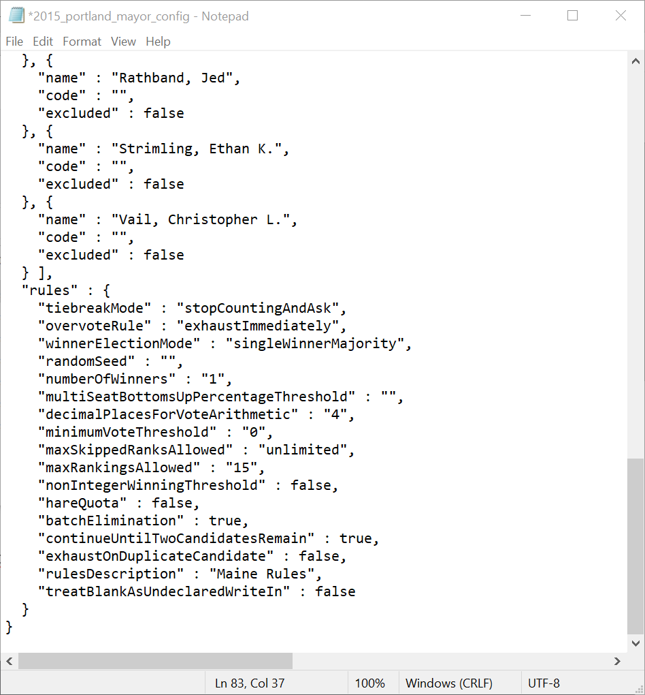


Permits user to edit these options (required settings denoted with *): 


* Maximum Number of Candidates That Can Be Ranked*
* Minimum Vote Threshold
* Tiebreak Mode*
* Random Seed (* if using randomized tiebreak mode)
* Number of Winners*

Invalid options, locked for this mode: 


* Use Batch Elimination
* Continue until Two Candidates Remain
* Threshold Calculation Method
* Decimal Places for Vote Arithmetic
* Percentage Threshold


<h5>Tiebreak Modes</h5>


**Random, Generate Permutation, Previous Round Counts (then random)**

If users select any of the tiebreaking modes that incorporate randomness (random, generate permutation, previous round counts (then random)) this is how RCTab will appear. Users must fill out the Random Seed setting. 


<p id="gdcalert44" ><span style="color: red; font-weight: bold">>>>>>  gd2md-html alert: inline image link here (to images/image38.png). Store image on your image server and adjust path/filename/extension if necessary. </span><br>(<a href="#">Back to top</a>)(<a href="#gdcalert45">Next alert</a>)<br><span style="color: red; font-weight: bold">>>>>> </span></p>


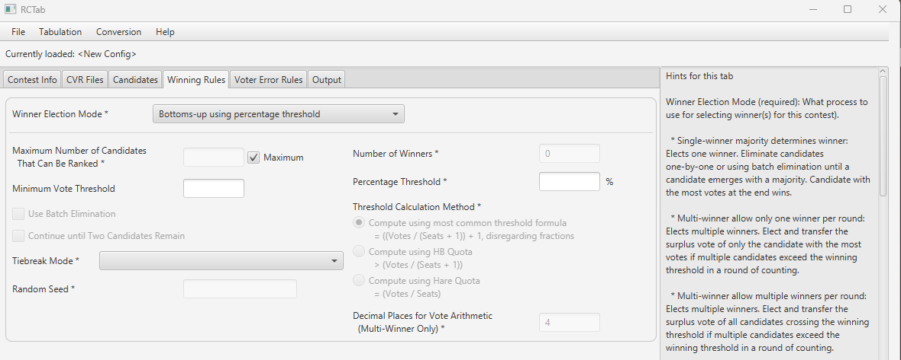


**Stop counting and ask, previous round counts (then stop counting and ask), use candidate order in the config file**

If users select any of the tiebreaking modes that incorporate user input (Stop counting and ask, previous round counts (then stop counting and ask), use candidate order in the config file) this is how RCTab will appear. The Random Seed field will be locked. 


<p id="gdcalert45" ><span style="color: red; font-weight: bold">>>>>>  gd2md-html alert: inline image link here (to images/image39.png). Store image on your image server and adjust path/filename/extension if necessary. </span><br>(<a href="#">Back to top</a>)(<a href="#gdcalert46">Next alert</a>)<br><span style="color: red; font-weight: bold">>>>>> </span></p>


<h4>Voter Error Rules</h4>


The tabulator needs to know how to handle voter errors in your jurisdiction. These requirements are typically included in statute or regulation. This is a screenshot of what winning rules looks like when a user first navigates to it. 

 

<p id="gdcalert46" ><span style="color: red; font-weight: bold">>>>>>  gd2md-html alert: inline image link here (to images/image40.png). Store image on your image server and adjust path/filename/extension if necessary. </span><br>(<a href="#">Back to top</a>)(<a href="#gdcalert47">Next alert</a>)<br><span style="color: red; font-weight: bold">>>>>> </span></p>


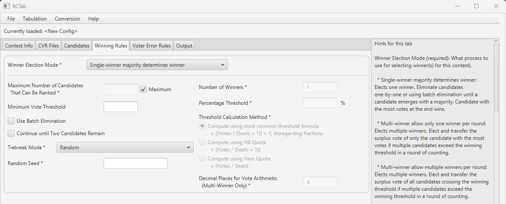


Overvote Rule (required): How to handle a ballot where a voter has marked multiple candidates at the same ranking when that ballot is encountered in the round-by-round count.


* Always skip to next rank: Skips over an overvote and goes to the next validly-marked ranking on a ballot.
    * Requires Overvote Label to be supplied (when overvote label can be edited)
* Exhaust immediately: A ballot with an overvote exhausts when that overvote is encountered in the rounds of counting.
    * Requires overvote label to be supplied (when overvote label can be edited)
* Exhaust if multiple continuing: If a voter has an overvote but only one candidate at that overvote is still in the race when that overvote is encountered, the ballot counts for that candidate. If multiple candidates at the overvote are still in the race, the ballot exhausts.
    * Requires overvote delimiter to be supplied (when overvote delimiter can be edited)

How Many Consecutive Skipped Ranks Are Allowed (required): How many rankings in a row can a voter skip and still have later rankings count? 0 allows no skipped rankings. 1 allows voters to skip rankings one at a time, but not more than 1 in a row, and so on. Selecting the checkbox disables the text box and inserts the value “unlimited”. Checkbox can be unselected. Default value: 1. 

  Example: A voter could rank in 1, 3, 5 and not exhaust under this rule, for example.

Exhaust on Multiple Ranks for the Same Candidate (optional): When checked, the tabulator will exhaust a ballot that includes multiple rankings for the same candidate when that repeat ranking is reached. When unchecked repeated rankings will not exhaust the ballot.

Example: A voter ranks the same candidate 1st and 3rd, a different candidate 2nd, and another candidate 4th. If their original first choice and their second choice are eliminated, the ballot exhausts when it reaches the repeat ranking in rank 3. The ranking in the 4th rank does not count.

Below is an example screenshot of a sample filled-out voter error rules tab. The user has selected Always skip to next rank for Overvote, has selected unlimited for How Many Consecutive Skipped Ranks Are Allowed (making the text box inoperable) and has left Exhaust on Multiple Ranks for the Same Candidate blank. 


<p id="gdcalert47" ><span style="color: red; font-weight: bold">>>>>>  gd2md-html alert: inline image link here (to images/image41.png). Store image on your image server and adjust path/filename/extension if necessary. </span><br>(<a href="#">Back to top</a>)(<a href="#gdcalert48">Next alert</a>)<br><span style="color: red; font-weight: bold">>>>>> </span></p>


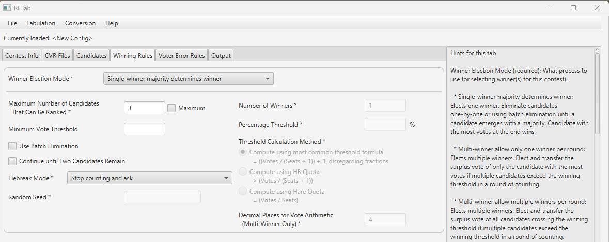


<h4></h4>


<h4>Output Tab</h4>


Tell the tabulator where results files go and what additional results files you want. This is a screenshot of what output looks like when a user first navigates to it.


<p id="gdcalert48" ><span style="color: red; font-weight: bold">>>>>>  gd2md-html alert: inline image link here (to images/image42.png). Store image on your image server and adjust path/filename/extension if necessary. </span><br>(<a href="#">Back to top</a>)(<a href="#gdcalert49">Next alert</a>)<br><span style="color: red; font-weight: bold">>>>>> </span></p>


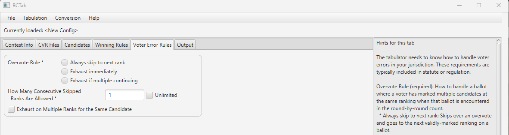


Output directory: One folder per contest tabulated should be created. Output directory instructs RCTab where to save any output files from successful RCTab tabulations. The location where results files will go. If no value (or a relative path, like "output") is supplied, the location where the config file is saved will be used as the base directory. Absolute paths, like "C:\output" work too. Select allows users to navigate through Explorer to select a location. 

RCTab will not allow the output path to be configured to a Windows user account folder (by default anything under the path `c:\users\`). This requirement ensures read-only output. You **must** follow the instructions in **RCTab v1.3.2 Section 22 - Installation Instructions for Windows OS v.1.2.2 **to set permissions on the output folder. Following these instructions ensures that the ‘RCTab’ user account cannot edit or delete RCTab summary output files or audit logs. 

Tabulate by Precinct: Produce round-by-round results at the precinct level. Results are how ballots at the precinct level transferred in the contest as a whole, not a simulated round-by-round count in the precinct. Requires precinct information in CVR Files tab for ES&S CVRs. Impacts which files are written to the output directory.

Generate a CDF JSON: Produce a VVSG common data format JSON file of the CVR. Impacts which files are written to the output directory. 

<h3></h3>


<h3>Generating Results Files </h3>


<h4>Validating Configuration files</h4>


Once a configuration file is successfully created, the user must validate the configuration file. 


1. Click on “Tabulation” at the top of the software window
2. Click on “Validate”
3. Refer to the log box at the bottom of the application. If the message “Contest config validation successful.” appears, your contest configuration has been successfully completed. 
4. If any error messages appear in the log box, refer to **RCTab v1.3.2 Section 29 - RCTab Operator Log Messages v.1.2.2 **and messages in the log box for how to resolve errors. If the error persists, restart the RCTab software

<h4>Saving Configuration Files</h4>


Once ready to run a tabulation, the user must first save the configuration file. 


1. Click on “File” at the top of the software window
2. Click on “Save…”
3. Select a location to save the configuration file. The manufacturer suggests users save the configuration file to the same location set in the Output Directory setting. 
4. Refer to the log box at the bottom of the application. If the message “Successfully saved file: Filepath” your configuration .json file has been successfully saved. 
5. If any error messages appear in the log box, refer to 430 RCTab Operator Log Messages documentation and messages in the log box for how to resolve errors. If the error persists, restart RCTab software. 

<h4>Running a Tabulation</h4>


Once a configuration is saved, the user is ready to run a tabulation. 


1. Click on “Tabulation” at the top of the software window
2. Click on “Tabulate” 
3. Tabulation will begin. 
4. If all the above steps were successfully completed, Tabulation will run until complete. 
5. Tabulator log box will update with messages as Tabulation proceeds. 
6. Once complete, the Tabulator log box will display a message stating “Results written to: [filepath from Output Directory]”

Output files will be: 


* `.csv` contest summary files
    * `summary.csv `Whole-contest summary file
    * `summary.csv.hash `Corresponding hash file. This contains the hash to verify the results in `summary.csv`
    * Precinct-by-precinct summary files (if tabulating by precinct)
* `.json` contest summary files
    * `summary.json` Whole-contest summary file
    * summary.json.hash Corresponding hash file. This contains the hash to verify the results in `summary.json`
    * Precinct-by-precinct summary files (if tabulating by precinct)
* `.log` audit files
    * .log audit files are exported in 50MB sections. If a .log file exceeds 50MB an additional .log file is started by RCTab
    * Corresponding <code>audit_<em>N</em>.log.hash</code> file. This contains the hash to verify the information in each <code>audit_<em>N</em>.log file</code>
* .json CDF (common data format) files if Generate a CDF JSON is checked

If necessary<strong>, </strong>instructions for verifying result file hashes can be found in<strong> </strong><strong>.</strong>

Users can then navigate to “File” and click “Exit” if all contests are tabulated. 

If more contests remain to be tabulated, and contests will contain fewer than 1,000,000 total votes, user can navigate to “File” and click “New.” This will clear all fields in RCTab and permit the user to create a new configuration file. 

If contests to be tabulated will contain more than 1,000,000 total votes, return to start of guide and re-launch tabulator according to large configuration launch requirements. Then follow the guide to set up a configuration file. 

If any errors arise in the use of RCTab, refer to **RCTab v1.3.2 Section 29 - RCTab Operator Log Messages v.1.2.2**. Errors arising out of any hardware or software other than RCTab should refer to **RCTab v1.3.2 Section 09 - System Maintenance Manual v.1.3.2** and any relevant user and maintenance manuals.

Before publishing results, jurisdictions should use their established reconciliation procedures to ensure total votes counted in each round equals total ballots cast in the contest. If numbers in the reconciliation process do not match, the user should double-check that all CVRs for that contest were exported successfully from the voting system and run RCTab process for that contest again.  Rely on user jurisdiction CVR handling procedures for transmitting CVRs. 

Any interaction with RCTab, including producing configuration files, running tabulations, hashing results files, and transmission of files from RCTab on USB drives should follow transmission procedures required in the jurisdiction, including the use of a team of no less than two trained personnel.

Required capabilities that may be bypassed or deactivated during installation or operation by the user shall be clearly indicated.

Additional capabilities that function only when activated during installation or operation by the user shall be clearly indicated.

Additional capabilities that normally are active but may be bypassed or deactivated during installation or operation by the user shall be clearly indicated.

The installation process for RCTab software does not give users the opportunity to bypass or deactivate options or settings.

Capabilities that are active or inactive in software operation depend on various factors. Many of these factors are laid out above. Configuration files determine which system capabilities apply to a given set of voting data. More information about operations that users can set through the user interface is provided in **RCTab v1.3.2 Section 25 - Configuration File Parameters v.1.1.1**. Information about the operation of those settings is also provided in **RCTab v1.3.2 Section 02 - Software Design and Specifications v.1.4.2.**

<h3>Configuration File Parameters and UI Label Match Sheet</h3>


Below is a list of all configuration file parameter labels and their corresponding labels in RCTab UI. Labels are organized by the order of their appearance in the RCTab UI. 

**Configuration File Parameters Name/Label	|	UI Name/Label**

contestName					  |	Contest Name

contestDate					  | 	Contest Date

contestJurisdiction				  |	Contest Jurisdiction

contestOffice					  |	Contest Office

rulesDescription				  	  |	Rules Description

provider					  |	Provider

cdf						  |	CDF

clearBallot					  |	Clear Ballot

Dominion					  |	Dominion

ess						  |	ES&S

hart						  |	Hart

filePath					               |	Path

contestId					  |	Contest ID

firstVoteColumnIndex				  |	First Vote Column

firstVoteRowIndex				  |	First Vote Row

idColumnIndex				               |	ID Column

precinctColumnIndex				  |	Precinct Column

overvoteDelimiter				  |	Overvote Delimiter

overvoteLabel					  |	Overvote Label

undervoteLabel				               |	Undervote Label

undeclaredWriteInLabel			 	  |	Undeclared Write-in Label

treatBlankAsUndeclaredWriteIn		               |	Treat Blank as Undeclared Write-In

name						  |	Name

code						  |	Code

excluded					  |	Excluded

winnerElectionMode				  |	Winner Election Mode

singleWinnerMajority				  |          Single-Winner Majority Determines Winner

multiWinnerAllowOnlyOneWinnerPerRound	  |          Multi-Winner Allow Only One Winner Per Round

multiWinnerAllowMultipleWinnersPerRound	  |          Multi-Winner Allow Multiple Winners Per Round

bottomsUp					  |	Bottoms-up

bottomsUpUsingPercentageThreshold	               |          Bottoms-up using Percentage Threshold

multiPassIrv					  |	Multi-Pass IRV

maxRankingsAllowed			               |          Maximum Number of Candidates That Can Be Ranked

minimumVoteThreshold			               |	Minimum Vote Threshold

batchElimination				  |	Use Batch Elimination

continueUntilTwoCandidatesRemain		  |	Continue Until Two Candidates Remain

tiebreakMode					  |	Tiebreak Mode

random					             |	Random

stopCountingAndAsk				  |	Stop counting and ask

previousRoundCountsThenRandom		|          Previous Round Counts (then random)

prevousRoundCountsThenAsk	                          |          Previous Round Counts (then stop counting       					                                     and ask)

useCandidateOrder				|          Use candidate order in config file

generatePermutation				|          Generate permutation

randomSeed					|          Random Seed

numberOfWinners				|          Number of Winners

multiSeatBottomsUpPercentageThreshold	|          Percentage Threshold

nonIntegerWinningThreshold		  	|          Compute using HB Quota >(Votes/ (Seats +                                                                                                        1))

hareQuota					|          Compute using Hare Quota =(Votes/Seats)

decimalPlacesForVoteArithmetic		    	|         Decimal Places for Vote Arithmetic (Multi-Winner Only)

overvoteRule					|          Overvote Rule

alwaysSkipToNextRank				|          Always skip to next rank

ExhaustImmediately				|          Exhaust Immediately

exhaustIfMultipleContinuing			|          Exhaust if multiple continuing

maxSkippedRanksAllowed		             |          How Many Consecutive Skipped Ranks Are Allowed

exhaustOnDuplicateCandidate	                          |           Exhaust on Multiple Ranks for the Same Candidate

outputDirectory 				             |         Output Directory

tabulateByPrecinct				|         Tabulate by Precinct

generateCdfJson				|         Generate CDF JSON


<table>
  <tr>
   <td colspan="4" ><strong>Document Revision History</strong>
   </td>
  </tr>
  <tr>
   <td><strong>Date</strong>
   </td>
   <td><strong>Version</strong>
   </td>
   <td><strong>Description</strong>
   </td>
   <td><strong>Author</strong>
   </td>
  </tr>
  <tr>
   <td>
   </td>
   <td>1.0.0
   </td>
   <td>2.0 Initial 
   </td>
   <td>Mathew Ruberg
   </td>
  </tr>
</table>


<h2></h2>


Ranked choice voting is an umbrella term for a collection of voting methods where voters rank candidates in order of preference and votes are counted in rounds. Ranked choice voting elections occur in a series of rounds. Those rounds can consist of counting votes, eliminating candidates, transferring votes from eliminated candidates, electing candidates, and transferring surplus votes from elected candidates. Ranked choice voting is counted at both the granular ballot-by-ballot level and at a contest-wide level. In other words, counting RCV requires knowing details of how every individual ballot is marked as well as the total number of votes for each candidate at each stage of the RCV count. 

The following is an enumeration and discussion of the various tabulation options that exist for Ranked Choice Voting (RCV) elections. Also included is a glossary of ranked choice voting terms. This same glossary is included in **RCTab v1.3.2 Section 18 - User Guide v.1.2.2**. 

 

Counting RCV elections proceeds as follows: all first-choice rankings are counted first. If no candidate receives a specified number of votes necessary for election (typically known as the threshold of election), then the candidate with the fewest votes is eliminated. Ballots counting for that candidate then transfer to the next-ranked candidate on each ballot. These rounds of counting, elimination, and redistribution recur until all seats up for election are filled. In some multi-winner variations of RCV, candidates who receive more votes than necessary to be elected – those candidates whose vote totals exceed the threshold of election – are deemed to have surplus votes. If a candidate has a surplus, the next step in counting is to transfer that surplus.  Surplus votes are transferred in various ways, but they follow the same logic as elimination transfers: each ballot counting for a candidate with surplus votes transfers vote value to the next-ranked candidate on that ballot.

 

There are many variations used in processing contest selections to determine the candidates that are elected. Voting the ballot is the same amongst the variants although the presentation of ballot design may vary. This document addresses all variations currently in use in the United States, which fall into two major categories: single-winner RCV and variants of RCV electing multiple candidates. **Single-winner RCV** is also known as Instant Runoff Voting (IRV). Variants of RCV that elect multiple candidates include **multi-winner Ranked Choice Voting** (also known as the Single Transferable Vote (STV) and Proportional ranked choice voting), **Multi-Pass IRV** (also known as block-preferential voting), **Bottoms-Up RCV**, and **Bottoms-Up RCV with Percentage Threshold**. All use multi-round processing methods to determine the outcome(s) and require the full set of ballots or cast vote records (CVRs), for RCV contests to be processed. Purposes of this method include avoiding holding a separate runoff election, eliminating the effect of vote splitting or implementing proportional representation in multi-member representative bodies.  

 

The processing used in each single-winner RCV round, if there is no apparent winner, is as follows. The candidate with the lowest vote total in the round is considered eliminated.  Each CVR containing the eliminated candidate as the current 1st choice is processed to count for the next highest-ranked continuing candidate (one that has not been eliminated). If there are no choices left on a given ballot, that ballot is considered exhausted and inactive for any subsequent rounds. The new round tabulates totals and determines whether a candidate now has sufficient votes to be elected. If not, the process is repeated round-by-round until a candidate has sufficient votes to win.

 

In single-winner RCV, once a candidate has sufficient votes to be elected (This typically means once a candidate has a majority of votes in a round, but see item 1 for more detail.) tabulation will stop.

 

In bottoms-up RCV, bottoms-up RCV with percentage threshold, and multi-pass IRV, tabulation proceeds in much the same way. Votes are counted, candidates with the fewest votes are eliminated, and votes transfer to the next candidate on each of those ballots. In bottoms-up RCV, these rounds of counting recur until there are as many candidates left as there are seats to fill. In bottoms-up RCV with percentage threshold, these rounds of counting recur until all candidates remaining have a share of votes equal to or greater than the percentage threshold. In multi-pass IRV, counting proceeds slightly differently. Multi-Pass IRV uses single-winner IRV for multi-winner contests by electing candidates one at a time. The same process for counting rounds as described above is followed. The count is then reset and run again, but any rankings for an elected candidate are ignored. These passes of IRV are run multiple times until all seats are filled. This method is not designed to guarantee proportional representation, in contrast to STV which was designed with the intent to provide proportional representation.

 

In multi-winner ranked choice voting (aka single-transferable vote or proportional RCV), rounds operate somewhat differently. Elimination operates in the same way as all of the above: If no candidate receives a previously specified number of votes necessary for election (typically known as the threshold of election), then the candidate with the fewest votes is eliminated. Ballots counting for that candidate then transfer to the next-ranked candidate on each ballot. Where counting differs, however, is when a candidate receives enough votes to win. If a candidate receives more votes than necessary to be elected – if their vote total exceeds the threshold of election – they are deemed to have surplus votes. If a candidate has a surplus, the next step in counting is to transfer that surplus.  Surplus votes are transferred in various ways, but they follow the same logic as elimination transfers: each ballot counting for a candidate with surplus votes transfers vote value to the next-ranked candidate on that ballot. In multi-winner RCV, rounds of elimination and election recur until all seats up for election are filled.

 

Note that in both multi-pass IRV and multi-winner RCV, once a candidate is declared elected they cannot receive any more votes from vote transfers.

There is variation in how each of the above tabulation methods actually operate on the round-by-round and ballot-by-ballot level. Variations related to how overvotes, repeated ranking, skipped rankings, candidate elimination, surplus transfers, thresholds, ties and other factors are handled. Each of these possible variations is described above. When a variation applies to a specific type of RCV, that will be noted. Example variations are briefly described in the bulleted list below:  


* Handling an overvoted choice during round-by-round processing – Is the ballot considered exhausted or is the choice skipped and the ballot checked for a subsequent continuing candidate?
* Handling an omitted choice/ranking during round-by-round processing  – Is the choice skipped?  Does this cause the ballot to exhaust, are skipped rankings ignored or is one skipped ranking ignored but two skipped rankings in succession exhaust the ballot?
* Handling of a repeat ranking (selecting the same candidate for more than one ranking) during the round-by-round processing – Is the repeated rank skipped in the same way as an omitted ranking or is the ballot considered exhausted? 
* Handling of candidate elimination – Are all candidates who have no mathematical chance of advancing concurrently eliminated in the first round only, in any round or is only one candidate eliminated in any round and multiple eliminations of candidates not used?
* When to terminate tabulation – Is tabulation of voted 1st choices used to determine if a candidate(s) has sufficient votes to be elected (thus avoiding the use of an RCV algorithm) or is the algorithm always used?  If used, does calculation of the threshold for election include all ballots cast (include over- and undervote totals) or is it based on total valid selections?

 

Most tabulation options are laid out explicitly in RCV laws, while some laws cover only some of these options, and some of these options are routinely excluded from RCV laws.


1. Termination of tabulation (single-winner)
    1. Declare winner if a candidate receives a majority of 1<sup>st</sup> choice votes in the initial count. See (d) as well. (State of Maine, New York City)
        1. If winner emerges from initial count, RCTab will not be used. 
    2. Declare winner when a candidate receives a majority of valid votes in any round (Basalt, Benton County, Berkeley, Las Cruces, Oakland, Payson, Portland, ME., San Leandro, Santa Fe, Takoma Park, MD., Vineyard)
        2. Setting in RCTab: Winner Election Mode: Single-winner majority determines winner
    3. Declare winner when a candidate receives a majority of all votes cast in contest, or most votes when two candidates remain (Minneapolis, St. Louis Park St. Paul, Minnesota jurisdictions)
        3. Not included in RCTab
    4. Declare a winner when only two candidates remain.  (Eastpointe, State of Maine, New York City, San Francisco, CA.)
        4. Setting in RCTab: 
            1. Winner Election Mode: Single-winner majority determines winner AND
            2. Select “Continue until Two Candidates Remain”

    While any candidate achieving a majority of votes under (a), (b), or (c) will also be the winner under (d), the latter provides a more complete picture of the strength of support for the winner across all voters.  While there is some incentive to choose option (a) if it saves on the cost of accumulating all cast vote records (CVRs) for RCV tabulation, if the CVRs are readily available, fully automated tabulation systems can go from (a) to (d) in seconds.  San Francisco law requires (b) but the city opts to continue tabulation in line with (d). As with other options, (c) does not alter who will win an election but it does alter how contest results are presented. It may help to envision these different rules as different formulas. These numbers depend on the number of valid ballots in a round – how many ballots can be counted towards a candidate in the ranked choice voting contest in question.


    A majority is calculated in (b) jurisdictions using the following formula:


    T+B/(S+1)+1, disregarding fractions.


    T = Threshold


    B = Number of Continuing Ballots in the given round of counting


    S = Number of Seats to be Filled


 

        	A majority is calculated in (c) jurisdictions using the following formula:

 


    T+B/(S+1)+1, disregarding fractions.


    T = Threshold


    B = Number of Valid Ballots Cast in the first round of counting


    S = Number of Seats to be Filled

 


2. Determining which candidate(s) to eliminate (varies only in single-winner)
    5. Lowest vote-getter (default in all methods)
        5. Setting in RCTab: Don’t select “Use Batch Elimination”
    6. Batch elimination (available only for single-winner contests)
        6. Setting in RCTab: Select “Use Batch Elimination”

    There are two ways to eliminate candidates in single-winner RCV elections - one at a time or in batches. Eliminating candidates one at a time is straightforward - determine which candidate has the fewest votes and eliminate that candidate. 


    Eliminating candidates in batches, using batch elimination, is somewhat more complicated. Eliminating candidates using batch elimination makes it faster to count a ranked choice voting election with many candidates - it is possible to have fewer rounds of counting if multiple candidates can be eliminated at once. 


    Batch elimination eliminates all candidates who cannot receive enough votes to surpass the candidate with the next highest number of votes. Example: in a six candidate contest with 200 votes, Candidate A has 80 votes, Candidate B has 70, and the other four combined have 50. Because those four candidates can never combine their votes to surpass Candidate B, they can be batch eliminated. 


    Rule (eliminate the set of one or more candidates C1, C2, C3….Cn if sum of all votes for C1….Cn < votes for candidate B and votes for B < votes for candidate)


    If a specified candidate satisfies both of the following conditions, then all candidates with fewer votes may be designated as defeated:


           (1) At least one other candidate has at least as many votes as the specified candidate.


           (2) The specified candidate has more votes than the total votes for all candidates with fewer votes.


    In practice, when tabulating using RCTab or other computerized methods of counting, batch elimination has no effect on how long it takes to count the election. Batch elimination can reduce the number of rounds of counting required for an election, however. And if hand counting, batch elimination does provide a way to count an election more quickly if candidates can be batch eliminated. 

3. Overvotes (two or more candidates marked with the same ranking)
    7. Skip to next highest-ranked candidate (Minneapolis, St. Louis Park, St. Paul)
        7. Setting in RCTab: Overvote Rule: Always Skip to Next Rank
    8. Exhaust ballot (Benton County, Berkeley, Eastpointe, Las Cruces, State of Maine, New York City, Oakland, Payson, Portland, San Francisco, Santa Fe, San Leandro, Telluride, Vineyard)
        8. Setting in RCTab: Overvote Rule: Exhaust Immediately
    9. Exhaust ballot unless only one overvoted candidate is a continuing candidate (Takoma Park, MD)
        9. Setting in RCTab: Overvote Rule: Exhaust if multiple continuing
    10. Suspend ballot until only one overvoted candidate is a continuing candidate then cast vote for that candidate or any subsequent highest-ranked continuing candidate. (Not currently used)
        10. Not included in RCTab

    Options (a), (b), and (c) are in use in current RCV jurisdictions. The argument in favor of exhausting the ballot, option (b), is that this makes no judgements about voter intent. An error is an error and that terminates the ballot.  While this is consistent with the treatment of overvotes in conventional plurality elections, RCV offers other valid options that keep a voter’s ballot alive.


    Skipping to the next highest-ranked candidate, option (a), is also used in a number of jurisdictions.  This acknowledges the error but does not make it a terminal error.  It simply treats the next highest-ranked choice as the first valid choice, which also avoids imposing any outside judgment about voter intent.


    Exhausting the ballot unless only one overvoted candidate is a continuing candidate, option (c), simply acknowledges that no overvote exists if only one of the marked candidates is a continuing candidate.  This is because each round of tabulation only looks at votes for continuing candidates and ignores candidates that have been eliminated.  There is, however, an inequity in this method in that it has unintended effects depending on the ranking at which the overvote occurs.  No candidates are eliminated prior to the first round of tabulation, thus, any overvote at the first choice level would exhaust the ballot where an overvote at a later round might not exhaust the ballot.


    Option (d) is suggested as a means of eliminating the inequity of the different treatment of overvotes in different tabulation rounds. This option appears to maximize the opportunity for a voter’s ballot to be counted and counted as that voter intended. It should be noted, however, this option has not been and is currently not used in any RCV jurisdiction. 

4. Skipped rankings
    11. Skip to next highest-ranked candidate (Berkeley, Las Cruces, Minneapolis, New York City, Oakland, St. Louis Park, St. Paul, San Francisco, Santa Fe, Telluride)
        11. Setting in RCTab: Select “Unlimited” for “How Many Consecutive Skipped Ranks are Allowed”
    12. Exhaust ballot (Colorado)
        12. Setting in RCTab: Set “How Many Consecutive Skipped Ranks are Allowed” to 0
    13. Exhaust ballot if two consecutive skipped rankings are encountered (Eastpointe, State of Maine, Takoma Park, MD., CA. Senate Bill 212, 2019)
        13. Setting in RCTab: Set “How Many Consecutive Skipped Ranks are Allowed” to 1

    Skipping to the next highest-ranked continuing candidate without a limitation in consecutive skips, option (a), runs the risk of casting a ballot for a voter’s last choice candidate if they rank only their first and last choices and the first choice is eliminated.*


    While exhausting a ballot after consecutive skipped rankings, option (c), minimizes this prospect of option (a), it does not entirely eliminate it (e.g., three candidates competing for one seat).


    Exhausting a ballot when a skipped ranking is encountered, option (b), again penalizes the voter in a draconian manner for what may be a simple oversight.


    Option (c) appears to minimize the potential adverse effects while maximizing the opportunity for the voter’s ballot to be counted as intended.

5. Repeat rankings of the same candidate (sometimes referred to as duplicate ranking)
    14. Ignore repeat rankings (Minneapolis, St. Paul, State of Maine, New York City, Oakland, San Leandro, Berkeley, Portland, ME., Takoma Park, MD., Santa Fe)
        14. Setting in RCTab: Don’t select “Exhaust on Multiple Ranks for the Same Candidate”
    15. Exhaust ballot at repeat ranking (Eastpointe)
        15. Setting in RCTab: Select “Exhaust on Multiple Ranks for the Same Candidate”

    Most jurisdictions are silent on this question in their RCV legislation. Information in this section is derived from practices followed in most jurisdictions. A standard tabulation algorithm will not detect a repeat ranking unless or until the candidate is eliminated. Once eliminated, the algorithm will simply look for the next highest-ranked continuing candidate and will pass over the repeat ranking as it would any other eliminated candidate. 


    The practice of exhausting a ballot when a repeat ranking is encountered, option b, appears to emerge from a position that all voter “errors” should invalidate a ballot. 

6. Ties among last-place candidates
    16. Decide by lot (Benton County, Berkeley, Eastpointe, State of Maine, Minneapolis, New York City, Oakland, Payson, Portland, ME., St. Louis Park, St. Paul, San Francisco, San Leandro, Santa Fe, Telluride, Vineyard, CA Senate Bill 212, 2019)
        16. Setting in RCTab: Tiebreak Mode: Stop counting and ask
    17. Most votes in previous round (Cambridge, Takoma Park, MD)
        17. Setting in RCTab: Tiebreak Mode: Previous Round Counts then Stop counting and ask
    18. Predetermine tiebreaking order and include in configuration or algorithm. (Allowed in State of Maine)
        18. Setting in RCTab: Tiebreak Mode: Use candidate order in the config file or Generate config

    Last place ties pose a different kind of challenge in RCV elections than encountered in plurality elections. Here, time is of the essence since the continuation of the tabulation is dependent upon the resolution of a tie to determine which candidate is eliminated. Many states require that tied candidates be present for a tie resolution, something that is not desirable in RCV last-place ties where a tie must be broken before the tabulation can proceed.


    While “most votes in the previous round” generally is an easy, built-in tie-breaking mechanism, it suffers from one major drawback: it may violate the one-person-one-vote principle.  This is due to the fact that it gives heavier weight to votes in the previous round than to votes in the current round in deciding who advances and who is eliminated. While this has not yet been litigated, it opens the door to that prospect.

7. Last round ties/ties between candidates to elect
    19. Defer to State law (Benton County, Berkeley, Maine, New York City, Oakland, San Francisco, San Leandro, Santa Fe, Telluride)
        19. Setting in RCTab: Tiebreak Mode: Stop counting and ask
    20. Decide by lot (Cambridge, Eastpointe, Minneapolis, St. Louis Park, St. Paul, Payson, Portland, ME., Santa Fe, Vineyard)
        20. Setting in RCTab: Tiebreak Mode: Stop counting and ask
    21. Most votes in previous round (Takoma Park, MD)
        21. Setting in RCTab: Tiebreak Mode: Previous Round Counts then Stop counting and ask
    22. Predetermine tiebreaking order and include in configuration or algorithm. (Allowed in State of Maine)
        22. Setting in RCTab: Tiebreak Mode: Use candidate order in the config file or Generate config

    Last round ties in RCV elections are very similar to ties in plurality elections.  Traditional tie breaking protocols may be employed if desired.  In all jurisdictions that defer to State law, except New York City, state law requires the use of lots to decide ties. New York City law defers to party committees in primary elections and appears to be silent on how to decide ties in other circumstances. New York City has decided to decide these ties by lot.


    The option of using “most votes in the previous round” here is likely more problematic than in last-place tie situations in that a tie break for the win is more likely to be subject to litigation.

8. RCV threshold calculation (multi-winner, bottoms-up RCV w/ percentage threshold)
    23. Multi-winner thresholds
        23. Whole number threshold aka Droop Quota or most common threshold (Eastpointe, Minneapolis, Cambridge, MA.)
            3. Setting in RCTab: Threshold Calculation Method: Compute using most common threshold formula
        24. Fractional threshold aka HB (Hagenbach Bischoff) Quota (not used in US elections, but detailed in CA. Senate Bill 1288, 2017, CA. Senate Bill 212, 2019)
            4. Setting in RCTab: Threshold Calculation Method: Compute using HB Quota
        25. Hare Quota (not used in official United States elections)
            5. Setting in RCTab: Threshold Calculation Method: Compute using Hare Quota. 
    24. Bottoms-up RCV with percentage threshold (used in Alaska, Hawaii, Kansas, and Wyoming) 2020 Democratic Presidential Primaries
        26. Percentage of votes cast in a round
            6. (for discussion of this scroll to the bottom of this section)
        27. Setting in RCTab: Percentage Threshold

    Multi-winner RCV uses a calculation based on the number of seats to be elected to determine what share of the votes cast in an election a candidate needs in order to win an election. That threshold is set by the formula floor(T=B/(S+1)+1) (for whole number thresholds),  T>B/(S-1)+n (for fractional thresholds), or floor(T=B/S) (for Hare Quota)


    T = Threshold


    B = Number of Valid Ballots Cast in election


    S = Number of Seats to be Filled


    	S is set by Number of Winners in RCTab. 


    n = a fraction greater than 0 and less than 1


    In percentages, this means the Droop or HB threshold in a three-seat election is 25%+ , a four-seat election is 20%+, a five-seat election is ~16.67%+, and so on. The Hare threshold/quota in a three-seat election is ~33.3% , a four-seat election is 25%, a five-seat election is 20%, and so on.


    While single-winner contests under options 1(a), 1(b), and 1(c) involve whole number thresholds, i.e., one vote more than a majority, multi-winner contests may use either whole number or fractional thresholds.  This is due to the use of surplus transfers in multi-winner contests to credit a proportional share of extra votes a candidate receives (those above the threshold) to the next highest-ranked choice on ballots cast for a winner.


    Fractional thresholds provide for a higher degree of precision in deciding winners or eliminations.  For instance, in a three-seat contest where 300 votes are cast, would the threshold be 101, 100.1, 100.01, 100.001, etc. votes?  In most elections, such precision would make no difference, however, there are certainly cases where fractions of a vote could make the difference between winning, losing, or tying. This is particularly true in small elections or where there are numerous candidates, many of whom have weak support and the order of elimination is important.


    Some jurisdictions define the threshold as T>B/(S+1) in which case the winner must receive a vote total greater than the threshold rather than greater than or equal to.


	--


    Calculating the threshold in bottoms-up RCV with percentage threshold is accomplished by multiplying the number of continuing ballots in a round of counting by the percentage threshold set for that election. 


    T = B*P

	T=Threshold


    B=Number of continuing ballots in a round


    P=Percentage threshold for this election.


    	P is set by Percentage Threshold in RCTab


    For example, if the percentage threshold is 15% and 2000 ballots count in a round of counting, the threshold will be 300 votes. 


9. Multi-winner RCV surplus transfers
    25. Fractional transfers (Eastpointe, MI, Minneapolis, CA.SB 1288, 2017, CA. SB 212, 2019)
        28. All multi-winner RCTab Winner Election Modes use fractional transfer. 
    26. Whole ballot transfer (Cambridge, MA.)
        29. Not included in RCTab

    Candidates elected in multi-winner RCV elections frequently receive more votes than they need to win an election. These votes in excess of the threshold are called “surplus votes.”


    To ensure proportionality in multi-winner RCV elections, those surplus votes are transferred to later-ranked candidates on ballots counting for the candidate with a surplus. Only continuing candidates (those candidates not yet elected or eliminated) can receive surplus votes.


    There are two main methods of surplus transfer:


                1)	Whole ballot transfers, where whole votes (each counting for one vote) transfer to a different candidate, instead of counting for the candidate with a surplus, until the candidate with a surplus has only as many votes as required by the threshold; or,


                2)	Fractional transfers, where a fraction of every vote counting for a candidate with a surplus is transferred to later-ranked candidates on those ballots, until the candidate with a surplus has only as many votes as required by the threshold.


    Whole ballot transfers are currently used in Cambridge, MA elections. Whole ballot transfers are disfavored because they are not guaranteed to proportionally distribute a candidate’s surplus to the other candidates ranked on each voter’s ballot.


    Fractional transfers are currently used in Minneapolis, MN elections using a transfer method known as the “Weighted Inclusive Gregory Method” (WIGM). Here is a brief example showing how that transfer method works:


        Take a three-seat election with 100 votes cast. The threshold is 25+, from the formula T≥100/(3+1)+n. 


        The Threshold is the number of valid ballots (B) divided by the number of seats to be filled (S), plus 1. n, as noted above, is some small amount between zero and one. In this case the threshold could be a fraction of a vote more than the 25 votes in our example.


    **How do we obtain a fraction of a vote?**


        First, Calculate a "Surplus Fraction." This is the candidate's extra votes (above the threshold) / the candidate's total votes.


                Surplus Fraction (SF) = Candidate's extra votes/Candidate's total votes


                  	e.g.: T = 25+, Candidate's total votes = 31


                  	  	SF = (31-25)/31 = 6/31 = .1935<sup>[*]</sup>


        With a threshold of 25 votes and a candidate who received 31 votes, the surplus fraction would be 6/31 or .1935.


        **This becomes the "Transfer Value" to apply to each ballot's share of the surplus.**


        Next, each of the 31 voters' next highest-ranked choice receives .1935 of a vote as the "transfer value" of the surplus.


        This "transfers" 5.9985 (31 x .1935) votes to other candidates, leaving the winning candidate with 25.0015 votes, which is >25 or the Threshold.


        No preferences are wasted, the order of counting is not a factor and each voter's ballot shares equally in the surplus.


    If the last seat(s) in a multi-winner contest is filled and a vote surplus exists, this surplus can be redistributed, leaving all candidates with vote totals equal to the threshold.  In general, neither the size of a vote surplus nor the order in which candidates are declared elected has any substantive meaning in multi-winner elections.  What is important is which candidates achieve the threshold number of votes. In our example, 25.0001 would be the smallest number > or = (≥) to 25, thus, all winners would receive 25.0001 votes and any remainder would be a “residual surplus” (not counting for any candidate) due to rounding.


    There are other methods of fractional surplus transfer, but none are used in the United States, so we do not cover them here. All international uses of multi-winner RCV (in Australia, Ireland, Malta, New Zealand, Northern Ireland, and Scotland) use fractional transfers.

10. How many surpluses to transfer at once (multi-winner RCV)
    27. Transfer one surplus at a time (Cambridge, Eastpointe, Minneapolis)
        30. Setting in RCTab: Winner Election Mode: Multi-winner allow only one winner per round
    28. Transfer all possible surpluses at once (CA SB 1288 2017, CA SB 212 2019)
        31. Setting in RCTab: Winner Election Mode: Multi-winner allow multiple winners per round

    It is possible for multiple candidates to cross the threshold of election in a single round in multi-winner ranked choice voting. If that occurs, there are two questions to answer: how many surpluses can transfer at once? And, if only one surplus can transfer, which one transfers?


    There are two options for transferring surpluses: transfer just one surplus or transfer all available surpluses. If just one surplus will transfer, then the largest surplus (the candidate with the most votes) transfers. If multiple surpluses will transfer, then all surplus votes transfer at once based on each individual winning candidate’s transfer value (as described in (9)). Votes transferring from winning candidates can transfer only to candidates still in the contest – if a winning candidate (a candidate transferring surplus or a candidate elected in a previous round) is ranked on a ballot, that ranking will be skipped in any surplus transfer. Eliminated candidates also cannot receive surplus votes.


    If, when transferring one surplus at a time, two or more candidates cross the threshold with a surplus and have surpluses of the same size, a tiebreaker will be needed to determine whose surplus transfers first. The tie-breaking protocols laid out in sections 6 and 7 are sufficient here.

11. Miscellaneous rules/notes
    29. Precinct Tabulation
        32. Setting in RCTab: Tabulate by Precinct
    30. Decimal places for vote counting
        33. Setting in RCTab: Decimal places for vote counting
    31. Number of rankings on a ballot
        34. Setting in RCTab: Maximum number of candidates that can be ranked

    **Precinct Tabulation**


    Precinct-level results in ranked choice voting elections are similar to precinct results in plurality elections: they show how many votes each candidate got in a given precinct. RCV precinct-level results differ from plurality results in two important ways, however: 

1. They are calculated round by round;
2. They depend on jurisdiction-wide results.

First: as with full results from a ranked choice voting election, precinct-level  ranked choice voting results must show the results of each round of counting. Reporting precinct-level results can be done using reporting methods similar to those used for the full RCV count, with a spreadsheet breaking down each round of counting. Examples of this are included later in this discussion. [More detailed visualizations](https://www.urbanresearchmaps.org/nycrcv2021/) have been produced as well. 

Second: ranked choice voting is calculated on a jurisdiction-wide level. In practice, that means precinct-level results in RCV provide somewhat different information from precinct-level results in a plurality election. 

For example, in a plurality election with three candidates (Candidates A, B, and C), 1000 votes are cast. Candidate A receives 400 votes, Candidate B receives 350 votes, and Candidate C receives 250 votes. To illustrate: 


<table>
  <tr>
   <td><strong>Election Results</strong>
   </td>
   <td><strong>Vote Totals</strong>
   </td>
  </tr>
  <tr>
   <td><strong>Candidate A</strong>
   </td>
   <td>400
   </td>
  </tr>
  <tr>
   <td><strong>Candidate B</strong>
   </td>
   <td>350
   </td>
  </tr>
  <tr>
   <td><strong>Candidate C</strong>
   </td>
   <td>250
   </td>
  </tr>
  <tr>
   <td><strong>Total Votes</strong>
   </td>
   <td>1000
   </td>
  </tr>
</table>


Candidate A wins the election. Candidates A, B, and C may win different precincts, however. 

For example, there may be a precinct where Candidate C is very popular:


<table>
  <tr>
   <td><strong>Precinct 3 Results</strong>
   </td>
   <td><strong>Vote Totals</strong>
   </td>
  </tr>
  <tr>
   <td><strong>Candidate A</strong>
   </td>
   <td>20
   </td>
  </tr>
  <tr>
   <td><strong>Candidate B</strong>
   </td>
   <td>30
   </td>
  </tr>
  <tr>
   <td><strong>Candidate C</strong>
   </td>
   <td>50
   </td>
  </tr>
  <tr>
   <td><strong>Total Votes in Precinct</strong>
   </td>
   <td>100
   </td>
  </tr>
</table>


We generally say that candidate C lost the contest but won this precinct. 

Compare this with an RCV election with this same set of candidates (A, B, and C). Again, 1000 votes are cast. Candidate A receives 400 first choices, B receives 350 first choices, and C receives 250 first choices. Because Candidate C has the fewest first choices, C is eliminated. Their votes then transfer to the next candidate ranked on each ballot. Candidate A receives 150 votes and Candidate B receives 100 votes. Candidate A wins with 550 votes and Candidate B winds up with 450 votes. To illustrate: 


<table>
  <tr>
   <td><strong>Round-By-Round Results</strong>
   </td>
   <td><strong>Round 1</strong>
   </td>
   <td><strong>Transfer</strong>
   </td>
   <td><strong>Round 2</strong>
   </td>
  </tr>
  <tr>
   <td>Candidate A
   </td>
   <td>400
   </td>
   <td>+150
   </td>
   <td>550
   </td>
  </tr>
  <tr>
   <td>Candidate B
   </td>
   <td>350
   </td>
   <td>+100
   </td>
   <td>450
   </td>
  </tr>
  <tr>
   <td>Candidate C
   </td>
   <td>250
   </td>
   <td>-250
   </td>
   <td>0
   </td>
  </tr>
</table>


There may be a precinct where Candidate C leads in first choices. In this precinct, Candidate C may have 50 first choices, Candidate B may have 30, and Candidate A may have 20. Candidate C may lead in the precinct but, because C has the fewest votes in the contest as a whole, they are eliminated, and their votes transfer.


<table>
  <tr>
   <td><strong>Precinct 3 Round-By-Round Results</strong>
   </td>
   <td><strong>Round 1</strong>
   </td>
   <td><strong>Transfer</strong>
   </td>
   <td><strong>Round 2</strong>
   </td>
  </tr>
  <tr>
   <td>Candidate A
   </td>
   <td>20
   </td>
   <td>+35
   </td>
   <td>55
   </td>
  </tr>
  <tr>
   <td>Candidate B
   </td>
   <td>30
   </td>
   <td>+15
   </td>
   <td>45
   </td>
  </tr>
  <tr>
   <td>Candidate C
   </td>
   <td>50
   </td>
   <td>-50
   </td>
   <td>0
   </td>
  </tr>
  <tr>
   <td>Total votes in Precinct
   </td>
   <td>100
   </td>
   <td>
   </td>
   <td>100
   </td>
  </tr>
</table>


In ranked choice voting, Candidate C led this precinct in the first round but, because they lost the contest, was eliminated and had their votes transfer. Because they were eliminated and their votes transferred, Candidate A wound up winning this precinct.


    **Decimal Places**


    The number of decimal places to use for voting counting is a detailed, granular decision relevant only to proportional RCV elections. Setting this makes it possible to hand count proportional RCV elections, because the fractions involved in multi-winner RCV can become unwieldy for a human to manage. All RCV jurisdictions in the US that have made this decision have set the number of decimal places at 4. It may be possible to remove the decimal place limitation on proportional RCV elections, but that would make those elections more challenging to replicate in a hand count. 


    The rounding required to stick to the number of decimal places set for a given multi-winner RCV election can mean that the/a vote value is rounded away. That vote value is recorded as “residual votes” in multi-winner RCV elections in RCTab. 


    **Rankings on the Ballot**


    The number of rankings on an RCV ballot varies across the United States. The most rankings permitted in an RCV election in the United States is 27 (the 2017 Cambridge City Council contest). Most RCV jurisdictions in the US allow voters to rank between 3 and 10 candidates. These ranking limitations may have an impact on how many votes to exhaust - if there are many candidates in a contest and voters have a limited number of rankings, it is likely that more ballots will run out of candidates as more candidates are eliminated in the round-by-round count. More rankings likely means fewer exhausted ballots. 


**Glossary of Terms**


<table>
  <tr>
   <td><strong>Batch elimination</strong>
   </td>
   <td>A simultaneous defeat of multiple continuing contest options for which it is mathematically impossible to be elected or to prevail.
<p>
<strong>Discussion</strong>


<pre class="prettyprint">Rule (eliminate the set of one or more candidates C1, C2, C3….Cn if sum of all votes for C1….Cn &lt; votes for candidate B and votes for B &lt; votes for candidate)

If a specified candidate satisfies both of the following conditions, then all candidates with fewer votes may be designated as defeated:
       (1) At least one other candidate has at least as many votes as the specified candidate.
       (2) The specified candidate has more votes than the total votes for all  candidates with fewer votes.</pre>


   </td>
  </tr>
  <tr>
   <td><strong>Continuing Ballot</strong>
   </td>
   <td>A ballot that will be processed in the current contest RCV round.
   </td>
  </tr>
  <tr>
   <td><strong>Continuing Contest Option</strong>
   </td>
   <td>A qualified candidate, measure, issue, or other contest option that has not yet been elected, approved, or eliminated in the current round or instance of RCV contest processing.
   </td>
  </tr>
  <tr>
   <td><strong>Exhausted Ballot</strong>
   </td>
   <td>A ballot encountered in a round of RCV processing of a contest that has no further valid rankings of continuing contest options or that contains a condition in a subsequent choice that invalidates further consideration of the ballot. 
<p>
Equivalent term: Inactive Ballot
<p>
<strong>Discussion</strong>


<pre class="prettyprint">The term 'exhausted ballot' is the term in use and in practice, in legislation and other authoritative elections official and election administrator documents including RFPs, RFIs, manuals, and documentation as well as in use in the discourse in the field. Therefore, this term is preserved to achieve the purpose, goals, and benefits of this standard. 

In Multi-Pass IRV all ballots, including exhausted ballots, are revived when beginning the count to fill a second or later seat. </pre>


   </td>
  </tr>
  <tr>
   <td><strong>Highest-ranked continuing contest option</strong>
   </td>
   <td>The next preferred continuing contest option on a given ranked ballot.
   </td>
  </tr>
  <tr>
   <td><strong>Highest Continuing Ranking</strong>
   </td>
   <td>The ranking on a voter's ballot with the lowest numerical value or the next highest position in sequence for a continuing RCV contest option.
   </td>
  </tr>
  <tr>
   <td><strong>Inactive Ballot</strong>
   </td>
   <td>Equivalent to <a href="https://docs.google.com/document/d/18jMvqrsjuVTlkQIUg9oH0GTEYB_1ZOjt/edit#bookmark=kix.5evv11x7prj1">Exhausted Ballot</a>.
<p>
<strong>Discussion</strong>


<pre class="prettyprint">See also: Discussion for Exhausted Ballot.
The term "Exhausted Ballot" is used extensively as a term of art in the RCV legislation, local jurisdiction artifacts, contracts, RFPs, and therefore in the field. Therefore, for the purpose of NIST SP 1500-107 we preserve this as a key existing label for the same concept as the newly and uniquely coined Inactive Ballot term.</pre>


   </td>
  </tr>
  <tr>
   <td><strong>Majority of Votes</strong>
   </td>
   <td>Greater than 50-percent of the votes counted for a contest for all continuing contest options in an RCV round.
<p>
<strong>Technical Definition</strong>


<pre class="prettyprint">majorityOfVotes = (sum(aggregate(votesContinuing)) /2) +1</pre>


<p>
<strong>Discussion</strong>


<pre class="prettyprint">"Majority of votes" shall mean fifty percent (50%) plus one of the votes cast on continuing ballots. (San Leandro)</pre>


   </td>
  </tr>
  <tr>
   <td><strong>Mathematically Impossible to be Elected or Prevail</strong>
   </td>
   <td>A contest option in an RCV contest where the current vote total plus all votes that could possibly be transferred to it in future rounds would not be sufficient to surpass the contest option with the next higher current vote total.
<p>
<strong>Discussion</strong>


<pre class="prettyprint">See Batch Elimination for operation.</pre>


   </td>
  </tr>
  <tr>
   <td><strong>Overvote</strong>
   </td>
   <td>Occurs when the number of selections made by a voter in a contest is more than the maximum number allowed. 
<p>
Discussion


<pre class="prettyprint">As applied to RCV, overvotes may result in a skipped selection rather than a lost vote. The consequences of the overvote depend on the RCV rule being applied.</pre>


   </td>
  </tr>
  <tr>
   <td><strong>Overvote RCV ranking</strong>
   </td>
   <td>A ranking assigned to more than one contest option.
   </td>
  </tr>
  <tr>
   <td><strong>Ranking, RCV</strong>
<p>
<strong> </strong>
   </td>
   <td>The number or position selected for a contest option to indicate a voter's ranked preference for that option. 
   </td>
  </tr>
  <tr>
   <td><strong>Repeated ranking</strong>
<p>
<strong> </strong>
   </td>
   <td>Selection of more than one ranking for the same contest option for the contest being counted. 
<p>
<strong>Discussion</strong>


<pre class="prettyprint">Sometimes referred to as Duplicate Ranking. Not to be confused with "duplicate ranking" when that term is used to refer to an overvote.
</pre>


   </td>
  </tr>
  <tr>
   <td><strong>Residual surplus</strong>
   </td>
   <td>Any vote value lost due to rounding/truncation during the surplus transfer process. 
   </td>
  </tr>
  <tr>
   <td><strong>Round of counting or round</strong>
<p>
<strong> </strong>
   </td>
   <td>A round is a subprocess in the tabulation process during which current votes for all continuing contest options are counted in accordance with the applicable tabulation method counting rules.
<p>
<strong>Technical Definition</strong>


<pre class="prettyprint">A round is a subprocess in the  tabulation counting process during which current votes for all continuing contest options are counted in accordance with the applicable tabulation method counting rules.
A round is for the purpose of determining the following:
whether a contest option has achieved a majority or a threshold,
whether and which contest option or contest options are to be eliminated,
redistribution of surplus in a multi-winner contest.</pre>


<p>
<strong>Discussion </strong>


<pre class="prettyprint">A round is for the purpose of determining the following:
whether a contest option has achieved a majority or a threshold;
whether and which contest option or contest options are to be eliminated; or
redistribution of surplus in a multi-winner contest.</pre>


   </td>
  </tr>
  <tr>
   <td><strong>Skipped ranking, RCV</strong>
   </td>
   <td>When a voter omits a ranking and ranks a contest option at a subsequent ranking.
   </td>
  </tr>
  <tr>
   <td><strong>Surplus</strong>
   </td>
   <td>The number of votes cast for a contest option in excess of the number required to meet or exceed the applicable threshold rule. 
<p>
<strong>Discussion</strong>


<pre class="prettyprint">Applies to multi-winner RCV, aka STV</pre>


   </td>
  </tr>
  <tr>
   <td><strong>Surplus fraction</strong>
   </td>
   <td>The proportion of each vote to be transferred when a surplus is transferred.
<p>
<strong>Technical Definition</strong>


<pre class="prettyprint">The quotient, rounded down to n decimal places, of a contest option's surplus divided by the total number of votes for the contest option in the round in which the surplus occurs.</pre>


<p>
<strong>Discussion</strong>


<pre class="prettyprint">Applies to multi-winner RCV, aka STV</pre>


   </td>
  </tr>
  <tr>
   <td><strong>Threshold/Quota, RCV</strong>
   </td>
   <td>The number of votes that are sufficient for a contest option to prevail. In STV, it is also the point at or above which additional votes for a contest option are considered to be surplus. 
   </td>
  </tr>
  <tr>
   <td><strong>Transfer value</strong>
   </td>
   <td>The transfer value of a ballot is the one vote or portion of a vote that the ballot will contribute to the vote total for the ballot’s highest-ranked continuing contest option after a surplus transfer or elimination of one or more contest options.
<p>
<strong>Technical Definition</strong>


<pre class="prettyprint">When used in surplus transfer, the product, rounded down to n decimal places, of a ballot's value multiplied by a contest option's surplus fraction.</pre>


   </td>
  </tr>
</table>


<table>
  <tr>
   <td colspan="4" ><strong>Document Revision History</strong>
   </td>
  </tr>
  <tr>
   <td><strong>Date</strong>
   </td>
   <td><strong>Version</strong>
   </td>
   <td><strong>Description</strong>
   </td>
   <td><strong>Author</strong>
   </td>
  </tr>
  <tr>
   <td>
   </td>
   <td>1.0.0
   </td>
   <td>2.0 Initial 
   </td>
   <td>Mathew Ruberg
   </td>
  </tr>
</table>


<h2>
    RCTab v1.3.2 Section 20 - Process Ranked Choice Voting Contest v.1.2.1</h2>


<h3>Overview</h3>


Ranked Choice Voting (RCV) is a voting method where the voter is able to identify their candidate choices in order of preference. Although voting the ballot is the same, there are many variations used in processing ballot selections to determine the candidates that are elected. This section will address the methods currently in use in the United States which fall into two major categories, single-winner RCV and multi-winner RCV.  Single-winner RCV is also known as Instant Runoff Voting (IRV).  Multi-winner RCV is also known as Single Transferable Vote (STV). Both use multi-round processing methods to determine the winner(s) and require Cast Voter Records (CVRs) containing all voter choices for RCV contests to be processed. These methods are most commonly used in jurisdictions where current law requires a winning candidate to have a majority of votes cast (i.e., 50% +1 in a single seat contest) to avoid the expensive alternative of holding a separate primary or runoff election.

The processing used in each round, if a winner has not been determined, is as follows. The candidate with the lowest vote total on the round is considered eliminated. Each CVR containing the eliminated candidate as the current 1<sup>st </sup>choice is processed to substitute the next highest ranked continuing candidate (one that has not been eliminated) to replace the eliminated candidate.  If there are no choices left on a given ballot, that ballot is considered exhausted. New round totals are tabulated and a determination of whether a candidate now has sufficient votes to win is made. If not, the process is repeated round by round until a winner is or winners are determined.

There are several variations of each of the IRV and STV methods. Most are common but a couple are specific to STV. Common variances include:


* Handling of an overvote choice during the round-by-round processing – Is the ballot considered exhausted or is the choice skipped and checked for a subsequent go forward candidate?
* Handling of an omitted choice/ranking during the round-by-round processing – Is the choice skipped, does this cause the ballot to be exhausted or is the choice skipped once but two skipped rankings in succession exhaust the ballot?
* Handling of a duplicate ranking (selecting the same candidate for more than one ranking) during the round-by-round processing – Is the duplicate skipped in the same way as an omitted ranking or is the ballot considered exhausted?
* Handling of candidate elimination – Are all candidates who have no chance of 

          winning concurrently eliminated in the first round only or in any round, or is only one candidate eliminated in any round and multiple elimination of candidates not used?

* Handling of tabulated voted 1<sup>st  </sup>choices – Is tabulation of voted 1<sup>st  </sup>choices used to determine if a candidate(s) has sufficient votes to be elected (thus avoiding the use of 

          an RCV algorithm) or is the algorithm always used and tabulation of marked first choices  ignored? Even if used, does calculation of the threshold for election include all ballots cast (include over and under vote totals) or is it based on total selection.


The flow chart below indicates the processing flow for either single or a multi-seat contest with each block in the flow described.


    

<p id="gdcalert49" ><span style="color: red; font-weight: bold">>>>>>  gd2md-html alert: inline image link here (to images/image43.jpg). Store image on your image server and adjust path/filename/extension if necessary. </span><br>(<a href="#">Back to top</a>)(<a href="#gdcalert50">Next alert</a>)<br><span style="color: red; font-weight: bold">>>>>> </span></p>


<h3>Description</h3>


1. Marked first-choice tabulation used?

Some RCV rules require (St. Paul and Minneapolis) or conditionally allow (Oakland) a shortcut that can elect candidates by looking only at marked first choices. This can help avoid what may be a more logistically involved process of collecting and examining CVRs to determine effective first choices. If a tabulation of marked first choices elects sufficient candidates, the full RCV tabulation process is not needed and examination of CVRs might be avoided. Some other jurisdictions use this shortcut as a matter of practice.

If a ballot has a validly marked first choice, that is also the ballot's effective first choice. However, a ballot can have an effective first choice but not a marked first choice if the first choice is left blank or is not valid but there is a second or subsequent choice that is validly marked. Detailed rules for what is counted as an effective first choice can vary by jurisdiction. See the description for block 6 for additional details.

The Yes path is taken if an initial tabulation of marked first choices is used. The No path is taken if the CVRs are used to initially determine the effective first-choice candidate votes.


2. Determine candidate vote counts & # of ballots by marked first-choices

Votes are tabulated by considering only marked first-choice ballot selections and as if the contest were a vote-for-one contest. If the first choice is not marked or is overvoted on a given ballot, there will not be any contribution to candidate votes. The number of ballots used as the base for the threshold calculation is also determined based on jurisdiction-specific rules or practice.  St. Paul uses the total number of ballots with validly marked first choices that count for candidates. Minneapolis uses the number of cast votes. The Oakland rule uses the number of ballots cast except for those with a marked overvote.


3. Determine threshold (T) to win and elect candidates

The threshold identifies how many votes a candidate must have in order to be elected based by the tabulation of marked first choices. If a contest is only electing one candidate, the threshold is typically a majority of the threshold base so that a candidate would need more than 50% of the threshold base to be elected. The Minneapolis threshold formula for any number of candidates to be elected is:


    T= 1 + B / (N+1)	rounded down to the nearest whole number

where T is the threshold, B is the number of relevant ballots and N is the number of candidates to 

be elected. Thus, in a contest where only one candidate is to be elected, the Minneapolis threshold is floor (1 + B/2) and a candidate must have at least that many votes to be elected. In a 

contest with 4 candidates to be elected, the Minneapolis threshold would be floor(1 + B/5) and a candidate must have at least that many marked first-choice votes to be elected, i.e., more than 20%, since the number of marked first-choice votes will be a whole number. Once the threshold and threshold criterion are established, any candidates satisfying that criterion are considered elected for the purposes of this tabulation of marked first choices.


4. All seats filled?

Are sufficient candidates elected because their number of marked first-choice votes is greater than (or equal to, for Minneapolis) the threshold to fill all seats in the contest? The Yes path is taken if there are. The No path is taken if one or more positions have not been filled due to insufficient candidates obtaining the required number of marked first-choice votes. In a single- winner contest, taking the Yes path only requires that one candidate be elected. If the No path is taken, a full RCV tabulation is conducted, without using the results of the tabulation of marked first choices. In particular, candidates elected by marked first choices are considered unelected continuing candidates at the beginning of the full RCV tabulation. If the Yes path is taken, the full RCV tabulation is not required.


5. Stage all CVRs

A full RCV tabulation requires every CVR to be examined to determine which if any candidate the CVR will count for in the first round. This block stages all CVRs for that determination. All candidates begin the first round as continuing candidates, neither elected nor eliminated, without any votes.


6. Process a staged CVR

A single CVR taken from a collection of staged CVRs is processed to determine the candidate for whom the ballot will next count, the CVR’s highest ranked continuing candidate, if such a candidate exists. A continuing candidate is defined as a candidate that is neither eliminated (a.k.a defeated) nor elected.

CVRs are staged for processing in this step from three sources: 1) in block 5, all CVRs are staged for round 1, 2) in block 20 after a candidate has been defeated, and 3) for multi-seat contests in block 18 after a candidate has been elected with surplus votes, the votes for a candidate in excess of the threshold. Minneapolis rules, CA SB 1288, and HR 3057 redistribute surplus as a fractional vote for all CVRs that counted for the elected candidate. Cambridge rules distribute surplus as a whole vote per CVR but only for a subset of CVRs.  See the description of 

block 18 for further details. Typically, the CVR’s counting for a candidate is staged for reassignment after that candidate is eliminated or elected and before the next round’s vote counts are tallied, unless it can be otherwise determined that a next round is not needed.

Determining the highest-ranked (most preferred) continuing candidate can be fairly straightforward if the voter has simply ranked candidates in order of preference. However, there are several irregular ranking situations that a voter might mark and which are treated according to jurisdiction-specific rules: 1) no candidate ranked at a ranking level, 2) ranking more than one candidate at a ranking level, and 3) ranking a candidate at more than one ranking level. The following describes how these situations are treated by various jurisdictions:


* Unvoted choice (no candidate ranked at a ranking level)
    * Ballot considered exhausted
    * Ballot considered exhausted if there are two unvoted choices in succession
    * Skipped and subsequent choice processed, if any
* Overvoted choice (more than one candidate ranked at a ranking level)
    * Ballot considered exhausted (most common)
    * Not considered overvoted if doesn’t contain more than one continuing candidate	(i.e., Takoma Park Md)
    * Skipped and subsequent choice processed, if any
* Repeated ranking of a previously ranked candidate
    * Ballot considered exhausted
    * Skipped and subsequent choice processed, if any
7. Valid most preferred continuing candidate?

The No path is taken for the processed CVR when there is no valid selection for the highest ranked continuing candidate. An invalid choice could include selections for more than one continuing candidate depending on jurisdiction rules. The Yes path is taken if there is a valid selection for the highest ranked continuing candidate.


8. Ballot is exhausted.  Update reason stats for reporting

This CVR will not be included in any further tabulation processing as there are no more validly ranked continuing candidates available. This may be due to not containing further ranking selections, an overvote in the current ranking choice preventing consideration of subsequent rankings, the repeated selection of an already ranked candidate, or that all subsequent ranking selections are for eliminated or already elected candidates. The reason for the ballot being considered exhausted is recorded for purposes of reporting round results.


9. CVR no longer processed

Since the CVR/ballot does not contain a valid subsequent choice for the highest ranked continuing candidate, that ballot is not subject to further tabulation.


10.  Assign CVR to that candidate

The CVR is assigned to count for its highest-ranked (most preferred) continuing candidate. The ballot will contribute one full vote or a surplus fraction of a vote to that candidate’s vote total. A 

surplus fraction of a vote can be used in a multi-seat contest using rules from Minneapolis, SB 1288, or HR 3057.


11.  All CVRs processed?

The No path is taken to process the next staged CVR if some staged ballots still remain to be processed.  The Yes path is taken if all staged ballots have been processed.


12.  Tabulate vote totals

The vote totals for each candidate and for any other reporting categories are tallied. 

If there was a tabulation of marked first choices in block 2 (a.k.a round 0), the candidate vote totals for round 1 can be higher, but never lower, than the candidate totals of marked first choices. A candidate vote total can be higher if there are one or more ballots with no marked first choice, or in some jurisdictions an invalidly marked first choice, but there is a valid candidate selection for a subsequent choice.


13.  Threshold exists for current round?

The No path is typically taken every time for a single-seat contest as the majority threshold will be calculated for each round. The No path is typically taken only for the first round for multi-seat contests, so that the same threshold applies to all elected candidates, regardless of the round in which they are elected. The Yes path is typically only taken for the second and subsequent rounds of a multi-seat contest which reuses the first-round threshold. Typically, a threshold from a tabulation of marked first choices will not be reused here, especially if that tabulation used a different threshold base.


14.  Determine threshold from vote totals

The total votes counting for candidates in the round is typically used as the threshold base, i.e., the number of ballots / votes used to calculate the threshold. For single-seat contests, the threshold is typically expressed in terms of a majority of that threshold base, i.e., more than 50%. For multi-seat contests, the threshold can be expressed as:

T = B / (S + 1) + X

where T is the threshold, B is the threshold base, S is the number of seats to be filled, and X is some small extra amount that, depending on the specific rules, might be as small as zero but is not bigger than one whole vote.

There are two approaches to determining the extra amount X and the threshold criterion in order to ensure that it is mathematically impossible to elect too many candidates:


* X must be greater than zero, but reaching the threshold is sufficient to be elected
* X can be zero, but the threshold must be exceeded in order to be elected

Minneapolis and Cambridge rules use the first, more traditional approach while the more recent rules in SB 1288 and HR 3057 use the second approach.  For example, Minneapolis rules describe X as being the result of adding one and ignoring any fractional value, i.e., rounding down to the nearest whole number. SB 1288 rounds up to the fifth decimal place, its precision for calculating fractional votes. In the diagram, the threshold criterion is expressed in terms of the second approach with the understanding that the greater-than-or-equal-to criterion of the first approach can be substituted as appropriate.


15.  Any candidate votes >T?

The Yes path is typically taken if the vote total for any (continuing) candidate satisfies the threshold criterion, i.e., is greater than the threshold. In a multi-seat election, it is possible for more than one continuing candidate to exceed the threshold in a round. The No path is taken if there are no continuing candidates with a vote total that satisfies the threshold criterion.

Minneapolis has an exceptional rule that requires, subject to defined conditions, that the No path to be taken in order to eliminate one or more candidates, even if one or more continuing candidates has enough votes to satisfy the threshold criterion. CA SB 1288 has a default provision and HR 3057 requires that the No path be taken for single-seat contests as long as there are three or more continuing candidates. This can extend the tabulation to show a one- on-one comparison between the two finalists without changing which candidate is elected. San Francisco has adopted this option in practice.


16.  One seat w/rules requiring end w/2 candidates?

For a single seat contest, the sum of existing RCV users require that the recursive process of candidate elimination and promotion of the subsequent highest-ranking continuing candidate continue until only 2 candidates remain even if a candidate reaches the threshold to be elected. The Yes path is taken if these rules apply. The No path is taken if the contest is either a multi- seat contest or the conventional rules are used for a single seat contest.


17.  2 candidates left?

This block is reached if the rules for single seat contests require the RCV process to continue until 2 candidates are left. The Yes path is taken if there are only 2 candidates left and the winner will be declared. The No path is taken if there are more than 2 candidates left and cause the RCV process to continue.


18.  Elect candidate(s)

One or more of the continuing candidates with a vote total that satisfies the threshold criterion are elected.  Depending on jurisdiction-specific rules, if there is more than one such candidate, all 

them might be elected or only one might be selected for being elected in this round, typically the candidate with the most such votes. Jurisdiction-specific rules for resolving a tie for having the most votes may apply. A candidate that satisfies the threshold criterion but is not elected remains a continuing candidate and is still eligible to receive transferred votes from other candidates.


19.  All seats filled?

The Yes path is taken if this is a single seat contest or if all required candidates in a multi-seat contest have been elected, indicating the process has been completed. The No path is taken if it is a multi-seat contest and all seats have not been filled.


20.  Calculate surplus votes transfer formula

In a multi-seat contest when one or more candidates are elected in a round, but all seats are not filled, CVRs containing excess votes for the elected candidate are staged for further processing along with the other CVRs for continuing candidates. This step determines the formula for how these CVRs are staged.

There are two methods currently used for handling surplus votes (votes for an elected candidate that are in excess of the threshold). Minneapolis, CA SB 1288, and HR 3057 each select all CVRs for the elected candidate but assign each CVR a transfer vote value that is a fraction of a whole vote that corresponds to the prorated ballot’s share of the elected candidate’s surplus. The fraction is equal to the ratio of the elected candidate’s surplus votes for the round divided by the elected candidate’s total votes for that round. Jurisdiction-specific rules may specify the precision and any rounding (typically rounding down) that are associated with this arithmetic operation.

In contrast, Cambridge processes ballots from precincts in a randomly chosen order and selects every Nth ballot where N is the total votes for the elected candidate divided by the excess votes (rounded) and transfers the full vote of the selected CVRs to continuing candidates.


21.  Stage CVRs with surplus votes for winning candidates

All CVRs for continuing candidates are staged including CVRs containing surplus votes for any candidate elected in this round according to the formula developed in Step 20. In Minneapolis, all CVRs will be transferred with a vote value fraction times the CVR’s previous transferred vote value. Note that the previous transferred value might be a fraction if it was a surplus from a candidate elected in a previous round. Jurisdiction specific rules may specify the precision and any rounding (typically rounding down) in this multiplication.

In Cambridge, the CVRs will be selected and staged at full vote value, according to the formula determined in Step 20.


22.  #  continuing candidates = # unfilled seats

The No path is taken if there are more continuing candidates than the number of unfilled seats. The Yes path is taken if the number of continuing candidates is equal to the current number of unfilled seats.


23.  Defeat candidates with fewest votes and stage their CVRs

A common approach is to eliminate (a.k.a. defeat) the candidate with the fewest votes and then transfer that candidate’s votes to other candidates. There can be jurisdiction-specific rules for how to resolve a tie for having the fewest votes. Some jurisdictions run a lottery while others look at previous round results and eliminate the candidate with the lowest votes in the most recent previous round that is not tied, using a lottery only if there is still a tie after looking at all previous rounds.

It is also common for single-seat contests to allow or require a group of candidates with the fewest votes to be eliminated in a single round (a.k.a batch elimination) if their combined vote totals are less than the candidate with the next higher vote total. Use of this option will not change who is elected, i.e., its use is outcome invariant. San Francisco and Oakland rules require use of this option but Alameda County, which administers Oakland’s RCV elections, does not use it and San Francisco has stopped using it in favor of other tabulation options its voting system supports.

Some rules have exceptional elimination rules.  For multi-seat contests, Minneapolis and HR 3057 require certain candidate eliminations, including batch eliminations, even though there might be continuing candidates that satisfy the threshold criterion for being elected. Cambridge requires elimination, after any surplus is transferred from candidates elected in the first round of every candidate with fewer than 50 votes. The 50-vote minimum is derived from the requirement to have 50 signatures on a candidate’s nominating petition. For single-seat contests, Minneapolis has a rule requiring elimination of a candidate based on the total number ballots on which a 

candidate is ranked.  None of these exceptional elimination rules is guaranteed to be outcome invariant compared to single elimination only when there is no surplus to be transferred.


24.  Elect all continuing candidates

All continuing candidates are elected in order to fill the remaining unfilled seats. This allows a candidate to be elected without satisfying the threshold criterion.


25.  Done

Indicates that candidates have been elected to all positions to be filled and the tabulation process is complete.


<table>
  <tr>
   <td colspan="4" ><strong>Document Revision History</strong>
   </td>
  </tr>
  <tr>
   <td><strong>Date</strong>
   </td>
   <td><strong>Version</strong>
   </td>
   <td><strong>Description</strong>
   </td>
   <td><strong>Author</strong>
   </td>
  </tr>
  <tr>
   <td>
   </td>
   <td>1.0.0
   </td>
   <td>2.0 Initial 
   </td>
   <td>Mathew Ruberg
   </td>
  </tr>
</table>


<h2>RCTab v1.3.2 Section 21 - Ballot Limitations & Maximum Testing Range v.1.1.1</h2>


All vendors have ballot limits for using Ranked Choice Voting.  You should check with your voting system vendor for ballot layout limitations. See the list below for the five major vendors in the US and their Ranked Choice Voting limitations. 


* ES&S
    * Portrait: 21 Maximum Number of Rankings
    * Landscape: 23 Maximum Number of Rankings
* Unisyn Voting
    * Grid/Portrait style: 3 Maximum Number of Rankings
* Hart Intercivic
    * Grid/Portrait style: 6 Maximum Number of Rankings
* Dominion Voting
    * Grid/Portrait Style: 10 Maximum Number of Rankings
* Clear Ballot
    * Not RCV compatible at this time. 

We recommend that RCTab be tested at the outer limits of the ballot layout to ensure that the software can tabulate accurately within the range of the ballot limitations.

_   _


<table>
  <tr>
   <td colspan="4" ><strong>Document Revision History</strong>
   </td>
  </tr>
  <tr>
   <td><strong>Date</strong>
   </td>
   <td><strong>Version</strong>
   </td>
   <td><strong>Description</strong>
   </td>
   <td><strong>Author</strong>
   </td>
  </tr>
  <tr>
   <td>
   </td>
   <td>1.0.0
   </td>
   <td>2.0 Initial 
   </td>
   <td>Mathew Ruberg
   </td>
  </tr>
</table>


<h2></h2>


<h3>Installing RCTab v</h3>


* **_Never connect the internet to the Workstation RCTab is installed on._** 
* Only Election Administrators should complete the following installation steps. It requires logging in with a Windows administrator level account created in . As described in that section, credentials for the Windows Administrator account should follow secure password practices and should be provided to the least amount of users necessary to complete the following steps. Users who will be running the tabulation shall not have access to the Administrator account.
* Log in to an administrator-level account on the RCTab machine. 
* Follow **RCTab v1.3.2 Section 16 - System Hardening Procedures - Windows OS v.1.3.0** before installation of RCTab. 
* **Create RCTab Windows Standard User Account** To ensure that RCTab users have the least OS-level permissions necessary to run a tabulation we will create an ‘RCTab’ Windows standard user account. The standard user account has less permissions than a Windows administrator account. Jurisdictions shall use this standard ‘RCTab’ account when running tabulations with RCTab. 
    * Open Windows System Settings by clicking the Windows Button -> Settings
    * Select ‘Accounts’
    * Click ‘Family & other users’ in the left menu list
    * Click ‘Add someone else to this PC’
    * Click ‘I don’t have this person’s sign in information’
    * Click ‘Add a user without a Microsoft Account’
    * Enter ‘RCTab’ as the User name
    * Enter a secure password
    * Enter security questions
    * Hit Next
    * The ‘RCTab’ account has been created. Continue installation instructions as an administrator-level account until installation instructions say to log in as RCTab user
* Contact the relevant authority to request the Trusted Build of the RCTab v1.3.2 software.
* The relevant authority will provide the procedures to receive the Trusted Build to install RCTab.
* Upon receipt of RCTab, plug the flash drive RCTab is saved on into the USB port on the hardware to be used for RCTab installation.
* Using File Explorer, locate the `C:\` drive and open it.
* Right-click in the open space in the right-hand frame and select new and left-click on the folder.
* Name the new folder `RCTab`. This folder is now located at `C:\RCTab`
* Using File Explorer, locate the `rctab_v``_windows.zip` file. 
* Right-click on the `.zip` file and select copy.
* Using File Explorer, open the RCTab folder.
* Right-click in the open space and select paste.
* To validate that the downloaded zip folder contains the certified version of RCTab, follow the instructions in document 
* After validating the hash of the trusted build navigate to the RCTab folder and locate the `rctab_v1.3.2_windows.zip` file. 
* Right-click on the file. Then click on the tab “Compressed Folder Tools” at the top of the file explorer window. Click on “Extract All” at the top of the File Explorer. 
* A window will pop up. Confirm that the extraction location is the RCTab folder created earlier. Click extract.
* The .zip file will now extract. You now have a folder called `rctab_v1.3.2_windows`
* **Enforce Read-Only Permissions on Output folder** To enforce read-only permissions for all RCTab output you **must** set the following permissions on the folder your jurisdiction will use for RCTab output.
    * Create a folder to be used for RCTab output. In order for RCTab to write output files as read only **do not use paths within the Windows User folders, like Desktop or Documents (**that is anything under the path `C:\users\`). This requirement is programmed into RCTab - it will not allow the output path to be configured to a Windows user account folder. For these instructions we will create an `output` folder in the `C:\RCTab` folder we created earlier
    * Right click the `C:\RCTab\output` folder and select Properties
    * Click the ‘Security’ tab
    * Click ‘Edit’ to change permissions
    * Click ‘Add’
    * Type ‘RCTab’ in the “Enter the object names to select” text box
    * Click the ‘Check Names’ button. If successful, the user name will be underlined. It might include the computer name in front of it. This is ok as long as it is underlined. 
    * Click ‘Ok’
    * Uncheck ‘Allow’ for ‘Read and Execute’
    * Check ‘Deny’ for ‘Write’
    * Click ‘Apply’
    * Click ‘Ok’

	

<p id="gdcalert50" ><span style="color: red; font-weight: bold">>>>>>  gd2md-html alert: inline image link here (to images/image44.png). Store image on your image server and adjust path/filename/extension if necessary. </span><br>(<a href="#">Back to top</a>)(<a href="#gdcalert51">Next alert</a>)<br><span style="color: red; font-weight: bold">>>>>> </span></p>


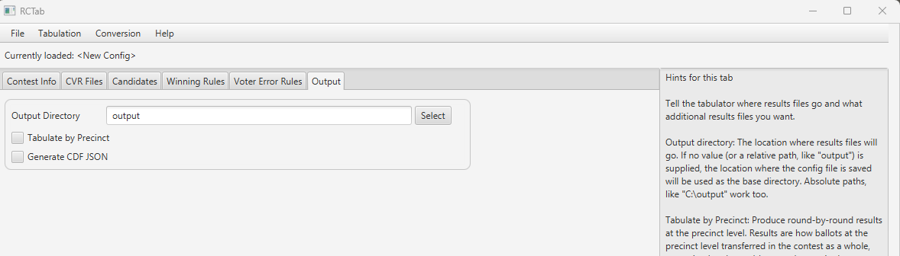


        Note: RCTab contest summary output files are programmatically set to be unmodifiable. However, if the folder they are exported to is not set properly with the preceding steps users could _delete_ them. 


* Now, log in as the ‘RCTab’ Windows standard user. Tabulation should **always be done logged in to the Windows OS as the ‘RCTab’ Windows standard user. **
* Navigate to the `rctab_v``_windows `folder. Double click on the `rcv` folder.
* Double click on the `bin` folder.
* Right-click on the `rcv.bat` file Click ‘Run as Administrator.’ If a ‘Windows protected your PC’ window pops up click ‘More Info’ then click the ‘Run anyway’ button. Enter the administrator password
* RCTab will now launch.
* Using your mouse left click and drag the window with the dark top border down until it looks like the pictures below.
* Check that the first line on the black background shows:

		RCTab version 


* You have successfully installed the RCTab v!
* Optionally, you can create a shortcut on your desktop for a more simpler start process in the future
    * Right click the `rcv.bat` file -> Create Shortcut
    * Right click the shortcut file created -> Properties -> Advanced -> Check the ‘Run as administrator’ checkbox -> Ok -> Ok
    * Drag the shortcut file to your desktop
* Complete the instructions in  under the ‘Validating the hash of a trusted RCTab build’ header to verify your installation.

<table>
  <tr>
   <td colspan="4" >
<strong>Document Revision History</strong>
   </td>
  </tr>
  <tr>
   <td><strong>Date</strong>
   </td>
   <td><strong>Version</strong>
   </td>
   <td><strong>Description</strong>
   </td>
   <td><strong>Author</strong>
   </td>
  </tr>
  <tr>
   <td>
   </td>
   <td>1.0.0
   </td>
   <td>2.0 Initial 
   </td>
   <td>Mathew Ruberg
   </td>
  </tr>
</table>


<h2>
    </h2>


<h3>Validating the hash of a trusted RCTab build .zip</h3>


To validate that the provided zip folder contains the certified version of RCTab v1.3.2, follow these instructions:


* Open the Start Menu
* Type in Command Prompt
* Press enter to launch the Command Prompt
* Type in C:\Windows\System32\certutil.exe -hashfile [filename] 
    * To insert the file name: locate the rctab_v1.3.2_windows.zip in File Explorer
    * Left click on the file and while continuing to hold the mouse down, drag the file to the Command Prompt window and place after -hashfile.
    * Example: C:\Windows\System32\certutil.exe -hashfile C:\RCTab\rctab_v1.3.2_windows.zip
* Add SHA512 to the end of the line
    * Example: C:\Windows\Systems32\certutil.exe -hashfile c:\RCTab\rctab_v1.3.2_windows.zip SHA512
* Press enter. The command prompt will show the text of the hash in the following format SHA512 hash of [filePath]: [SHA512 hash text]
* Compare the SHA512 hash code produced on your system to the SHA512 hash code supplied with the trusted build. 
* If the SHA512 hash codes match 100%, you are using an approved download and can proceed. Return to the **RCTab v1.3.2 Section 22 - Installation Instructions for Windows OS v.1.3.0 **document to complete installation. 

<h3>Validating the hash of RCTab contest summary files</h3>


RCTab automatically creates corresponding `.hash` files for the `summary.csv` and `summary.json` output files. Follow these instructions for using the [fileName].hash files to verify their corresponding summary file. For this example we will verify a `summary.csv` file and we will assume that it is located in `c:\RCTab\output\`


* Create a new empty text file. We’ll call this the ‘comparison text file’
* Copy the RCTab programmatically generated hash to the comparison text file
    * Open summary.csv.hash in text editor. This file contains the following format: [hash] [hashAlgorithm]
        * [hash] is the text of the hash itself
        * [hashAlgorithm] is the algorithm used to get the hash e..g SHA512
    * Copy the [hash] to the comparison text file on a single line
* Use cmd prompt to generate hash of summary.csv
    * Open the Start Menu
    * Type in Command Prompt
    * Press enter to launch the Command Prompt
    * Create the command to hash the summary.csv with the following template C:\Windows\System32\certutil.exe -hashfile **[filePath]** SHA512
        * Replace **[filePath]** with the location of your summary.csv. You can drag the file into the cmd prompt window to have it automatically fill it in for you or you can type it manually if you know the path
    * Press enter. The command prompt will show the text of the hash in the following format SHA512 hash of [filePath]: [SHA512 hash text]
* Copy and paste [SHA512 hash text] to the next line of the comparison text file
* Compare the text of the two SHA512 hashes. Pulling the width of the text editor wide enough so that the hashes each are one line each will help line them up for comparison.

<table>
  <tr>
   <td colspan="4" >
<strong>Document Revision History</strong>
   </td>
  </tr>
  <tr>
   <td><strong>Date</strong>
   </td>
   <td><strong>Version</strong>
   </td>
   <td><strong>Description</strong>
   </td>
   <td><strong>Author</strong>
   </td>
  </tr>
  <tr>
   <td>
   </td>
   <td>1.0.0
   </td>
   <td>2.0 Initial 
   </td>
   <td>Mathew Ruberg
   </td>
  </tr>
</table>


<h2>RCTab v1.3.2 Section 24 - Tabulator Command Line Instructions v.1.1.2</h2>


To run the tabulation for a config file via the command line, users must open a terminal, navigate to the root directory of the unzipped software build, and use a command similar to the one that launches the GUI, except with different arguments. The final argument is the name of the config file to be tabulated. All tabulation will be done in the terminal window. RCTab’s user interface will not appear. If command line launch is successful, RCTab will tabulate a contest according to the requirements of the configuration file in the command line argument. Following are detailed steps for how to launch the RCTab in the command line.

On Windows:


1. Open Start Menu
2. Type Command Prompt. Hit enter.
3. Command Prompt will launch. The screenshot below displays an example of Command Prompt. 


<p id="gdcalert51" ><span style="color: red; font-weight: bold">>>>>>  gd2md-html alert: inline image link here (to images/image45.png). Store image on your image server and adjust path/filename/extension if necessary. </span><br>(<a href="#">Back to top</a>)(<a href="#gdcalert52">Next alert</a>)<br><span style="color: red; font-weight: bold">>>>>> </span></p>


4. The user needs to direct Command Prompt to the folder where RCTab is installed. Type cd. Insert the folder name: locate the folder rcv under the folder rctab_v1.3.1_windows in File Explorer.
5. Click on the rcv folder and while continuing to hold the button down, drag the file to the Command Prompt window and place after cd.
    1. Example: cd C:\RCTab\rctab_v1.3.1_windows\rcv
6. Hit enter. The screenshot displays the result of a successful execution of previous steps.

     


<p id="gdcalert52" ><span style="color: red; font-weight: bold">>>>>>  gd2md-html alert: inline image link here (to images/image46.png). Store image on your image server and adjust path/filename/extension if necessary. </span><br>(<a href="#">Back to top</a>)(<a href="#gdcalert53">Next alert</a>)<br><span style="color: red; font-weight: bold">>>>>> </span></p>


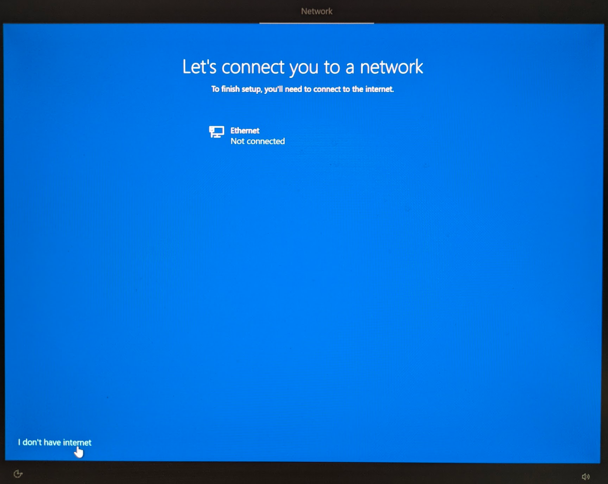


7. Type in bin\java -m network.brightspots.rcv/network.brightspots.rcv.Main -cli [filename]
    2. Filename should be the name of the configuration file for the RCTab to use to process the contest. Example: "C:\RCTab\rctab_v1.3.1_windows\rcv\sample_input\sample_interactive_tiebreak"
    3. Screenshot shows an example of correct command prompt entry for this example. 


<p id="gdcalert53" ><span style="color: red; font-weight: bold">>>>>>  gd2md-html alert: inline image link here (to images/image47.png). Store image on your image server and adjust path/filename/extension if necessary. </span><br>(<a href="#">Back to top</a>)(<a href="#gdcalert54">Next alert</a>)<br><span style="color: red; font-weight: bold">>>>>> </span></p>


8. Filename can be copied over into the Command Prompt by finding the configuration file in File Explorer, clicking on the file, and dragging the file over to the Command Prompt window.
9. Press enter.
10. Tabulation will run. Messages explaining the process of tabulation will appear in the Command Prompt window. Screenshot shows an example of messages sent during tabulation.


<p id="gdcalert54" ><span style="color: red; font-weight: bold">>>>>>  gd2md-html alert: inline image link here (to images/image48.png). Store image on your image server and adjust path/filename/extension if necessary. </span><br>(<a href="#">Back to top</a>)(<a href="#gdcalert55">Next alert</a>)<br><span style="color: red; font-weight: bold">>>>>> </span></p>


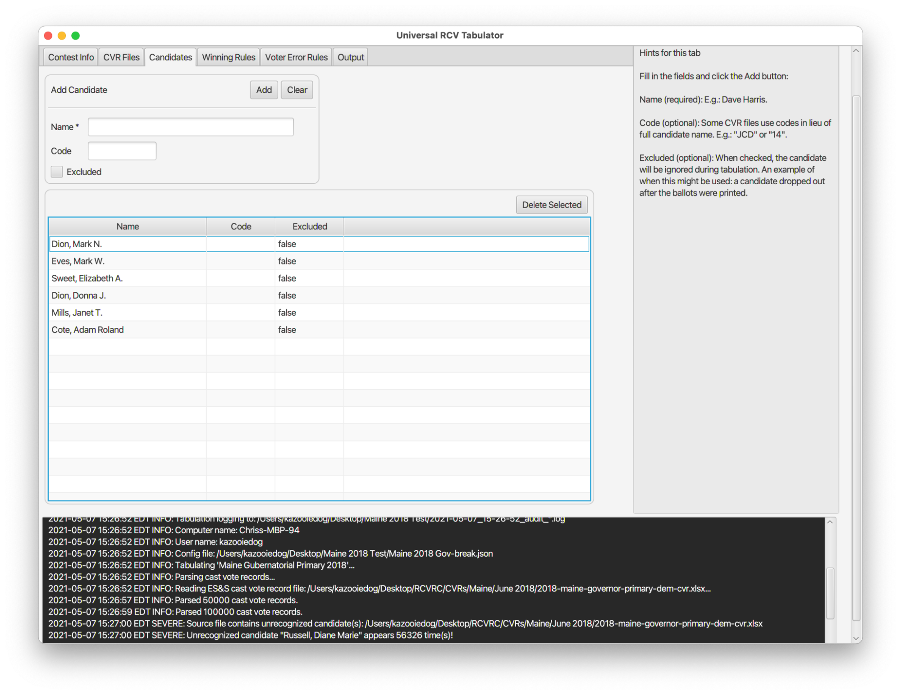


11. When tabulation is complete, Command Prompt will display the message: “INFO: Tabulation Session Completed.” Followed by a line stating, “Results written to: [filepath]”. The file path will be based on the information included in the Output Directory setting in the configuration file. See **RCTab v1.3.2 Section 08 - System Operations Procedures v.1.2.2 **and **RCTab v1.3.2 Section 25 - Configuration File Parameters v.1.1.1** for more information. See below for an example of messages sent at the end of successful tabulation.


<p id="gdcalert55" ><span style="color: red; font-weight: bold">>>>>>  gd2md-html alert: inline image link here (to images/image49.png). Store image on your image server and adjust path/filename/extension if necessary. </span><br>(<a href="#">Back to top</a>)(<a href="#gdcalert56">Next alert</a>)<br><span style="color: red; font-weight: bold">>>>>> </span></p>


12. If any of the above commands do not work, double check that you have copied them all over correctly, that you are pointing the command prompt to the correct directory, and that all filenames are correctly entered.

<table>
  <tr>
   <td colspan="4" >
<strong>Document Revision History</strong>
   </td>
  </tr>
  <tr>
   <td><strong>Date</strong>
   </td>
   <td><strong>Version</strong>
   </td>
   <td><strong>Description</strong>
   </td>
   <td><strong>Author</strong>
   </td>
  </tr>
  <tr>
   <td>
   </td>
   <td>1.0.0
   </td>
   <td>2.0 Initial 
   </td>
   <td>Mathew Ruberg
   </td>
  </tr>
</table>


<h2>RCTab v1.3.2 Section 25 - Configuration File Parameters v.1.1.1</h2>


This document lists the parameters the user will configure within RCTab. The output is the JSON file used for tabulation.

The Config file must be a valid JSON format. Example config files can be found under the test folder. The values a user inputs into any of these fields depend upon the relevant laws and regulations in place in their jurisdiction, as well as the voting system vendor used to produce cast-vote records for their elections. Users must understand the requirements of their laws, regulations, and vendor CVR data in order to fill out these fields successfully. 

This document lists the parameters that can be included in a config file suitable for input tabulation. Parameters are categorized by required and optional. If a user fails to fill out a required parameter when building a configuration file, RCTab will alert the user to the missing requirement and provide suggested resolution steps. 

Config file must be valid JSON format. Examples can be found in the test_data folder.


* "tabulatorVersion" required
    * version of the application that created this file
    * used for migrating config data between different application versions
    * example: "1.0.1"
    * value: text string of length [1..1000]

**  "outputSettings"** required

A list of output settings and their associated parameters

The "outputSettings" section contains the following parameters:


1. "contestName" required
    1. The name of the contest
    2. Used for naming audit output files
    3. Example: "Portland Mayoral Race 2017"
    4. Value: text string of length [1..255]
2. The "outputDirectory" optional
    5. Directory for audit output files (absolute or relative path)
    6. Example: /Path/To/TabulatorResults
    7. Example: output data/contest1
    8. Value: string of length [1..255]
    9. If not supplied: files will be saved to the current working directory
3. The "contestDate" optional
    10. Date of the contest
    11. Example: "2015-11-03"
    12. Value: text string of length [1..1000]
    13. If not supplied: none
4. The "contestJurisdiction" optional
    14. Text description of the jurisdiction of this contest
    15. Example: "Portland, ME"
    16. Value: text string of length [1..1000]
    17. If not supplied: none
5. "contestOffice" optional
1. text description of the office being contested
2. Example: "Mayor"
3. Value: text string of length [1..1000]
4. If not supplied: none

**"cvrFileSources"** required


    List of input CVR file paths and their associated parameters. Multiple CVRs can be input in a single configuration file.

Each "cvrFileSources" list item contains the following parameters:


1. "provider" required
    1. text description of the vendor / machine which generated this file
    2. value: "cdf" | "clearBallot" | "dominion" | "ess" | "hart"
2. "filePath" required
    3. location of the CVR file (in the case of CDF, Clear Ballot, and ES&S), or the CVR folder (in the case of Dominion and Hart)
    4. example: /Users/test_data/2015-portland-mayor-cvr.xlsx
    5. value: string of length [1..255]
3. "contestId" required when CVR source files are from a provider other than ES&S; must be blank for ES&S
    6. the ID of the contest to tabulate, as represented in the CVR file(s)
    7. example: "b651b997-417a-46d9-a676-a43d4df94ddc"
    8. value: text string of length [1..1000]
4. "firstVoteColumnIndex" required and used if and only if the provider is ES&S
    9. index of the column (starting from 1) that contains the top-ranked candidate for each CVR
    10. example: 3
    11. value: [1..1000]
5. "firstVoteRowIndex" required and used if and only if the provider is ES&S
    12. index of the row (starting from 1) that contains the rankings for the first CVR
    13. example: 2
    14. value: [1..100000]
6. "idColumnIndex" optional and can be used only if the provider is ES&S
    15. index of the column (starting from 1) that contains the unique ID for each CVR
    16. example: 1
    17. value: [1..1000]
7. "precinctColumnIndex" required and used if and only if "tabulateByPrecinct" is enabled and the provider is ES&S
    18. index of the column (starting from 1) that contains the precinct name for each CVR
    19. example: 2
    20. value: [1..1000]
8. "overvoteLabel" optional and can be used only if the provider is ES&S or CDF
    21. label used in the CVR to denote an overvote; if this parameter is present overvoteRule must be either "alwaysSkipToNextRank" or "exhaustImmediately" (because the other option, "exhaustIfMultipleContinuing", relies on knowing which specific candidates were involved in each overvote)
    22. example: "OVERVOTE"
    23. value: string of length [1..1000]
9. "undervoteLabel" optional and can be used only if the provider is ES&S
    24. the special label used in the cast vote records to denote an undervote
    25. example: "UNDERVOTE"
    26. value: string of length [1..1000]
10. "undeclaredWriteInLabel" optional
    27. the special label used in the cast vote records to denote a vote for an undeclared write-in
    28. example: "UWI"
    29. value: string of length [1..1000]
11. "treatBlankAsUndeclaredWriteIn" optional and can be used only if the provider is ES&S
    30. tabulator will interpret a blank cell in a CVR as a vote for an undeclared write-in
    31. value: true | false
    32. if not supplied: false

**"candidates"** required


    List of registered candidate names and associated candidate code (note: leave empty when CVR is in Common Data Format)

Each "candidates" list item has the following parameters:


        1. "name" required
            1. Full name of the registered candidate
            2. Example: "Duson, Jill C."
            3. Value: string of length [1..1000]
1. "code" optional
            4. Candidate code which may appear in CVRs in lieu of full candidate name
            5. Example: "JCD"
            6. Value: string of length [1..1000]
            7. If not supplied: none
2. "excluded" optional
            8. Candidate should be ignored during tabulation
            9. Value: true | false
            10. If not supplied: false

**"rules"** required

Set of configuration parameters that specify the tabulation rules

The "rules" section contains the following parameters:


1. "tiebreakMode" required
    1. how the program should decide which candidate to eliminate when multiple candidates are tied for last place
    2. or which candidate to elect first when:
        1. 1) electionWinnerMode is set to multiWinnerAllowOnlyOneWinnerPerRound, and
        2. 2) multiple candidates exceed the winning threshold in the same round, and
        3. 3) at least two of those candidates are tied for the highest vote total in that round
    3. value: "random" | "stopCountingAndAsk" | "previousRoundCountsThenRandom" | "previousRoundCountsThenAsk" | "useCandidateOrder" | "generatePermutation"
        4. we use java.util.random for randomness in our tiebreak implementations
            1. see: [https://docs.oracle.com/en/java/javase/12/docs/api/java.base/java/util/Random.html](https://docs.oracle.com/en/java/javase/12/docs/api/java.base/java/util/Random.html)
            2. compatible methods exist for other languages, e.g. [https://pypi.org/project/java-random/](https://pypi.org/project/java-random/)
        5. on tabulation start a java.util.Random object is created if required using the randomSeed value specified in the input config file:
            3. Random random = new Random(config.getRandomSeed());
    4. "Random"
        6. during tabulation, in the event of a tie at the end of a round:
            4. the list of tied candidates is sorted alphabetically
            5. a randomDouble is generated using the random object:
            6. double randomDouble = random.nextDouble();
            7. the randomDouble is mapped to one of the tied candidates in the list:
            8. int randomCandidateIndex = (int) Math.floor(randomDouble * (double) tiedCandidates.size());
            9. the selected candidate will be the winner or loser for that round
    5. "stopCountingAndAsk":
        7. the user is presented with a list of tied candidates
        8. the user will input their selection manually
    6. "previousRoundCountsThenRandom"
        9. the tied candidate with the highest vote total in the previous round is selected
        10. if there is a tie for the vote count in the previous round as well, a candidate is selected from the still tying candidates as described under tiebreakMode "Random"
    7. "previousRoundCountsThenAsk"
        11. the tied candidate with the highest vote total in the previous round is selected
        12. if there is a tie for the vote count in the previous round as well, a candidate is selected from the still tying candidates as described under tiebreakMode "Stop counting and ask"
    8. "useCandidateOrder"
        13. during tabulation, in the event of a tie at the end of a round the list of candidates from the config file is consulted
        14. if selecting a winner the tied candidate in this round who appears earliest is selected as a winner
        15. if selecting a loser the tied candidate who appears latest is selected as the loser.
    9. "generatePermutation"
        16. on config load candidate names are sorted alphabetically by candidate code, or if code is not present, candidate name
        17. a randomly ordered candidate permutation is created using Collections.shuffle() with the randomSeed specified in the input config file
        18. during tabulation, in the event of a tie at the end of a round, this permutation is consulted
        19. if selecting a winner: the tied candidate in this round who appears earliest is selected
        20. if selecting a loser: the tied candidate who appears latest is selected
2. "overvoteRule" required
    10. how the program should handle an overvote when it encounters one
    11. value: "alwaysSkipToNextRank" | "exhaustImmediately" | "exhaustIfMultipleContinuing"
    12. “exhaustImmediately”
        21. "exhaustImmediately": exhaust a ballot as soon as we encounter an overvote
3. "winnerElectionMode" required
    13. which process the program should apply for selecting the winner(s)
    14. value: "singleWinnerMajority" | "multiWinnerAllowOnlyOneWinnerPerRound" | "multiWinnerAllowMultipleWinnersPerRound" | "bottomsUp" | "bottomsUpUsingPercentageThreshold" | "multiPassIrv"
    15. If only “singleWinnerMajority” is in use. 
        22. "singleWinnerMajority": no special process (only valid when numberOfWinners = 1). 
            10. Election threshold = floor(V/(S+1)) + 1
            11. where V = total number of votes (in the current round); and S = numberOfWinners
4. "numberOfWinners" required
    16. the number of seats to be won in this contest
    17. Uneditable if using “single-winner majority determines winner,” automatically set to 1. Uneditable if using “Bottoms-up using percentage threshold,” automatically set to 0. 
    18. note: we use fractional vote transfer to redistribute votes in “multiWinnerAllowOnlyOneWinnerPerRound” and “multiWinnerAllowMultipleWinnersPerRound” contests. 
    19. note: 0 is valid only when winnerElectionMode is set to "bottomsUpUsingPercentageThreshold"
    20. value: [0..number of declared candidates]
5. "minimumVoteThreshold" optional
    21. if a candidate receives fewer than this number of votes in the first round, they are automatically eliminated
    22. example: 150
    23. value: [0..1000000]
    24. if not supplied: no automatic elimination occurs (equivalent to setting it to 0)
    25. Note: If no candidate exceeds the minimum vote threshold, tabulation silently fails. If you are using the minimum vote threshold setting and are having issues getting results, check that you have not set the minimum vote threshold too high. 
6. "maxSkippedRanksAllowed" required
    26. maximum number of skipped ranks (undervotes) on a ballot before the ballot should be considered exhausted; if "unlimited" is entered, a ballot will never be considered exhausted due to skipped ranks
    27. example: 1
    28. value: [unlimited, 0..1000000]
7. "maxRankingsAllowed" required
    29. maximum number of candidates that a ballot is allowed to rank; if "max" is entered, this will default to the total number of declared candidates as entered on the candidates tab
    30. example: 15
    31. values: [max, 1..1000000]
8. "rulesDescription" optional
    32. text description of this rules configuration for organizing your config files -- not used by the tabulator
    33. Example "Maine Rules"
    34. value: string of length [1..1000]
9. "batchElimination" optional
    35. Tabulator will use batch elimination (only valid for single-winner contests)
    36. Value: true | false
    37. If not supplied: false    
10. "continueUntilTwoCandidatesRemain" optional
    38. tabulator will keep tabulating (beyond winning round) until only two candidates remain (only valid for single-winner contests)
    39. Value: true | false
    40. If not supplied: false
11. "overvoteDelimiter" optional and can be used only if provider is ES&S; must be blank when overvoteLabel is provided
    41. string that will be used to split a cell into multiple candidate strings in the case of an overvote
    42. example: //
    43. value: any string that contains no backslashes and at least one character that is not a letter, number, hyphen, period, comma, apostrophe, quote, or space
12. "tabulateByPrecinct" optional
    44. Tabulator will generate a results spreadsheet for each precinct
    45. Value: true | false
    46. If not supplied: false
13. "generateCdfJson" optional
    47. Tabulator will generate a JSON of cast vote records in the Common Data Format
    48. Value: true | false
    49. If not supplied: false
    50. "exhaustOnDuplicateCandidate" optional
        23. Tabulator will exhaust a ballot when it encounters a duplicate candidate (instead of just skipping the duplicate)
        24. Value: true | false
        25. If not supplied: false
14. "nonIntegerWinningThreshold" optional
    51. the vote threshold used to determine winners can be a non-integer
    52. if true, threshold = V/(S+1) + 10^-d
    53. if false, threshold = floor(V/(S+1)) + 1
    54. where V = total number of votes (in the current round or in the first round, depending on the winnerElectionMode); S = numberOfWinners; and d = decimalPlacesForVoteArithmetic
    55. (note that S+1 in the formulas above becomes just S if hareQuota is set to true.)
    56. Only valid for “multiWinnerAllowOnlyOneWinnerPerRound” and “multiWinnerAllowMultipleWinnersPerRound” contests
    57. value: true | false
    58. if not supplied: false
15. "hareQuota*****" optional
    59. the winning threshold should be computed using the Hare quota***** (floor(votes divided by seats)) instead of the preferred Droop quota (votes divided by (seats+1))
    60. Only valid for “multiWinnerAllowOnlyOneWinnerPerRound” and “multiWinnerAllowMultipleWinnersPerRound” contests
    61. Value: true | false
    62. If not supplied: false
16. "randomSeed" required if tiebreakMode is "random", "previousRoundCountsThenRandom", or "generatePermutation"
    63. the integer seed for the application's pseudorandom number generator
    64. value: [-140737488355328..140737488355327]
17. "multiSeatBottomsUpPercentageThreshold" required if winnerElectionMode is "bottomsUpUsingPercentageThreshold" and numberOfWinners is 0
    65. the percentage threshold used to determine when to stop the tabulation and declare winners
    66. note: only valid when winnerElectionMode is "bottomsUpUsingPercentageThreshold" and numberOfWinners is 0
    67. value: [1..100]
18. "decimalPlacesForVoteArithmetic" required
    68. number of rounding decimal places when computing winning thresholds and fractional vote transfers
    69. note: only editable when winnerElectionMode is "multiWinnerAllowOnlyOneWinnerPerRound" or "multiWinnerAllowMultipleWinnersPerRound"
    70. value: [1..20]
19. "winnerElectionMode" required
    71. which process the program should apply for selecting the winner(s)
    72. value: "singleWinnerMajority" | "multiWinnerAllowOnlyOneWinnerPerRound" | "multiWinnerAllowMultipleWinnersPerRound" | "bottomsUp" | "bottomsUpUsingPercentageThreshold" | "multiPassIrv"
    73. "multiWinnerAllowOnlyOneWinnerPerRound": elect no more than one winner per round, even when there are multiple candidates exceeding the winning threshold (only valid when numberOfWinners is > 1)
        26. Election threshold = floor(V/(S+1)) + 1
        27. where V = total number of votes (in the first round); and S = numberOfWinners
    74. "multiWinnerAllowMultipleWinnersPerRound": may elect more than one winner per round when there are multiple candidates exceeding the winning threshold (only valid when numberOfWinners is > 1)
        28. Election threshold = floor(V/(S+1)) + 1
        29. where V = total number of votes (in the first round); and S = numberOfWinners
    75. "bottomsUp": instead of running a standard multi-seat contest with single transferable votes, just eliminate candidates until there are numberOfWinners remaining (only valid when numberOfWinners is > 1)
        30. Election threshold = floor(V/(S+1)) + 1
        31. where V = total number of votes (in the first round); and S = numberOfWinners
        32. bottomsUp does not rely on election threshold for any vote processing
    76. "bottomsUpUsingPercentageThreshold": instead of running a standard multi-seat contest with single transferable votes, just eliminate candidates until all remaining candidates have vote shares that meet or exceed multiSeatBottomsUpPercentageThreshold (only valid when numberOfWinners is 0)
        33. Election threshold = V•T
        34. where V = total number of votes (in the current round); and T = multiSeatBottomsUpPercentageThreshold
    77. "multiPassIrv": instead of running a true multi-seat contest, run a series of single-seat contests and progressively exclude candidates as they win seats (only valid when numberOfWinners is > 1). 
        35. Election threshold = floor(V/(2)) + 1
        36. where V = total number of votes (in the current round)
20. “overvoteRule" required
    78. how the program should handle an overvote when it encounters one
    79. value: "alwaysSkipToNextRank" | "exhaustImmediately" | "exhaustIfMultipleContinuing"
    80. "alwaysSkipToNextRank": when we encounter an overvote, ignore this rank and look at the next rank in the cast vote record
    81. "exhaustIfMultipleContinuing": if more than one candidate in an overvote are continuing, exhaust the ballot; if only one, assign the vote to them; if none, continue to the next rank (not valid with an ES&S source unless overvoteDelimiter is supplied)

<table>
  <tr>
   <td colspan="4" >
<strong>Document Revision History</strong>
   </td>
  </tr>
  <tr>
   <td><strong>Date</strong>
   </td>
   <td><strong>Version</strong>
   </td>
   <td><strong>Description</strong>
   </td>
   <td><strong>Author</strong>
   </td>
  </tr>
  <tr>
   <td>
   </td>
   <td>1.0.0
   </td>
   <td>2.0 Initial 
   </td>
   <td>Mathew Ruberg
   </td>
  </tr>
</table>


<h2>RCTab v1.3.2 Section 26 - RCTab CVR Files v.1.2.2</h2>


    This document describes the different CVR files RCTab is compatible with. It documents how they are laid out and describes relevant file structures that inform how RCTab parses CVR data. 

<h3>ES&S</h3>


The CVR files from the ES&S EVS export system are in an MS Excel Worksheet format.  The sample below displays the following records:


* First Vote Column Index – the first vote appears in column D under “Cand Choice 1”
* First Vote Row Index – the first cast vote record is in Row 2 in this example
* ID Column Index – in this sample Column A contains all Cast Vote Record IDs, making it the ID Column
* Precinct Column Index – displayed in Column B as the precinct Name/#
* Ballot Style – in Column C is the Name/# of the ballot style 
* Cand Choice – in columns D thru H are the candidate choices selected by the voter


<p id="gdcalert56" ><span style="color: red; font-weight: bold">>>>>>  gd2md-html alert: inline image link here (to images/image50.jpg). Store image on your image server and adjust path/filename/extension if necessary. </span><br>(<a href="#">Back to top</a>)(<a href="#gdcalert57">Next alert</a>)<br><span style="color: red; font-weight: bold">>>>>> </span></p>


_Figure 1 - Sample cvr File_

**Note:** The first three columns in the ES&S’ file are fixed and the number of columns will depend on the number of contest choices. The format will typically follow this format:

**Header Row (column labels)** 


<table>
  <tr>
   <td>
    Cast Vote  Record
   </td>
   <td>Precinct 
   </td>
   <td>Ballot Style 
   </td>
   <td>
    CONTEST-X  1st Choice
   </td>
   <td>
    CONTEST-X  2nd Choice
   </td>
   <td>
    CONTEST-X  3rd Choice
   </td>
   <td>
    CONTEST-X  4th Choice
   </td>
  </tr>
</table>


**Each CVR Row **


<table>
  <tr>
   <td><strong>Column Number </strong>
   </td>
   <td>
    <strong>Description</strong>
   </td>
  </tr>
  <tr>
   <td>
    <strong>Column 1 </strong>
   </td>
   <td>
    Cast Vote Record ID number. Unique number, sequentially assigned.
   </td>
  </tr>
  <tr>
   <td>
    <strong>Column 2 </strong>
   </td>
   <td>
    Precinct Name that is associated with the cast vote record.
   </td>
  </tr>
  <tr>
   <td>
    <strong>Column 3 </strong>
   </td>
   <td>
    Ballot Style Name that is associated with the cast vote record. Applies to  both ballots by precinct and ballots by style elections.
   </td>
  </tr>
  <tr>
   <td>
    <strong>Column 4  </strong>
<p>

    <strong>thru N + 3</strong>
   </td>
   <td>
    N + 3 where N is the number of choices on the ballot. The content of the  cell in each of the columns will be the name of the candidate selected on  the ballot.  
<p>

    • If there is no selection for the choice, the content of the column will  show “undervote”. 
<p>

    • If there is more than one selection for the choice, the column will show  “overvote”. 
<p>

    • If the choice is a write-in the column will show “write-in”.
   </td>
  </tr>
</table>


<h3>Hart Verity</h3>


Hart’s Verity system exports CVRs in a multi-folder format and differs from that of singular file CVRs such as ES&S. The structure of Verity’s CVRs are as follows:

**CVR Archives Naming Convention**

The format of the archive name is:

“CVRArchive_C_S_E_T.zip” where:


* ‘C’ is the number of CVRs contained in the Archive.
* ‘S’ is the number of cast sheet 1s.
* ‘E’ is the number of cast electronic ballots.
* ‘T’ is a timestamp used to make the archive name unique.

 RCTab requires the Hart CVRs to be cryptographically signed. Signed CVR archives include a corresponding `.zip`.sig.xml file for the .`zip` as well as a corresponding `.xml.sig.xml` for each `.xml` CVR file inside the `.zip`. This allows the CSV `.zip` archive and its contents to be programmatically verified by RCTab during tabulation. Tabulation will not proceed without a  `.sig.xml` for each CVR `.xml` file. Use the Preferences menu in Verity Count to digitally sign CVR exports


<p id="gdcalert57" ><span style="color: red; font-weight: bold">>>>>>  gd2md-html alert: inline image link here (to images/image51.png). Store image on your image server and adjust path/filename/extension if necessary. </span><br>(<a href="#">Back to top</a>)(<a href="#gdcalert58">Next alert</a>)<br><span style="color: red; font-weight: bold">>>>>> </span></p>


**CVR Structure**

CVR data is recorded in XML file format, and can be viewed using a number of applications, such  as Windows Notepad and Microsoft Edge. However, applications designed to work specifically with XML, such as XML Notepad, may simplify the presentation of the XML data.

XML files must be extracted from the ZIP file before being viewed. Once extracted, the “Open with” command may be used to view the XML in the desired application.

**CVR File Naming Convention**

The .zip contains many CVR files. Each CVR file name uses the convention “S_G.xml”, where:


* ‘S’ is the CVR type identifier
    * “1” if paper ballot sheet 1, blank for all other sheets
    * “e” for DRE ballot
    * “p” for Provisional ballot
* ‘G’ is the GUID of the CVR

For example, _1_c7db3cf2-c1a2-4773-971c-337ea2d198d7.xml_, or _50810795-95d4-4c0c-a6dc-0d5333e99c5a.xml_

When signed, each `.xml` CVR file has a corresponding `.xml.sig.xml` file.

**Viewing CVR Contents**

The following is a general example of a CVR as viewed in Internet Explorer, showing two contests expanded:


<p id="gdcalert58" ><span style="color: red; font-weight: bold">>>>>>  gd2md-html alert: inline image link here (to images/image52.png). Store image on your image server and adjust path/filename/extension if necessary. </span><br>(<a href="#">Back to top</a>)(<a href="#gdcalert59">Next alert</a>)<br><span style="color: red; font-weight: bold">>>>>> </span></p>


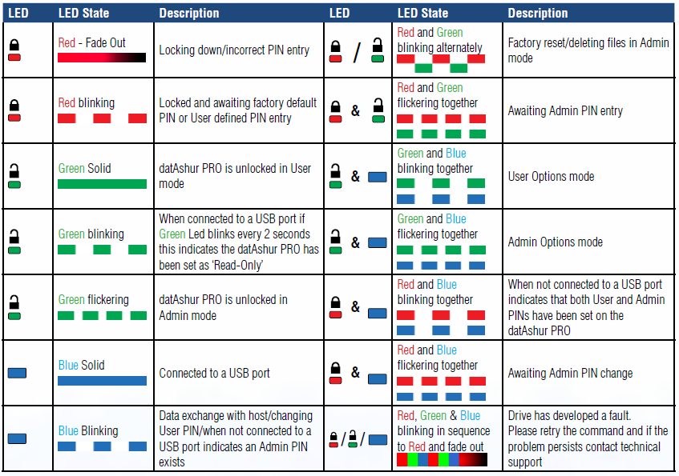


Here is the same section of the previous CVR as viewed in XML Notepad:


<p id="gdcalert59" ><span style="color: red; font-weight: bold">>>>>>  gd2md-html alert: inline image link here (to images/image53.png). Store image on your image server and adjust path/filename/extension if necessary. </span><br>(<a href="#">Back to top</a>)(<a href="#gdcalert60">Next alert</a>)<br><span style="color: red; font-weight: bold">>>>>> </span></p>


**Structure**

Each CVR accounts for all contests available to the voter for that ballot style (precinct-split/party/sheet combination), including a voter’s marked choice(s), any remaining Undervotes, or for unmarked contests in an Open Primary, a “No vote” tag.

Marked choices are viewable in plain text. For marked write-ins, an ID is provided to cross-reference with a folder containing images of each write-in.

The following example combines all election types—General, Closed Primary, and Open Primary—into a “master” structure; not all fields will be present for all election types, and will be indicated appropriately.

**CVR Elements**


* CVR (top-level folder)
    * Contests (contains all contests for this ballot or sheet)
        * Contest (random order of contests—Verity 1.0)
            * Name (Title of contest; includes Party designation for Closed and Open Primaries)
            * ID (Globally Unique ID [GUID] of contest)
            * Options (contains each marked Choice for this contest)
                * Option (empty if contest is completely undervoted)
                    * Name (Choice name, or blank if Write-in)
                    * ID (GUID of Choice)
                    * Value (1 if marked; 100000 or similar, where the position of the 1 indicates a ranking mark in Ranked Choice contests, or to indicate one or more marks in a Cumulative contests)
                    * WriteInData (only present when Write-in Choice is marked)
                        * Text (Central vDrives only; text of Write-in, if resolved)
                        * ImageID (GUID of Write-in Image, and name of file located in “Write In Images” folder)
                        * WriteInDataStatus (“Unresolved” for all Scan write-ins; “Unresolved”, “Resolved” or “Rejected” for all Central write-ins)
            * Undervotes (quantity of undervotes)
            * Overvoted (only present if contest is also overvoted)
            * NoVote (Open Primaries only; indicates the contest was not voted in)
            * InvalidVote (Open Primaries only; only present if contests of different party affiliations are voted in)
    * BatchSequence (Central vDrives only; indicates the sheet’s sequence within the batch number, below)
    * IsElectronic (True/False; indicates whether the vote was cast with a DRE)
    * SheetNumber (sheet indicator of paper ballot)
    * PrecinctSplit
        * Name (name of the voted Precinct-Split)
        * ID (GUID of Precinct-Split)
    * Party (Closed Primaries only; indicates party affiliation of ballot)
        * Name (name of Party)
        * ID (GUID of Party)
    * BatchNumber (Central vDrives only; indicates the Batch ID)
    * DeviceSerialNumber (Verity 1.0: Central vDrives only; indicates the vDrive ID)
    * RetrievalCode (Unique Retrievable Ballot Code for this CVR, if applicable)
    * ProvisionalCode (Unique Provisional Ballot Code for this CVR, if applicable)
    * CvrGuid (GUID of CVR)

<h3>Dominion </h3>


Dominion’s CVR format consists of several files which are grouped together in the same directory, similar to Hart’s CVR structure. All exported files have a top level attribute which is set to the version of EMS that produced the file. 


    **Configuration **


    This file shows which parameters were selected by the user when performing the export. It contains the following attributes: 


* IncludeTabulatorFilter: Boolean value indicating whether the export was performed for a single tabulator. 
* TabulatorFilterValue: a numeric identifier of the tabulator that was exported.
* IncludeResultContainerFilter: Boolean value indicating whether the batch filter was used.
* ResultContainerFilterValue: an integer indicating the batch to export CVR data for.
* IncludePrecinctPortionFilter: Boolean value indicating whether the export was performed for a  single precinct portion. 
* PrecinctPortionFilterValue: an integer indicating the precinct portion to export CVR data for.
* IncludeBallotTypeFilter: Boolean value indicating whether the export was performed for a single  ballot type. 
* BallotTypeFilterValue: an integer indicating the ballot type to export CVR data for.
* IncludeContestFilter: Boolean value indicating whether the export was performed for a single contest. 
* ContestFilterValue: an integer indicating the contest to export CVR data for.
* SplitFilesPerBatch: a Boolean value indicating whether separate CVR export JSON files should be created per batch.  
* IncludeOnlyPublishedResultContainers: a Boolean value indicating whether only published result  containers where included. 

**ContestManifest **


    This file contains a list of all non-disabled contests ordered by global order that can produce votes. The list is ordered by contest global order and each contest has the following attributes: 


* Description: name of the contest.  
* Id: identifier of the contest (internal machine id) 
* External Id: external identifier (optional) 
* VoteFor: the number of votes allowed/number of positions to be elected. 
* NumOfRanks: the number of rankings allowed to be made. 

    **CandidateManifest **


    This file contains a list of all non-disabled candidates ordered by global order (first by contest, then by choice) that can produce votes (for example “No Candidate” are not included). 

* Description: name of the candidate. 
* Id: identifier of the candidate (internal machine id)
* External Id: external identifier (optional) 
* ContestId: identifier of the contest this choice belongs to. 
* Type: candidate type. Regular, Writein, NoPreference , QualifiedWriteIn. 

    **PartyManifest **


    This file contains a list of political parties ordered by global order, each with the following attributes: 

* Description: name of the political party 
* Id: identifier of the party (internal machine id) 
* External Id: external identifier (optional) 

    **PrecinctPortionManifest **


    This file contains a list of all precinct portions ordered by global order, each with the following attributes: 

* Description: name of the precinct portion 
* Id: identifier of the precinct portion (internal machine id) 
* External Id: external identifier (optional) 

    **BallotTypeManifest **


    This file contains a list of all ballot types ordered by global order, each with the following attributes: 

* Description: name of the ballot type 
* Id: identifier of the ballot type (internal machine id) 
* External Id: external identifier (optional). 

    **BallotTypeContestManifest **


    This file contains information on which contests are used on which ballot types. Each relationship has  the following attributes: 

* BallotTypeId: identifier of the ballot type (internal machine id) 
* ContestId: identifier of the contest (internal machine id). 

    **CountingGroupManifest **


    This file contains a list of all counting groups ordered by global order, each with the following attributes: 

* Description: name of the counting group 
* Id: identifier of the counting group (internal machine id) 
* External Id: external identifier (optional). 

    **TabulatorManifest **


    This file contains a list of all tabulators ordered by global order, each with the following attributes: 

* Description: name of the tabulator 
* Id: identifier of the tabulator, we will use tabulator number here. 
* ExternalId: the external string identifier (optional). 
* ThresholdMin: minimum threshold for voting box scanned on this tabulator 
* ThresholdMax: maximum threshold for voting box scanned on this tabulator
* WriteinThresholdMin: minimum threshold for write-in area scanned on this tabulator  
* WriteinThresholdMax: maximum threshold for write-in area scanned on this tabulator

    **CVRExport **


    This file contains the actual CVR data. In addition to the top level version field it also has an ElectionId field that contains the description of the election. 


    The main content of the file is a list of CVR sessions. Each **Session **object contains the following attributes: 

* TabulatorId: the tabulator id, same as the one used in the manifest 
* BatchId: the batch id, unique for a given tabulator id. 
* RecordId: the CVR id within the batch. 
* CountingGroupId: the counting group id, same as the one used in the manifest. 
* ImageMask: the file mask for finding the associated images with this session. 
* Original element, contains the original state of the CVR data for this session. 
* Modified element (optional), contains the modified state of the CVR data for this session. 

    **Original/Modified element: **


    This element contains attributes that can be potentially be modified during adjudication/conditional voting management: 

* PrecinctPortionId: the precinct portion id, same as the one used in the manifest.  
* BallotTypeId: the ballot type id, same as the one used in the manifest. 
* IsCurrent: set to true, if this element represents the current state of the CVR. 
* Contest elements. Lists all contests for the current ballot type. 

    **Contest: **


This element represents a marked contest. Contains the following attributes: 


* Id: contest identifier, as used in the manifest file. 
* Marks: list of marked (explicitly/implicitly) in this contest. Note: explicit marks mean when the voter filled in the voting box directly. Implicit means when the voting box was implied by a straight party ticket selection. 

    **Mark element  **


    Contains the following attributes: 

* CandidateId: indicates the candidate the mark is for (if a write-in position is resolved to a qualified write-in the candidate id will point to a qualified write-in). 
* PartyId: indicates party affiliation. If not party affiliation then this will be 0. 
* Rank: indicates rank; will be 1 by default, will only contain values higher than 1 if ranked choice voting is used. 
* WriteinIndex: if mark is for write-in position (or qualified write-in) this attribute indicates which  write-in position in the contest (0 means first, 1 means second position, etc.) 
* MarkDensity: percentage that voting box was filled. 
* WriteinDensity: percentage that write-in area was filled in. Attribute exists only if it is a write-in position. 
* IsAmbiguous: a Boolean value indicating whether mark is ambiguous. 
* IsVote: a Boolean value indicating whether the mark produced a vote Note: an implicit selection  because of straight party vote would also be set to true. Any mark above the max threshold will  be true in a ranked choice voting contest.

<h3>Clear Ballot</h3>


Clear Ballot’s CVR is still currently under development and while RCTab was developed to include Clear Ballot as a vendor, it is considered a beta feature at this time. Once Clear Ballot has finalized a format for their CVR export, the details of said CVR will be included in this document as a reference. 

**Document Revision History**


<table>
  <tr>
   <td><strong>Date</strong>
   </td>
   <td><strong>Version</strong>
   </td>
   <td><strong>Description</strong>
   </td>
   <td><strong>Author</strong>
   </td>
  </tr>
  <tr>
   <td>
   </td>
   <td>1.0.0
   </td>
   <td>2.0 Initial 
   </td>
   <td>Mathew Ruberg
   </td>
  </tr>
</table>


<h2>
    RCTab v1.3.2 Section 27 - RCTab Config Files v.1.1.1</h2>


RCTab’s Config File is generated by the software when creating a new election. The Config file is saved in a JSON format and should only be revised using RCTab software (do not attempt to edit the JSON file).  The Config File contains all the information necessary to conduct an election. The file must be validated using RCTab prior to tabulating an election.  See **RCTab v1.3.2 Section 08 - System Operations Procedures v.1.2.2** for more. Here is a sample of the Config File: 


<p id="gdcalert60" ><span style="color: red; font-weight: bold">>>>>>  gd2md-html alert: inline image link here (to images/image54.png). Store image on your image server and adjust path/filename/extension if necessary. </span><br>(<a href="#">Back to top</a>)(<a href="#gdcalert61">Next alert</a>)<br><span style="color: red; font-weight: bold">>>>>> </span></p>


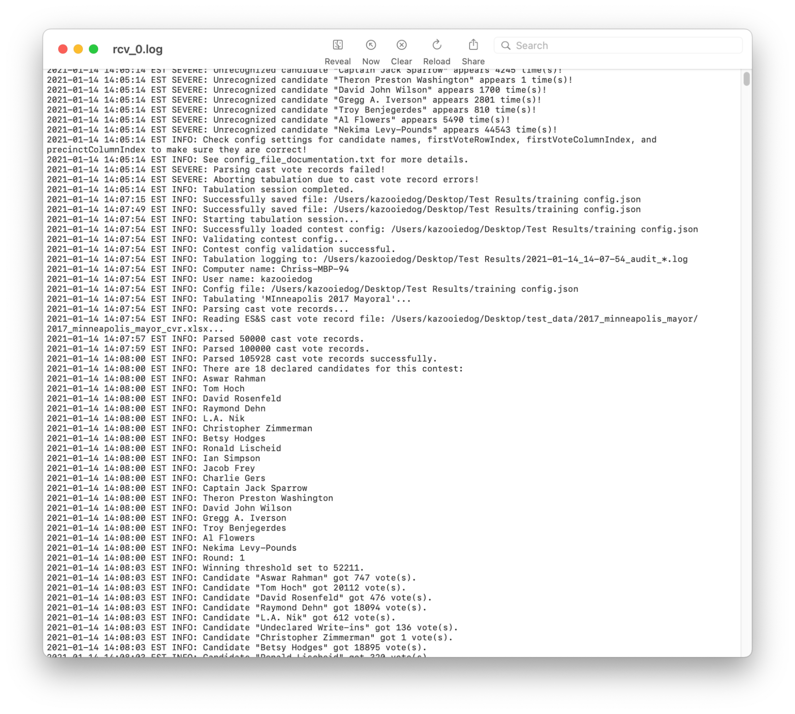


File continued: 


<table>
  <tr>
   <td colspan="4" >

<p id="gdcalert61" ><span style="color: red; font-weight: bold">>>>>>  gd2md-html alert: inline image link here (to images/image55.png). Store image on your image server and adjust path/filename/extension if necessary. </span><br>(<a href="#">Back to top</a>)(<a href="#gdcalert62">Next alert</a>)<br><span style="color: red; font-weight: bold">>>>>> </span></p>


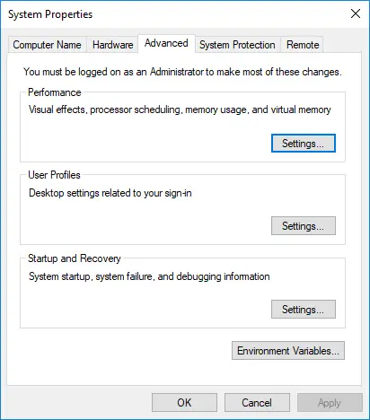

<p>
<strong>Document Revision History</strong>
   </td>
  </tr>
  <tr>
   <td><strong>Date</strong>
   </td>
   <td><strong>Version</strong>
   </td>
   <td><strong>Description</strong>
   </td>
   <td><strong>Author</strong>
   </td>
  </tr>
  <tr>
   <td>
   </td>
   <td>1.0.0
   </td>
   <td>2.0 Initial 
   </td>
   <td>Mathew Ruberg
   </td>
  </tr>
</table>


<h2>RCTab v1.3.2 Section 28 - Post-Election Audit & Clearing RCTab from System v.1.1.1</h2>


<h3>Post-Election Audit Preparation for RCTab</h3>


In order to run a post-election audit of RCTab, users will need to gather up all relevant log files and understand the information included in those logs. This guide will describe where to find the relevant log files and how to read those log files in any audit procedure. 

<h4>Retrieving the Operator log(s)</h4>


The operator log is a .log file that includes all information from the black log box at the bottom of the user interface, as shown at the bottom of the screenshot here:


<p id="gdcalert62" ><span style="color: red; font-weight: bold">>>>>>  gd2md-html alert: inline image link here (to images/image56.png). Store image on your image server and adjust path/filename/extension if necessary. </span><br>(<a href="#">Back to top</a>)(<a href="#gdcalert63">Next alert</a>)<br><span style="color: red; font-weight: bold">>>>>> </span></p>


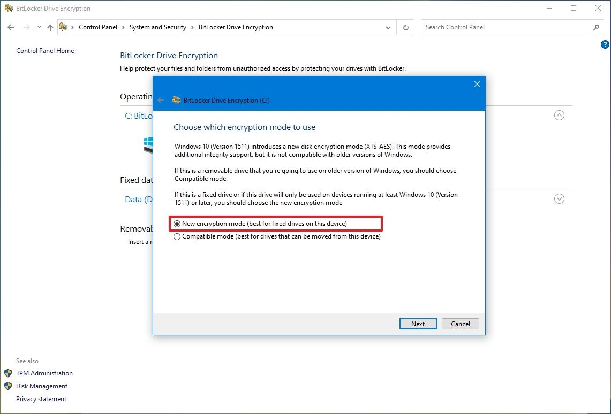


The operator log is updated any time RCTab generates any message to send through that log box. Note that messages are generated internally by the software, then saved to the operator log file and shown to the user in the log box. 

On Windows, this log file is saved to the folder where RCTab is launched from - in practice, that means the bin folder within RCTab’s install location (the bin folder is where the user launches RCTab using the rcv.bat launcher file). Operator logs are saved in the format rcv_*.log: rcv_0.log, rcv_1.log, and so on. Each log has a maximum size of 50MB, and once a log reaches 50MB, a new rcv_*.log file is created. This log file is continuously updated as a user interacts with RCTab. Users should retrieve all such logs when conducting a post-election audit. 

<h4>Reading the operator log</h4>


The operator log includes any error messages sent to the user in operation, as well as summary information about each tabulation run through RCTab (how many CVRs have been read in, how many votes each candidate got in each round, winners of each contest). Below is a screenshot of a rcv_0.log. Each line starts with a timestamp of when the message was generated. There are a variety of messages in this screenshot: informational messages letting the user know they've saved a configuration file, information about a tabulated contest (how many votes each candidate received in a round, the candidate names RCTab is looking for in the CVR), and error messages about information RCTab needs in order to run a ranked choice voting election (at the top of the screen). Similar information will be repeated in the operator log file every time a user runs a tabulation through RCTab. 

This log can be used to determine how a user has interacted with RCTab: any error messages they've received, summary information of any time they've run a tabulation on the given installation of RCTab, and other information about user interaction with the software itself. 

All messages RCTab may send to a user are included in **RCTab v1.3.2 Section 29 - RCTab Operator Log Messages v.1.2.2**. This document categorizes messages by the labels given to them in RCTab’s operation: INFO, WARNING, and SEVERE. Severe errors cause RCTab’s tabulation to fail, and so suggested resolution steps for any severe errors are provided in the document. Info and Warning messages convey information about contest configuration files, contest tabulation progress, CVR files, and other relevant information about tabulation. No Info or Warning messages cause tabulation to fail, but Info and Warning messages may be sent along with Severe messages to provide users with potential resolution steps for any Severe errors. 

<h4>Retrieving contest audit log(s)</h4>


The audit log is a record of everything RCTab did to process a given ranked choice voting contest. A new audit log is produced each time the user runs a tabulation using the "Tabulate" option in RCTab. Each audit log is saved to the output folder the user selects in the Output Directory setting on the Output tab in the RCTab user interface. The manufacturer suggests users save all files for a contest to a folder named after that contest (for example, County Commission November 2020, City Council District 5 April 2018). This will make retrieving any audit logs straightforward. 

Audit logs, like operator logs, have a maximum size of 50MB. Once an audit log reaches 50MB, RCTab creates a new audit log for the tabulation. Audit log files grow quickly because they include a large amount of information on how every piece of data in a CVR file is handled, so users should confirm that they have retrieved every audit .log file from the relevant contest(s).

Audit logs are named according to the rule: 

[time_stamp]_audit_0.log where the timestamp is created when the tabulation is triggered and used on all audit files for a given tabulation. 

For example, a tabulation that begins at 10:49:49 pm on April 24, 2021, will produce an audit log named: 2021-04-24_22-49-49_audit_0.log

When an audit log reaches 50MB size, it will be renamed along with any other preceding log files. For example:

2021-04-24_22-49-49_audit_0.log -> 2021-04-24_22-49-49_audit_1.log

2021-04-24_22-49-49_audit_1.log -> 2021-04-24_22-49-49_audit_2.log

Then a new 2021-04-24_22-49-49_audit_0.log file will be created, and logging will continue.

Each time an audit log file is written to disk a corresponding .hash file is also written. This hash file contains a cryptographic hash that can be used to verify the contents on the corresponding audit log file. See ** **for instructions on how to use the hash file to verify audit logs.

<h4>Reading the audit log</h4>


Audit logs include the configuration file settings used in the tabulation, how every individual ballot/CVR record in the given CVR file(s) for the contest got counted in each round, which candidate got eliminated in each round of counting, and other details of how the contest was counted. These logs also include all messages sent in the log box on the Tabulator UI during contest tabulation. Below is a screenshot example of information included in an audit log: 


<p id="gdcalert63" ><span style="color: red; font-weight: bold">>>>>>  gd2md-html alert: inline image link here (to images/image57.png). Store image on your image server and adjust path/filename/extension if necessary. </span><br>(<a href="#">Back to top</a>)(<a href="#gdcalert64">Next alert</a>)<br><span style="color: red; font-weight: bold">>>>>> </span></p>


Each line starts with a timestamp of when the message was generated.

At the top of the screenshot is the end of the configuration file settings for this contest. In the middle, RCTab is reading in all the CVR files for the contest and a list of all the candidate names listed in the configuration file that is also found in the CVR files. At the bottom is the start of ballot-by-ballot counting. In the first round of counting, every individual ballot in the CVR file(s) in a contest will be listed out here. This information displays how RCTab read in each ballot and which candidate it counted the ballot for in the first round. In all subsequent rounds, the audit log displays information for each transferred ballot - which candidate the ballot counted for in the previous round and which candidate the ballot counts for in that new round (or the exhaust condition of the ballot - if an overvote is reached or if a ballot runs out of rankings, for example). 

Audit logs close by noting where summary results files were saved to in the case of a successful tabulation. In the case of a tabulation that cannot be completed (because candidate names are missing, or required rules are missing, or other issues), audit logs close by noting the errors sent to a user. This same information will be included in the operator log. 

Audit log files can be used to check:


* What counting rules were used in a tabulation using RCTab; 
* The list of candidates used in a tabulation using RCTab;
* The total number of individual cast vote records included in all CVR export files used in a contest tabulation;
* How every ballot in each CVR file was counted in each round of counting; 
* Summary information for votes each candidate received in each round of the contest; 
* How RCTab read every single cell of each CVR file; 
* Where all contest files were saved; 
* And errors leading to a failed tabulation.

This is how every line in a CVR file is first displayed in RCTab: 

2020-12-02 17:53:54 EST FINE: [Round] 1 [CVR] 4582 [counted for] Candidate 9 [Raw Data] [4582, Precinct 5, Ballot Style 5, Candidate 9, Candidate 4, undervote, undervote, Candidate 10, undervote, undervote, overvote, undervote, Candidate 2]

This can be broken down into three parts: the time stamp, how the vote was counted in this round, and all the data RCTab read for this individual cast vote record. 

Time Stamp: 

2020-12-02 17:53:54 EST FINE: This message was sent at 5:53 pm on December 2, 2020. 

Vote counted in this round: 

[Round] 1 [CVR] 4582 [counted for] Candidate 9: In round 1, CVR ID 4582 was counted for Candidate 9.

All CVR data read for this individual CVR: 

[Raw Data] [4582, Precinct 5, Ballot Style 5, Candidate 9, Candidate 4, undervote, undervote, Candidate 10, undervote, undervote, overvote, undervote, Candidate 2]: This ballot was labeled CVR # 4582 in the CVR file for this contest. It was cast in precinct 5. The ballot style was ballot style 5. The ballot used their rankings in this order: Candidate 9, Candidate 4, undervote, undervote, Candidate 10, undervote, undervote, overvote, undervote, Candidate 2. 

(Note: undervote means a ranking was left blank).

Later in this same contest, after candidate 9 is eliminated, the audit log displays this information: 

2020-12-02 17:53:56 EST FINE: [Round] 4 [CVR] 4582 [transferred to] Candidate 4

This tells the user that the CVR listed above, #4582, transferred in Round 4 to Candidate 4. 

Users can check multiple different factors using the audit log and operator log to review the performance of RCTab software.


1. Using the audit .log, check that the total CVRs read into RCTab is equal to the total ballots cast according to the EMS used to export CVR files.
2. Check the rcv_0.log and any audit .logs for SEVERE errors and to see how users resolved those errors.
3. Compare summary result information in the audit file(s) and the summary results files for a contest run through RCTab. 
4. Review the election data form used for a contest (see Section 11 - L&A Testing pages 7-9). Compare the information in this form to the configuration file used in a contest as reflected in the audit .log for that contest to confirm that the proper counting rules were used for the contest. 
5. Using audit .log files, compare how data in the CVR files was read into RCTab with the information included in CVR files exported from the relevant election management software. This data can also be cross-referenced with paper ballot data from precincts, using precinct information in the audit .log files and in CVR files from the election management software.
6. If using the Tabulate by Precinct feature of RCTab, users can compare a hand count of ballots from a precinct to RCTab’s tabulation of those same ballots. The Tabulate by Precinct feature produces round-by-round results at the precinct level. These results display how ballots at the precinct level transferred in the contest as a whole, not a simulated round-by-round count in the precinct. A hand count could be conducted at the precinct level, following the elimination order in RCTab results, to check that RCTab counted each ballot properly in a given precinct. 
    1. Note that the Tabulate by Precinct feature identifies a winner. That identified winner is the winner of the contest overall, not necessarily the person who received the most votes in that specific precinct. This will be updated in a future release to identify the winner of the precinct. 
7. When summary files are written to disk the audit log also contains the text of the hash of those files. Confirming that the summary file hashes in the audit log matches the .hash files written to disk is another layer of security to prevent malicious editing of summary files.


<h3>Clearing RCTab from a System</h3>


Note: Before following this procedure, ensure that any materials that must be archived according to the jurisdiction’s archiving requirements have been archived. 

There are three types of files needed to remove RCTab from your system: RCTab installation folders, any files you created when using RCTab (configuration files, results files, audit files), and any CVR files you save to the RCTab workstation. 


* Delete the RCTab installation folder (generically called rctab_1.3.0_windows after you unzip it) - this deletes RCTab itself. Delete any .zip file of RCTab as well. 
* Delete any folders where you have RCTab files (meaning configuration files, results files, and audit files) or CVR files saved. The simplest way to keep track of this is to set up an RCTab Files folder on the computer with RCTab, with subfolders for each contest/L&A process run through RCTab. The user could then save all relevant files for each contest (configuration file, results files, audit files, and CVR files) to those folders.

<table>
  <tr>
   <td colspan="4" >
<strong>Document Revision History</strong>
   </td>
  </tr>
  <tr>
   <td>Date
   </td>
   <td>Version
   </td>
   <td>Description
   </td>
   <td>Author
   </td>
  </tr>
  <tr>
   <td>
   </td>
   <td>1.0.0
   </td>
   <td>2.0 Initial 
   </td>
   <td>Mathew Ruberg
   </td>
  </tr>
</table>


<h2>RCTab v1.3.2 Section 29 - RCTab Operator Log Messages v.1.2.2</h2>


RCTab generates messages and displays them in the Operator Log at the bottom of the user interface window.  The log will list SEVERE messages, WARNING messages, and INFO messages for the operator to review and take appropriate action.


<p id="gdcalert64" ><span style="color: red; font-weight: bold">>>>>>  gd2md-html alert: inline image link here (to images/image58.png). Store image on your image server and adjust path/filename/extension if necessary. </span><br>(<a href="#">Back to top</a>)(<a href="#gdcalert65">Next alert</a>)<br><span style="color: red; font-weight: bold">>>>>> </span></p>


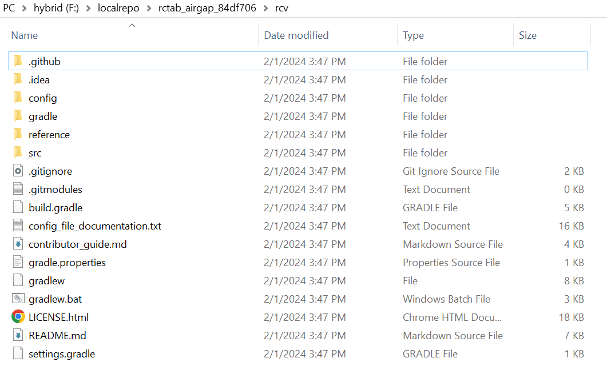


_Operator log screenshot _

On the following pages are all the SEVERE, WARNING, and INFO messages that RCTab may log during the setup and tabulation of an RCV election. Each SEVERE error includes a suggested resolution step or steps directly below the relevant error. Some SEVERE errors can all be resolved with the same resolution step and are grouped together before the suggested resolution. 

Errors in the operator log will include detailed information about errors encountered. Users should rely on that information, as well as information provided in this guide, to resolve errors encountered in tabulation. If following those steps still does not resolve your problem, contact the manufacturer for support. WARNING and INFO messages do not interrupt the ability of RCTab to

complete tabulation and so do not have resolution steps suggested.

<h3>SEVERE MESSAGES</h3>


<h4>Configuration File Errors</h4>


Errors on this tab are correctable through the Tabulation drop-down menu on RCTab, by creating a new configuration file from scratch, or may require reference to other sections of this document. 

SEVERE, "No contest config path specified!"

SEVERE, "Failed to load contest config: %s"

 

Suggested resolution: Load a configuration file using the “File” menu or create a new configuration file using the user interface and following **_RCTab v1.3.2 Section 08 - System Operations Procedures v.1.2.2 _**document.

SEVERE, "Failed to load config."

 

Suggested resolution: Create new configuration using the user interface. 

 

SEVERE, "Error logging config file: %s\n"

 

Suggested resolution: Create new configuration using the user interface. 

SEVERE, "Invalid winnerElectionMode!" 

SEVERE, "maxRankingsAllowed must either be \"%s\" or an integer from %d to %d!" 

SEVERE, "maxSkippedRanksAllowed must either be \"%s\" or an integer from %d to %d!"

SEVERE, "tabulatorVersion %s not supported”

SEVERE, "tabulatorVersion must be set to %s” 

SEVERE, "tabulatorVersion is required”

SEVERE, "Invalid tiebreakMode!" 

SEVERE, "Invalid overvoteRule!" 

SEVERE, "Invalid contestDate: %s!"

SEVERE, "Error parsing JSON file: %s\n%s\n" + "Check file formatting and values and make sure they are correct!\n"

                + "It might help to try surrounding values causing problems with quotes (e.g. \"value\").\n"

                + "See config_file_documentation.txt for more details."

SEVERE: "continueUntilTwoCandidatesRemain can't be true in a multi-seat contest unless the winner election mode is multi-pass IRV!"

SEVERE: "batchElimination can't be true in a multi-seat contest unless the winner election mode is multi-pass IRV!"

SEVERE, "winnerElectionMode can't be multiSeatSequentialWinnerTakesAll in a single-seat " + "contest!" 

SEVERE, "winnerElectionMode can't be multiSeatBottomsUp in a single-seat contest!" 

SEVERE, "winnerElectionMode can't be multiSeatAllowOnlyOneWinnerPerRound in a single-seat " + "contest!" 

SEVERE, "batchElimination can't be true when winnerElectionMode is multiSeatBottomsUp!"

SEVERE, "%s should not be defined for CVR source with provider \"%s\" for file source %s", fieldName, provider, inputLocation \
SEVERE, "treatBlankAsUndeclaredWriteIn should not be true for CVR source with provider \"%s\"for file source %s", fieldName, provider, inputLocation

SEVERE, "hareQuota can't be true when winnerElectionMode is \"%s\"!", winnerMode \
SEVERE, "nonIntegerWinningThreshold and hareQuota can't both be true at the same time!"

SEVERE, "Failed to get tiebreaker!\n%s"

Suggested resolution: Create a configuration file using RCTab user interface. It should not be possible to select inconsistent sets of rules (which these errors are responding to) if a configuration is created using the UI. Confirm that the configuration file follows requirements set out in **RCTab v1.3.2 Section 08 - System Operations Procedures v.1.2.2 **document. 

SEVERE, "\"%s\" can't be used as %s if it's also being used as %s!" (%s = string, field, otherField)

 

Suggested resolution: Change one of these values so that different values are used for different options.

SEVERE, "%s must be an integer equal to %d for file source %s", fieldName, lowerBoundary, inputLocation

SEVERE, "%s must be an integer from %d to %d for file source %s", fieldName, lowerBoundary, upperBoundary, inputLocation

SEVERE, "%s must be an integer equal to %d if supplied for file source %s", fieldName, lowerBoundary, inputLocation

SEVERE, "%s must be an integer from %d to %d if supplied for file source %s", fieldName, lowerBoundary, upperBoundary, inputLocation

Suggested resolution: These errors appear when a number the user input into a number-based field (such as random seed or allowable number of consecutive skipped rankings) is outside the bounds usable by RCTab. Refer to the specific error message in the tabulator log, which will provide a range of numbers RCTab is compatible with for that specific field. 

 

SEVERE, "Contest config validation failed! Please modify the contest config file and try again.\nSee config_file_documentation.txt for more details.”

 

Suggested resolution: This error message will be preceded by specific error messages about information that RCTab finds missing in the configuration file. 

 

SEVERE, "\"%s\" is a reserved term and can't be used for %s!"

 

Suggested resolution: Change the term used in the option setting identified in the error code. Re-save configuration file. 

SEVERE, "Error during validation:\n%s\nValidation failed!"

 

Suggested resolution: Check operator error log for other error messages. Other error messages will appear explaining why validation could not be completed. 

SEVERE, “Unable to process a config file with version %s using older version %s of the app!”

 

Suggested resolution: Create new configuration file using the user interface. 

<h4>Contest Info Error</h4>


The error in this section is correctable on the Contest Info tab. 

SEVERE, "contestName is required!"

 

Suggested resolution: Enter the contest name in the “Contest Info/Contest Name” field.

<h4>CVR Errors</h4>


Errors in this section are correctable on the CVR Files tab. They may also require detailed examination of CVR Files themselves and consultation with voting system vendor documentation to identify the source of any issues with CVR Files.  

 

SEVERE, "filePath is required for each cast vote record file!"

 

Suggested resolution: Verify that a valid file location is entered in the “CVR Files/Path” field for each CVR included in the tabulation.

SEVERE, "No cast vote records found!"

 

Suggested resolution: Check that the folder or file RCTab is directed to has CVR files compatible with the RCTab software.

SEVERE, "Contest config must contain at least 1 cast vote record file!"

 

Suggested resolution: Select, in the “CVR Files” tab, at least one cast vote record file to tabulate.

SEVERE, "Cast vote record file not found: %s"

 

Suggested resolution: Confirm that the file path supplied for the CVR file listed in the error goes to a file accessible by RCTab. 

SEVERE, "Duplicate cast vote record filePaths are not allowed: %s"

 

Suggested resolution: Delete all but one listing of each CVR File in the CVR list. CVR files should only be listed once in the CVR list. 

SEVERE, "Error opening cast vote record file: %s"

 

Suggested resolution: Ensure that you have added a cast vote record file in a format recognized by RCTab. 

SEVERE, "Aborting tabulation due to cast vote record errors!"

 

Suggested resolution: Review the log for other errors that will alert you to specific errors with your CVR files. Review your cast vote record files. Ensure that all candidate codes and other vote data are properly represented in configuration files.

SEVERE, "Parsing cast vote records failed!"

SEVERE, "Error parsing source file %s"

 

Suggested resolution: Check for other error messages in the operator log box. Parsing files fails when data appears in those files that the configuration file does not include. If information appears in the CVR files that is not in a configuration file, RCTab will abort tabulation. Ensure that CVR files are in a format RCTab can read. 

SEVERE, "Data format error while parsing source file: %s"

 

Suggested resolution: Check that your CVR file is in the correct format. User may need to retrieve new CVR files. 

SEVERE, "undeclaredWriteInLabel must be supplied if treatBlankAsUndeclaredWriteIn is true!"

 

Suggested resolution: Confirm that Undeclared Write-In Label is supplied on CVR tab. 

SEVERE, "Invalid cell address: %s"

 

Suggested resolution: Check CVR files tab. Confirm that correct information explaining where information is included in CVRs is included for each CVR file. 

SEVERE, "precinctColumnIndex is required when tabulateByPrecinct is enabled: %s"

 

Suggested resolution: Update configuration to include Precinct Column Index information for the CVR being processed. Or uncheck Tabulate by Precinct in the configuration. 

SEVERE, "Error reading file!\n%s"

 

Suggested resolution: This error only applies to Clear Ballot files. Ensure that all CVR Files in CVR Files tab are labeled as the correct vendor. 

SEVERE, “If a cell contains multiple candidates split by the overvote delimiter, it's not valid for any of them to be blank or an explicit undervote.”

 

Suggested resolution: Check your CVR file against the data in your election management system and ensure that CVR files are exporting with accurate information. 

 

SEVERE, “Error parsing cast vote record:\n%s”

 

Suggested resolution: Confirm that all CVR Files are set to the correct vendor. Check for other error messages in the operator log to see more detailed information about errors. Compare CVR file to expected CVR files available from your vendor to confirm that files are in the correct format. 

 \
SEVERE, "overvoteDelimiter and overvoteLabel can't both be supplied."

Suggested resolution: Review configuration file settings. Ensure that only one of these two fields is filled out on the CVR Files tab. 

 \
SEVERE, "overvoteDelimiter is required for an ES&S CVR source when overvoteRule is set to “Exhaust if Multiple Continuing”

Suggested resolution: Review configuration file settings. Ensure that the overvote delimiter field on the CVR files tab is filled in with the character used in your CVR File to differentiate between candidates ranked at an overvote. 

SEVERE, "If a cell contains multiple candidates split by the overvote delimiter, it's not valid for any of them to be blank or an explicit undervote."

Suggested resolution: Review your CVR. Make sure that it correctly includes data for any overvoted ranking. Check with the CVR vendor to make sure the CVR is exporting correctly from their system. 

SEVERE, "overvoteDelimiter is invalid."

Suggested resolution: Check the information input into the overvote delimiter setting on the CVR Files tab. That setting can't contain any backslashes (\) and it must contain at least one character that's not a letter, number, dot, apostrophe, comma, hyphen, quotation mark, or space. For example, an overvote delimiter could be  the character |. It could never be the character \.

SEVERE, "Cast vote record identifier missing on row %d in file %s. This may be due to an incorrectly formatted xlsx file. Try copying your cvr data into a new xlsx file to fix this.",cvrIndex + firstVoteRowIndex, excelFileName

Suggested resolution: In addition to the resolution suggested in the message, check your cast vote record and compare it to any expected CVR data from your voting system vendor. Check with the CVR vendor to make sure the CVR is exporting correctly from their system. Users can also remove any CVR ID labels on the CVR Files tab, which should resolve this issue. 

SEVERE, "No header row found in cast vote record file: %s", this.cvrPath

SEVERE, "No choice columns found in cast vote record file: %s", this.cvrPath

SEVERE: "Wrong number of choice header fields in cast vote record file: %s", this.cvrPath

SEVERE: "Current snapshot has no CVRContests."

SEVERE, "Error parsing contest manifest:\n%s", exception

SEVERE, "Error parsing precinct manifest:\n%s", exception

SEVERE, "Error parsing candidate manifest:\n%s", exception

SEVERE, "No precinct data found!"

SEVERE, "No precinct portion data found!"

SEVERE, "No contest data found!"

SEVERE, "No candidate data found!"

SEVERE, "Precinct ID \"%d\" from CVR not found in manifest data!",precinctId

SEVERE, "Precinct portion ID \"%d\" from CVR not found in manifest data!",precinctPortionId

SEVERE: "GpUnit \"%s\" for CVR \"%s\" not found!", cvr.BallotStyleUnitId, cvr.UniqueId

SEVERE: "GpUnit \"%s\" not found!", unitId

SEVERE: "No Rank found on CVR \"%s\" Contest \"%s\"!", cvr.UniqueId,contest.ContestId

 \
Suggested resolution: These are all errors that appear when a CVR file is incompatible with RCTab. Check your cast vote record and compare it to any expected CVR data from your voting system vendor. Check with the CVR vendor to make sure the CVR is exporting correctly from their system. Make sure your voting system version is compatible with RCTab by reviewing the CVR documentation provided with RCTab and by checking with your voting system vendor. If you are unable to resolve the issue this way, file an issue on the RCTab GitHub and we will investigate the problem.

 \
SEVERE, "No cast vote record data found!"

 \
Suggested resolution: Check your cast vote record and compare it to any expected CVR data from your voting system vendor. Check with the CVR vendor to make sure the CVR is exporting correctly from their system. 

SEVERE, "Unknown contest ID '%d' found while parsing CVR!", contestId

SEVERE: "Contest \"%s\" from config file not found!", this.contestId

Suggested resolution: Double-check the Contest ID for the contest you’re trying to tabulate. Make sure the correct contest ID is included in the config. 

SEVERE, "Aborting conversion due to cast vote record errors!" \


Suggested resolution: Check the Operator Log for other messages. Those messages will indicate specific errors with the cast vote record file. 

 \
SEVERE: "ContestSelection \"%s\" from CVR not found!", contestSelectionId

SEVERE: "CandidateSelection \"%s\" has no CandidateIds!", contestSelection.ObjectId

SEVERE: "CandidateId \"%s\" from ContestSelectionId \"%s\" not found!",contestSelection.CandidateIds[0], contestSelection.ObjectId

Suggested resolution: These errors appear if a CDF CVR indicates that a vote ranked a candidate (a contest selection) that the CDF file does not otherwise identify. Check with your vendor to make sure their CDF CVR export matches up with the CDF CVR requirements.  

SEVERE, "Unexpected error parsing source file: %s\n%s", cvrPath, exception

Suggested resolution: RCTab is unable to read the CVR file used. Make sure your voting system version is compatible with RCTab by reviewing the CVR documentation provided with RCTab and by checking with your voting system vendor. If you are unable to resolve the issue this way, file an issue on the RCTab GitHub and we will investigate the problem. 

<h4>Candidate Errors</h4>


 

Errors in this section are correctable on the Candidates tab. They may also require detailed examination of CVR Files themselves.

SEVERE, "Unrecognized candidate found in CVR: %s", candidateId

SEVERE, "Source file contains unrecognized candidate(s): %s"

SEVERE, "Error processing candidate data:\n%s"

SEVERE, "Unrecognized candidate \"%s\" appears %d time(s)!"

SEVERE, "A name is required for each candidate!"

 

Suggested resolution: Add unrecognized candidate names to the Candidates list in the configuration. Error log will list candidate names that do not appear in the CVR files. 

SEVERE, "Duplicate candidate %ss are not allowed: %s"

 

Suggested resolution: Delete all but one listing of each candidate name in the Candidates list. Candidates only need to be listed once in the Candidate list. Ensure that candidates with similar names are labeled distinctly in the CVR data.

SEVERE, "Contest config must contain at least 1 declared candidate!" 

 

Suggested resolution: Confirm that candidate names have been added to the candidate list in the Candidates tab. 

SEVERE, "Error parsing candidate data: %s"

 

Suggested resolution: Re-enter candidate data on the Candidates tab. Confirm that correct CVR files are directed to on CVR files tab. 

SEVERE, "Contest config must contain at least 1 non-excluded candidate!" 

 

Suggested resolution: Confirm that at least one candidate is not excluded on the Candidates tab. If all candidates are excluded, remove excluded candidates. Re-enter candidate names and do not exclude every candidate.

SEVERE, "If candidate codes are used, a unique code is required for each candidate!"

Suggested resolution: Double-check on the candidates tab that no candidate code values repeat. If code values do repeat, delete that candidate information and re-enter candidate information with a different candidate code. 

SEVERE, "Candidate code '%s' is not valid for contest '%d'!", candidateCode,contestId

Suggested resolution: Check the candidate codes on the “Candidates” tab and cross-reference them with the candidate codes in the contest you’re trying to tabulate. Make sure that all candidate codes are accurate. 

<h4>Winning Rules Errors</h4>


Errors in this section can be corrected on the Winning Rules tab. 

SEVERE, "If numberOfWinners is zero, winnerElectionMode must be multiSeatBottomsUpPercentageThreshold”!

SEVERE, "numberOfWinners must be zero if winnerElectionMode is multiSeatBottomsUpPercentageThreshold "!"

SEVERE, "If numberOfWinners is zero, multiSeatBottomsUpPercentageThreshold must be specified!"

SEVERE, "nonIntegerWinningThreshold can't be true when winnerElectionMode is \"%s\"!",winnerMode

Suggested resolution: Ensure that the correct winner election mode is selected, according to your local RCV laws. After confirming the correct winner election mode, rebuild the configuration file from scratch using the RCTab UI. The settings indicated by these errors cannot be changed or set to incorrect values if a configuration file is created using the UI. 

SEVERE, "Tabulation can't proceed because all declared candidates are below the minimum vote threshold."

Suggested resolution: There are multiple potential solutions here. Check the minimum vote threshold setting for the contest - is it set according to your local tabulation rules? If it is, then no candidate has sufficient votes to win in this contest. Refer to your local law for what to do next. If the minimum vote threshold setting is out of sync with your local tabulation rules, reset it to the correct setting and run tabulation again. 

SEVERE, "When tiebreakMode involves a random element, randomSeed must be supplied.”

 

Suggested resolution: Input a positive or negative number into the random seed box on the Winning Rules tab. 

<h4>Voter Error Tab Errors</h4>


Errors in this section can be corrected on the Voter Error tab. 

SEVERE, "When overvoteLabel is supplied, overvoteRule must be either “exhaustImmediately " + "or alwaysSkipToNextRank!" 

SEVERE, When overvoteLabel is supplied, overvoteRule must be either "Always skip to next rank" or "Exhaust immediately"!

 

Suggested resolution: Check what overvote rule is selected on the Voter Error tab. Ensure that it is the correct rule based on your local RCV laws. If either of the two rules mentioned in this error are required by your local laws, select the correct one.

<h4>Results Writing Errors</h4>


 

Errors in this section relate to RCTab’s ability to save results data after a tabulation. They can be corrected by ensuring that RCTab has the ability to read/write to disk, that there is sufficient disk space to create files, and by checking that valid filepaths are indicated in the configuration file. 

SEVERE, "Error writing summary files:\n%s"

 

Suggested resolution: Ensure that your computer has sufficient space to store summary files and check that RCTab has write permission for the location selected for file storage on the Output tab. 

  

 SEVERE, "Error saving file: %s\n%s"

 

Suggested resolution: Confirm that the location you have set files to save is a correct filepath. 

  

SEVERE, "Failed to create output directory: %s\n" + “Check the directory name and permissions”

 

Suggested resolution: Confirm that the location you have set files to save to is a correct filepath and that RCTab has permissions in that location. 

 

SEVERE, "Error writing to JSON file: %s\n%s\nPlease check the file path and permissions!"

SEVERE, "Error creating CSV file: %s\n%s\nPlease check the file path and permissions!"

SEVERE, "Error saving file: %s\n%s"

 

Suggested resolution: Check file path on output file settings. Confirm file path is correct. Also confirm that RCTab has permission to write to the filepath selected.

SEVERE, "CDF JSON generation failed."

 

Suggested resolution: Uncheck CDF JSON in your configuration. 

SEVERE, “"Error writing cast vote records in generic format from input file: %s\n%s"

 

Suggested resolution: This error only applies to certain CVR files. Ensure that all CVR files in the CVR Files tab are labeled as the correct vendor and that RCTab has read/write permissions for the location on the drive where you are attempting to save files. 

<h4>System Errors</h4>


 

Errors in this section relate to RCTab’s ability to actually run tabulations and potential errors in booting the software. 

SEVERE, "Failed to configure tabulation logger!\n%s”

SEVERE, "Failed to configure logger!"

 

Suggested resolution: Close and reboot RCTab.

SEVERE, "Error opening file: %s\n%s\n" + "Check file path and permissions and make sure they are correct!"

Suggested resolution: Confirm that the location you have set files to save is a correct filepath. 

SEVERE, “RCTab security error. Could not meet FIPS compliance.”

SEVERE, “Error checking if output directory was in Users directory”

Suggested resolution: Restart RCTab and confirm that you are running with local administrator permissions. 

SEVERE, "Failed to open: %s:\n%s."

 

Suggested resolution: Close RCTab and re-launch according to the relevant launch instructions in **RCTab v1.3.2 Section 08 - System Operations Procedures v.1.2.2** document. 

SEVERE, "User exited tabulator before it was finished!"

SEVERE, "Tabulation was cancelled by the user!" 

 

Suggested resolution: Re-launch tabulator. Run Tabulation again and do not close RCTab. 

 SEVERE, "Error loading text file: %s\n%s",configFileDocumentationFilename,exception

 

Suggested resolution: Close RCTab and re-launch according to the relevant launch instructions in **RCTab v1.3.2 Section 08 - System Operations Procedures v.1.2.2** document.

SEVERE, "Error during tabulation:\n%s\nTabulation failed!"

 

Suggested resolution: Check operator error log for other error messages. Other error messages will appear explaining why Tabulation could not be completed. 

SEVERE, "Failed to open: %s:\n%s. "

 

Suggested resolution: Close RCTab and re-launch according to the relevant launch instructions in **RCTab v1.3.2 Section 08 - System Operations Procedures v.1.1.1** document.

SEVERE, "Files are unequal lengths!" 

SEVERE, "Files are not equal (line %d):\n%s\n%s"

SEVERE, "File not found!\n%s"

SEVERE, "Error reading file!\n%s"

SEVERE, “Error closing file!\n%s"

SEVERE, "Error deleting file: %s\n%s"

 

Suggested resolution: These are errors presented by code when an automated test fails. If a user is seeing these errors, restart RCTab and build a new configuration file for the contest you are trying to tabulate.

<h4>Other errors</h4>


Errors in this section do not fit neatly into any other sections in this document. 

SEVERE: "No config file path provided on command line!Please provide a path to the config file!See README.md for more details." \
 

Suggested resolution: Use the user interface to interact with RCTab, or check that you have followed **_RCTab v1.3.2 24 - Command Line Instructions v.1.2.1_** properly. 

<h3></h3>


<h3>WARNING MESSAGES</h3>


WARNING: "winnerElectionMode \"%s\" is unrecognized! Please supply a valid winnerElectionMode.", oldWinnerElectionMode

WARNING: "tiebreakMode \"%s\" is unrecognized! Please supply a valid tiebreakMode.",oldTiebreakMode

WARNING: "CVR has no adjudicated rankings, skipping: Tabulator ID: %s Batch ID: %s Record ID: %d",tabulatorId, batchId, recordId

WARNING: "Precinct identifier not found for cast vote record: %s", computedCastVoteRecordId

WARNING: "Unexpected XML data: %s %b %s", s, b, s1

WARNING: "Invalid selection! Please try again."

WARNING: "Please load a contest config file before attempting to tabulate!"

WARNING: "Please load a contest config file before attempting to convert to CDF!"

WARNING: "Unable tell if saving is necessary, but everything should work fine anyway! Prompting for save just in case...\n%s",exception

WARNING: "Unable to set emptyConfigString, but everything should work fine anyway!\n%s",exception

WARNING: "CandidateSelection \"%s\" has multiple CandidateIds. Only the first one will be processed.",contestSelection.ObjectId

WARNING: "CandidateSelection \"%s\" has multiple CandidateIds. Only the first one will be processed.",contestSelectionId


```
kip
```


<h3></h3>


<h3>INFO MESSAGES</h3>


```
INFO: "Tabulator is being used via the CLI."

INFO: "Launching %s version %s...", APP_NAME, APP_VERSION

INFO: "Round: %d", currentRound

INFO: "Candidate \"%s\" was elected with a surplus fraction of %s.",winner, surplusFraction

INFO: "Randomly generated candidate permutation for tie-breaking:"

INFO: "%s", candidateId

INFO: "%s had residual surplus of %s.", winner, winnerResidual

INFO: "Winning threshold set to %s.", winningThreshold

INFO: "Parsed %d records from %d files", recordsParsed, cvrSequence

INFO: "Parsed %d cast vote records.", recordsParsed

INFO: "Successfully loaded contest config: %s", configPath

INFO: "Validating contest config..."

INFO: "Contest config validation successful."

INFO: "Creating new contest config..."

INFO: "Exiting tabulator GUI..."

INFO: "Exiting tabulator GUI..."

INFO: "Opening tabulator GUI..."

INFO: "Welcome to %s version %s!", Main.APP_NAME, Main.APP_VERSION

INFO: "Contest Selection needs adjudication. Skipping."

INFO: "Starting tabulation session..."

INFO: "Config file: %s", configPath

INFO: "This is a multi-pass IRV contest."

INFO: "Excluding %s from the remaining tabulations.", newWinner

INFO: "Tabulation session completed."

INFO: "Results written to: %s", outputPath

INFO: "Parsing cast vote records..."
INFO: "Reading CDF cast vote record file: %s...", cvrPath

INFO: "Reading Clear Ballot cast vote records from file: %s...", cvrPath

INFO: "Reading Dominion cast vote records from folder: %s...", cvrPath

INFO: "Reading ES&S cast vote record file: %s...", cvrPath

INFO: "Reading Hart cast vote records from folder: %s...", cvrPath

INFO: "Check config settings for candidate names, firstVoteRowIndex, firstVoteColumnIndex, and precinctColumnIndex to make sure they are correct!"

INFO: "See config_file_documentation.txt for more details."

INFO: "Check file path and permissions and make sure they are correct!"

INFO: "ES&S cast vote record files must be Microsoft Excel Workbook format.\nStrict Open XML and Open Office are not supported."

INFO: "See the log for details."

INFO: "JSON file generated successfully."

INFO: "Generating summary spreadsheet: %s...", csvPath

INFO: "Summary spreadsheet generated successfully."

INFO: "Writing cast vote records in generic format to file: %s...", 
outputPath

INFO: "Generating cast vote record CDF JSON file: %s...", outputPath

INFO: "Generating summary JSON file: %s...", jsonPath

INFO: "Migrated tabulator config version from %s to %s.",config.rawConfig.tabulatorVersion != null ? config.rawConfig.tabulatorVersion : "unknown",Main.APP_VERSION


<table>
  <tr>
   <td colspan="4" >```

<strong>Document Revision History</strong>
   </td>
  </tr>
  <tr>
   <td>Date
   </td>
   <td>Version
   </td>
   <td>Description
   </td>
   <td>Author
   </td>
  </tr>
  <tr>
   <td>
   </td>
   <td>1.0.0
   </td>
   <td>2.0 Initial 
   </td>
   <td>Mathew Ruberg
   </td>
  </tr>
</table>


<h2>RCTab v1.3.2 Section 30 - RCTab System Tab Hints v.1.1.1</h2>


These hints are displayed in the user interface of RCTab to help users navigate through each option available in RCTab.

<h3>Hints for Contest Info Tab</h3>


```
The tabulator calculates results for one contest at a time, rather than the results of several contests for an election all at once. The information on this tab is for the particular contest you will be tabulating.

These fields do not influence the computations. They are shown in the final output file(s) to help connect the data (results) with the contest the results belong to. 

* Think long term, e.g. from the perspective of looking at the results files 6 months after the election and wanting to be clear what contest the results belong to.

* You may find it helpful to revisit this tab once you have done a few test runs and see what the output looks like.

Contest Name (required): Enter a name to identify it.
  Examples: City Council 2018, Board of Election Ward 13 2017, Mayor, Referendum 289b

Contest Date (optional): The date on which the election for this contest was run.

Contest Jurisdiction (optional): E.g.: Minneapolis, Eastpointe
  Whether this is helpful may depend on what you put into the Contest Name field

Contest Office (optional): E.g.: Mayor, County Clerk
  Whether this is helpful may depend on what you put into the Contest Name field

Rules Description (optional): What short description of this configuration would help you remember in, say, six months what election this specific rule configuration is for?
```


<h3>Hints for Candidates Tab	</h3>


```
Fill in the fields and click the Add button:

Name (required): E.g.: Dave Harris.

Code (optional): Some CVR files use codes in lieu of full candidate name. E.g.: "JCD" or "14".

Excluded (optional): When checked, the candidate will be ignored during tabulation. An example of when this might be used: a candidate dropped out after the ballots were printed.
```


<h3>Hints for CVR Files Tab</h3>


```
The tabulator needs to know where each of your CVR files is and how to interpret each of them. As you add files, it will build up a list of files to use when it tabulates the results of this contest.

For each of your CVR files, provide the necessary information and then use the Add button to add it to the list.

Provider (required): The vendor/machine that generated (produced) the file. After you select the field, the tabulator will fill in as many of the other fields as it can based on what it knows about that provider. You can adjust those values as necessary.

Path (required): Location of the CVR file.
  * Example: /Users/test data/2015-portland-mayor-cvr.xlsx

Contest ID (required for non-ES&S): Some CVRs assign an ID label to each contest in the CVR. The tabulator needs to know which contest is being tabulated when multiple contests are included in one CVR. Enter the ID of the contest being tabulated in this field.

First Vote Column (required for ES&S): the column where the first vote record is.

First Vote Row (required for ES&S): the row where the first vote record is.

ID Column (optional): The column the IDs are in. Not all CVR files contain an ID column.

Precinct Column (required for ES&S if you want to tabulate by precinct): The column that contains the precinct.

Overvote Delimiter (optional, but must be blank if "Overvote Label" is provided): If using a CVR in ES&S style, overvotes can be reflected in a CVR by displaying all candidates marked at a ranking. Those candidate names will be differentiated from each other by a delimiter, something like a vertical bar | or a slash /. If your overvotes are delimited like this, enter the delimiter used in this field. Note that ES&S files may include only the label "overvote" and no additional information, in which case the "Overvote Label" field should be used instead.

Overvote Label (optional): Some CDF and ES&S CVRs use a particular word/phrase to indicate an overvote.

Undervote Label (optional): Some ES&S CVRs use a particular word/phrase to indicate an undervote.

Undeclared Write-in Label (optional): Some CVRs use a particular word/phrase to indicate a write-in.

Treat Blank as Undeclared Write-in (optional): When checked, the tabulator will interpret blank cells in this ES&S CVR as votes for undeclared write-ins.

```


<h3>Hints for Winning Rules Tab</h3>


<p id="gdcalert65" ><span style="color: red; font-weight: bold">>>>>>  gd2md-html alert: Long single-cell table. Check to make sure this is meant to be a code block. </span><br>(<a href="#">Back to top</a>)(<a href="#gdcalert66">Next alert</a>)<br><span style="color: red; font-weight: bold">>>>>> </span></p>


```
Winner Election Mode (required): What process to use for selecting winner(s) for this contest.

  * Single-winner majority determines winner: Elects one winner. Eliminate candidates one-by-one or using batch elimination until a candidate emerges with a majority. Candidate with the most votes at the end wins.

  * Multi-winner allows only one winner per round: Elects multiple winners. Elect and transfer the surplus vote of only the candidate with the most votes if multiple candidates exceed the winning threshold in a round of counting.

  * Multi-winner allows multiple winners per round: Elects multiple winners. Elect and transfer the surplus vote of all candidates crossing the winning threshold if multiple candidates exceed the winning threshold in a round of counting.

  * Bottoms-up: Eliminate candidates until the desired number of winners is reached, then stop. Bottoms up does not transfer surplus votes.

  * Bottoms-up using percentage threshold: Elects multiple winners. Eliminate candidates until the remaining candidates have a vote share equal to or greater than a specified percentage of the vote.

  * Multi-pass IRV: Elects multiple winners. Eliminate candidates one-by-one or using batch elimination until only two candidates remain. Candidate with the most votes at the end wins. Run a new set of rounds with any winning candidates ignored.

Maximum Number of Candidates That Can Be Ranked: How many rankings each voter has in this contest.

Minimum Vote Threshold: The number of first-choice votes a candidate must receive in order to remain in the race. Most jurisdictions do not set a minimum vote threshold.

Use Batch Elimination: Batch elimination, or simultaneous elimination of all candidates for whom it is mathematically impossible to be elected, eliminates all candidates who cannot receive enough votes to surpass the candidate with the next highest number of votes. Example: in a six candidate contest with 200 votes, Candidate A has 80 votes, Candidate B has 70, and the other four combined have 50. Because those four candidates can never combine their votes to surpass Candidate B, they can be batch eliminated. Available only when Winner Election Mode is "Single-winner majority determines winner".

Continue until Two Candidates Remain: Single-winner ranked-choice voting elections can stop as soon as a candidate receives a majority of votes, even though 3 or more candidates may still be in the race. Selecting this option will run the round-by-round count until only two candidates remain, regardless of when a candidate wins a majority of votes.

Tiebreak Mode (required): Ties in ranked-choice voting contests can occur when eliminating candidates or when electing candidates. Multi-winner contests can have ties between candidates who have both crossed the threshold of election; in that case ties are broken to determine whose surplus vote value transfers first. Tiebreak procedures are set in law, either in the ranked-choice voting law used in your jurisdiction or in the elections code more generally. Select the option from this list that complies with law and procedure in your jurisdiction.
  * Random: Randomly select a tied candidate to eliminate or, in multi-winner contests only, elect. Requires a random seed.

  * Stop counting and ask: Pause count when a tie is reached. User is prompted to select any tied candidate to eliminate or, in multi-winner contests only, elect.

  * Previous round counts (then random): The tied candidate with the least votes in the previous round loses the tie. If there is a tie in the previous round, the tie is broken randomly. Requires a random seed.

  * Previous round counts (then stop counting and ask): The tied candidate with the least votes in the previous round loses the tie. If there is a tie in the previous round, user is prompted to select any tied candidate to eliminate or, in multi-winner contests only, elect.

  * Use candidate order in the config file: Use the order of candidates in the config file to determine tiebreak results. Candidates lower in the list lose the tiebreaker.

  * Generate permutation: Generate a randomly ordered list of candidates in the contest. Candidates lower in the permutation lose the tiebreaker. Requires a random seed.

Random Seed (required if Tiebreak Mode is "Random", "Previous round counts (then random)", or "Generate permutation"): Enter a positive or negative integer to generate random orders.

Number of Winners: The number of seats to be filled in the contest.

Percentage Threshold: The share of votes a candidate must have in order to win. Candidates falling below this threshold are eliminated one-by-one beginning with the candidate with the fewest votes. Available only when Winner Election Mode is "Bottoms-up using percentage threshold".

Threshold Calculation Method: The threshold of election is the number of votes a candidate must receive in order to win election. There are three primary ways to calculate the threshold of election in multi-winner RCV contests. This will be set in law (either by statute or regulation) in your jurisdiction. Available only when Winner Election Mode is "Multi-winner allow only one winner per round" or "Multi-winner allow multiple winners per round".

  * Compute using most common threshold formula: The most common threshold formula is calculated by dividing the number of votes by the number of seats plus one, then adding one to that number. Fractions are disregarded. This is also known as the Droop quota. Candidates must receive this number of votes (or more) to win.

  * Compute using HB Quota: The HB, or Hagenbach-Bischoff, Quota divides the number of votes by the number of seats plus one, leaving fractions. Candidates must receive more than this number of votes to win.

  * Compute using Hare Quota: The Hare quota divides the number of votes by the number of seats. It requires candidates to receive that number of votes (or more) to win. 

Decimal Places for Vote Arithmetic (Multi-Winner Only): Sets how many decimal places after the decimal point are used in surplus transfers and in calculating the threshold.
```


<h3>Hints for Voter Error Rules Tab</h3>


```
The tabulator needs to know how to handle voter errors in your jurisdiction. These requirements are typically included in statute or regulation.

Overvote Rule (required): How to handle a ballot where a voter has marked multiple candidates at the same ranking when that ballot is encountered in the round-by-round count.
  * Always skip to next rank: Skips over an overvote and goes to the next validly-marked ranking on a ballot.
  * Exhaust immediately: A ballot with an overvote exhausts when that overvote is encountered in the rounds of counting.
  * Exhaust if multiple continuing: If a voter has an overvote but only one candidate at that overvote is still in the race when that overvote is encountered, the ballot counts for that candidate. If multiple candidates at the overvote are still in the race, the ballot exhausts.

How Many Consecutive Skipped Ranks Are Allowed (required): How many rankings in a row can a voter skip and still have later rankings count? 0 allows no skipped rankings. 1 allows voters to skip rankings one at a time, but not more than 1 in a row, and so on.
Example: A voter could rank in 1, 3, 5 and not exhaust under this rule, for example.

Exhaust on Multiple Ranks for the Same Candidate: When checked, the tabulator will exhaust a ballot that includes multiple rankings for the same candidate when that repeat ranking is reached.
Example: A voter ranks the same candidate 1st and 3rd, a different candidate 2nd, and another candidate 4th. If their original first choice and their second choice are eliminated, the ballot exhausts when it reaches the repeat ranking in rank 3. The ranking in the 4th rank does not count.
```


<h3>Hints for Output Tab</h3>


```
Tell the tabulator where results files go and what additional results files you want.

Output directory: The location where results files will go. If no value (or a relative path, like "output") is supplied, the location where the config file is saved will be used as the base directory. Absolute paths, like "C:\output" work too.

Tabulate by Precinct: Produce round-by-round results at the precinct level. Results are how ballots at the precinct level transferred in the contest as a whole, not a simulated round-by-round count in the precinct. Requires precinct information in CVR Files tab.

Generate a CDF JSON: Produce a VVSG common data format JSON file of the CVR.
```


**Document Revision History**


<table>
  <tr>
   <td><strong>Date</strong>
   </td>
   <td><strong>Version</strong>
   </td>
   <td><strong>Description</strong>
   </td>
   <td><strong>Author</strong>
   </td>
  </tr>
  <tr>
   <td>
   </td>
   <td>1.0.0
   </td>
   <td>2.0 Initial 
   </td>
   <td>Mathew Ruberg
   </td>
  </tr>
</table>


<h2>RCTab v1.3.2 Section 31 - Coding and Header Comment Standards for RCTab v.1.0.1 </h2>


    The BrightSpots programmers that do the coding of the RCTab following the Google Java Style Guide. They do not have revision histories on individual files because comprehensive file revision histories between versions are easily viewable on GitHub. 


    The CVVS includes the following Header Comments requirements: 

_5.2.6 Header Comments_


    _Header comments and other commenting standards should be specified by the selected coding standard in a manner consistent with the idiom of the programming language chosen. If the coding standard specifies a coding style and commenting standard that make header comments redundant, then they may be omitted. Otherwise, in the event that the coding standard fails to specify the content of header comments, application logic modules should include header comments that provide at least the following information for each callable unit (function, method, operation, subroutine, procedure,_


    _etc.):_


        _a. The purpose of the unit and how it works (if not obvious);_


        _b. A description of input parameters, outputs and return values, exceptions thrown, and side-effects;_


        _c. Any protocols that must be observed (e.g., unit calling sequences);_


        _d. File references by name and method of access (read, write, modify, append, etc.);_


        _e. Global variables used (if applicable);_


        _f. Audit event generation;_


        _g. Date of creation; and_


        _h. Change log (revision record). Change logs need not cover the nascent period, but they must go back as far as the first baseline or release that is submitted for testing, and should go back as far as the first baseline or release that is deemed reasonably coherent._


    The coding style and commenting standard used in developing RCTab, the Google Java Style Guide, makes header comments redundant. Per the statement in 5.2.6 that if a “coding standard specifies a coding style and commenting standard that make[s] header comments redundant,” we exclude extensive header comments in source code. One of the benefits of writing high-quality code is that there's less need to add extraneous comments since the code speaks for itself. 


    The Google Java Style Guide is attached as an addendum to this document. 

**Document Revision History**


<table>
  <tr>
   <td><strong>Date </strong>
   </td>
   <td><strong>Version </strong>
   </td>
   <td><strong>Description </strong>
   </td>
   <td><strong>Author</strong>
   </td>
  </tr>
  <tr>
   <td>
   </td>
   <td>1.0.0
   </td>
   <td>2.0 Initial 
   </td>
   <td>Mathew Ruberg
   </td>
  </tr>
</table>


<h2>RCTab v1.3.2 Section 32 - Secure USB Process v.1.0.1</h2>


RCTab is available as a download from the RCVRC website or directly from Github, where each build of the software is hosted. However, jurisdictions are free to request a copy of the software on a secure USB.

The steps below outline the details of how the RCVRC selects and secures a USB for use and transport to the requestee.

**USB Details  **

Security begins with the USB storage device selected. Currently, the RCVRC uses iStorage datAshur PRO encrypted USB Memory Sticks. iStorage’s datAshur PROs were selected because they include the following features and attributes:


* PIN authenticated hardware encryption
* AES-XTS 256-bit hardware encryption
* Certified to meet NIST’s FIPS 140-2 Level 3 standard
* Compatible with MS Windows, macOS, and Linux

For more information on iStorage’s datAshur PROs functionality please see the appendix at the end of this guide.  

**USB Formatting**

Each datAshur PRO memory stick arrives formatted by the factory. However, the RCVRC formats each USB memory stick in-house to ensure security. Formatting is done using Windows 11’s disk formatting tool. 

To format a datAshur PRO memory stick, the RCVRC follows the following steps:


1. Unlock the datAshur PRO memory stick by pressing the key icon button on the memory stick and entering the default admin password, 1-1-2-2-3-3-4-4. Press the key icon button again, and the LED above the keypad will turn green. 
2.  Plug the datAshur PRO memory stick into a USB slot on your PC.
3. Select the search icon on your window’s toolbar, which is typically located in the bottom left-hand corner of your screen, and type “File Explorer”.
4. Once File Explorer is open, select “This PC” on the left-hand side of the screen.
5. Under Devices and drives, right-click on the USB memory stick and then select “Format”.
6. In the Format USB Drive window, leave each option alone except for “Format Options.” Unselect “Quick Format.”  
7.  A warning prompt will pop up. Click “Ok” 
8. Formatting complete.

**Setting a PIN on datAshur PRO Memory Stick**

Once the datAshur PRO Memory Stick has been formatted, the manufacturer will program a user PIN into the device. This PIN will be shared with the organization or jurisdiction requesting the USB version of RCTab. User PIN requirements are as follows:


* Must be between 7-15 digits in length
* Must not contain only repetitive numbers, e.g. (3-3-3-3-3-3-3)
* Must not contain only consecutive numbers, e.g. (1-2-3-4-5-6-7)
* Must not be plugged in a USB port at the time of updating

To update a pin on the datAshur PRO Memory Stick follow these steps:


1. Press the key button and wait for the red LED to blink.
2. Enter the user PIN and press the key button. The red LED will be solid for two seconds and then change to a solid green LED light. 
    1. The factory default PIN is 1 1 2 2 3 3 4 4
3. Press the key button twice and the blue LED will blink.
4. Within 10 seconds, enter a new user pin and press the key button twice. The green LED will blink after entry.
    2. Decide on a PIN first and write it down before trying this step. 
    3. The new PIN can be a word and typed using the alpha-numeric keypad on the datAshur PRO Memory Stick. 
5. Re-enter the new user PIN and press the key button twice. The red LED will illuminate and then change to a solid green LED if PIN entries match.
6. Once the datAshur PRO Memory Stick locks, enter the new PIN and verify it unlocks the memory stick.
    4. After the PIN has been changed, the default PIN 1 1 2 2 3 3 4 4 will no longer work.

**Preparing datAshur PRO Memory Stick for a jurisdiction**

After a datAshur PRO Memory Stick has been formatted and the PIN has been reset, the requested version of RCTab and any relevant documentation will be loaded onto the memory stick. The details of what is stored on the memory stick, as well as the PIN, will be shared with the organization or jurisdiction.


1. **datAshure PRO Layout**


<p id="gdcalert66" ><span style="color: red; font-weight: bold">>>>>>  gd2md-html alert: inline image link here (to images/image59.png). Store image on your image server and adjust path/filename/extension if necessary. </span><br>(<a href="#">Back to top</a>)(<a href="#gdcalert67">Next alert</a>)<br><span style="color: red; font-weight: bold">>>>>> </span></p>


2. **LED Indicators and their actions**


<p id="gdcalert67" ><span style="color: red; font-weight: bold">>>>>>  gd2md-html alert: inline image link here (to images/image60.png). Store image on your image server and adjust path/filename/extension if necessary. </span><br>(<a href="#">Back to top</a>)(<a href="#gdcalert68">Next alert</a>)<br><span style="color: red; font-weight: bold">>>>>> </span></p>


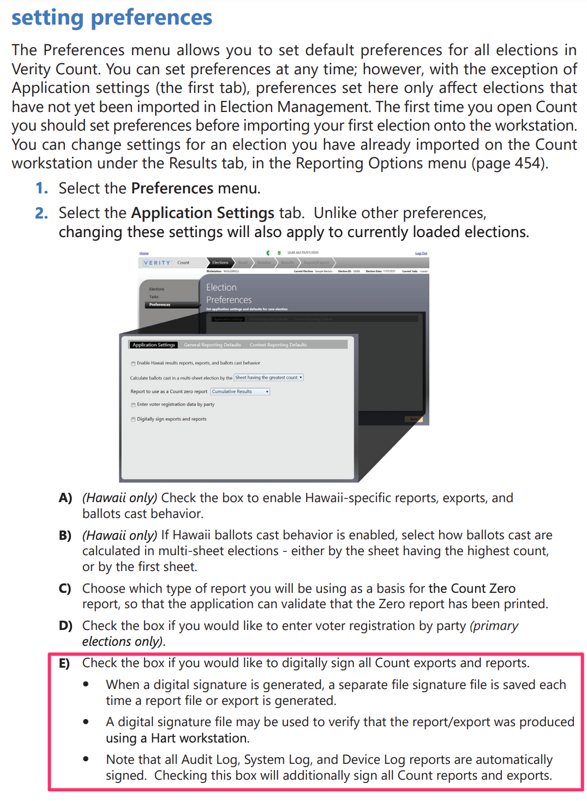


<table>
  <tr>
   <td colspan="4" ><strong>Document Revision History</strong>
   </td>
  </tr>
  <tr>
   <td><strong>Date</strong>
   </td>
   <td><strong>Version</strong>
   </td>
   <td><strong>Description</strong>
   </td>
   <td><strong>Author</strong>
   </td>
  </tr>
  <tr>
   <td>04/26/2023
   </td>
   <td>1.0.1
   </td>
   <td>Updated to Reflect RCTab v1.3.1
   </td>
   <td>Rosemary Blizzard
   </td>
  </tr>
  <tr>
   <td>01/06/2023
   </td>
   <td>1.0.0
   </td>
   <td>Document Created
   </td>
   <td>Rene Rojas
   </td>
  </tr>
</table>


<!-- watermark --><div style="background-color:#FFFFFF"><p style="color:#FFFFFF">gd2md-html: xyzzy Wed Jul 17 2024</p></div>

